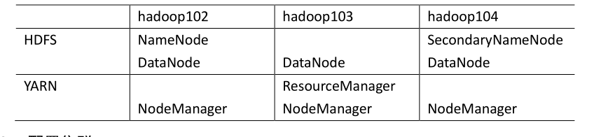
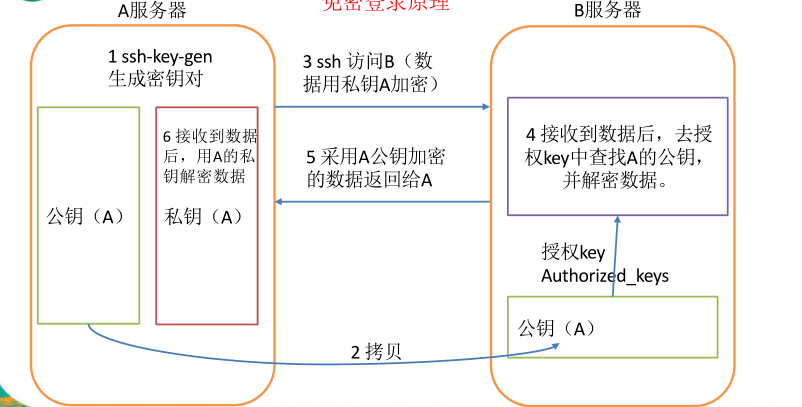
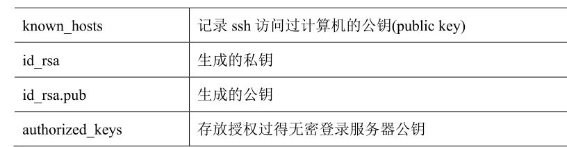

## Hadoop 目录结构

```shell
bin    
etc
include
lib
libexec
LICENSE.txt
NOTICE.txt
README.txt
sbin
share
```
### - 重要目录

（1）bin 目录：存放对 Hadoop 相关服务（HDFS,YARN）进行操作的脚本

（2）etc 目录：Hadoop 的配置文件目录，存放 Hadoop 的配置文件

（3）lib 目录：存放 Hadoop 的本地库（对数据进行压缩解压缩功能）

（4）sbin 目录：存放启动或停止 Hadoop 相关服务的脚本

（5）share 目录：存放 Hadoop 的依赖 jar 包、文档、和官方案例

## Hadoop  运行模式

### - 本地模式

### - 伪分布式模式

### - 完全分布式模式(重点)

**分析：**

1）准备 3 台客户机（关闭防火墙、静态 ip、主机名称）

2）安装 JDK

3）配置环境变量

4）安装 Hadoop

5）配置环境变量

6）配置集群

7）单点启动

8）配置 ssh

9）群起并测试集群

#### 编写集群分发脚本 xsync

**1. scp（secure copy）安全拷贝**

```shell
（1）scp 定义：
     scp 可以实现服务器与服务器之间的数据拷贝。
（2）基本语法
    scp  -r    $pdir/$fname       $user@hadoop$host:$pdir
    命令  递归  要拷贝的文件路径/名称  目的用户@主机:目的路径
 (3) 实例
    scp  -r  /opt/module root@hadoop102:/opt/module
```
**2. rsync 远程同步工具**
```shell
rsync 主要用于备份和镜像。具有速度快、避免复制相同内容和支持符号链接的优点。
rsync 和 scp 区别：用 rsync 做文件的复制要比 scp 的速度快，rsync 只对差异文件做更新。scp 是把所有文件都复制过去
基本语法:
  rsync  -rvl   $pdir/$fname       $user@hadoop$host:$pdir
  命令   选项参数 要拷贝的文件路径/名称  目的用户@主机:目的路径
```


**3. xsync 集群分发脚本**

需求：循环复制文件到所有节点的相同目录下

```shell
#!/bin/bash
#1 获取输入参数个数，如果没有参数，直接退出
pcount=$#
if((pcount==0)); then
echo no args;
exit;
fi
#2 获取文件名称
p1=$1
fname=`basename $p1`
echo fname=$fname
#3 获取上级目录到绝对路径
pdir=`cd -P $(dirname $p1); pwd`
echo pdir=$pdir
#4 获取当前用户名称
user=`whoami`
#5 循环
for((host=103; host<105; host++)); do
echo ------------------- hadoop$host --------------
rsync -rvl $pdir/$fname $user@hadoop$host:$pdir
done
```
修改脚本 xsync 具有执行权限
```shell
 chmod 777 xsync
```
调用脚本形式：xsync 文件名称
**注意** ：如果将xsync放到/home/martinhub/bin目录下仍然不能实现全局使用，可以将xsync移动到/usr/local/bin 目录下。

#### 集群配置

1. **集群部署规划**



**2. 配置集群**

（1）核心配置文件

配置 core-site.xml

```shell
[martinhub@hadoop102 hadoop]$ vi core-site.xml
```
在该文件中编写如下配置:
```shell
<!-- 指定 HDFS 中 NameNode 的地址 -->
<property>
  <name>fs.defaultFS</name>
  <value>hdfs://hadoop102:9000</value>
</property>
<!-- 指定 Hadoop 运行时产生文件的存储目录 -->
<property>
  <name>hadoop.tmp.dir</name>
  <value>/opt/module/hadoop-2.7.2/data/tmp</value>
</property>
```
（2）HDFS 配置文件
配置 hadoop-env.sh：

```shell
[martinhub@hadoop102 hadoop]$ vi hadoop-env.sh
export JAVA_HOME=/opt/module/jdk1.8.0_144
```
配置 hdfs-site.xml：
```shell
[martinhub@hadoop102 hadoop]$ vi hdfs-site.xml
```
在该文件中编写如下配置:
```shell
<property>
  <name>dfs.replication</name>
  <value>3</value>
</property>
<!-- 指定 Hadoop 辅助名称节点主机配置 -->
<property>
  <name>dfs.namenode.secondary.http-address</name>
  <value>hadoop104:50090</value>
</property>
```
（3）YARN 配置文件
配置 yarn-env.sh:

```shell
[martinhub@hadoop102 hadoop]$ vi yarn-env.sh
export JAVA_HOME=/opt/module/jdk1.8.0_144
```
配置 yarn-site.xml:
```shell
[martinhub@hadoop102 hadoop]$ vi yarn-site.xml
```
在该文件中增加如下配置:
```shell
<!-- reducer 获取数据的方式 -->
<property>
    <name>yarn.nodemanager.aux-services</name>
    <value>mapreduce_shuffle</value>
</property>
<!-- 指定 YARN 的 ResourceManager 的地址 -->
<property>
    <name>yarn.resourcemanager.hostname</name>
    <value>hadoop103</value>
</property>
```
（4）MapReduce 配置文件
配置 mapred-env.sh:

```shell
[martinhub@hadoop102 hadoop]$ vi mapred-env.sh
export JAVA_HOME=/opt/module/jdk1.8.0_144
```
配置 mapred-site.xml:
```shell
[martinhub@hadoop102  hadoop]$  cp  mapred-site.xml.template mapred-site.xml
[martinhub@hadoop102  hadoop]$  vi mapred-site.xml
```
在该文件中增加如下配置:
```shell
<!-- 指定 mr 运行在 yarn 上 -->
<property>
    <name>mapreduce.framework.name</name>
    <value>yarn</value>
</property>
```
**3．在集群上分发配置好的 Hadoop 配置文件**
```shell
[martinhub@hadoop102 hadoop]$ xsync /opt/module/hadoop-2.7.2/
```
#### 集群单点启动

（1）如果集群是第一次启动，需要 格式化 NameNode

```shell
[martinhub@hadoop102 hadoop-2.7.2]$ hadoop namenode -format
```
（2）在 hadoop102 上启动 NameNode
```shell
[martinhub@hadoop102  hadoop-2.7.2]$  hadoop-daemon.sh  start namenode
```
（3）在 hadoop102、hadoop103 以及 hadoop104 上分别启动 DataNode
```shell
[martinhub@hadoop102  hadoop-2.7.2]$  hadoop-daemon.sh  start datanode
[martinhub@hadoop102 hadoop-2.7.2]$ jps
3461 NameNode
3608 Jps
3561 DataNode
[martinhub@hadoop103  hadoop-2.7.2]$  hadoop-daemon.sh  start
datanode
[martinhub@hadoop103 hadoop-2.7.2]$ jps
3190 DataNode
3279 Jps
[martinhub@hadoop104  hadoop-2.7.2]$  hadoop-daemon.sh  start
datanode
[martinhub@hadoop104 hadoop-2.7.2]$ jps
3237 Jps
3163 DataNode
```
#### SSH  无密登录

**1. 配置 ssh**

（1）基本语法

```shell
ssh 另一台电脑的 ip 地址
```
（2）ssh 连接时出现 Host key verification failed 的解决方法
```shell
[martinhub@hadoop102 opt] $ ssh 192.168.1.103
The authenticity of host '192.168.1.103 (192.168.1.103)' can'tbe established. RSA  key  fingerprint  is
cf:1e:de:d7:d0:4c:2d:98:60:b4:fd:ae:b1:2d:ad:06.
Are you sure you want to continue connecting (yes/no)?
Host key verification failed
```
(3）解决方案如下：直接输入 yes
**2. 无密钥配置**

（1）免密登录原理



（2）生成公钥和私钥：

```shell
[martinhub@hadoop102 .ssh]$ ssh-keygen -t rsa
```
然后敲（三个回车），就会生成两个文件id_rsa（私钥）、id_rsa.pub（公钥）
（3）将公钥拷贝到要免密登录的目标机器上

```shell
[martinhub@hadoop102 .ssh]$ ssh-copy-id hadoop102
[martinhub@hadoop102 .ssh]$ ssh-copy-id hadoop103
[martinhub@hadoop102 .ssh]$ ssh-copy-id hadoop104
```
注意：
还需要在hadoop103上采用martinhub账号配置一下无密登录到hadoop102、hadoop103、

hadoop104 服务器上。

**3. .ssh 文件夹下（~/.ssh）的文件功能解释**



#### 群起集群

**1. 配置 slaves**

```shell
/opt/module/hadoop-2.7.2/etc/hadoop/slaves
[martinhub@hadoop102 hadoop]$ vi slaves
```
在该文件中增加如下内容：
```shell
hadoop102
hadoop103
hadoop104
```
注意：该文件中添加的内容结尾不允许有空格，文件中不允许有空行。
**2. 启动集群**

（1）如果集群是第一次启动，需要格式化 NameNode

```shell
[martinhub@hadoop102 hadoop-2.7.2]$ bin/hdfs namenode -format
```
（2）启动 HDFS
```shell
[martinhub@hadoop102 hadoop-2.7.2]$ sbin/start-dfs.sh
[martinhub@hadoop102 hadoop-2.7.2]$ jps
4166 NameNode
4482 Jps
4263 DataNode
[martinhub@hadoop103 hadoop-2.7.2]$ jps
3218 DataNode
3288 Jps
[martinhub@hadoop104 hadoop-2.7.2]$ jps
3221 DataNode
3283 SecondaryNameNode
3364 Jps
```
（3）启动 YARN
```shell
[martinhub@hadoop103 hadoop-2.7.2]$ sbin/start-yarn.sh
```
***注意：NameNode 和 ResourceManger 如果不是同一台机器，不能在 NameNode 上启***
***动 YARN，应该在 ResouceManager 所在的机器上启动 YARN。***

***jps 是 JDK 中的命令，不是 Linux 命令。不安装 JDK 不能使用 jps***

#### 集群 启动/ 停止方式 总结

**1. 各个服务组件逐一启动/停止**

（1）分别启动/停止 HDFS 组件

```shell
hadoop-daemon.sh start / stop namenode / datanode / secondarynamenode
```
（2）启动/停止 YARN
```shell
yarn-daemon.sh start / stop resourcemanager / nodemanager
```
**2. 各个模块分开启动/停止（配置 ssh 是前提）常用**
（1）整体启动/停止 HDFS

```powershell
start-dfs.sh / stop-dfs.sh
```
（2）整体启动/停止 YARN
```shell
start-yarn.sh / stop-yarn.sh
```
#### 集群时间同步

时间同步的方式：找一个机器，作为时间服务器，所有的机器与这台集群时间进行定时

的同步，比如，每隔十分钟，同步一次时间。

**配置时间同步实操:**

**1. 时间服务器配置（必须 root 用户）**

（1）检查 ntp 是否安装

```shell
[root@hadoop102 桌面]# rpm -qa|grep ntp
```
ntp-4.2.6p5-10.el6.centos.x86_64
fontpackages-filesystem-1.41-1.1.el6.noarch

ntpdate-4.2.6p5-10.el6.centos.x86_64

（2）修改 ntp 配置文件

```shell
[root@hadoop102 桌面]# vi /etc/ntp.conf
```
修改内容如下:
a）修改 1 （授权 192.168.1.0 网段上的所有机器可以从这台机器上查询和同步时间）

```shell
#restrict 192.168.1.0 mask 255.255.255.0 nomodify notrap 为
restrict 192.168.1.0 mask 255.255.255.0 nomodify notrap
```
b）修改 2（集群在局域网中，不使用其他的网络时间）
```shell
server 0.centos.pool.ntp.org iburst
server 1.centos.pool.ntp.org iburst
server 2.centos.pool.ntp.org iburst
server 3.centos.pool.ntp.org iburst 为
#server 0.centos.pool.ntp.org iburst
#server 1.centos.pool.ntp.org iburst
#server 2.centos.pool.ntp.org iburst
#server 3.centos.pool.ntp.org iburst
```
c）添加 3 （ 当该节点丢失网络连接，依然可以作为时间服务器为集群中的其他节点
提供时间同步 ）

```powershell
server 127.127.1.0
fudge 127.127.1.0 stratum 10
```
（3）修改/etc/sysconfig/ntpd 文件
```shell
[root@hadoop102 桌面]# vim /etc/sysconfig/ntpd
```
增加内容如下（让硬件时间与系统时间一起同步）
SYNC_HWCLOCK=yes

（4）重新启动 ntpd

```shell
[root@hadoop102 桌面]# service ntpd status
ntpd 已停
[root@hadoop102 桌面]# service ntpd start
正在启动 ntpd： [确定]
```
（5）执行：
```shell
[root@hadoop102 桌面]# chkconfig ntpd on
```
**2. 其他机器配置（必须 root 用户）**
（1）在其他机器配置 10 分钟与时间服务器同步一次

```shell
[root@hadoop103 桌面]# crontab -e
```
编写定时任务如下：
```shell
*/10 * * * * /usr/sbin/ntpdate hadoop102
```
（2）修改任意机器时间
```shell
[root@hadoop103 桌面]# date -s "2017-9-11 11:11:11"
```
（3）十分钟后查看机器是否与时间服务器同步
```shell
[root@hadoop103 桌面]# date
```
说明：测试的时候可以将 10 分钟调整为 1 分钟，节省时间。
#### **为什么不能一直格式化 NameNode ?**

答：格式化 NameNode，会产生新的集群 id，导致 NameNode 和 DataNode 的集

群 id 不一致，集群找不到已往数据。所以，格式 NameNode 时，一定要先删除

data 数据和 log 日志，然后再格式化 NameNode。

（第一次启动时格式化，以后就不要总格式化）

