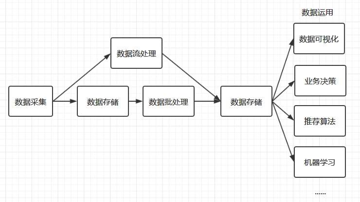
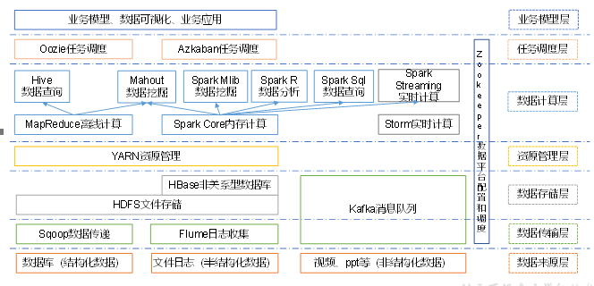
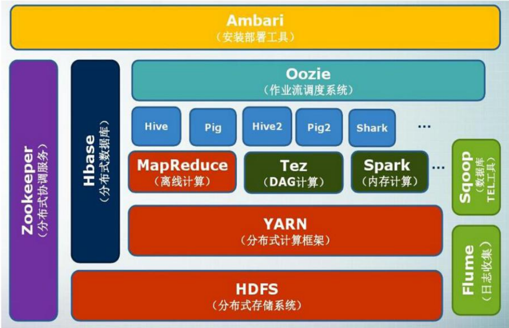
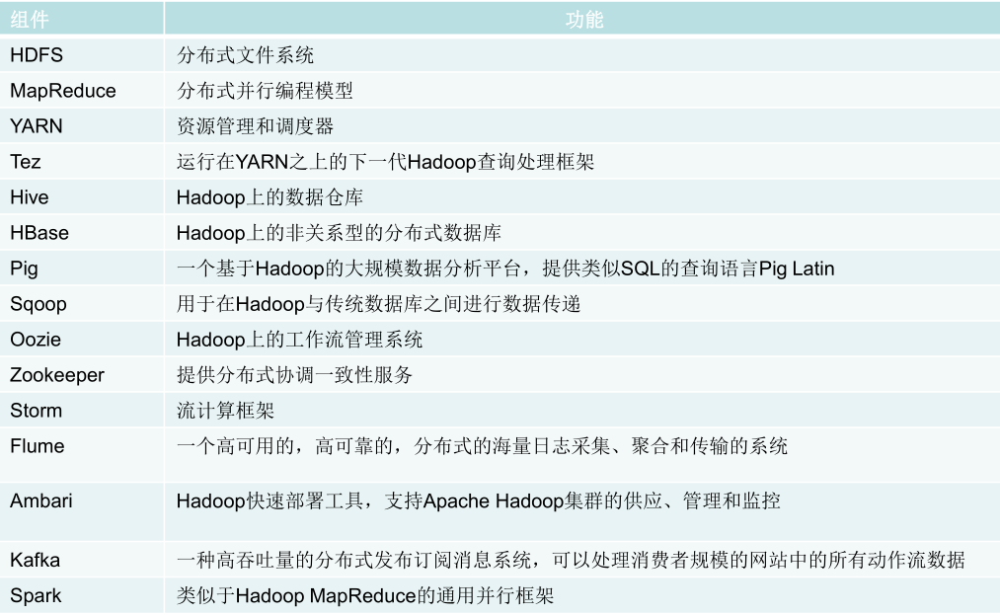
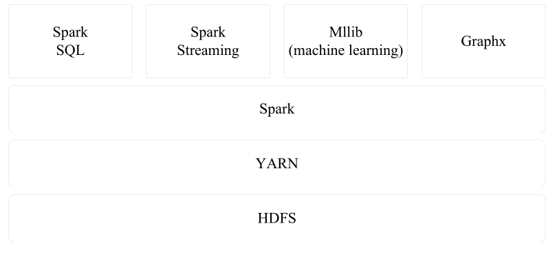

## 一、大数据处理简化流程

## 二、Hadoop生态架构

## 三、Hadoop生态系统

## 四、Hadoop项目结构

## 五、Spark架构

## 六、Flink系统架构

## 七、框架分类

**日志收集框架**：Flume 、Logstash、Kibana

**分布式文件存储系统**：Hadoop HDFS

**数据库系统**：Mongodb、HBase

**分布式计算框架**：

- 批处理框架：Hadoop MapReduce

- 流处理框架：Storm
- 混合处理框架：Spark、Flink

**查询分析框架** ：Hive 、Spark SQL 、Flink SQL、 Pig、Phoenix 

**集群资源管理器** ：Hadoop YARN

**分布式协调服务** ：Zookeeper

**数据迁移工具** ：Sqoop

**任务调度框架** ：Azkaban、Oozie

**集群部署和监控** ：Ambari、Cloudera Manager

