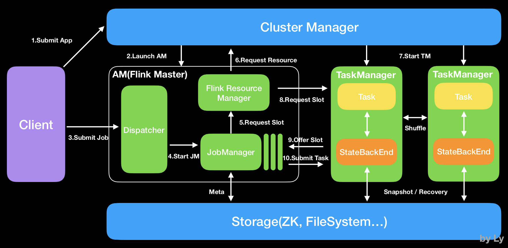

## 一、大数据处理简化流程

## 二、Hadoop生态架构

## 三、Hadoop生态系统

## 四、Hadoop项目结构

## 五、Spark架构

## 六、Flink系统架构

## 七、框架分类

&emsp;日志收集框架**：Flume 、Logstash、Kibana

&emsp;分布式文件存储系统**：Hadoop HDFS

&emsp;数据库系统**：Mongodb、HBase

&emsp;分布式计算框架**：

&emsp; - 批处理框架：Hadoop MapReduce

- 流处理框架：Storm
- 混合处理框架：Spark、Flink

&emsp;查询分析框架**：Hive 、Spark SQL 、Flink SQL、 Pig、Phoenix 

&emsp;集群资源管理器**：Hadoop YARN

&emsp;分布式协调服务**：Zookeeper

&emsp;数据迁移工具**：Sqoop

&emsp;任务调度框架**：Azkaban、Oozie

&emsp;集群部署和监控**：Ambari、Cloudera Manager

