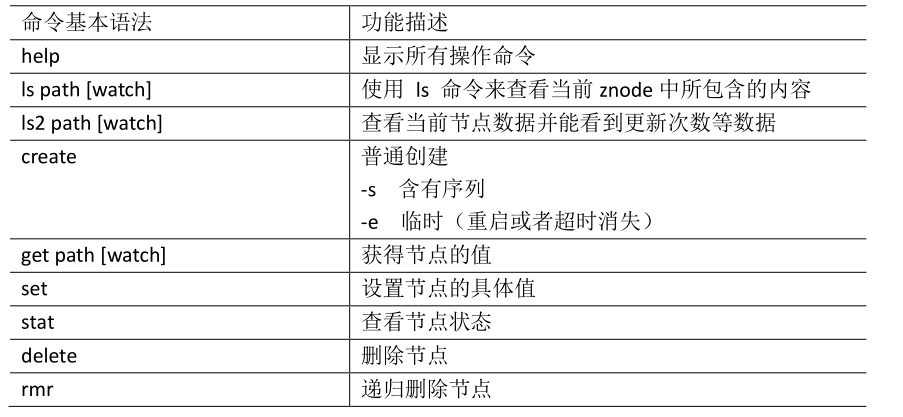

## 一、Zookeeper简介

​	Zookeeper 是一个开源的分布式的，为分布式应用提供协调服务的 Apache 项目。

## 二、Zookerrper的工作机制

​	Zookeeper从设计模式角度来理解：是一个基于观察者模式设计的分布式服务管理框架，它负责存储和管理大家都关心的数据，然后接受观察者的注册，一旦这些数据的状态发生变化，Zookeeper就将负责通知已经在Zookeeper上注册的那些观察者做出相应的反应。

## 三、Zookeeper的特点

1）Zookeeper：一个领导者（Leader），多个跟随者（Follower）组成的集群。

2）集群中只要有半数以上节点存活，Zookeeper集群就能正常服务。

3）全局数据一致：每个Server保存一份相同的数据副本，Client无论连接到哪个Server，数据都是一致的。

4）更新请求顺序进行，来自同一个Client的更新请求按其发送顺序依次执行。

5）数据更新原子性，一次数据更新要么成功，要么失败。

6）实时性，在一定时间范围内，Client能读到最新数据。

## 四、应用场景

​	提供的服务包括：统一命名服务、统一配置管理、统一集群管理、服务器节点动态上下线、软负载均衡等。

### 1. 统一命名服务

​	在分布式环境下，经常需要对应用/服务进行统一命名，便于识别。例如：IP不容易记住，而域名容易记住。

### 2. 统一配置管理

1）分布式环境下，配置文件同步非常常见。

（1）一般要求一个集群中，所有节点的配置信息是一致的，比如 Kafka 集群。

（2）对配置文件修改后，希望能够快速同步到各个节点上。

2）配置管理可交由ZooKeeper实现。

（1）可将配置信息写入ZooKeeper上的一个Znode。

（2）各个客户端服务器监听这个Znode。

（3）一旦Znode中的数据被修改，ZooKeeper将通知各个客户端服务器。

### 3. 统一集群管理

1）分布式环境中，实时掌握每个节点的状态是必要的。

（1）可根据节点实时状态做出一些调整。

2）ZooKeeper可以实现实时监控节点状态变化

（1）可将节点信息写入ZooKeeper上的一个ZNode。

（2）监听这个ZNode可获取它的实时状态变化。

### 4. 服务器动态上下线

​	客户端能实时洞察到服务器上下线的变化。

### 5. 软负载均衡

​	在Zookeeper中记录每台服务器的访问数，让访问数最少的服务器去处理最新的客户端请求。

## 五、Zookeeper的内部原理

### 1. 选举机制

1）半数机制：集群中半数以上机器存活，集群可用。所以 Zookeeper 适合安装奇数台服务器。

2）Zookeeper 虽然在配置文件中并没有指定 Master 和 Slave。但是，Zookeeper 工作时，是有一个节点为Leader，其他则为 Follower，Leader 是通过内部的选举机制临时产生的。

## 六、Zookeeper集群环境搭建

为保证集群高可用，Zookeeper 集群的节点数最好是奇数，最少有三个节点，所以这里演示搭建一个三个节点的集群。这里我使用三台主机进行搭建，主机名分别为 hadoop101，hadoop102，hadoop103。

### 1. zoo.cfg 参数解读

Zookeeper中的配置文件 zoo.cfg 中参数含义解读如下：

```text
1．tickTime =2000：通信心跳数，Zookeeper 服务器与客户端心跳时间，单位毫秒
	Zookeeper使用的基本时间，服务器之间或客户端与服务器之间维持心跳的时间间隔，也就是每个tickTime时间就会发送一个心跳，时间单位为毫秒。
	它用于心跳机制，并且设置最小的session超时时间为两倍心跳时间。(session的最小超时时间是2*tickTime)
	
2．initLimit =10：LF 初始通信时限
	集群中的Follower跟随者服务器与Leader领导者服务器之间初始连接时能容忍的最多心跳数（tickTime的数量），用它来限定集群中的Zookeeper服务器连接到Leader的时限。
	
3．syncLimit =5：LF 同步通信时限
	集群中Leader与Follower之间的最大响应时间单位，假如响应超过syncLimit * tickTime，Leader认为Follwer死掉，从服务器列表中删除Follwer。

4．dataDir：数据文件目录+数据持久化路径
	主要用于保存 Zookeeper 中的数据。
5．clientPort =2181：客户端连接端口
	监听客户端连接的端口。
```

### 2. 修改配置

解压一份 zookeeper 安装包，修改其配置文件 `zoo.cfg`，内容如下。之后使用 scp 命令将安装包分发到三台服务器上：

```shell
tickTime=2000
initLimit=10
syncLimit=5
dataDir=/usr/local/zookeeper-cluster/data/
dataLogDir=/usr/local/zookeeper-cluster/log/
clientPort=2181

# server.1 这个1是服务器的标识，可以是任意有效数字，标识这是第几个服务器节点，这个标识要写到dataDir目录下面myid文件里
# 指名集群间通讯端口和选举端口
server.1=hadoop101:2287:3387
server.2=hadoop102:2287:3387
server.3=hadoop103:2287:3387
```

### 3. 标识节点

分别在三台主机的 `dataDir` 目录下新建 `myid` 文件,并写入对应的节点标识。Zookeeper 集群通过 `myid` 文件识别集群节点，并通过上文配置的节点通信端口和选举端口来进行节点通信，选举出 Leader 节点。

创建存储目录：

```shell
# 三台主机均执行该命令
mkdir -vp  /usr/local/zookeeper-cluster/data/
```

创建并写入节点标识到 `myid` 文件：

```shell
# hadoop001主机
echo "1" > /usr/local/zookeeper-cluster/data/myid
# hadoop002主机
echo "2" > /usr/local/zookeeper-cluster/data/myid
# hadoop003主机
echo "3" > /usr/local/zookeeper-cluster/data/myid
```

### 4. 启动集群

分别在三台主机上，执行如下命令启动服务：

```shell
./bin/zkServer.sh start
```

### 5. 集群验证

启动后使用 `zkServer.sh status` 查看集群各个节点状态。如图所示：三个节点进程均启动成功，并且 hadoop102 为 leader 节点，hadoop101 和 hadoop103 为 follower 节点。

```shell
[MartinHub@hadoop101 zookeeper-3.4.10]# bin/zkServer.sh status
	JMX enabled by default Using  config:  /opt/module/zookeeper-3.4.10/bin/../conf/zoo.cfg Mode: fsollower
	
[MartinHub@hadoop102 zookeeper-3.4.10]# bin/zkServer.sh status
	JMX enabled by default Using  config:  /opt/module/zookeeper- 3.4.10/bin/../conf/zoo.cfg Mode: leader

[MartinHub@hadoop103 zookeeper-3.4.5]# bin/zkServer.sh status
	JMX enabled by default Using  config:  /opt/module/zookeeper- 3.4.10/bin/../conf/zoo.cfg Mode: follower
```

##   七、客户端命令行操作



1．启动客户端

```shell
[MartinHub@hadoop103 zookeeper-3.4.10]$ bin/zkCli.sh
```

2．显示所有操作命令

```shell
[zk: localhost:2181(CONNECTED) 1] help
```

3．查看当前 znode 中所包含的内容

```shell
[zk: localhost:2181(CONNECTED) 0] ls /
[zookeeper]
```

4．查看当前节点详细数据

```shell
[zk: localhost:2181(CONNECTED) 1] ls2 /
[zookeeper]
cZxid = 0x0
ctime = Thu Jan 01 08:00:00 CST 1970
mZxid = 0x0
mtime = Thu Jan 01 08:00:00 CST 1970
pZxid = 0x0
cversion = -1
dataVersion = 0
aclVersion = 0
ephemeralOwner = 0x0
dataLength = 0
numChildren = 1
```

5．分别创建 2 个普通节点

```shell
[zk: localhost:2181(CONNECTED) 3] create /sanguo "jinlian"
Created /sanguo
[zk:  localhost:2181(CONNECTED)  4]  create  /sanguo/shuguo
"liubei"
Created /sanguo/shuguo
```

6．获得节点的值

```shell
[zk: localhost:2181(CONNECTED) 5] get /sanguo
jinlian
cZxid = 0x100000003
ctime = Wed Aug 29 00:03:23 CST 2018
mZxid = 0x100000003
mtime = Wed Aug 29 00:03:23 CST 2018
pZxid = 0x100000004
cversion = 1
dataVersion = 0
aclVersion = 0
ephemeralOwner = 0x0
dataLength = 7
numChildren = 1
[zk: localhost:2181(CONNECTED) 6]
[zk: localhost:2181(CONNECTED) 6] get /sanguo/shuguo
liubei
cZxid = 0x100000004
ctime = Wed Aug 29 00:04:35 CST 2018
mZxid = 0x100000004
mtime = Wed Aug 29 00:04:35 CST 2018
pZxid = 0x100000004
cversion = 0
dataVersion = 0
aclVersion = 0
ephemeralOwner = 0x0
dataLength = 6
numChildren = 0
```

7．创建短暂节点

```shell
[zk: localhost:2181(CONNECTED) 7] create -e /sanguo/wuguo
"zhouyu"
Created /sanguo/wuguo
```

（1）在当前客户端是能查看到的

```shell
[zk: localhost:2181(CONNECTED) 3] ls /sanguo
[wuguo, shuguo]
```

（2）退出当前客户端然后再重启客户端

```shell
[zk: localhost:2181(CONNECTED) 12] quit
[atguigu@hadoop104 zookeeper-3.4.10]$ bin/zkCli.sh
```

（3）再次查看根目录下短暂节点已经删除

```shell
[zk: localhost:2181(CONNECTED) 0] ls /sanguo
[shuguo]
```

## 八、企业面试题

- 请简述 ZooKeeper  的选举机制

- ZooKeeper  的监听原理是什么？

- ZooKeeper  的部署方式有哪几种？集群中的角色有哪些？集群最少需要几台机器？

  （1）部署方式单机模式、集群模式
  （2）角色：Leader 和 Follower
  （3）集群最少需要机器数：3


