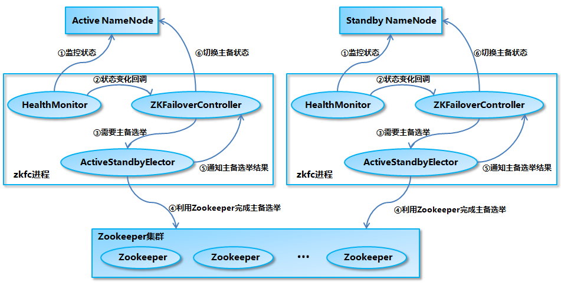

## 一、Hadoop 目录结构


```shell
bin    
etc
include
lib
libexec
LICENSE.txt
NOTICE.txt
README.txt
sbin
share
```
### 1. 重要目录

（1）bin 目录：存放对 Hadoop 相关服务（HDFS,YARN）进行操作的脚本

（2）etc 目录：Hadoop 的配置文件目录，存放 Hadoop 的配置文件

（3）lib 目录：存放 Hadoop 的本地库（对数据进行压缩解压缩功能）

（4）sbin 目录：存放启动或停止 Hadoop 相关服务的脚本

（5）share 目录：存放 Hadoop 的依赖 jar 包、文档、和官方案例


## 二、Hadoop  运行模式

### 1. 本地模式

### 2. 伪分布式模式

### 3. 完全分布式模式(重点)

&emsp;&emsp;**分析：**

&emsp;&emsp;&emsp;1）准备 3 台客户机（关闭防火墙、静态 ip、主机名称）

&emsp;&emsp;&emsp;2）安装 JDK

&emsp;&emsp;&emsp;3）配置环境变量

&emsp;&emsp;&emsp;4）安装 Hadoop

&emsp;&emsp;&emsp;5）配置环境变量

&emsp;&emsp;&emsp;6）配置集群

&emsp;&emsp;&emsp;7）单点启动

&emsp;&emsp;&emsp;8）配置 ssh

&emsp;&emsp;&emsp;9）群起并测试集群


## 三、Hadoop集群环境搭建

### 1. 集群规划

&emsp;&emsp;这里搭建一个 3 节点的 Hadoop 集群，其中三台主机均部署 `DataNode` 和 `NodeManager` 服务，但只有 hadoop001 上部署 `NameNode` 和 `ResourceManager` 服务。


### 2. 安装JDK

下载并解压

&emsp;&emsp;在[官网](https://www.oracle.com/technetwork/java/javase/downloads/index.html) 下载所需版本的 JDK，这里我下载的版本为[JDK 1.8](https://www.oracle.com/technetwork/java/javase/downloads/jdk8-downloads-2133151.html) ,下载后进行解压：

```shell
[root@ java]# tar -zxvf jdk-8u201-linux-x64.tar.gz
```

设置环境变量

```shell
[root@ java]# vi /etc/profile
```

&emsp;&emsp;添加如下配置：

```shell
export JAVA_HOME=/usr/java/jdk1.8.0_201  
export JRE_HOME=${JAVA_HOME}/jre  
export CLASSPATH=.:${JAVA_HOME}/lib:${JRE_HOME}/lib  
export PATH=${JAVA_HOME}/bin:$PATH
```

&emsp;&emsp;执行 `source` 命令，使得配置立即生效：

```shell
[root@ java]# source /etc/profile
```

检查是否成功

```shell
[root@ java]# java -version
```

&emsp;&emsp;显示出对应的版本信息则代表安装成功。

```shell
java version "1.8.0_201"
Java(TM) SE Runtime Environment (build 1.8.0_201-b09)
Java HotSpot(TM) 64-Bit Server VM (build 25.201-b09, mixed mode)
```

### 3. 配置免密登录

#### 生成密匙

&emsp;&emsp;在每台主机上使用 `ssh-keygen` 命令生成公钥私钥对：

```shell
ssh-keygen
```

#### 免密登录

&emsp;&emsp;将 `hadoop001` 的公钥写到本机和远程机器的 ` ~/ .ssh/authorized_key` 文件中：

```shell
ssh-copy-id -i ~/.ssh/id_rsa.pub hadoop001
ssh-copy-id -i ~/.ssh/id_rsa.pub hadoop002
ssh-copy-id -i ~/.ssh/id_rsa.pub hadoop003
```

#### 验证免密登录

```she
ssh hadoop002
ssh hadoop003
```

### 4. 集群搭建

#### 下载并解压

&emsp;&emsp;下载 Hadoop。这里我下载的是 CDH 版本 Hadoop，下载地址为：http://archive.cloudera.com/cdh5/cdh/5/

```shell
# tar -zvxf hadoop-2.6.0-cdh5.15.2.tar.gz 
```

#### 配置环境变量

&emsp;&emsp;编辑 `profile` 文件：

```shell
# vim /etc/profile
```

&emsp;&emsp;增加如下配置：

```
export HADOOP_HOME=/usr/app/hadoop-2.6.0-cdh5.15.2
export  PATH=${HADOOP_HOME}/bin:$PATH
```

&emsp;&emsp;执行 `source` 命令，使得配置立即生效：

```shell
# source /etc/profile
```

#### 修改配置

&emsp;&emsp;进入 `${HADOOP_HOME}/etc/hadoop` 目录下，修改配置文件。各个配置文件内容如下：

1. hadoop-env.sh

```shell
# 指定JDK的安装位置
export JAVA_HOME=/usr/java/jdk1.8.0_201/
```

2.  core-site.xml

```xml
<configuration>
    <property>
        <!--指定 namenode 的 hdfs 协议文件系统的通信地址-->
        <name>fs.defaultFS</name>
        <value>hdfs://hadoop001:8020</value>
    </property>
    <property>
        <!--指定 hadoop 集群存储临时文件的目录-->
        <name>hadoop.tmp.dir</name>
        <value>/home/hadoop/tmp</value>
    </property>
</configuration>
```

3. hdfs-site.xml

```xml
<property>
      <!--namenode 节点数据（即元数据）的存放位置，可以指定多个目录实现容错，多个目录用逗号分隔-->
    <name>dfs.namenode.name.dir</name>
    <value>/home/hadoop/namenode/data</value>
</property>
<property>
      <!--datanode 节点数据（即数据块）的存放位置-->
    <name>dfs.datanode.data.dir</name>
    <value>/home/hadoop/datanode/data</value>
</property>
```

4. yarn-site.xml

```xml
<configuration>
    <property>
        <!--配置 NodeManager 上运行的附属服务。需要配置成 mapreduce_shuffle 后才可以在 Yarn 上运行 MapReduce 程序。-->
        <name>yarn.nodemanager.aux-services</name>
        <value>mapreduce_shuffle</value>
    </property>
    <property>
        <!--resourcemanager 的主机名-->
        <name>yarn.resourcemanager.hostname</name>
        <value>hadoop001</value>
    </property>
</configuration>

```

5.  mapred-site.xml

```xml
<configuration>
    <property>
        <!--指定 mapreduce 作业运行在 yarn 上-->
        <name>mapreduce.framework.name</name>
        <value>yarn</value>
    </property>
</configuration>
```

6. slaves

&emsp;&emsp;配置所有从属节点的主机名或 IP 地址，每行一个。所有从属节点上的 `DataNode` 服务和 `NodeManager` 服务都会被启动。

```properties
hadoop001
hadoop002
hadoop003
```

#### 分发程序

&emsp;&emsp;将 Hadoop 安装包分发到其他两台服务器，分发后建议在这两台服务器上也配置一下 Hadoop 的环境变量。

```shell
# 将安装包分发到hadoop002
scp -r /usr/app/hadoop-2.6.0-cdh5.15.2/  hadoop002:/usr/app/
# 将安装包分发到hadoop003
scp -r /usr/app/hadoop-2.6.0-cdh5.15.2/  hadoop003:/usr/app/
```

#### 初始化

&emsp;&emsp;在 `Hadoop001` 上执行 namenode 初始化命令：

```
hdfs namenode -format
```

&emsp;&emsp;<font color='red'>为什么不能一直格式化 NameNode ?</font>

&emsp;&emsp;&emsp;答：格式化 NameNode，会产生新的集群 id，导致 NameNode 和 DataNode 的集群 id 不一致，集群找不到已往数据。所以，格式 NameNode 时，一定要先删除data 数据和 log 日志，然后再格式化 NameNode。（第一次启动时格式化，以后就不要总格式化）

#### 集群时间同步

&emsp;&emsp;时间同步的方式：找一个机器，作为时间服务器，所有的机器与这台集群时间进行定时的同步，比如，每隔十分钟，同步一次时间。

**配置时间同步实操:**

**1. 时间服务器配置（必须 root 用户）**

（1）检查 ntp 是否安装

```shell
[root@hadoop102 桌面]# rpm -qa|grep ntp
ntp-4.2.6p5-10.el6.centos.x86_64
fontpackages-filesystem-1.41-1.1.el6.noarch

ntpdate-4.2.6p5-10.el6.centos.x86_64
```

（2）修改 ntp 配置文件

```shell
[root@hadoop102 桌面]# vi /etc/ntp.conf
```

&emsp;&emsp;修改内容如下:
&emsp;&emsp;&emsp;a）修改 1 （授权 192.168.1.0 网段上的所有机器可以从这台机器上查询和同步时间）

```shell
#restrict 192.168.1.0 mask 255.255.255.0 nomodify notrap 为
restrict 192.168.1.0 mask 255.255.255.0 nomodify notrap
```

&emsp;&emsp;&emsp;b）修改 2（集群在局域网中，不使用其他的网络时间）

```shell
server 0.centos.pool.ntp.org iburst
server 1.centos.pool.ntp.org iburst
server 2.centos.pool.ntp.org iburst
server 3.centos.pool.ntp.org iburst 为
#server 0.centos.pool.ntp.org iburst
#server 1.centos.pool.ntp.org iburst
#server 2.centos.pool.ntp.org iburst
#server 3.centos.pool.ntp.org iburst
```

&emsp;&emsp;&emsp;c）添加 3 （ 当该节点丢失网络连接，依然可以作为时间服务器为集群中的其他节点
提供时间同步 ）

```powershell
server 127.127.1.0
fudge 127.127.1.0 stratum 10
```

（3）修改/etc/sysconfig/ntpd 文件

```shell
[root@hadoop102 桌面]# vim /etc/sysconfig/ntpd
```

&emsp;&emsp;增加内容如下（让硬件时间与系统时间一起同步）
`SYNC_HWCLOCK=yes`

（4）重新启动 ntpd

```shell
[root@hadoop102 桌面]# service ntpd status
ntpd 已停
[root@hadoop102 桌面]# service ntpd start
正在启动 ntpd： [确定]
```

（5）执行：

```shell
[root@hadoop102 桌面]# chkconfig ntpd on
```

**2. 其他机器配置（必须 root 用户）**
（1）在其他机器配置 10 分钟与时间服务器同步一次

```shell
[root@hadoop103 桌面]# crontab -e
```

编写定时任务如下：

```shell
*/10 * * * * /usr/sbin/ntpdate hadoop102
```

（2）修改任意机器时间

```shell
[root@hadoop103 桌面]# date -s "2021-1-11 11:11:11"
```

（3）十分钟后查看机器是否与时间服务器同步

```shell
[root@hadoop103 桌面]# date
```

&emsp;&emsp;说明：测试的时候可以将 10 分钟调整为 1 分钟，节省时间。

#### 启动集群

&emsp;&emsp;进入到 `Hadoop001` 的 `${HADOOP_HOME}/sbin` 目录下，启动 Hadoop。此时 `hadoop002` 和 `hadoop003` 上的相关服务也会被启动：

```shell
# 启动dfs服务
start-dfs.sh
# 启动yarn服务
start-yarn.sh
```

#### 查看集群

&emsp;&emsp;在每台服务器上使用 `jps` 命令查看服务进程，或直接进入 Web-UI 界面进行查看，端口为 `50070`。可以看到此时有三个可用的 `Datanode`：


&emsp;&emsp;点击 `Live Nodes` 进入，可以看到每个 `DataNode` 的详细情况：


&emsp;&emsp;接着可以查看 Yarn 的情况，端口号为 `8088` ：


#### 提交服务到集群

&emsp;&emsp;提交作业到集群的方式和单机环境完全一致，这里以提交 Hadoop 内置的计算 Pi 的示例程序为例，在任何一个节点上执行都可以，命令如下：

```shell
hadoop jar /usr/app/hadoop-2.6.0-cdh5.15.2/share/hadoop/mapreduce/hadoop-mapreduce-examples-2.6.0-cdh5.15.2.jar  pi  3  3
```


## 四、基于ZooKeeper搭建Hadoop高可用集群

### 1. 高可用简介

&emsp;&emsp;Hadoop 高可用 (High Availability) 分为 HDFS 高可用和 YARN 高可用，两者的实现基本类似，但 HDFS NameNode 对数据存储及其一致性的要求比 YARN ResourceManger 高得多，所以它的实现也更加复杂，故下面先进行讲解：

#### 高可用整体架构

&emsp;&emsp;HDFS 高可用架构如下：


> *图片引用自：https://www.edureka.co/blog/how-to-set-up-hadoop-cluster-with-hdfs-high-availability/*

HDFS 高可用架构主要由以下组件所构成：

- **Active NameNode 和 Standby NameNode**：两台 NameNode 形成互备，一台处于 Active 状态，为主 NameNode，另外一台处于 Standby 状态，为备 NameNode，只有主 NameNode 才能对外提供读写服务。
- **主备切换控制器 ZKFailoverController**：ZKFailoverController 作为独立的进程运行，对 NameNode 的主备切换进行总体控制。ZKFailoverController 能及时检测到 NameNode 的健康状况，在主 NameNode 故障时借助 Zookeeper 实现自动的主备选举和切换，当然 NameNode 目前也支持不依赖于 Zookeeper 的手动主备切换。
- **Zookeeper 集群**：为主备切换控制器提供主备选举支持。
- **共享存储系统**：共享存储系统是实现 NameNode 的高可用最为关键的部分，共享存储系统保存了 NameNode 在运行过程中所产生的 HDFS 的元数据。主 NameNode 和 NameNode 通过共享存储系统实现元数据同步。在进行主备切换的时候，新的主 NameNode 在确认元数据完全同步之后才能继续对外提供服务。
- **DataNode 节点**：除了通过共享存储系统共享 HDFS 的元数据信息之外，主 NameNode 和备 NameNode 还需要共享 HDFS 的数据块和 DataNode 之间的映射关系。DataNode 会同时向主 NameNode 和备 NameNode 上报数据块的位置信息。

#### 基于 QJM 的共享存储系统的数据同步机制分析

&emsp;&emsp;&emsp;目前 Hadoop 支持使用 Quorum Journal Manager (QJM) 或 Network File System (NFS) 作为共享的存储系统，这里以 QJM 集群为例进行说明：Active NameNode 首先把 EditLog 提交到 JournalNode 集群，然后 Standby NameNode 再从 JournalNode 集群定时同步 EditLog，当 Active NameNode  宕机后， Standby  NameNode 在确认元数据完全同步之后就可以对外提供服务。

&emsp;&emsp;需要说明的是向 JournalNode 集群写入 EditLog 是遵循 “过半写入则成功” 的策略，所以你至少要有 3 个 JournalNode 节点，当然你也可以继续增加节点数量，但是应该保证节点总数是奇数。同时如果有 2N+1 台 JournalNode，那么根据过半写的原则，最多可以容忍有 N 台 JournalNode 节点挂掉。


#### NameNode 主备切换

&emsp;&emsp;NameNode 实现主备切换的流程下图所示：



1. HealthMonitor 初始化完成之后会启动内部的线程来定时调用对应 NameNode 的 HAServiceProtocol RPC 接口的方法，对 NameNode 的健康状态进行检测。
2. HealthMonitor 如果检测到 NameNode 的健康状态发生变化，会回调 ZKFailoverController 注册的相应方法进行处理。
3. 如果 ZKFailoverController 判断需要进行主备切换，会首先使用 ActiveStandbyElector 来进行自动的主备选举。
4. ActiveStandbyElector 与 Zookeeper 进行交互完成自动的主备选举。
5. ActiveStandbyElector 在主备选举完成后，会回调 ZKFailoverController 的相应方法来通知当前的 NameNode 成为主 NameNode 或备 NameNode。
6. ZKFailoverController 调用对应 NameNode 的 HAServiceProtocol RPC 接口的方法将 NameNode 转换为 Active 状态或 Standby 状态。

#### YARN高可用

&emsp;&emsp;&emsp;YARN ResourceManager 的高可用与 HDFS NameNode 的高可用类似，但是 ResourceManager 不像 NameNode ，没有那么多的元数据信息需要维护，所以它的状态信息可以直接写到 Zookeeper 上，并依赖 Zookeeper 来进行主备选举。


### 2. 集群规划

&emsp;&emsp;&emsp;按照高可用的设计目标：需要保证至少有两个 NameNode (一主一备)  和 两个 ResourceManager (一主一备)  ，同时为满足“过半写入则成功”的原则，需要至少要有 3 个 JournalNode 节点。这里使用三台主机进行搭建，集群规划如下：


### 3. 前置条件

- 所有服务器都安装有 JDK
- 搭建好 ZooKeeper 集群
- 所有服务器之间都配置好 SSH 免密登录

### 4. 集群配置

#### 下载并解压

&emsp;&emsp;下载 Hadoop。这里我下载的是 CDH 版本 Hadoop，下载地址为：http://archive.cloudera.com/cdh5/cdh/5/

```shell
# tar -zvxf hadoop-2.6.0-cdh5.15.2.tar.gz 
```

#### 配置环境变量

&emsp;&emsp;编辑 `profile` 文件：

```shell
# vim /etc/profile
```

&emsp;&emsp;增加如下配置：

```
export HADOOP_HOME=/usr/app/hadoop-2.6.0-cdh5.15.2
export  PATH=${HADOOP_HOME}/bin:$PATH
```

&emsp;&emsp;执行 `source` 命令，使得配置立即生效：

```shell
# source /etc/profile
```

#### 修改配置

&emsp;&emsp;进入 `${HADOOP_HOME}/etc/hadoop` 目录下，修改配置文件。各个配置文件内容如下：

1. hadoop-env.sh

```shell
# 指定JDK的安装位置
export JAVA_HOME=/usr/java/jdk1.8.0_201/
```

2.  core-site.xml

```xml
<configuration>
    <property>
        <!-- 指定 namenode 的 hdfs 协议文件系统的通信地址 -->
        <name>fs.defaultFS</name>
        <value>hdfs://hadoop001:8020</value>
    </property>
    <property>
        <!-- 指定 hadoop 集群存储临时文件的目录 -->
        <name>hadoop.tmp.dir</name>
        <value>/home/hadoop/tmp</value>
    </property>
    <property>
        <!-- ZooKeeper 集群的地址 -->
        <name>ha.zookeeper.quorum</name>
        <value>hadoop001:2181,hadoop002:2181,hadoop002:2181</value>
    </property>
    <property>
        <!-- ZKFC 连接到 ZooKeeper 超时时长 -->
        <name>ha.zookeeper.session-timeout.ms</name>
        <value>10000</value>
    </property>
</configuration>
```

3. hdfs-site.xml

```xml
<configuration>
    <property>
        <!-- 指定 HDFS 副本的数量 -->
        <name>dfs.replication</name>
        <value>3</value>
    </property>
    <property>
        <!-- namenode 节点数据（即元数据）的存放位置，可以指定多个目录实现容错，多个目录用逗号分隔 -->
        <name>dfs.namenode.name.dir</name>
        <value>/home/hadoop/namenode/data</value>
    </property>
    <property>
        <!-- datanode 节点数据（即数据块）的存放位置 -->
        <name>dfs.datanode.data.dir</name>
        <value>/home/hadoop/datanode/data</value>
    </property>
    <property>
        <!-- 集群服务的逻辑名称 -->
        <name>dfs.nameservices</name>
        <value>mycluster</value>
    </property>
    <property>
        <!-- NameNode ID 列表-->
        <name>dfs.ha.namenodes.mycluster</name>
        <value>nn1,nn2</value>
    </property>
    <property>
        <!-- nn1 的 RPC 通信地址 -->
        <name>dfs.namenode.rpc-address.mycluster.nn1</name>
        <value>hadoop001:8020</value>
    </property>
    <property>
        <!-- nn2 的 RPC 通信地址 -->
        <name>dfs.namenode.rpc-address.mycluster.nn2</name>
        <value>hadoop002:8020</value>
    </property>
    <property>
        <!-- nn1 的 http 通信地址 -->
        <name>dfs.namenode.http-address.mycluster.nn1</name>
        <value>hadoop001:50070</value>
    </property>
    <property>
        <!-- nn2 的 http 通信地址 -->
        <name>dfs.namenode.http-address.mycluster.nn2</name>
        <value>hadoop002:50070</value>
    </property>
    <property>
        <!-- NameNode 元数据在 JournalNode 上的共享存储目录 -->
        <name>dfs.namenode.shared.edits.dir</name>
        <value>qjournal://hadoop001:8485;hadoop002:8485;hadoop003:8485/mycluster</value>
    </property>
    <property>
        <!-- Journal Edit Files 的存储目录 -->
        <name>dfs.journalnode.edits.dir</name>
        <value>/home/hadoop/journalnode/data</value>
    </property>
    <property>
        <!-- 配置隔离机制，确保在任何给定时间只有一个 NameNode 处于活动状态 -->
        <name>dfs.ha.fencing.methods</name>
        <value>sshfence</value>
    </property>
    <property>
        <!-- 使用 sshfence 机制时需要 ssh 免密登录 -->
        <name>dfs.ha.fencing.ssh.private-key-files</name>
        <value>/root/.ssh/id_rsa</value>
    </property>
    <property>
        <!-- SSH 超时时间 -->
        <name>dfs.ha.fencing.ssh.connect-timeout</name>
        <value>30000</value>
    </property>
    <property>
        <!-- 访问代理类，用于确定当前处于 Active 状态的 NameNode -->
        <name>dfs.client.failover.proxy.provider.mycluster</name>
        <value>org.apache.hadoop.hdfs.server.namenode.ha.ConfiguredFailoverProxyProvider</value>
    </property>
    <property>
        <!-- 开启故障自动转移 -->
        <name>dfs.ha.automatic-failover.enabled</name>
        <value>true</value>
    </property>
</configuration>
```

4. yarn-site.xml

```xml
<configuration>
    <property>
        <!--配置 NodeManager 上运行的附属服务。需要配置成 mapreduce_shuffle 后才可以在 Yarn 上运行 MapReduce 程序。-->
        <name>yarn.nodemanager.aux-services</name>
        <value>mapreduce_shuffle</value>
    </property>
    <property>
        <!-- 是否启用日志聚合 (可选) -->
        <name>yarn.log-aggregation-enable</name>
        <value>true</value>
    </property>
    <property>
        <!-- 聚合日志的保存时间 (可选) -->
        <name>yarn.log-aggregation.retain-seconds</name>
        <value>86400</value>
    </property>
    <property>
        <!-- 启用 RM HA -->
        <name>yarn.resourcemanager.ha.enabled</name>
        <value>true</value>
    </property>
    <property>
        <!-- RM 集群标识 -->
        <name>yarn.resourcemanager.cluster-id</name>
        <value>my-yarn-cluster</value>
    </property>
    <property>
        <!-- RM 的逻辑 ID 列表 -->
        <name>yarn.resourcemanager.ha.rm-ids</name>
        <value>rm1,rm2</value>
    </property>
    <property>
        <!-- RM1 的服务地址 -->
        <name>yarn.resourcemanager.hostname.rm1</name>
        <value>hadoop002</value>
    </property>
    <property>
        <!-- RM2 的服务地址 -->
        <name>yarn.resourcemanager.hostname.rm2</name>
        <value>hadoop003</value>
    </property>
    <property>
        <!-- RM1 Web 应用程序的地址 -->
        <name>yarn.resourcemanager.webapp.address.rm1</name>
        <value>hadoop002:8088</value>
    </property>
    <property>
        <!-- RM2 Web 应用程序的地址 -->
        <name>yarn.resourcemanager.webapp.address.rm2</name>
        <value>hadoop003:8088</value>
    </property>
    <property>
        <!-- ZooKeeper 集群的地址 -->
        <name>yarn.resourcemanager.zk-address</name>
        <value>hadoop001:2181,hadoop002:2181,hadoop003:2181</value>
    </property>
    <property>
        <!-- 启用自动恢复 -->
        <name>yarn.resourcemanager.recovery.enabled</name>
        <value>true</value>
    </property>
    <property>
        <!-- 用于进行持久化存储的类 -->
        <name>yarn.resourcemanager.store.class</name>
        <value>org.apache.hadoop.yarn.server.resourcemanager.recovery.ZKRMStateStore</value>
    </property>
</configuration>
```

5.  mapred-site.xml

```xml
<configuration>
    <property>
        <!--指定 mapreduce 作业运行在 yarn 上-->
        <name>mapreduce.framework.name</name>
        <value>yarn</value>
    </property>
</configuration>
```

6. slaves

&emsp;&emsp;配置所有从属节点的主机名或 IP 地址，每行一个。所有从属节点上的 `DataNode` 服务和 `NodeManager` 服务都会被启动。

```properties
hadoop001
hadoop002
hadoop003
```

#### 分发程序

&emsp;&emsp;将 Hadoop 安装包分发到其他两台服务器，分发后建议在这两台服务器上也配置一下 Hadoop 的环境变量。

```shell
# 将安装包分发到hadoop002
scp -r /usr/app/hadoop-2.6.0-cdh5.15.2/  hadoop002:/usr/app/
# 将安装包分发到hadoop003
scp -r /usr/app/hadoop-2.6.0-cdh5.15.2/  hadoop003:/usr/app/
```


### 5. 启动集群

#### 启动ZooKeeper

&emsp;&emsp;分别到三台服务器上启动 ZooKeeper 服务：

```ssh
 zkServer.sh start
```

#### 启动Journalnode

&emsp;&emsp;分别到三台服务器的的 `${HADOOP_HOME}/sbin` 目录下，启动 `journalnode` 进程：

```shell
hadoop-daemon.sh start journalnode
```

#### 初始化NameNode

&emsp;&emsp;在 `hadop001` 上执行 `NameNode` 初始化命令：

```
hdfs namenode -format
```

&emsp;&emsp;执行初始化命令后，需要将 `NameNode` 元数据目录的内容，复制到其他未格式化的 `NameNode` 上。元数据存储目录就是我们在 `hdfs-site.xml` 中使用 `dfs.namenode.name.dir` 属性指定的目录。这里我们需要将其复制到 `hadoop002` 上：

```shell
 scp -r /home/hadoop/namenode/data hadoop002:/home/hadoop/namenode/
```

#### 初始化HA状态

&emsp;&emsp;在任意一台 `NameNode` 上使用以下命令来初始化 ZooKeeper 中的 HA 状态：

```shell
hdfs zkfc -formatZK
```

#### 启动HDFS

&emsp;&emsp;进入到 `hadoop001` 的 `${HADOOP_HOME}/sbin` 目录下，启动 HDFS。此时 `hadoop001` 和 `hadoop002` 上的 `NameNode` 服务，和三台服务器上的 `DataNode` 服务都会被启动：

```shell
start-dfs.sh
```

#### 启动YARN

&emsp;&emsp;进入到 `hadoop002` 的 `${HADOOP_HOME}/sbin` 目录下，启动 YARN。此时 `hadoop002` 上的 `ResourceManager` 服务，和三台服务器上的 `NodeManager` 服务都会被启动：

```shell
start-yarn.sh
```

&emsp;&emsp;需要注意的是，这个时候 `hadoop003` 上的 `ResourceManager` 服务通常是没有启动的，需要手动启动：

```shell
yarn-daemon.sh start resourcemanager
```

### 6. 查看集群

#### 查看进程

&emsp;&emsp;成功启动后，每台服务器上的进程应该如下：

```shell
[root@hadoop001 sbin]# jps
4512 DFSZKFailoverController
3714 JournalNode
4114 NameNode
3668 QuorumPeerMain
5012 DataNode
4639 NodeManager


[root@hadoop002 sbin]# jps
4499 ResourceManager
4595 NodeManager
3465 QuorumPeerMain
3705 NameNode
3915 DFSZKFailoverController
5211 DataNode
3533 JournalNode


[root@hadoop003 sbin]# jps
3491 JournalNode
3942 NodeManager
4102 ResourceManager
4201 DataNode
3435 QuorumPeerMain
```


#### 查看Web UI

&emsp;&emsp;HDFS 和 YARN 的端口号分别为 `50070` 和 `8080`，界面应该如下：

&emsp;&emsp;此时 hadoop001 上的 `NameNode` 处于可用状态：


&emsp;&emsp;而 hadoop002 上的 `NameNode` 则处于备用状态：


&emsp;&emsp;hadoop002 上的 `ResourceManager` 处于可用状态：


&emsp;&emsp;hadoop003 上的 `ResourceManager` 则处于备用状态：


&emsp;&emsp;同时界面上也有 `Journal Manager` 的相关信息：


### 7. 集群的二次启动

&emsp;&emsp;上面的集群初次启动涉及到一些必要初始化操作，所以过程略显繁琐。但是集群一旦搭建好后，想要再次启用它是比较方便的，步骤如下（首选需要确保 ZooKeeper 集群已经启动）：

&emsp;&emsp;在 ` hadoop001` 启动 HDFS，此时会启动所有与 HDFS 高可用相关的服务，包括 NameNode，DataNode 和 JournalNode：

```shell
start-dfs.sh
```

&emsp;&emsp;在 `hadoop002` 启动 YARN：

```shell
start-yarn.sh
```

&emsp;&emsp;这个时候 `hadoop003` 上的 `ResourceManager` 服务通常还是没有启动的，需要手动启动：

```shell
yarn-daemon.sh start resourcemanager
```


## 参考资料

以上搭建步骤主要参考自官方文档：

- [HDFS High Availability Using the Quorum Journal Manager](https://hadoop.apache.org/docs/r3.1.2/hadoop-project-dist/hadoop-hdfs/HDFSHighAvailabilityWithQJM.html)
- [ResourceManager High Availability](https://hadoop.apache.org/docs/r3.1.2/hadoop-yarn/hadoop-yarn-site/ResourceManagerHA.html)

关于 Hadoop 高可用原理的详细分析，推荐阅读：

[Hadoop NameNode 高可用 (High Availability) 实现解析](https://www.ibm.com/developerworks/cn/opensource/os-cn-hadoop-name-node/index.html)


## 编写集群分发脚本 xsync

**1. scp（secure copy）安全拷贝**

```shell
（1）scp 定义：
     scp 可以实现服务器与服务器之间的数据拷贝。
（2）基本语法
    scp  -r    $pdir/$fname       $user@hadoop$host:$pdir
    命令  递归  要拷贝的文件路径/名称  目的用户@主机:目的路径
 (3) 实例
    scp  -r  /opt/module root@hadoop102:/opt/module
```

**2. rsync 远程同步工具**

```shell
rsync 主要用于备份和镜像。具有速度快、避免复制相同内容和支持符号链接的优点。
rsync 和 scp 区别：用 rsync 做文件的复制要比 scp 的速度快，rsync 只对差异文件做更新。scp 是把所有文件都复制过去
基本语法:
  rsync  -rvl   $pdir/$fname       $user@hadoop$host:$pdir
  命令   选项参数 要拷贝的文件路径/名称  目的用户@主机:目的路径
```


**3. xsync 集群分发脚本**

&emsp;&emsp;需求：循环复制文件到所有节点的相同目录下

```shell
#!/bin/bash
#1 获取输入参数个数，如果没有参数，直接退出
pcount=$#
if((pcount==0)); then
echo no args;
exit;
fi
#2 获取文件名称
p1=$1
fname=`basename $p1`
echo fname=$fname
#3 获取上级目录到绝对路径
pdir=`cd -P $(dirname $p1); pwd`
echo pdir=$pdir
#4 获取当前用户名称
user=`whoami`
#5 循环
for((host=103; host<105; host++)); do
echo ------------------- hadoop$host --------------
rsync -rvl $pdir/$fname $user@hadoop$host:$pdir
done
```

&emsp;&emsp;修改脚本 xsync 具有执行权限

```shell
 chmod 777 xsync
```

&emsp;&emsp;调用脚本形式：xsync 文件名称       

**注意** ：如果将xsync放到/home/martinhub/bin目录下仍然不能实现全局使用，可以将xsync移动到/usr/local/bin 目录下。

