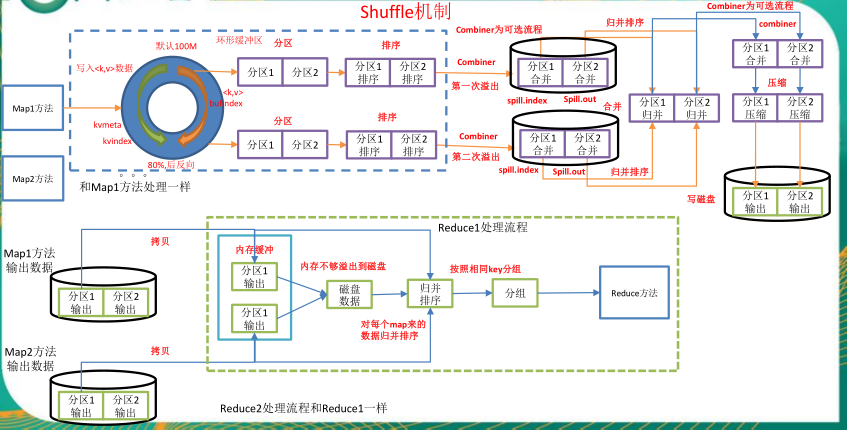

## 一、MapReduce概述

&emsp;&emsp;MapReduce是一个分布式运算程序的编程框架，是用户开发“基于Hadoop的数据分析应用”的核心框架。

&emsp;&emsp;MapReduce核心功能是将用户编写的业务逻辑代码和自带默认组件整合成一个完整的分布式运算程序，并发运行在一个Hadoop集群上。

&emsp;&emsp;MapReduce 作业通过将输入的数据集拆分为独立的块，这些块由 `map` 以并行的方式处理，框架对 `map` 的输出进行排序，然后输入到 `reduce` 中。MapReduce 框架专门用于 `<key，value>` 键值对处理，它将作业的输入视为一组 `<key，value>` 对，并生成一组 `<key，value>` 对作为输出。输出和输出的 `key` 和 `value` 都必须实现[Writable](http://hadoop.apache.org/docs/stable/api/org/apache/hadoop/io/Writable.html) 接口。

```
(input) <k1, v1> -> map -> <k2, v2> -> combine -> <k2, v2> -> reduce -> <k3, v3> (output)
```


## 二、MapReduce编程模型简述

&emsp;&emsp;这里以词频统计为例进行说明，MapReduce 处理的流程如下：


1. **input** : 读取文本文件；
2. **splitting** : 将文件按照行进行拆分，此时得到的 `K1` 行数，`V1` 表示对应行的文本内容；
3. **mapping** : 并行将每一行按照空格进行拆分，拆分得到的 `List(K2,V2)`，其中 `K2` 代表每一个单词，由于是做词频统计，所以 `V2` 的值为 1，代表出现 1 次；
4. **shuffling**：由于 `Mapping` 操作可能是在不同的机器上并行处理的，所以需要通过 `shuffling` 将相同 `key` 值的数据分发到同一个节点上去合并，这样才能统计出最终的结果，此时得到 `K2` 为每一个单词，`List(V2)` 为可迭代集合，`V2` 就是 Mapping 中的 V2；
5. **Reducing** : 这里的案例是统计单词出现的总次数，所以 `Reducing` 对 `List(V2)` 进行归约求和操作，最终输出。

&emsp;&emsp;MapReduce 编程模型中 `splitting` 和 `shuffing` 操作都是由框架实现的，需要我们自己编程实现的只有 `mapping` 和 `reducing`，这也就是 MapReduce 这个称呼的来源。

## 三、MapReduce  编程规范

&emsp;&emsp;用户编写的程序分成三个部分：Mapper、Reducer 和 Driver。

### （1）Mapper阶段

（1）用户自定义的Mapper要继承自己的父类

（2）Mapper的输入数据是KV对的形式（KV的类型可自定义）

（3）Mapper中的业务逻辑写在map()方法中

（4）Mapper的输出数据是KV对的形式（KV的类型可自定义）

（5）map()方法（MapTask进程）对每一个<K,V>调用一次

### （2）Reducer阶段

（1）用户自定义的Reducer要继承自己的父类

（2）Reducer的输入数据类型对应Mapper的输出数据类型，也是KV

（3）Reducer的业务逻辑写在reduce()方法中

（4）ReduceTask进程对每一组相同k的<k,v>组调用一次reduce()方法

### （3）Driver阶段

&emsp;&emsp;相当于YARN集群的客户端，用于提交我们整个程序到YARN集群，提交的是封装了MapReduce程序相关运行参数的job对象。

## 四、Shuffle  机制

&emsp;&emsp;Mapreduce 确保每个 Reducer 的输入都是按 key 排序的。系统执行排序的过程（即将Mapper 输出作为输入传给 Reducer）称为 Shuffle。




