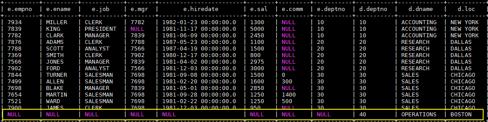

## 一、Hive基础

&emsp;&emsp;Hive 是基于 Hadoop 的一个数据仓库工具，可以将结构化的数据文件映射为一张表，并提供类 SQL 查询功能。

<font color='red'>本质是：将 HQL 转化成 MapReduce 程序。</font>

&emsp;1）Hive 处理的数据存储在 HDFS

&emsp;2）Hive 分析数据底层的实现是 MapReduce

&emsp;3）执行程序运行在 Yarn 上

### 1. Hive的优缺点

#### 优点

1)  操作接口采用类 SQL 语法，提供快速开发的能力（简单、容易上手）。

2)  避免了去写 MapReduce，减少开发人员的学习成本。

3)  Hive 的执行延迟比较高，因此 Hive 常用于数据分析，对实时性要求不高的场合。

4)  Hive 优势在于处理大数据，对于处理小数据没有优势，因为 Hive 的执行延迟比较高。

5)  Hive 支持用户自定义函数，用户可以根据自己的需求来实现自己的函数。

#### 缺点

1．Hive 的 HQL 表达能力有限

（1）迭代式算法无法表达

（2）数据挖掘方面不擅长

2．Hive 的效率比较低

（1）Hive 自动生成的 MapReduce 作业，通常情况下不够智能化

（2）Hive 调优比较困难，粒度较粗

### 2. Hive架构原理

1．用户接口：Client

&emsp;&emsp;CLI（hive shell）、JDBC/ODBC(java 访问 hive)、WEBUI（浏览器访问 hive）

2．元数据：Metastore

&emsp;&emsp;元数据包括：表名、表所属的数据库（默认是 default）、表的拥有者、列/分区字段、表
的类型（是否是外部表）、表的数据所在目录等；

<font color='red'>默认存储在自带的 derby 数据库中，推荐使用 MySQL 存储 Metastore。</font>

3．Hadoop

&emsp;&emsp;使用 HDFS 进行存储，使用 MapReduce 进行计算。

4．驱动器：Driver

（1）解析器（SQL Parser）：将 SQL 字符串转换成抽象语法树 AST，这一步一般都用第三方工具库完成，比如 antlr；对 AST 进行语法分析，比如表是否存在、字段是否存在、SQL 语义是否有误。

（2）编译器（Physical Plan）：将 AST 编译生成逻辑执行计划。

（3）优化器（Query Optimizer）：对逻辑执行计划进行优化。

（4）执行器（Execution）：把逻辑执行计划转换成可以运行的物理计划。对于 Hive 来说，就是 MR/Spark。

&emsp;&emsp;Hive 通过给用户提供的一系列交互接口，接收到用户的指令(SQL)，使用自己的 Driver，结合元数(MetaStore)，将这些指令翻译成 MapReduce，提交到 Hadoop 中执行，最后，将执行返回的结果输出到用户交互接口。

&emsp;&emsp;Hive 是建立在 Hadoop 之上的，所有 Hive 的数据都是存储在 HDFS 中的。

&emsp;&emsp;Hive 是针对数据仓库应用设计的，而数据仓库的内容是读多写少的。因此，Hive中不建议对数据的改写，所有的数据都是在加载的时候确定好的。

&emsp;&emsp;Hive 在加载数据的过程中不会对数据进行任何处理，甚至不会对数据进行扫描，因此也没有对数据中的某些 Key 建立索引。Hive 要访问数据中满足条件的特定值时，需要暴力扫描整个数据，因此访问延迟较高。由于 MapReduce 的引入， Hive 可以并行访问数据，因此即使没有索引，对于大数据量的访问，Hive 仍然可以体现出优势。


## 二、Hive的安装

### 1. 下载并解压

&emsp;&emsp;下载所需版本的 Hive，这里我下载版本为 `cdh5.15.2`。下载地址：http://archive.cloudera.com/cdh5/cdh/5/

```shell
# 下载后进行解压
 tar -zxvf hive-1.1.0-cdh5.15.2.tar.gz
```

### 2. 配置环境变量

```shell
vim /etc/profile
```

&emsp;&emsp;添加环境变量：

```shell
export HIVE_HOME=/usr/app/hive-1.1.0-cdh5.15.2
export PATH=$HIVE_HOME/bin:$PATH
```

&emsp;&emsp;使得配置的环境变量立即生效：

```shell
source /etc/profile
```

### 3. 修改配置

**1. hive-env.sh**

&emsp;&emsp;进入安装目录下的 `conf/` 目录，拷贝 Hive 的环境配置模板 `flume-env.sh.template`

```shell
cp hive-env.sh.template hive-env.sh
```

&emsp;&emsp;修改 `hive-env.sh`，指定 Hadoop 的安装路径：

```shell
export HADOOP_HOME=/usr/app/hadoop-2.6.0-cdh5.15.2
export HIVE_CONF_DIR=/opt/module/hive/conf
```

**2. hive-site.xml**

&emsp;&emsp;新建 hive-site.xml 文件，内容如下，主要是配置存放元数据的 MySQL 的地址、驱动、用户名和密码等信息：

&emsp;&emsp;前提是已经安装好Mysql。

```xml
<?xml version="1.0"?>
<?xml-stylesheet type="text/xsl" href="configuration.xsl"?>

<configuration>
  <property>
    <name>javax.jdo.option.ConnectionURL</name>
    <value>jdbc:mysql://hadoop001:3306/hadoop_hive?createDatabaseIfNotExist=true</value>
  </property>
  
  <property>
    <name>javax.jdo.option.ConnectionDriverName</name>
    <value>com.mysql.jdbc.Driver</value>
  </property>
  
  <property>
    <name>javax.jdo.option.ConnectionUserName</name>
    <value>root</value>
  </property>
  
  <property>
    <name>javax.jdo.option.ConnectionPassword</name>
    <value>root</value>
  </property>

</configuration>
```

### 4. 拷贝数据库驱动

&emsp;&emsp;将 MySQL 驱动包拷贝到 Hive 安装目录的 `lib` 目录下, MySQL 驱动的下载地址为：https://dev.mysql.com/downloads/connector/j/  。


### 5. 初始化元数据库

- 当使用的 hive 是 1.x 版本时，可以不进行初始化操作，Hive 会在第一次启动的时候会自动进行初始化，但不会生成所有的元数据信息表，只会初始化必要的一部分，在之后的使用中用到其余表时会自动创建；

- 当使用的 hive 是 2.x 版本时，必须手动初始化元数据库。初始化命令：

  ```shell
  # schematool 命令在安装目录的 bin 目录下，由于上面已经配置过环境变量，在任意位置执行即可
  schematool -dbType mysql -initSchema
  ```

&emsp;&emsp;这里我使用的是 CDH 的 `hive-1.1.0-cdh5.15.2.tar.gz`，对应 `Hive 1.1.0` 版本，可以跳过这一步。

### 6. 启动

&emsp;&emsp;由于已经将 Hive 的 bin 目录配置到环境变量，直接使用以下命令启动，成功进入交互式命令行后执行 `show databases` 命令，无异常则代表搭建成功。

```shell
hive
```


&emsp;&emsp;在 Mysql 中也能看到 Hive 创建的库和存放元数据信息的表


```text
1）Default 数据仓库的最原始位置是在 hdfs 上的：/user/hive/warehouse 路径下。
2）在仓库目录下，没有对默认的数据库 default 创建文件夹。如果某张表属于 default
数据库，直接在数据仓库目录下创建一个文件夹
```

## 三、HiveServer2/beeline

&emsp;&emsp;Hive 内置了 HiveServer 和 HiveServer2 服务，两者都允许客户端使用多种编程语言进行连接，但是 HiveServer 不能处理多个客户端的并发请求，因此产生了 HiveServer2。HiveServer2（HS2）允许远程客户端可以使用各种编程语言向 Hive 提交请求并检索结果，支持多客户端并发访问和身份验证。HS2 是由多个服务组成的单个进程，其包括基于 Thrift 的 Hive 服务（TCP 或 HTTP）和用于 Web UI 的 Jetty Web 服务。

 &emsp;&emsp;HiveServer2 拥有自己的 CLI 工具——Beeline。Beeline 是一个基于 SQLLine 的 JDBC 客户端。由于目前 HiveServer2 是 Hive 开发维护的重点，所以官方更加推荐使用 Beeline 而不是 Hive CLI。以下主要讲解 Beeline 的配置方式。


### 1. 修改Hadoop配置

&emsp;&emsp;修改 hadoop 集群的 core-site.xml 配置文件，增加如下配置，指定 hadoop 的 root 用户可以代理本机上所有的用户。

```xml
<property>
 <name>hadoop.proxyuser.root.hosts</name>
 <value>*</value>
</property>
<property>
 <name>hadoop.proxyuser.root.groups</name>
 <value>*</value>
</property>
```

&emsp;&emsp;之所以要配置这一步，是因为 hadoop 2.0 以后引入了安全伪装机制，使得 hadoop 不允许上层系统（如 hive）直接将实际用户传递到 hadoop 层，而应该将实际用户传递给一个超级代理，由该代理在 hadoop 上执行操作，以避免任意客户端随意操作 hadoop。如果不配置这一步，在之后的连接中可能会抛出 `AuthorizationException` 异常。

> 关于 Hadoop 的用户代理机制，可以参考：[hadoop 的用户代理机制](https://blog.csdn.net/u012948976/article/details/49904675#官方文档解读) 或 [Superusers Acting On Behalf Of Other Users](http://hadoop.apache.org/docs/current/hadoop-project-dist/hadoop-common/Superusers.html)


### 2. 启动hiveserver2

&emsp;&emsp;由于上面已经配置过环境变量，这里直接启动即可：

```shell
nohup hiveserver2 &
```


### 3. 使用beeline

&emsp;&emsp;可以使用以下命令进入 beeline 交互式命令行，出现 `Connected` 则代表连接成功。

```shell
beeline -u jdbc:hive2://hadoop001:10000 -n root
```


## 四、Hive CLI和Beeline命令行的基本使用

### 1. Hive CLI

#### 1.1 Help

&emsp;&emsp;使用 `hive -H` 或者 `hive --help` 命令可以查看所有命令的帮助，显示如下：

```
usage: hive
 -d,--define <key=value>          Variable subsitution to apply to hive 
                                  commands. e.g. -d A=B or --define A=B  --定义用户自定义变量
    --database <databasename>     Specify the database to use  -- 指定使用的数据库
 -e <quoted-query-string>         SQL from command line   -- 执行指定的 SQL
 -f <filename>                    SQL from files   --执行 SQL 脚本
 -H,--help                        Print help information  -- 打印帮助信息
    --hiveconf <property=value>   Use value for given property    --自定义配置
    --hivevar <key=value>         Variable subsitution to apply to hive  --自定义变量
                                  commands. e.g. --hivevar A=B
 -i <filename>                    Initialization SQL file  --在进入交互模式之前运行初始化脚本
 -S,--silent                      Silent mode in interactive shell    --静默模式
 -v,--verbose                     Verbose mode (echo executed SQL to the  console)  --详细模式
```

#### 1.2 交互式命令行

&emsp;&emsp;直接使用 `Hive` 命令，不加任何参数，即可进入交互式命令行。

#### 1.3 执行SQL命令

&emsp;&emsp;在不进入交互式命令行的情况下，可以使用 `hive -e ` 执行 SQL 命令。

```sql
hive -e 'select * from emp';
```


#### 1.4 执行SQL脚本

&emsp;&emsp;用于执行的 sql 脚本可以在本地文件系统，也可以在 HDFS 上。

```shell
# 本地文件系统
hive -f /usr/file/simple.sql;

# HDFS文件系统
hive -f hdfs://hadoop001:8020/tmp/simple.sql;
```

&emsp;&emsp;其中 `simple.sql` 内容如下：

```sql
select * from emp;
```

#### 1.5 配置Hive变量

&emsp;&emsp;可以使用 `--hiveconf` 设置 Hive 运行时的变量。

```sql
hive -e 'select * from emp' \
--hiveconf hive.exec.scratchdir=/tmp/hive_scratch  \
--hiveconf mapred.reduce.tasks=4;
```

> hive.exec.scratchdir：指定 HDFS 上目录位置，用于存储不同 map/reduce 阶段的执行计划和这些阶段的中间输出结果。

#### 1.6 配置文件启动

&emsp;&emsp;使用 `-i` 可以在进入交互模式之前运行初始化脚本，相当于指定配置文件启动。

```shell
hive -i /usr/file/hive-init.conf;
```

&emsp;&emsp;其中 `hive-init.conf` 的内容如下：

```sql
set hive.exec.mode.local.auto = true;
```

> hive.exec.mode.local.auto 默认值为 false，这里设置为 true ，代表开启本地模式。

#### 1.7 用户自定义变量

&emsp;&emsp;`--define <key=value> ` 和 `--hivevar <key=value>  ` 在功能上是等价的，都是用来实现自定义变量，这里给出一个示例:

&emsp;&emsp;定义变量：

```sql
hive  --define  n=ename --hiveconf  --hivevar j=job;
```

&emsp;&emsp;在查询中引用自定义变量：

```sql
# 以下两条语句等价
hive > select ${n} from emp;
hive >  select ${hivevar:n} from emp;

# 以下两条语句等价
hive > select ${j} from emp;
hive >  select ${hivevar:j} from emp;
```

&emsp;&emsp;结果如下：


### 2. Beeline

#### 2.1 HiveServer2

&emsp;&emsp;Hive 内置了 HiveServer 和 HiveServer2 服务，两者都允许客户端使用多种编程语言进行连接，但是 HiveServer 不能处理多个客户端的并发请求，所以产生了 HiveServer2。

&emsp;&emsp;HiveServer2（HS2）允许远程客户端可以使用各种编程语言向 Hive 提交请求并检索结果，支持多客户端并发访问和身份验证。HS2 是由多个服务组成的单个进程，其包括基于 Thrift 的 Hive 服务（TCP 或 HTTP）和用于 Web UI 的 Jetty Web 服务器。

&emsp;&emsp; HiveServer2 拥有自己的 CLI(Beeline)，Beeline 是一个基于 SQLLine 的 JDBC 客户端。由于 HiveServer2 是 Hive 开发维护的重点 (Hive0.15 后就不再支持 hiveserver)，所以 Hive CLI 已经不推荐使用了，官方更加推荐使用 Beeline。

#### 2.1 Beeline

&emsp;&emsp;Beeline 拥有更多可使用参数，可以使用 `beeline --help` 查看，完整参数如下：

```properties
Usage: java org.apache.hive.cli.beeline.BeeLine
   -u <database url>               the JDBC URL to connect to
   -r                              reconnect to last saved connect url (in conjunction with !save)
   -n <username>                   the username to connect as
   -p <password>                   the password to connect as
   -d <driver class>               the driver class to use
   -i <init file>                  script file for initialization
   -e <query>                      query that should be executed
   -f <exec file>                  script file that should be executed
   -w (or) --password-file <password file>  the password file to read password from
   --hiveconf property=value       Use value for given property
   --hivevar name=value            hive variable name and value
                                   This is Hive specific settings in which variables
                                   can be set at session level and referenced in Hive
                                   commands or queries.
   --property-file=<property-file> the file to read connection properties (url, driver, user, password) from
   --color=[true/false]            control whether color is used for display
   --showHeader=[true/false]       show column names in query results
   --headerInterval=ROWS;          the interval between which heades are displayed
   --fastConnect=[true/false]      skip building table/column list for tab-completion
   --autoCommit=[true/false]       enable/disable automatic transaction commit
   --verbose=[true/false]          show verbose error messages and debug info
   --showWarnings=[true/false]     display connection warnings
   --showNestedErrs=[true/false]   display nested errors
   --numberFormat=[pattern]        format numbers using DecimalFormat pattern
   --force=[true/false]            continue running script even after errors
   --maxWidth=MAXWIDTH             the maximum width of the terminal
   --maxColumnWidth=MAXCOLWIDTH    the maximum width to use when displaying columns
   --silent=[true/false]           be more silent
   --autosave=[true/false]         automatically save preferences
   --outputformat=[table/vertical/csv2/tsv2/dsv/csv/tsv]  format mode for result display
   --incrementalBufferRows=NUMROWS the number of rows to buffer when printing rows on stdout,
                                   defaults to 1000; only applicable if --incremental=true
                                   and --outputformat=table
   --truncateTable=[true/false]    truncate table column when it exceeds length
   --delimiterForDSV=DELIMITER     specify the delimiter for delimiter-separated values output format (default: |)
   --isolation=LEVEL               set the transaction isolation level
   --nullemptystring=[true/false]  set to true to get historic behavior of printing null as empty string
   --maxHistoryRows=MAXHISTORYROWS The maximum number of rows to store beeline history.
   --convertBinaryArrayToString=[true/false]    display binary column data as string or as byte array
   --help                          display this message

```

#### 2.3 常用参数

&emsp;&emsp;在 Hive CLI 中支持的参数，Beeline 都支持，常用的参数如下。更多参数说明可以参见官方文档 [Beeline Command Options](https://cwiki.apache.org/confluence/display/Hive/HiveServer2+Clients#HiveServer2Clients-Beeline%E2%80%93NewCommandLineShell)

| 参数                                   | 说明               |
| ------------------------------------ | ---------------- |
| **-u \<database URL>**               | 数据库地址            |
| **-n \<username>**                   | 用户名              |
| **-p \<password>**                   | 密码               |
| **-d \<driver class>**               | 驱动 (可选)          |
| **-e \<query>**                      | 执行 SQL 命令        |
| **-f \<file>**                       | 执行 SQL 脚本        |
| **-i  (or)--init  \<file or files>** | 在进入交互模式之前运行初始化脚本 |
| **--property-file \<file>**          | 指定配置文件           |
| **--hiveconf** *property**=**value*  | 指定配置属性           |
| **--hivevar** *name**=**value*       | 用户自定义属性，在会话级别有效  |

&emsp;&emsp;示例： 使用用户名和密码连接 Hive

```shell
$ beeline -u jdbc:hive2://localhost:10000  -n username -p password 
```

​         

### 3. Hive配置

&emsp;&emsp;可以通过三种方式对 Hive 的相关属性进行配置，分别介绍如下：

#### 3.1 配置文件

方式一为使用配置文件，使用配置文件指定的配置是永久有效的。Hive 有以下三个可选的配置文件：

- hive-site.xml ：Hive 的主要配置文件；
- hivemetastore-site.xml： 关于元数据的配置；
- hiveserver2-site.xml：关于 HiveServer2 的配置。

示例如下,在 hive-site.xml 配置 `hive.exec.scratchdir`：

```xml
 <property>
    <name>hive.exec.scratchdir</name>
    <value>/tmp/mydir</value>
    <description>Scratch space for Hive jobs</description>
  </property>
```

#### 3.2 hiveconf

&emsp;&emsp;方式二为在启动命令行 (Hive CLI / Beeline) 的时候使用 `--hiveconf` 指定配置，这种方式指定的配置作用于整个 Session。

```
hive --hiveconf hive.exec.scratchdir=/tmp/mydir
```

#### 3.3 set

&emsp;&emsp;方式三为在交互式环境下 (Hive CLI / Beeline)，使用 set 命令指定。这种设置的作用范围也是 Session 级别的，配置对于执行该命令后的所有命令生效。set 兼具设置参数和查看参数的功能。如下：

```shell
0: jdbc:hive2://hadoop001:10000> set hive.exec.scratchdir=/tmp/mydir;
No rows affected (0.025 seconds)
0: jdbc:hive2://hadoop001:10000> set hive.exec.scratchdir;
+----------------------------------+--+
|               set                |
+----------------------------------+--+
| hive.exec.scratchdir=/tmp/mydir  |
+----------------------------------+--+
```

#### 3.4 配置优先级

&emsp;&emsp;配置的优先顺序如下 (由低到高)：  
`hive-site.xml` - >` hivemetastore-site.xml `- > `hiveserver2-site.xml` - >` -- hiveconf`- > `set`

#### 3.5 配置参数

&emsp;&emsp;Hive 可选的配置参数非常多，在用到时查阅官方文档即可[AdminManual Configuration](https://cwiki.apache.org/confluence/display/Hive/AdminManual+Configuration)

## 五、Hive常用DDL操作

### 1. 创建数据库

&emsp;&emsp;创建一个数据库，数据库在 HDFS 上的默认存储路径是/user/hive/warehouse/*.db。

```shell
hive (default)> create database db_hive;
```

&emsp;&emsp;避免要创建的数据库已经存在错误，增加 if not exists 判断。（标准写法）

```shell
hive (default)> create database db_hive;
FAILED: Execution Error, return code 1 from org.apache.hadoop.hive.ql.exec.DDLTask.
Database db_hive already exists
hive (default)> create database if not exists db_hive;
```

&emsp;&emsp;创建一个数据库，指定数据库在 HDFS 上存放的位置

```shell
hive (default)> create database db_hive2 location '/db_hive2.db';
```


### 2. 查询数据库

&emsp;&emsp;显示数据库

```shell
hive> show databases;
```

&emsp;&emsp;过滤显示查询的数据库

```shell
hive> show databases like 'db_hive*';
OK
db_hive
db_hive_1
```

&emsp;&emsp;查看数据库详情

```shell
hive> desc database db_hive;
OK
db_hive hdfs://hadoop102:9000/user/hive/warehouse/db_hive.db atguiguUSER 
```

&emsp;&emsp;切换当前数据库

```shell
hive (default)> use db_hive;
```


### 3. 修改数据库

&emsp;&emsp;用户可以使用 ALTER DATABASE 命令为某个数据库的 DBPROPERTIES 设置键-值对属性值，来描述这个数据库的属性信息。数据库的其他元数据信息都是不可更改的，包括数据库名和数据库所在的目录位置。

```shell
hive (default)> alter database db_hive set dbproperties('createtime'='20210130');
```


### 4. 删除数据库

&emsp;&emsp;删除空数据库:

```shell
hive>drop database db_hive2;
```

&emsp;&emsp;如果删除的数据库不存在，最好采用 if exists 判断数据库是否存在

```shell
hive> drop database db_hive;
FAILED: SemanticException [Error 10072]: Database does not exist: db_hive
hive> drop database if exists db_hive2;
```

&emsp;&emsp;如果数据库不为空，可以采用 cascade 命令，强制删除

```shell
hive> drop database db_hive;
FAILED: Execution Error, return code 1 from org.apache.hadoop.hive.ql.exec.DDLTask.
InvalidOperationException(message:Database db_hive is not empty. One or more tables
exist.)
hive> drop database db_hive cascade;
```


### 5. 创建表

&emsp;&emsp;建表语法:

```shell
CREATE [TEMPORARY] [EXTERNAL] TABLE [IF NOT EXISTS] [db_name.]table_name     --表名
  [(col_name data_type [COMMENT col_comment],
    ... [constraint_specification])]  --列名 列数据类型
  [COMMENT table_comment]   --表描述
  [PARTITIONED BY (col_name data_type [COMMENT col_comment], ...)]  --分区表分区规则
  [
    CLUSTERED BY (col_name, col_name, ...) 
   [SORTED BY (col_name [ASC|DESC], ...)] INTO num_buckets BUCKETS
  ]  --分桶表分桶规则
  [SKEWED BY (col_name, col_name, ...) ON ((col_value, col_value, ...), (col_value, col_value, ...), ...)  
   [STORED AS DIRECTORIES] 
  ]  --指定倾斜列和值
  [
   [ROW FORMAT row_format]    
   [STORED AS file_format]
     | STORED BY 'storage.handler.class.name' [WITH SERDEPROPERTIES (...)]  
  ]  -- 指定行分隔符、存储文件格式或采用自定义存储格式
  [LOCATION hdfs_path]  -- 指定表的存储位置
  [TBLPROPERTIES (property_name=property_value, ...)]  --指定表的属性
  [AS select_statement];   --从查询结果创建表
```

&emsp;&emsp;字段解释说明:

```shell
（1）CREATE TABLE 创建一个指定名字的表。如果相同名字的表已经存在，则抛出异常；用户可以用 IF NOT EXISTS 选项来忽略这个异常。
（2）EXTERNAL 关键字可以让用户创建一个外部表，在建表的同时指定一个指向实际数据的路径（LOCATION），Hive 创建内部表时，会将数据移动到数据仓库指向的路径；若创建外部表，仅记录数据所在的路径，不对数据的位置做任何改变。在删除表的时候，内部表的元数据和数据会被一起删除，而外部表只删除元数据，不删除数据。
（3）COMMENT：为表和列添加注释。
（4）PARTITIONED BY 创建分区表
（5）CLUSTERED BY 创建分桶表
（6）SORTED BY 不常用
（7）ROW FORMAT
DELIMITED  [FIELDS  TERMINATED  BY  char]  [COLLECTION  ITEMS
TERMINATED BY char]
	[MAP KEYS TERMINATED BY char] [LINES TERMINATED BY char]
	| SERDE serde_name [WITH SERDEPROPERTIES (property_name=property_value,
property_name=property_value, ...)]
	用户在建表的时候可以自定义 SerDe 或者使用自带的 SerDe。如果没有指定 ROWFORMAT 或者 ROW FORMAT DELIMITED，将会使用自带的 SerDe。在建表的时候，用户还需要为表指定列，用户在指定表的列的同时也会指定自定义的 SerDe，Hive 通过 SerDe确定表的具体的列的数据。SerDe 是 Serialize/Deserilize 的简称，目的是用于序列化和反序列化。
（8）STORED AS 指定存储文件类型
常用的存储文件类型：SEQUENCEFILE（二进制序列文件）、TEXTFILE（文本）、
RCFILE（列式存储格式文件）
如果文件数据是纯文本，可以使用 STORED AS TEXTFILE。如果数据需要压缩，
使用 STORED AS SEQUENCEFILE。
（9）LOCATION ：指定表在 HDFS 上的存储位置。
（10）LIKE 允许用户复制现有的表结构，但是不复制数据。
```

**管理表（内部表）**:

&emsp;&emsp;1．理论

&emsp;&emsp;默认创建的表都是所谓的管理表，有时也被称为内部表。因为这种表，Hive 会（或多或少地）控制着数据的生命周期。Hive 默认情况下会将这些表的数据存储在由配置项hive.metastore.warehouse.dir (例如，/user/hive/warehouse)所定义的目录的子目录下。 当我 们删除一个管理表时，Hive 也会删除这个表中数据。

管理表不适合和其他工具共享数据。

```sql
  CREATE TABLE emp(
    empno INT,
    ename STRING,
    job STRING,
    mgr INT,
    hiredate TIMESTAMP,
    sal DECIMAL(7,2),
    comm DECIMAL(7,2),
    deptno INT)
    ROW FORMAT DELIMITED FIELDS TERMINATED BY "\t";
```

**外部表(EXTERNAL)**:

&emsp;&emsp;1．理论

&emsp;&emsp;因为表是外部表，所以 Hive 并非认为其完全拥有这份数据。删除该表并不会删除掉这份数据，不过描述表的元数据信息会被删除掉。

&emsp;&emsp;2．管理表和外部表的使用场景

&emsp;&emsp;每天将收集到的网站日志定期流入 HDFS 文本文件。在外部表（原始日志表）的基础上做大量的统计分析，用到的中间表、结果表使用内部表存储，数据通过 SELECT+INSERT进入内部表。

```sql
  CREATE EXTERNAL TABLE emp_external(
    empno INT,
    ename STRING,
    job STRING,
    mgr INT,
    hiredate TIMESTAMP,
    sal DECIMAL(7,2),
    comm DECIMAL(7,2),
    deptno INT)
    ROW FORMAT DELIMITED FIELDS TERMINATED BY "\t"
    LOCATION '/hive/emp_external';
```


**管理表与外部表的互相转换**:

（1）查询表的类型

```shell
hive (default)> desc formatted student2;
Table Type: MANAGED_TABLE
```

（2）修改内部表 student2 为外部表

```shell
alter table student2 set tblproperties('EXTERNAL'='TRUE');
```

（3）查询表的类型

```shell
hive (default)> desc formatted student2;
Table Type: EXTERNAL_TABLE
```

（4）修改外部表 student2 为内部表

```shell
alter table student2 set tblproperties('EXTERNAL'='FALSE');
```

（5）查询表的类型

```shell
hive (default)> desc formatted student2;
Table Type: MANAGED_TABLE
```

<font color='red'>注意：('EXTERNAL'='TRUE')和('EXTERNAL'='FALSE')为固定写法，区分大小写！</font>


### 6. 分区表

&emsp;&emsp;分区表实际上就是对应一个 HDFS 文件系统上的独立的文件夹，该文件夹下是该分区所有的数据文件。Hive 中的分区就是分目录，把一个大的数据集根据业务需要分割成小的数据集。在查询时通过 WHERE 子句中的表达式选择查询所需要的指定的分区，这样的查询效率会提高很多。

**分区表基本操作**

1．引入分区表（需要根据日期对日志进行管理）

```shell
/user/hive/warehouse/log_partition/20200702/20200702.log
/user/hive/warehouse/log_partition/20200703/20200703.log
/user/hive/warehouse/log_partition/20200704/20200704.log
```

2．创建分区表语法

```shell
hive (default)> create table dept_partition(
deptno int, dname string, loc string
)
partitioned by (month string)
row format delimited fields terminated by '\t';
```

3．加载数据到分区表中

```shell
hive (default)> load data local inpath '/opt/module/datas/dept.txt' into table
default.dept_partition partition(month='202009');
hive (default)> load data local inpath '/opt/module/datas/dept.txt' into table
default.dept_partition partition(month='202008');
hive (default)> load data local inpath '/opt/module/datas/dept.txt' into table
default.dept_partition partition(month='202007’);
```

4．查询分区表中数据

单分区查询

```shell
hive (default)> select * from dept_partition where month='202009';
```

多分区联合查询

```shell
hive (default)> select * from dept_partition where month='202009'
                union
                select * from dept_partition where month='202008'
                union
                select * from dept_partition where month='202007';
                
_u3.deptno    _u3.dname    _u3.loc    _u3.month
10       ACCOUNTING NEW YORK         202007
10       ACCOUNTING NEW YORK         202008
10       ACCOUNTING NEW YORK         202009
20       RESEARCH DALLAS             202007
20       RESEARCH DALLAS             202008
20       RESEARCH DALLAS             202009
30       SALES CHICAGO               202007
30       SALES CHICAGO               202008
30       SALES CHICAGO               202009
40       OPERATIONS BOSTON           202007
40       OPERATIONS BOSTON           202008
40       OPERATIONS BOSTON           202009
```

增加分区

```shell
hive (default)> alter table dept_partition add partition(month='202006') ;

hive (default)> alter table dept_partition add partition(month='202005')
partition(month='202004');
```

删除分区

```shell
hive (default)> alter table dept_partition drop partition (month='202004');
```

查看分区表有多少分区

```shell
hive> show partitions dept_partition;
```

查看分区表结构

```shell
hive> desc formatted dept_partition;
# Partition Information
# col_name data_type comment
month string
```

### 7. 分桶表

&emsp;&emsp;分区提供了一个隔离数据和优化查询的可行方案，但是并非所有的数据集都可以形成合理的分区，分区的数量也不是越多越好，过多的分区条件可能会导致很多分区上没有数据。同时 Hive 会限制动态分区可以创建的最大分区数，用来避免过多分区文件对文件系统产生负担。鉴于以上原因，Hive 还提供了一种更加细粒度的数据拆分方案：分桶表 (bucket Table)。

&emsp;&emsp;分桶表会将指定列的值进行哈希散列，并对 bucket（桶数量）取余，然后存储到对应的 bucket（桶）中。

```sql
  CREATE EXTERNAL TABLE emp_bucket(
    empno INT,
    ename STRING,
    job STRING,
    mgr INT,
    hiredate TIMESTAMP,
    sal DECIMAL(7,2),
    comm DECIMAL(7,2),
    deptno INT)
    CLUSTERED BY(empno) SORTED BY(empno ASC) INTO 4 BUCKETS  --按照员工编号散列到四个 bucket 中
    ROW FORMAT DELIMITED FIELDS TERMINATED BY "\t"
    LOCATION '/hive/emp_bucket';
```

### 8. 修改表

语法：

```sql
ALTER TABLE table_name [PARTITION partition_spec] CHANGE [COLUMN] col_old_name col_new_name column_type
  [COMMENT col_comment] [FIRST|AFTER column_name] [CASCADE|RESTRICT];
```

```sql
-- 修改字段名和类型
ALTER TABLE emp_temp CHANGE empno empno_new INT;
 
-- 修改字段 sal 的名称 并将其放置到 empno 字段后
ALTER TABLE emp_temp CHANGE sal sal_new decimal(7,2)  AFTER ename;

-- 为字段增加注释
ALTER TABLE emp_temp CHANGE mgr mgr_new INT COMMENT 'this is column mgr';
```

重命名表:

```sql
ALTER TABLE table_name RENAME TO new_table_name
```

增加/ 修改/ 替换列信息:

```sql
更新列
ALTER TABLE table_name CHANGE [COLUMN] col_old_name col_new_name column_type [COMMENT col_comment] [FIRST|AFTER column_name]

增加和替换列
ALTER TABLE table_name ADD|REPLACE COLUMNS (col_name data_type [COMMENT col_comment], ...)

注：ADD 是代表新增一字段，字段位置在所有列后面(partition 列前)，REPLACE 则是表示替换表中所有字段。
```

### 9. 删除表

```shell
hive (default)> drop table dept_partition;
```

## 六、Hive常用的DML操作 

### 1. 数据导入

向表中装载数据（Load ）

```shell
hive> load data [local] inpath '/opt/module/datas/student.txt' [overwrite] into table student
[partition (partcol1=val1,…)];


（1）load data:表示加载数据
（2）local:表示从本地加载数据到 hive 表；否则从 HDFS 加载数据到 hive 表
（3）inpath:表示加载数据的路径
（4）overwrite:表示覆盖表中已有数据，否则表示追加
（5）into table:表示加载到哪张表
（6）student:表示具体的表
（7）partition:表示上传到指定分区


实例：
加载本地文件到 hive
hive (default)> load data local inpath '/opt/module/datas/student.txt' into table
default.student;

加载 HDFS 文件到 hive 中
hive (default)> load data inpath '/user/atguigu/hive/student.txt' into table
default.student;
```

### 2. 数据导出

Hadoop 命令导出到本地

```shell
hive (default)> dfs -get /user/hive/warehouse/student/month=201709/000000_0
/opt/module/datas/export/student3.txt;
```

清除表中数据（Truncate ）

```shell
hive (default)> truncate table student;

注意：Truncate 只能删除管理表，不能删除外部表中数据
```

## 七、Hive查询操作

### 1. 数据准备

&emsp;&emsp;为了演示查询操作，这里需要预先创建三张表，并加载测试数据。

#### 1.1 员工表

```sql
 -- 建表语句
 CREATE TABLE emp(
     empno INT,     -- 员工表编号
     ename STRING,  -- 员工姓名
     job STRING,    -- 职位类型
     mgr INT,   
     hiredate TIMESTAMP,  --雇佣日期
     sal DECIMAL(7,2),  --工资
     comm DECIMAL(7,2),
     deptno INT)   --部门编号
    ROW FORMAT DELIMITED FIELDS TERMINATED BY "\t";

  --加载数据
LOAD DATA LOCAL INPATH "/usr/file/emp.txt" OVERWRITE INTO TABLE emp;
```

#### 1.2 部门表

```sql
 -- 建表语句
 CREATE TABLE dept(
     deptno INT,   --部门编号
     dname STRING,  --部门名称
     loc STRING    --部门所在的城市
 )
 ROW FORMAT DELIMITED FIELDS TERMINATED BY "\t";
 
 --加载数据
 LOAD DATA LOCAL INPATH "/usr/file/dept.txt" OVERWRITE INTO TABLE dept;
```

#### 1.3 分区表

&emsp;&emsp;这里需要额外创建一张分区表，主要是为了演示分区查询：

```sql
CREATE EXTERNAL TABLE emp_ptn(
      empno INT,
      ename STRING,
      job STRING,
      mgr INT,
      hiredate TIMESTAMP,
      sal DECIMAL(7,2),
      comm DECIMAL(7,2)
  )
 PARTITIONED BY (deptno INT)   -- 按照部门编号进行分区
 ROW FORMAT DELIMITED FIELDS TERMINATED BY "\t";


--加载数据
LOAD DATA LOCAL INPATH "/usr/file/emp.txt" OVERWRITE INTO TABLE emp_ptn PARTITION (deptno=20)
LOAD DATA LOCAL INPATH "/usr/file/emp.txt" OVERWRITE INTO TABLE emp_ptn PARTITION (deptno=30)
LOAD DATA LOCAL INPATH "/usr/file/emp.txt" OVERWRITE INTO TABLE emp_ptn PARTITION (deptno=40)
LOAD DATA LOCAL INPATH "/usr/file/emp.txt" OVERWRITE INTO TABLE emp_ptn PARTITION (deptno=50)
```


### 2. 单表查询

#### 2.1 SELECT

```sql
-- 查询表中全部数据
SELECT * FROM emp;
```


#### 2.2 WHERE

```sql
-- 查询 10 号部门中员工编号大于 7782 的员工信息 
SELECT * FROM emp WHERE empno > 7782 AND deptno = 10;
```


#### 2.3  DISTINCT

Hive 支持使用 DISTINCT 关键字去重。

```sql
-- 查询所有工作类型
SELECT DISTINCT job FROM emp;
```


#### 2.4 分区查询

分区查询 (Partition Based Queries)，可以指定某个分区或者分区范围。

```sql
-- 查询分区表中部门编号在[20,40]之间的员工
SELECT emp_ptn.* FROM emp_ptn
WHERE emp_ptn.deptno >= 20 AND emp_ptn.deptno <= 40;
```


#### 2.5 LIMIT

```sql
-- 查询薪资最高的 5 名员工
SELECT * FROM emp ORDER BY sal DESC LIMIT 5;
```


#### 2.6 GROUP BY

&emsp;&emsp;Hive 支持使用 GROUP BY 进行分组聚合操作。

```sql
set hive.map.aggr=true;

-- 查询各个部门薪酬综合
SELECT deptno,SUM(sal) FROM emp GROUP BY deptno;
```

&emsp;&emsp;`hive.map.aggr` 控制程序如何进行聚合。默认值为 false。如果设置为 true，Hive 会在 map 阶段就执行一次聚合。这可以提高聚合效率，但需要消耗更多内存。


#### 2.7 ORDER AND SORT

&emsp;&emsp;可以使用 ORDER BY 或者 Sort BY 对查询结果进行排序，排序字段可以是整型也可以是字符串：如果是整型，则按照大小排序；如果是字符串，则按照字典序排序。ORDER BY 和 SORT BY 的区别如下：

- 使用 ORDER BY 时会有一个 Reducer 对全部查询结果进行排序，可以保证数据的全局有序性；
- 使用 SORT BY 时只会在每个 Reducer 中进行排序，这可以保证每个 Reducer 的输出数据是有序的，但不能保证全局有序。

&emsp;&emsp;由于 ORDER BY 的时间可能很长，如果你设置了严格模式 (hive.mapred.mode = strict)，则其后面必须再跟一个 `limit` 子句。

> 注 ：hive.mapred.mode 默认值是 nonstrict ，也就是非严格模式。

```sql
-- 查询员工工资，结果按照部门升序，按照工资降序排列
SELECT empno, deptno, sal FROM emp ORDER BY deptno ASC, sal DESC;
```


#### 2.8 HAVING

&emsp;&emsp;可以使用 HAVING 对分组数据进行过滤。

```sql
-- 查询工资总和大于 9000 的所有部门
SELECT deptno,SUM(sal) FROM emp GROUP BY deptno HAVING SUM(sal)>9000;
```


#### 2.9 DISTRIBUTE BY

&emsp;&emsp;如果想要把具有相同 Key 值的数据分发到同一个 Reducer 进行处理，这可以使用 DISTRIBUTE BY 字句。需要注意的是，DISTRIBUTE BY 虽然能把具有相同 Key 值的数据分发到同一个 Reducer，但是不能保证数据在 Reducer 上是有序的。情况如下：

&emsp;&emsp;把以下 5 个数据发送到两个 Reducer 上进行处理：

```properties
k1
k2
k4
k3
k1
```

Reducer1 得到如下乱序数据：

```properties
k1
k2
k1
```

Reducer2 得到数据如下：

```properties
k4
k3
```

&emsp;&emsp;如果想让 Reducer 上的数据是有序的，可以结合 `SORT BY` 使用 (示例如下)，或者使用下面我们将要介绍的 CLUSTER BY。

```sql
-- 将数据按照部门分发到对应的 Reducer 上处理
SELECT empno, deptno, sal FROM emp DISTRIBUTE BY deptno SORT BY deptno ASC;
```


#### 2.10 CLUSTER BY

&emsp;&emsp;如果 `SORT BY` 和 `DISTRIBUTE BY` 指定的是相同字段，且 SORT BY 排序规则是 ASC，此时可以使用 `CLUSTER BY` 进行替换，同时 `CLUSTER BY` 可以保证数据在全局是有序的。

```sql
SELECT empno, deptno, sal FROM emp CLUSTER  BY deptno ;
```


### 3. 多表联结查询

&emsp;&emsp;Hive 支持内连接，外连接，左外连接，右外连接，笛卡尔连接，这和传统数据库中的概念是一致的，可以参见下图。

&emsp;&emsp;需要特别强调：JOIN 语句的关联条件必须用 ON 指定，不能用 WHERE 指定，否则就会先做笛卡尔积，再过滤，这会导致你得不到预期的结果 (下面的演示会有说明)。


#### 3.1 INNER JOIN

```sql
-- 查询员工编号为 7369 的员工的详细信息
SELECT e.*,d.* FROM 
emp e JOIN dept d
ON e.deptno = d.deptno 
WHERE empno=7369;

--如果是三表或者更多表连接，语法如下
SELECT a.val, b.val, c.val FROM a JOIN b ON (a.key = b.key1) JOIN c ON (c.key = b.key1)
```

#### 3.2 LEFT OUTER  JOIN

LEFT OUTER  JOIN 和 LEFT  JOIN 是等价的。 

```sql
-- 左连接
SELECT e.*,d.*
FROM emp e LEFT OUTER  JOIN  dept d
ON e.deptno = d.deptno;
```

#### 3.3 RIGHT OUTER  JOIN

```sql
--右连接
SELECT e.*,d.*
FROM emp e RIGHT OUTER JOIN  dept d
ON e.deptno = d.deptno;
```

&emsp;&emsp;执行右连接后，由于 40 号部门下没有任何员工，所以此时员工信息为 NULL。这个查询可以很好的复述上面提到的——JOIN 语句的关联条件必须用 ON 指定，不能用 WHERE 指定。你可以把 ON 改成 WHERE，你会发现无论如何都查不出 40 号部门这条数据，因为笛卡尔运算不会有 (NULL, 40) 这种情况。



#### 3.4 FULL OUTER  JOIN

```sql
SELECT e.*,d.*
FROM emp e FULL OUTER JOIN  dept d
ON e.deptno = d.deptno;
```

#### 3.5 LEFT SEMI JOIN

LEFT SEMI JOIN （左半连接）是 IN/EXISTS 子查询的一种更高效的实现。

- JOIN 子句中右边的表只能在 ON 子句中设置过滤条件;
- 查询结果只包含左边表的数据，所以只能 SELECT 左表中的列。

```sql
-- 查询在纽约办公的所有员工信息
SELECT emp.*
FROM emp LEFT SEMI JOIN dept 
ON emp.deptno = dept.deptno AND dept.loc="NEW YORK";

--上面的语句就等价于
SELECT emp.* FROM emp
WHERE emp.deptno IN (SELECT deptno FROM dept WHERE loc="NEW YORK");
```

#### 3.6 JOIN

&emsp;&emsp;笛卡尔积连接，这个连接日常的开发中可能很少遇到，且性能消耗比较大，基于这个原因，如果在严格模式下 (hive.mapred.mode = strict)，Hive 会阻止用户执行此操作。

```sql
SELECT * FROM emp JOIN dept;
```


### 4. JOIN优化

#### 4.1 STREAMTABLE

&emsp;&emsp;在多表进行联结的时候，如果每个 ON 字句都使用到共同的列（如下面的 `b.key`），此时 Hive 会进行优化，将多表 JOIN 在同一个 map / reduce 作业上进行。同时假定查询的最后一个表（如下面的 c 表）是最大的一个表，在对每行记录进行 JOIN 操作时，它将尝试将其他的表缓存起来，然后扫描最后那个表进行计算。因此用户需要保证查询的表的大小从左到右是依次增加的。

```sql
`SELECT a.val, b.val, c.val FROM a JOIN b ON (a.key = b.key) JOIN c ON (c.key = b.key)`
```

然后，用户并非需要总是把最大的表放在查询语句的最后面，Hive 提供了 `/*+ STREAMTABLE() */` 标志，用于标识最大的表，示例如下：

```sql
SELECT /*+ STREAMTABLE(d) */  e.*,d.* 
FROM emp e JOIN dept d
ON e.deptno = d.deptno
WHERE job='CLERK';
```


#### 4.2 MAPJOIN

&emsp;&emsp;如果所有表中只有一张表是小表，那么 Hive 把这张小表加载到内存中。这时候程序会在 map 阶段直接拿另外一个表的数据和内存中表数据做匹配，由于在 map 就进行了 JOIN 操作，从而可以省略 reduce 过程，这样效率可以提升很多。Hive 中提供了 `/*+ MAPJOIN() */` 来标记小表，示例如下：

```sql
SELECT /*+ MAPJOIN(d) */ e.*,d.* 
FROM emp e JOIN dept d
ON e.deptno = d.deptno
WHERE job='CLERK';
```


### 5. SELECT的其他用途

查看当前数据库：

```sql
SELECT current_database()
```


### 6. 本地模式

在上面演示的语句中，大多数都会触发 MapReduce, 少部分不会触发，比如 `select * from emp limit 5` 就不会触发 MR，此时 Hive 只是简单的读取数据文件中的内容，然后格式化后进行输出。在需要执行 MapReduce 的查询中，你会发现执行时间可能会很长，这时候你可以选择开启本地模式。

```sql
--本地模式默认关闭，需要手动开启此功能
SET hive.exec.mode.local.auto=true;
```

启用后，Hive 将分析查询中每个 map-reduce 作业的大小，如果满足以下条件，则可以在本地运行它：

- 作业的总输入大小低于：hive.exec.mode.local.auto.inputbytes.max（默认为 128MB）；
- map-tasks 的总数小于：hive.exec.mode.local.auto.tasks.max（默认为 4）；
- 所需的 reduce 任务总数为 1 或 0。

因为我们测试的数据集很小，所以你再次去执行上面涉及 MR 操作的查询，你会发现速度会有显著的提升。


