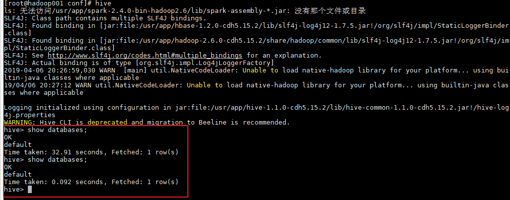
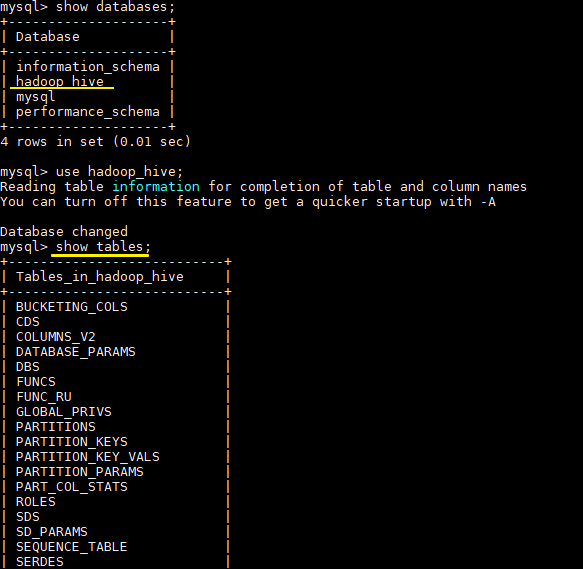
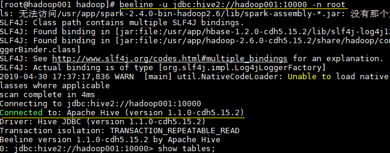
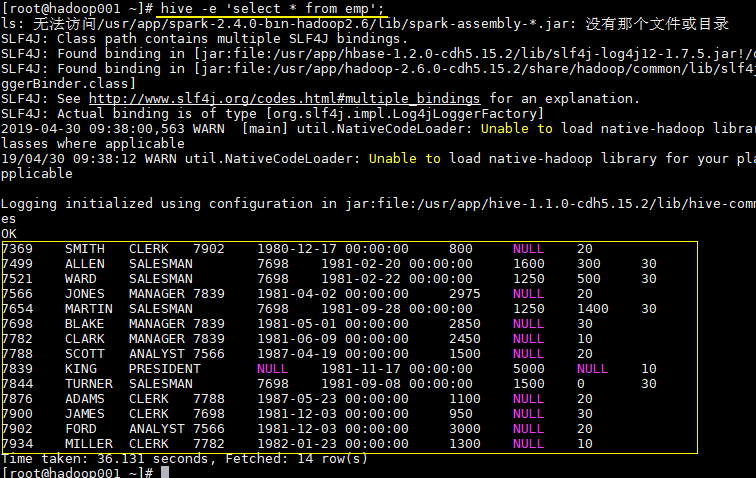
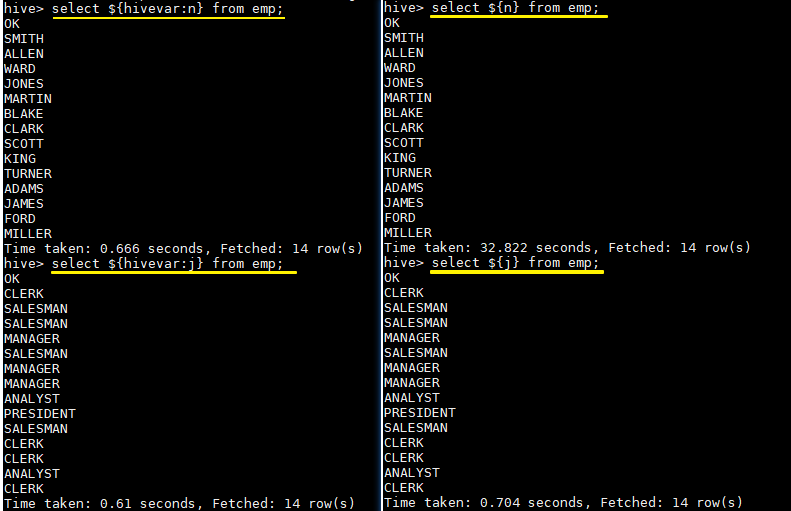

## 一、Hive基础

&emsp;&emsp;Hive 是基于 Hadoop 的一个数据仓库工具，可以将结构化的数据文件映射为一张表，并提供类 SQL 查询功能。

<font color='red'>本质是：将 HQL 转化成 MapReduce 程序。</font>

&emsp;1）Hive 处理的数据存储在 HDFS

&emsp;2）Hive 分析数据底层的实现是 MapReduce

&emsp;3）执行程序运行在 Yarn 上

### 1. Hive的优缺点

#### 优点

1)  操作接口采用类 SQL 语法，提供快速开发的能力（简单、容易上手）。

2)  避免了去写 MapReduce，减少开发人员的学习成本。

3)  Hive 的执行延迟比较高，因此 Hive 常用于数据分析，对实时性要求不高的场合。

4)  Hive 优势在于处理大数据，对于处理小数据没有优势，因为 Hive 的执行延迟比较高。

5)  Hive 支持用户自定义函数，用户可以根据自己的需求来实现自己的函数。

#### 缺点

1．Hive 的 HQL 表达能力有限

（1）迭代式算法无法表达

（2）数据挖掘方面不擅长

2．Hive 的效率比较低

（1）Hive 自动生成的 MapReduce 作业，通常情况下不够智能化

（2）Hive 调优比较困难，粒度较粗

### 2. Hive架构原理

1．用户接口：Client

&emsp;&emsp;CLI（hive shell）、JDBC/ODBC(java 访问 hive)、WEBUI（浏览器访问 hive）

2．元数据：Metastore

&emsp;&emsp;元数据包括：表名、表所属的数据库（默认是 default）、表的拥有者、列/分区字段、表
的类型（是否是外部表）、表的数据所在目录等；

<font color='red'>默认存储在自带的 derby 数据库中，推荐使用 MySQL 存储 Metastore。</font>

3．Hadoop

&emsp;&emsp;使用 HDFS 进行存储，使用 MapReduce 进行计算。

4．驱动器：Driver

（1）解析器（SQL Parser）：将 SQL 字符串转换成抽象语法树 AST，这一步一般都用第三方工具库完成，比如 antlr；对 AST 进行语法分析，比如表是否存在、字段是否存在、SQL 语义是否有误。

（2）编译器（Physical Plan）：将 AST 编译生成逻辑执行计划。

（3）优化器（Query Optimizer）：对逻辑执行计划进行优化。

（4）执行器（Execution）：把逻辑执行计划转换成可以运行的物理计划。对于 Hive 来说，就是 MR/Spark。

&emsp;&emsp;Hive 通过给用户提供的一系列交互接口，接收到用户的指令(SQL)，使用自己的 Driver，结合元数(MetaStore)，将这些指令翻译成 MapReduce，提交到 Hadoop 中执行，最后，将执行返回的结果输出到用户交互接口。

&emsp;&emsp;Hive 是建立在 Hadoop 之上的，所有 Hive 的数据都是存储在 HDFS 中的。

&emsp;&emsp;Hive 是针对数据仓库应用设计的，而数据仓库的内容是读多写少的。因此，Hive中不建议对数据的改写，所有的数据都是在加载的时候确定好的。

&emsp;&emsp;Hive 在加载数据的过程中不会对数据进行任何处理，甚至不会对数据进行扫描，因此也没有对数据中的某些 Key 建立索引。Hive 要访问数据中满足条件的特定值时，需要暴力扫描整个数据，因此访问延迟较高。由于 MapReduce 的引入， Hive 可以并行访问数据，因此即使没有索引，对于大数据量的访问，Hive 仍然可以体现出优势。


## 二、Hive的安装

### 1. 下载并解压

&emsp;&emsp;下载所需版本的 Hive，这里我下载版本为 `cdh5.15.2`。下载地址：http://archive.cloudera.com/cdh5/cdh/5/

```shell
# 下载后进行解压
 tar -zxvf hive-1.1.0-cdh5.15.2.tar.gz
```

### 2. 配置环境变量

```shell
vim /etc/profile
```

&emsp;&emsp;添加环境变量：

```shell
export HIVE_HOME=/usr/app/hive-1.1.0-cdh5.15.2
export PATH=$HIVE_HOME/bin:$PATH
```

&emsp;&emsp;使得配置的环境变量立即生效：

```shell
source /etc/profile
```

### 3. 修改配置

**1. hive-env.sh**

&emsp;&emsp;进入安装目录下的 `conf/` 目录，拷贝 Hive 的环境配置模板 `flume-env.sh.template`

```shell
cp hive-env.sh.template hive-env.sh
```

&emsp;&emsp;修改 `hive-env.sh`，指定 Hadoop 的安装路径：

```shell
export HADOOP_HOME=/usr/app/hadoop-2.6.0-cdh5.15.2
export HIVE_CONF_DIR=/opt/module/hive/conf
```

**2. hive-site.xml**

&emsp;&emsp;新建 hive-site.xml 文件，内容如下，主要是配置存放元数据的 MySQL 的地址、驱动、用户名和密码等信息：

&emsp;&emsp;前提是已经安装好Mysql。

```xml
<?xml version="1.0"?>
<?xml-stylesheet type="text/xsl" href="configuration.xsl"?>

<configuration>
  <property>
    <name>javax.jdo.option.ConnectionURL</name>
    <value>jdbc:mysql://hadoop001:3306/hadoop_hive?createDatabaseIfNotExist=true</value>
  </property>
  
  <property>
    <name>javax.jdo.option.ConnectionDriverName</name>
    <value>com.mysql.jdbc.Driver</value>
  </property>
  
  <property>
    <name>javax.jdo.option.ConnectionUserName</name>
    <value>root</value>
  </property>
  
  <property>
    <name>javax.jdo.option.ConnectionPassword</name>
    <value>root</value>
  </property>

</configuration>
```

### 4. 拷贝数据库驱动

&emsp;&emsp;将 MySQL 驱动包拷贝到 Hive 安装目录的 `lib` 目录下, MySQL 驱动的下载地址为：https://dev.mysql.com/downloads/connector/j/  。


### 5. 初始化元数据库

- 当使用的 hive 是 1.x 版本时，可以不进行初始化操作，Hive 会在第一次启动的时候会自动进行初始化，但不会生成所有的元数据信息表，只会初始化必要的一部分，在之后的使用中用到其余表时会自动创建；

- 当使用的 hive 是 2.x 版本时，必须手动初始化元数据库。初始化命令：

  ```shell
  # schematool 命令在安装目录的 bin 目录下，由于上面已经配置过环境变量，在任意位置执行即可
  schematool -dbType mysql -initSchema
  ```

&emsp;&emsp;这里我使用的是 CDH 的 `hive-1.1.0-cdh5.15.2.tar.gz`，对应 `Hive 1.1.0` 版本，可以跳过这一步。

### 6. 启动

&emsp;&emsp;由于已经将 Hive 的 bin 目录配置到环境变量，直接使用以下命令启动，成功进入交互式命令行后执行 `show databases` 命令，无异常则代表搭建成功。

```shell
hive
```



&emsp;&emsp;在 Mysql 中也能看到 Hive 创建的库和存放元数据信息的表



```text
1）Default 数据仓库的最原始位置是在 hdfs 上的：/user/hive/warehouse 路径下。
2）在仓库目录下，没有对默认的数据库 default 创建文件夹。如果某张表属于 default
数据库，直接在数据仓库目录下创建一个文件夹
```

## 三、HiveServer2/beeline

&emsp;&emsp;Hive 内置了 HiveServer 和 HiveServer2 服务，两者都允许客户端使用多种编程语言进行连接，但是 HiveServer 不能处理多个客户端的并发请求，因此产生了 HiveServer2。HiveServer2（HS2）允许远程客户端可以使用各种编程语言向 Hive 提交请求并检索结果，支持多客户端并发访问和身份验证。HS2 是由多个服务组成的单个进程，其包括基于 Thrift 的 Hive 服务（TCP 或 HTTP）和用于 Web UI 的 Jetty Web 服务。

 &emsp;&emsp;HiveServer2 拥有自己的 CLI 工具——Beeline。Beeline 是一个基于 SQLLine 的 JDBC 客户端。由于目前 HiveServer2 是 Hive 开发维护的重点，所以官方更加推荐使用 Beeline 而不是 Hive CLI。以下主要讲解 Beeline 的配置方式。


### 1. 修改Hadoop配置

&emsp;&emsp;修改 hadoop 集群的 core-site.xml 配置文件，增加如下配置，指定 hadoop 的 root 用户可以代理本机上所有的用户。

```xml
<property>
 <name>hadoop.proxyuser.root.hosts</name>
 <value>*</value>
</property>
<property>
 <name>hadoop.proxyuser.root.groups</name>
 <value>*</value>
</property>
```

&emsp;&emsp;之所以要配置这一步，是因为 hadoop 2.0 以后引入了安全伪装机制，使得 hadoop 不允许上层系统（如 hive）直接将实际用户传递到 hadoop 层，而应该将实际用户传递给一个超级代理，由该代理在 hadoop 上执行操作，以避免任意客户端随意操作 hadoop。如果不配置这一步，在之后的连接中可能会抛出 `AuthorizationException` 异常。

> 关于 Hadoop 的用户代理机制，可以参考：[hadoop 的用户代理机制](https://blog.csdn.net/u012948976/article/details/49904675#官方文档解读) 或 [Superusers Acting On Behalf Of Other Users](http://hadoop.apache.org/docs/current/hadoop-project-dist/hadoop-common/Superusers.html)


### 2. 启动hiveserver2

&emsp;&emsp;由于上面已经配置过环境变量，这里直接启动即可：

```shell
nohup hiveserver2 &
```


### 3. 使用beeline

&emsp;&emsp;可以使用以下命令进入 beeline 交互式命令行，出现 `Connected` 则代表连接成功。

```shell
beeline -u jdbc:hive2://hadoop001:10000 -n root
```



## 四、Hive CLI和Beeline命令行的基本使用

### 1. Hive CLI

#### 1.1 Help

&emsp;&emsp;使用 `hive -H` 或者 `hive --help` 命令可以查看所有命令的帮助，显示如下：

```
usage: hive
 -d,--define <key=value>          Variable subsitution to apply to hive 
                                  commands. e.g. -d A=B or --define A=B  --定义用户自定义变量
    --database <databasename>     Specify the database to use  -- 指定使用的数据库
 -e <quoted-query-string>         SQL from command line   -- 执行指定的 SQL
 -f <filename>                    SQL from files   --执行 SQL 脚本
 -H,--help                        Print help information  -- 打印帮助信息
    --hiveconf <property=value>   Use value for given property    --自定义配置
    --hivevar <key=value>         Variable subsitution to apply to hive  --自定义变量
                                  commands. e.g. --hivevar A=B
 -i <filename>                    Initialization SQL file  --在进入交互模式之前运行初始化脚本
 -S,--silent                      Silent mode in interactive shell    --静默模式
 -v,--verbose                     Verbose mode (echo executed SQL to the  console)  --详细模式
```

#### 1.2 交互式命令行

&emsp;&emsp;直接使用 `Hive` 命令，不加任何参数，即可进入交互式命令行。

#### 1.3 执行SQL命令

&emsp;&emsp;在不进入交互式命令行的情况下，可以使用 `hive -e ` 执行 SQL 命令。

```sql
hive -e 'select * from emp';
```




#### 1.4 执行SQL脚本

&emsp;&emsp;用于执行的 sql 脚本可以在本地文件系统，也可以在 HDFS 上。

```shell
# 本地文件系统
hive -f /usr/file/simple.sql;

# HDFS文件系统
hive -f hdfs://hadoop001:8020/tmp/simple.sql;
```

&emsp;&emsp;其中 `simple.sql` 内容如下：

```sql
select * from emp;
```

#### 1.5 配置Hive变量

&emsp;&emsp;可以使用 `--hiveconf` 设置 Hive 运行时的变量。

```sql
hive -e 'select * from emp' \
--hiveconf hive.exec.scratchdir=/tmp/hive_scratch  \
--hiveconf mapred.reduce.tasks=4;
```

> hive.exec.scratchdir：指定 HDFS 上目录位置，用于存储不同 map/reduce 阶段的执行计划和这些阶段的中间输出结果。

#### 1.6 配置文件启动

&emsp;&emsp;使用 `-i` 可以在进入交互模式之前运行初始化脚本，相当于指定配置文件启动。

```shell
hive -i /usr/file/hive-init.conf;
```

&emsp;&emsp;其中 `hive-init.conf` 的内容如下：

```sql
set hive.exec.mode.local.auto = true;
```

> hive.exec.mode.local.auto 默认值为 false，这里设置为 true ，代表开启本地模式。

#### 1.7 用户自定义变量

&emsp;&emsp;`--define <key=value> ` 和 `--hivevar <key=value>  ` 在功能上是等价的，都是用来实现自定义变量，这里给出一个示例:

&emsp;&emsp;定义变量：

```sql
hive  --define  n=ename --hiveconf  --hivevar j=job;
```

&emsp;&emsp;在查询中引用自定义变量：

```sql
# 以下两条语句等价
hive > select ${n} from emp;
hive >  select ${hivevar:n} from emp;

# 以下两条语句等价
hive > select ${j} from emp;
hive >  select ${hivevar:j} from emp;
```

&emsp;&emsp;结果如下：



### 2. Beeline

#### 2.1 HiveServer2

&emsp;&emsp;Hive 内置了 HiveServer 和 HiveServer2 服务，两者都允许客户端使用多种编程语言进行连接，但是 HiveServer 不能处理多个客户端的并发请求，所以产生了 HiveServer2。

&emsp;&emsp;HiveServer2（HS2）允许远程客户端可以使用各种编程语言向 Hive 提交请求并检索结果，支持多客户端并发访问和身份验证。HS2 是由多个服务组成的单个进程，其包括基于 Thrift 的 Hive 服务（TCP 或 HTTP）和用于 Web UI 的 Jetty Web 服务器。

&emsp;&emsp; HiveServer2 拥有自己的 CLI(Beeline)，Beeline 是一个基于 SQLLine 的 JDBC 客户端。由于 HiveServer2 是 Hive 开发维护的重点 (Hive0.15 后就不再支持 hiveserver)，所以 Hive CLI 已经不推荐使用了，官方更加推荐使用 Beeline。

#### 2.1 Beeline

&emsp;&emsp;Beeline 拥有更多可使用参数，可以使用 `beeline --help` 查看，完整参数如下：

```properties
Usage: java org.apache.hive.cli.beeline.BeeLine
   -u <database url>               the JDBC URL to connect to
   -r                              reconnect to last saved connect url (in conjunction with !save)
   -n <username>                   the username to connect as
   -p <password>                   the password to connect as
   -d <driver class>               the driver class to use
   -i <init file>                  script file for initialization
   -e <query>                      query that should be executed
   -f <exec file>                  script file that should be executed
   -w (or) --password-file <password file>  the password file to read password from
   --hiveconf property=value       Use value for given property
   --hivevar name=value            hive variable name and value
                                   This is Hive specific settings in which variables
                                   can be set at session level and referenced in Hive
                                   commands or queries.
   --property-file=<property-file> the file to read connection properties (url, driver, user, password) from
   --color=[true/false]            control whether color is used for display
   --showHeader=[true/false]       show column names in query results
   --headerInterval=ROWS;          the interval between which heades are displayed
   --fastConnect=[true/false]      skip building table/column list for tab-completion
   --autoCommit=[true/false]       enable/disable automatic transaction commit
   --verbose=[true/false]          show verbose error messages and debug info
   --showWarnings=[true/false]     display connection warnings
   --showNestedErrs=[true/false]   display nested errors
   --numberFormat=[pattern]        format numbers using DecimalFormat pattern
   --force=[true/false]            continue running script even after errors
   --maxWidth=MAXWIDTH             the maximum width of the terminal
   --maxColumnWidth=MAXCOLWIDTH    the maximum width to use when displaying columns
   --silent=[true/false]           be more silent
   --autosave=[true/false]         automatically save preferences
   --outputformat=[table/vertical/csv2/tsv2/dsv/csv/tsv]  format mode for result display
   --incrementalBufferRows=NUMROWS the number of rows to buffer when printing rows on stdout,
                                   defaults to 1000; only applicable if --incremental=true
                                   and --outputformat=table
   --truncateTable=[true/false]    truncate table column when it exceeds length
   --delimiterForDSV=DELIMITER     specify the delimiter for delimiter-separated values output format (default: |)
   --isolation=LEVEL               set the transaction isolation level
   --nullemptystring=[true/false]  set to true to get historic behavior of printing null as empty string
   --maxHistoryRows=MAXHISTORYROWS The maximum number of rows to store beeline history.
   --convertBinaryArrayToString=[true/false]    display binary column data as string or as byte array
   --help                          display this message

```

#### 2.3 常用参数

&emsp;&emsp;在 Hive CLI 中支持的参数，Beeline 都支持，常用的参数如下。更多参数说明可以参见官方文档 [Beeline Command Options](https://cwiki.apache.org/confluence/display/Hive/HiveServer2+Clients#HiveServer2Clients-Beeline%E2%80%93NewCommandLineShell)

| 参数                                   | 说明               |
| ------------------------------------ | ---------------- |
| **-u \<database URL>**               | 数据库地址            |
| **-n \<username>**                   | 用户名              |
| **-p \<password>**                   | 密码               |
| **-d \<driver class>**               | 驱动 (可选)          |
| **-e \<query>**                      | 执行 SQL 命令        |
| **-f \<file>**                       | 执行 SQL 脚本        |
| **-i  (or)--init  \<file or files>** | 在进入交互模式之前运行初始化脚本 |
| **--property-file \<file>**          | 指定配置文件           |
| **--hiveconf** *property**=**value*  | 指定配置属性           |
| **--hivevar** *name**=**value*       | 用户自定义属性，在会话级别有效  |

&emsp;&emsp;示例： 使用用户名和密码连接 Hive

```shell
$ beeline -u jdbc:hive2://localhost:10000  -n username -p password 
```

​         

### 3. Hive配置

&emsp;&emsp;可以通过三种方式对 Hive 的相关属性进行配置，分别介绍如下：

#### 3.1 配置文件

方式一为使用配置文件，使用配置文件指定的配置是永久有效的。Hive 有以下三个可选的配置文件：

- hive-site.xml ：Hive 的主要配置文件；
- hivemetastore-site.xml： 关于元数据的配置；
- hiveserver2-site.xml：关于 HiveServer2 的配置。

示例如下,在 hive-site.xml 配置 `hive.exec.scratchdir`：

```xml
 <property>
    <name>hive.exec.scratchdir</name>
    <value>/tmp/mydir</value>
    <description>Scratch space for Hive jobs</description>
  </property>
```

#### 3.2 hiveconf

&emsp;&emsp;方式二为在启动命令行 (Hive CLI / Beeline) 的时候使用 `--hiveconf` 指定配置，这种方式指定的配置作用于整个 Session。

```
hive --hiveconf hive.exec.scratchdir=/tmp/mydir
```

#### 3.3 set

&emsp;&emsp;方式三为在交互式环境下 (Hive CLI / Beeline)，使用 set 命令指定。这种设置的作用范围也是 Session 级别的，配置对于执行该命令后的所有命令生效。set 兼具设置参数和查看参数的功能。如下：

```shell
0: jdbc:hive2://hadoop001:10000> set hive.exec.scratchdir=/tmp/mydir;
No rows affected (0.025 seconds)
0: jdbc:hive2://hadoop001:10000> set hive.exec.scratchdir;
+----------------------------------+--+
|               set                |
+----------------------------------+--+
| hive.exec.scratchdir=/tmp/mydir  |
+----------------------------------+--+
```

#### 3.4 配置优先级

&emsp;&emsp;配置的优先顺序如下 (由低到高)：  
`hive-site.xml` - >` hivemetastore-site.xml `- > `hiveserver2-site.xml` - >` -- hiveconf`- > `set`

#### 3.5 配置参数

&emsp;&emsp;Hive 可选的配置参数非常多，在用到时查阅官方文档即可[AdminManual Configuration](https://cwiki.apache.org/confluence/display/Hive/AdminManual+Configuration)

## 五、Hive常用DDL操作

loading.............


