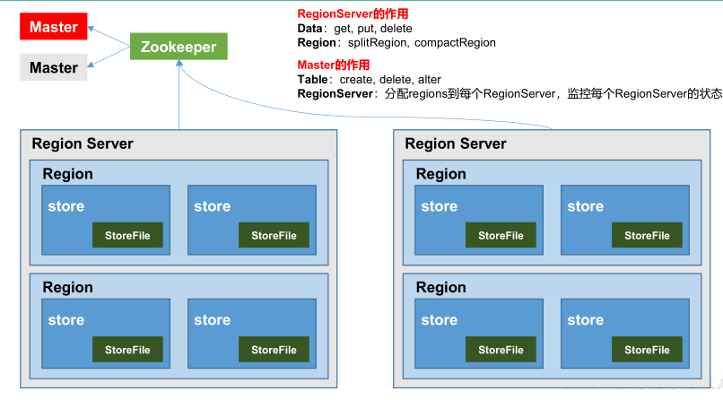

## 一、HBase简介

### 1. HBase的定义

&emsp;&emsp;HBase 是一种分布式、可扩展、支持海量数据存储的 NoSQL 数据库。
&emsp;&emsp;Hbase 面向列存储，构建于 Hadoop 之上，类似于 Google 的 BigTable，提供对 10 亿级别表数据的快速随机实时读写！

### 2. HBase的特点

1）海量存储

&emsp;&emsp;HBase 适合存储 PB 级别的海量数据，在 PB 级别的数据以及采用廉价 PC 存储的情况下，能在几十到百毫秒内返回数据。这与 HBase 的极易扩展性息息相关。正式因为 HBase 良好的扩展性，才为海量数据的存储提供了便利。

2）列式存储

&emsp;&emsp;这里的列式存储其实说的是列族存储，HBase 是根据列族来存储数据的。列族下面可以有非常多的列，列族在创建表的时候就必须指定。

3）极易扩展

&emsp;&emsp;HBase 的扩展性主要体现在两个方面，一个是基于上层处理能力（RegionServer）的扩展，一个是基于存储的扩展（HDFS）。通过横向添加 RegionSever 的机器，进行水平扩展，提升 HBase 上层的处理能力，提升 Hbsae 服务更多 Region的能力。

4）高并发

&emsp;&emsp;由于目前大部分使用 HBase 的架构，都是采用的廉价 PC，因此单个 IO 的延迟其实并不小，一般在几十到上百ms 之间。这里说的高并发，主要是在并发的情况下，HBase 的单个 IO 延迟下降并不多。能获得高并发、低延迟的服务。

5）稀疏

&emsp;&emsp;稀疏主要是针对 HBase 列的灵活性，在列族中，你可以指定任意多的列，在列数据为空的情况下，是不会占用存储空间的。

### 3. HBase的优缺点

**优点** ：

①HDFS 有高容错，高扩展的特点，而 Hbase 基于 HDFS 实现数据的存储，因此 Hbase 拥有与生俱来的超强的扩展性和吞吐量。

②HBase 采用的是 Key/Value 的存储方式，这意味着，即便面临海量数据的增长，也几乎不会导致查询性能下降。

③HBase 是一个列式数据库，相对于于传统的行式数据库而言。当你的单张表字段很多的时候，可以将相同的列(以regin 为单位)存在到不同的服务实例上，分散负载压力。

**缺点** ：

①架构设计复杂，且使用 HDFS 作为分布式存储，因此只是存储少量数据，它也不会很快。在大数据量时，它慢的不会很明显！

②Hbase不支持表的关联操作，因此数据分析是HBase的弱项。常见的 group by或order by只能通过编写MapReduce来实现！

③Hbase 部分支持了 ACID。

### 4. HBase的总结

适合场景：单表超千万，上亿，且高并发！
不适合场景：主要需求是数据分析，比如做报表。数据量规模不大，对实时性要求高！

### 5. HBase的数据类型

逻辑上，HBase 的数据模型同关系型数据库很类似，数据存储在一张表中，有行有列。但从 HBase 的底层物理
存储结构（K-V）来看，HBase 更像是一个 multi-dimensional map。

### 6. HBase 逻辑结构


### 7. HBase  数据模型

1）**Name Space**

&emsp;&emsp;命名空间，类似于关系型数据库的 database 概念，每个命名空间下有多个表。HBase 两个自带的命名空间，分别是 hbase 和 default，hbase 中存放的是 HBase 内置的表，default 表是用户默认使用的命名空间。
一个表可以 自由选择是否有命名 空间，如果创建表的 时候加上了命名空间 后，这个表名字 以
<Namespace>:<Table>作为区分！

2） **Table**

&emsp;&emsp;类似于关系型数据库的表概念。不同的是，HBase 定义表时只需要声明列族即可，数据属性，比如超时时间（TTL），压缩算法（COMPRESSION）等，都在列族的定义中定义，不需要声明具体的列。这意味着，往 HBase 写入数据时，字段可以动态、按需指定。因此，和关系型数据库相比，HBase 能够轻松应对字段变更的场景。

3） **Row**

&emsp;&emsp;HBase 表中的每行数据都由一个 RowKey 和多个 Column（列）组成。一个行包含了多个列，这些列通过列族来分类,行中的数据所属列族只能从该表所定义的列族中选取,不能定义这个表中不存在的列族，否则报错
NoSuchColumnFamilyException。

4)  **RowKey**

&emsp;&emsp;Rowkey 由用户指定的一串不重复的字符串定义，是一行的唯一标识！数据是按照 RowKey 的字典顺序存储的，并且查询数据时只能根据 RowKey 进行检索，所以 RowKey 的设计十分重要。如果使用了之前已经定义的 RowKey，那么会将之前的数据更新掉！

5）**Column Family**

&emsp;&emsp;列族是多个列的集合。一个列族可以动态地灵活定义多个列。表的相关属性大部分都定义在列族上，同一个表里的不同列族可以有完全不同的属性配置，但是同一个列族内的所有列都会有相同的属性。列族存在的意义是 HBase 会把相同列族的列尽量放在同一台机器上，所以说，如果想让某几个列被放到一起，你就给他们定义相同的列族。官方建议一张表的列族定义的越少越好，列族太多会极大程度地降低数据库性能，且目前版本 Hbase 的架构，容易出 BUG。

6)  **Column Qualifier**

&emsp;&emsp;Hbase 中的列是可以随意定义的，一个行中的列不限名字、不限数量，只限定列族。因此列必须依赖于列族存在！列的名称前必须带着其所属的列族！例如 info：name，info：age。因为 HBase 中的列全部都是灵活的，可以随便定义的，因此创建表的时候并不需要指定列！列只有在你插入第一条数据的时候才会生成。其他行有没有当前行相同的列是不确定，只有在扫描数据的时候才能得知！

7）**TimeStamp**

&emsp;&emsp;用于标识数据的不同版本（version）。时间戳默认由系统指定，也可以由用户显式指定。在读取单元格的数据时，版本号可以省略，如果不指定，Hbase 默认会获取最后一个版本的数据返回！

8）**Cell**

&emsp;&emsp;一个列中可以存储多个版本的数据。而每个版本就称为一个单元格（Cell）。Cell 由{rowkey, column Family：column Qualifier, time Stamp}确定。Cell 中的数据是没有类型的，全部是字节码形式存贮。


9）**Region**

&emsp;&emsp;Region 由一个表的若干行组成！在 Region 中行的排序按照行键（rowkey）字典排序。

&emsp;&emsp;Region 不能跨 RegionSever，且当数据量大的时候，HBase 会拆分 Region。

&emsp;&emsp;Region 由 RegionServer 进程管理。HBase 在进行负载均衡的时候，一个 Region 有可能会从当前 RegionServer移动到其他 RegionServer 上。

&emsp;&emsp;Region 是基于 HDFS 的，它的所有数据存取操作都是调用了 HDFS 的客户端接口来实现的。

### 8. HBase  基本架构



**架构角色**：

1） Region Serve

&emsp;&emsp;RegionServer 是一个服务，负责多个 Region 的管理。其实现类为 HRegionServer，主要作用如下:

&emsp;&emsp;&emsp;对于数据的操作：get, put, delete；

&emsp;&emsp;&emsp;对于 Region 的操作：splitRegion、compactRegion。

&emsp;&emsp;&emsp;客户端从 ZooKeeper 获取 RegionServer 的地址，从而调用相应的服务，获取数据。

2） Master

&emsp;&emsp;Master 是所有 Region Server 的管理者，其实现类为 HMaster，主要作用如下：

&emsp;&emsp;&emsp;对于表的操作：create, delete, alter，这些操作可能需要跨多个 ReginServer，因此需要 Master 来进行协调！

&emsp;&emsp;&emsp;对于 RegionServer 的操作：分配 regions 到每个 RegionServer，监控每个 RegionServer 的状态，负载均衡和故障转移。

&emsp;&emsp;&emsp;即使 Master 进程宕机，集群依然可以执行数据的读写，只是不能进行表的创建和修改等操作！当然Master 也不能宕机太久，有很多必要的操作，比如创建表、修改列族配置，以及更重要的分割和合并都需要它的操作。

3） Zookeeper

&emsp;&emsp;RegionServer 非常依赖 ZooKeeper 服务，ZooKeeper 管理了 HBase 所有 RegionServer 的信息，包括具体的数据段存放在哪个 RegionServer 上。

&emsp;&emsp;客户端每次与 HBase 连接，其实都是先与 ZooKeeper 通信，查询出哪个 RegionServer 需要连接，然后再连接RegionServer。Zookeeper 中记录了读取数据所需要的元数据表hbase:meata,因此关闭 Zookeeper 后，客户端是无法实现读操作的！

&emsp;&emsp;HBase 通过 Zookeeper 来做 master 的高可用、RegionServer 的监控、元数据的入口以及集群配置的维护等工作。

4） HDFS

&emsp;&emsp;HDFS 为 Hbase 提供最终的底层数据存储服务，同时为 HBase 提供高可用的支持。

### 9. ROWkey的设计

&emsp;&emsp;一条数据的唯一标识就是 rowkey，那么这条数据存储于哪个分区，取决于 rowkey 处于哪个一个预分区的区间内，设计 rowkey 的主要目的 ，就是让数据均匀的分布于所有的 region 中，在一定程度上防止数据倾斜。

```
1．生成随机数、hash、散列值
2．字符串反转
3．字符串拼接
```


## 二、HBase的shell操作

```shell
# HBase shell中的帮助命令非常强大，使用help获得全部命令的列表，使用help ‘command_name’获得某一个命令的详细信息
help 'status'

# 查询服务器状态
status

# 查看所有表
list

# 创建一个表
create 'FileTable','fileInfo','saveInfo'

# 获得表的描述
describe 'FileTable'

# 添加一个列族
alter 'FileTable', 'cf'

# 删除一个列族
alter 'FileTable', {NAME => 'cf', METHOD => 'delete'}

# 插入数据
put 'FileTable', 'rowkey1','fileInfo:name','file1.txt'
put 'FileTable', 'rowkey1','fileInfo:type','txt'
put 'FileTable', 'rowkey1','fileInfo:size','1024'
put 'FileTable', 'rowkey1','saveInfo:path','/home'
put 'FileTable', 'rowkey1','saveInfo:creator','tom'
put 'FileTable', 'rowkey2','fileInfo:name','file2.jpg'
put 'FileTable', 'rowkey2','fileInfo:type','jpg'
put 'FileTable', 'rowkey2','fileInfo:size','2048'
put 'FileTable', 'rowkey2','saveInfo:path','/home/pic'
put 'FileTable', 'rowkey2','saveInfo:creator','jerry'

# 查询表中有多少行
count 'FileTable'

# 获取一个rowkey的所有数据
get 'FileTable', 'rowkey1'

# 获得一个id，一个列簇（一个列）中的所有数据
get 'FileTable', 'rowkey1', 'fileInfo'

# 查询整表数据
scan 'FileTable'

# 扫描整个列簇
scan 'FileTable', {COLUMN=>'fileInfo'}

# 指定扫描其中的某个列
scan 'FileTable', {COLUMNS=> 'fileInfo:name'}

# 除了列（COLUMNS）修饰词外，HBase还支持Limit（限制查询结果行数），STARTROW（ROWKEY起始行。会先根据这个key定位到region，再向后扫描）、STOPROW(结束行)、TIMERANGE（限定时间戳范围）、VERSIONS（版本数）、和FILTER（按条件过滤行）等。比如我们从RowKey1这个rowkey开始，找下一个行的最新版本
scan 'FileTable', { STARTROW => 'rowkey1', LIMIT=>1, VERSIONS=>1}

# Filter是一个非常强大的修饰词，可以设定一系列条件来进行过滤。比如我们要限制名称为file1.txt
scan 'FileTable', FILTER=>"ValueFilter(=,'name:file1.txt’)"

# FILTER中支持多个过滤条件通过括号、AND和OR的条件组合
scan 'FileTable', FILTER=>"ColumnPrefixFilter('typ') AND  ValueFilter(=,'substring:10')"

# hbase前缀查询
scan 'FileTable',{ROWPREFIXFILTER => 'c1'}

# 通过delete命令，我们可以删除某个字段，接下来的get就无结果
delete 'FileTable','rowkey1','fileInfo:size'
get 'FileTable','rowkey1','fileInfo:size'

# 删除整行的值
deleteall 'FileTable','rowkey1'
get 'FileTable','rowkey1'

# 通过enable和disable来启用/禁用这个表,相应的可以通过is_enabled和is_disabled来检查表是否被禁用
is_enabled 'FileTable'
is_disabled 'FileTable'

# 使用exists来检查表是否存在
exists 'FileTable'

# 删除表需要先将表disable
disable 'FilesTable'
drop 'FileTable'
```


## 三、HBase集群环境配置

### 1. 集群规划

这里搭建一个 3 节点的 HBase 集群，其中三台主机上均为 `Regin Server`。同时为了保证高可用，除了在 hadoop001 上部署主 `Master` 服务外，还在 hadoop002 上部署备用的 `Master` 服务。Master 服务由 Zookeeper 集群进行协调管理，如果主 `Master` 不可用，则备用 `Master` 会成为新的主 `Master`。


### 2. 前置条件

HBase 的运行需要依赖 Hadoop 和 JDK(`HBase 2.0+` 对应 `JDK 1.8+`) 。同时为了保证高可用，这里我们不采用 HBase 内置的 Zookeeper 服务，而采用外置的 Zookeeper 集群。

### 3. 集群搭建

#### 3.1 下载并解压

下载并解压，这里我下载的是 CDH 版本 HBase，下载地址为：http://archive.cloudera.com/cdh5/cdh/5/

```shell
tar -zxvf hbase-1.2.0-cdh5.15.2.tar.gz
```

#### 3.2 配置环境变量

```shell
vim /etc/profile
```

添加环境变量：

```shell
export HBASE_HOME=usr/app/hbase-1.2.0-cdh5.15.2
export PATH=$HBASE_HOME/bin:$PATH
```

使得配置的环境变量立即生效：

```shell
source /etc/profile
```

#### 3.3 集群配置

进入 `${HBASE_HOME}/conf` 目录下，修改配置：

##### 1. hbase-env.sh

```shell
# 配置JDK安装位置
export JAVA_HOME=/usr/java/jdk1.8.0_201
# 不使用内置的zookeeper服务
export HBASE_MANAGES_ZK=false
```

##### 2. hbase-site.xml

```xml
<configuration>
    <property>
        <!-- 指定 hbase 以分布式集群的方式运行 -->
        <name>hbase.cluster.distributed</name>
        <value>true</value>
    </property>
    <property>
        <!-- 指定 hbase 在 HDFS 上的存储位置 -->
        <name>hbase.rootdir</name>
        <value>hdfs://hadoop001:8020/hbase</value>
    </property>
    <property>
        <!-- 指定 zookeeper 的地址-->
        <name>hbase.zookeeper.quorum</name>
        <value>hadoop001:2181,hadoop002:2181,hadoop003:2181</value>
    </property>
</configuration>
```

##### 3. regionservers

```
hadoop001
hadoop002
hadoop003
```

##### 4. backup-masters

```
hadoop002
```

` backup-masters` 这个文件是不存在的，需要新建，主要用来指明备用的 master 节点，可以是多个，这里我们以 1 个为例。

#### 3.4 HDFS客户端配置

这里有一个可选的配置：如果您在 Hadoop 集群上进行了 HDFS 客户端配置的更改，比如将副本系数 `dfs.replication` 设置成 5，则必须使用以下方法之一来使 HBase 知道，否则 HBase 将依旧使用默认的副本系数 3 来创建文件：

> 1. Add a pointer to your `HADOOP_CONF_DIR` to the `HBASE_CLASSPATH` environment variable in *hbase-env.sh*.
> 2. Add a copy of *hdfs-site.xml* (or *hadoop-site.xml*) or, better, symlinks, under *${HBASE_HOME}/conf*, or
> 3. if only a small set of HDFS client configurations, add them to *hbase-site.xml*.

以上是官方文档的说明，这里解释一下：

**第一种** ：将 Hadoop 配置文件的位置信息添加到 `hbase-env.sh` 的 `HBASE_CLASSPATH` 属性，示例如下：

```shell
export HBASE_CLASSPATH=usr/app/hadoop-2.6.0-cdh5.15.2/etc/hadoop
```

**第二种** ：将 Hadoop 的 ` hdfs-site.xml` 或 `hadoop-site.xml` 拷贝到  `${HBASE_HOME}/conf ` 目录下，或者通过符号链接的方式。如果采用这种方式的话，建议将两者都拷贝或建立符号链接，示例如下：

```shell
# 拷贝
cp core-site.xml hdfs-site.xml /usr/app/hbase-1.2.0-cdh5.15.2/conf/
# 使用符号链接
ln -s   /usr/app/hadoop-2.6.0-cdh5.15.2/etc/hadoop/core-site.xml
ln -s   /usr/app/hadoop-2.6.0-cdh5.15.2/etc/hadoop/hdfs-site.xml
```

> 注：`hadoop-site.xml` 这个配置文件现在叫做 `core-site.xml`

**第三种** ：如果你只有少量更改，那么直接配置到 `hbase-site.xml` 中即可。


#### 3.5 安装包分发

将 HBase 的安装包分发到其他服务器，分发后建议在这两台服务器上也配置一下 HBase 的环境变量。

```shell
scp -r /usr/app/hbase-1.2.0-cdh5.15.2/  hadoop002:usr/app/
scp -r /usr/app/hbase-1.2.0-cdh5.15.2/  hadoop003:usr/app/
```


### 4. 启动集群

#### 4.1 启动ZooKeeper集群

分别到三台服务器上启动 ZooKeeper 服务：

```shell
 zkServer.sh start
```

#### 4.2 启动Hadoop集群

```shell
# 启动dfs服务
start-dfs.sh
# 启动yarn服务
start-yarn.sh
```

#### 4.3 启动HBase集群

进入 hadoop001 的 `${HBASE_HOME}/bin`，使用以下命令启动 HBase 集群。执行此命令后，会在 hadoop001 上启动 `Master` 服务，在 hadoop002 上启动备用 `Master` 服务，在 `regionservers` 文件中配置的所有节点启动 `region server` 服务。

```shell
start-hbase.sh
```


#### 4.5 查看服务

访问 HBase 的 Web-UI 界面，这里我安装的 HBase 版本为 1.2，访问端口为 `60010`，如果你安装的是 2.0 以上的版本，则访问端口号为 `16010`。可以看到 `Master` 在 hadoop001 上，三个 `Regin Servers` 分别在 hadoop001，hadoop002，和 hadoop003 上，并且还有一个 `Backup Matser` 服务在 hadoop002 上。


hadoop002 上的 HBase 出于备用状态：


## 四、HBase与Hive集成

### 1. HBase 与 Hive 的对比

**Hive**:

(1) 数据仓库

&emsp;&emsp;Hive 的本质其实就相当于将 HDFS 中已经存储的文件在 Mysql 中做了一个双射关系，以方便使用 HQL 去管理查询。

(2) 用于数据分析、清洗

&emsp;&emsp;Hive 适用于离线的数据分析和清洗，延迟较高。

(3) 基于 HDFS、MapReduce

&emsp;&emsp;Hive 存储的数据依旧在 DataNode 上，编写的 HQL 语句终将是转换为 MapReduce 代码执行。

**HBase**:

(1) 数据库

&emsp;&emsp;是一种面向列存储的非关系型数据库。

(2) 用于存储结构化和非结构化的数据

&emsp;&emsp;适用于单表非关系型数据的存储，不适合做关联查询，类似 JOIN 等操作。

(3) 基于 HDFS

&emsp;&emsp;数据持久化存储的体现形式是 Hfile，存放于 DataNode 中，被 ResionServer 以 region 的形式进行管理。

(4) 延迟较低，接入在线业务使用

&emsp;&emsp;面对大量的企业数据，HBase 可以直线单表大量数据的存储，同时提供了高效的数据访问速度。

### 2. HBase 与 Hive 集成使用

环境准备:

&emsp;&emsp;因为我们后续可能会在操作 Hive 的同时对 HBase 也会产生影响，所以 Hive 需要持有操作 HBase 的 Jar，那么接下来拷贝 Hive 所依赖的 Jar 包（或者使用软连接的形式）。

```shell
export HBASE_HOME=/opt/module/HBase
export HIVE_HOME=/opt/module/hive
ln  -s  $HBASE_HOME/lib/HBase-common-1.3.1.jar
$HIVE_HOME/lib/HBase-common-1.3.1.jar
ln -s $HBASE_HOME/lib/HBase-server-1.3.1.jar $HIVE_HOME/lib/HBase-
server-1.3.1.jar
ln -s $HBASE_HOME/lib/HBase-client-1.3.1.jar $HIVE_HOME/lib/HBase-
client-1.3.1.jar
ln  -s  $HBASE_HOME/lib/HBase-protocol-1.3.1.jar
$HIVE_HOME/lib/HBase-protocol-1.3.1.jar
ln -s $HBASE_HOME/lib/HBase-it-1.3.1.jar $HIVE_HOME/lib/HBase-it-
1.3.1.jar
ln  -s  $HBASE_HOME/lib/htrace-core-3.1.0-incubating.jar
$HIVE_HOME/lib/htrace-core-3.1.0-incubating.jar
ln  -s  $HBASE_HOME/lib/HBase-hadoop2-compat-1.3.1.jar
$HIVE_HOME/lib/HBase-hadoop2-compat-1.3.1.jar
ln  -s  $HBASE_HOME/lib/HBase-hadoop-compat-1.3.1.jar
$HIVE_HOME/lib/HBase-hadoop-compat-1.3.1.jar
```

同时在 hive-site.xml 中修改 zookeeper 的属性，如下：

```shell
<property>
	<name>hive.zookeeper.quorum</name>
	<value>hadoop102,hadoop103,hadoop104</value>
	<description>The list of ZooKeeper servers to talk to. This is only needed for read/write locks.</description>
</property>

<property>
	<name>hive.zookeeper.client.port</name>
	<value>2181</value>
	<description>The port of ZooKeeper servers to talk to. This is only needed for read/write locks.</description>
</property>
```

**案例**

在 HBase 中已经存储了某一张表` test_table`，然后在 Hive 中创建一个外部表来关联 HBase 中的
`test_table`这张表，使之可以借助 Hive 来分析 HBase 这张表中的数据。

```sql
CREATE EXTERNAL TABLE cs.test_table (
	key string,
	name string comment '姓名',
	age string comment '年龄'
) 
STORED BY 'org.apache.hadoop.hive.hbase.HBaseStorageHandler'
WITH SERDEPROPERTIES ("hbase.columns.mapping" = ":key,cf:name,cf:age")
TBLPROPERTIES ("hbase.table.name" = "test_table", "hbase.mapred.output.outputtable" = "test_table");
```

关联后就可以使用 Hive 函数进行一些分析操作了