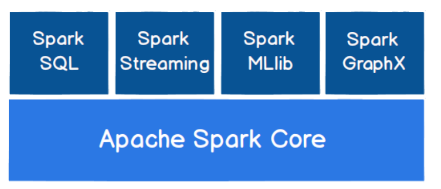

## 一、Spark-Core

### 1. Spark 概述

> Spark 是一种基于内存的快速、通用、可扩展的大数据分析计算引擎。
>
> Spark和Hadoop的根本差异是多个作业之间的数据通信问题 : 
>
> &emsp;Spark多个作业之间数据通信是基于内存，而 Hadoop 是基于磁盘。
>
> Spark 只有在 shuffle 的时候将数据写入磁盘，而 Hadoop 中多个 MR 作业之间的数据交互都要依赖于磁盘交互。
>
> &emsp;在绝大多数的数据计算场景中，Spark 确实会比 MapReduce更有优势。但是 Spark 是基于内存的，所以在实际的生产环境中，由于内存的限制，可能会由于内存资源不够导致 Job 执行失败，此时，MapReduce 其实是一个更好的选择，所以 Spark并不能完全替代 MR。

### 2. Spark的核心模块



➢  Spark Core

&emsp;Spark Core 中提供了 Spark 最基础与最核心的功能，Spark 其他的功能如：Spark SQL，Spark Streaming，GraphX, MLlib 都是在 Spark Core 的基础上进行扩展的

➢  Spark SQL

&emsp;Spark SQL 是 Spark 用来操作结构化数据的组件。通过 Spark SQL，用户可以使用 SQL或者 Apache Hive 版本的 SQL 方言（HQL）来查询数据。

➢  Spark Streaming

&emsp;Spark Streaming 是 Spark 平台上针对实时数据进行流式计算的组件，提供了丰富的处理数据流的 API。

➢  Spark MLlib

&emsp;MLlib 是 Spark 提供的一个机器学习算法库。MLlib 不仅提供了模型评估、数据导入等额外的功能，还提供了一些更底层的机器学习原语。

➢  Spark GraphX

&emsp;GraphX 是 Spark 面向图计算提供的框架与算法库。

### 3. Spark开发环境搭建

#### 1. 安装Spark

**下载并解压**

官方下载地址：http://spark.apache.org/downloads.html ，选择 Spark 版本和对应的 Hadoop 版本后再下载：


解压安装包：

```shell
tar -zxvf  spark-2.2.3-bin-hadoop2.6.tgz
```

**配置环境变量**

```shell
vim /etc/profile
```

添加环境变量：

```shell
export SPARK_HOME=/usr/app/spark-2.2.3-bin-hadoop2.6
export  PATH=${SPARK_HOME}/bin:$PATH
```

使得配置的环境变量立即生效：

```shell
source /etc/profile
```

**Local模式**

Local 模式是最简单的一种运行方式，它采用单节点多线程方式运行，不用部署，开箱即用，适合日常测试开发。

```shell
# 启动spark-shell
spark-shell --master local[2]
```

- **local**：只启动一个工作线程；
- **local[k]**：启动 k 个工作线程；
- **local[*]**：启动跟 cpu 数目相同的工作线程数。


进入 spark-shell 后，程序已经自动创建好了上下文 `SparkContext`，等效于执行了下面的 Scala 代码：

```scala
val conf = new SparkConf().setAppName("Spark shell").setMaster("local[2]")
val sc = new SparkContext(conf)
```

#### 2. 词频统计案例

安装完成后可以先做一个简单的词频统计例子，感受 spark 的魅力。准备一个词频统计的文件样本 `wc.txt`，内容如下：

```txt
hadoop,spark,hadoop
spark,flink,flink,spark
hadoop,hadoop
```

在 scala 交互式命令行中执行如下 Scala 语句：

```scala
val file = spark.sparkContext.textFile("file:///usr/app/wc.txt")
val wordCounts = file.flatMap(line => line.split(",")).map((word => (word, 1))).reduceByKey(_ + _)
wordCounts.collect
```

执行过程如下，可以看到已经输出了词频统计的结果：


同时还可以通过 Web UI 查看作业的执行情况，访问端口为 `4040`：


#### 3. Scala开发环境配置

Spark 是基于 Scala 语言进行开发的，分别提供了基于 Scala、Java、Python 语言的 API，如果你想使用 Scala 语言进行开发，则需要搭建 Scala 语言的开发环境。

**前置条件**

Scala 的运行依赖于 JDK，所以需要你本机有安装对应版本的 JDK，最新的 Scala 2.12.x 需要 JDK 1.8+。

**安装Scala插件**

IDEA 默认不支持 Scala 语言的开发，需要通过插件进行扩展。打开 IDEA，依次点击 **File** => **settings**=> **plugins** 选项卡，搜索 Scala 插件 (如下图)。找到插件后进行安装，并重启 IDEA 使得安装生效。


**创建Scala项目** 

在 IDEA 中依次点击 **File** => **New** => **Project** 选项卡，然后选择创建 `Scala—IDEA` 工程：


**下载Scala SDK** 

1. 方式一

此时看到 `Scala SDK` 为空，依次点击 `Create` => `Download` ，选择所需的版本后，点击 `OK` 按钮进行下载，下载完成点击 `Finish` 进入工程。


2. 方式二

方式一是 Scala 官方安装指南里使用的方式，但下载速度通常比较慢，且这种安装下并没有直接提供 Scala 命令行工具。所以个人推荐到官网下载安装包进行安装，下载地址：https://www.scala-lang.org/download/

这里我的系统是 Windows，下载 msi 版本的安装包后，一直点击下一步进行安装，安装完成后会自动配置好环境变量。


由于安装时已经自动配置好环境变量，所以 IDEA 会自动选择对应版本的 SDK。


**创建Hello World** 

在工程 `src` 目录上右击 **New** => **Scala class** 创建 `Hello.scala`。输入代码如下，完成后点击运行按钮，成功运行则代表搭建成功。


**切换Scala版本** 

在日常的开发中，由于对应软件（如 Spark）的版本切换，可能导致需要切换 Scala 的版本，则可以在 `Project Structures` 中的 `Global Libraries` 选项卡中进行切换。


**可能出现的问题** 

在 IDEA 中有时候重新打开项目后，右击并不会出现新建 `scala` 文件的选项，或者在编写时没有 Scala 语法提示，此时可以先删除 `Global Libraries` 中配置好的 SDK，之后再重新添加：


**另外在 IDEA 中以本地模式运行 Spark 项目是不需要在本机搭建 Spark 和 Hadoop 环境的。**


### 4. Spark部署模式与作业提交 

- **Local  模式**

  > 所谓的 Local 模式，就是不需要其他任何节点资源就可以在本地执行 Spark 代码的环境，一般用于教学，调试，演示等.

- **Standalone  模式**

  > local 本地模式毕竟只是用来进行练习演示的，真实工作中还是要将应用提交到对应的集群中去执行，这里我们来看看只使用 Spark 自身节点运行的集群模式，也就是我们所谓的独立部署（Standalone）模式。Spark 的 Standalone 模式体现了经典的 master-slave 模式。

  集群规划：

  

- **Yarn 模式**

  > 独立部署（Standalone）模式由 Spark 自身提供计算资源，无需其他框架提供资源。这种方式降低了和其他第三方资源框架的耦合性，独立性非常强。但是Spark 主要是计算框架，而不是资源调度框架，所以本身提供的资源调度并不是它的强项，所以还是和其他专业的资源调度框架集成会更靠谱一些。在国内工作中，Yarn 使用的非常多。

  **配置**

  在 `spark-env.sh` 中配置 hadoop 的配置目录的位置，可以使用 `YARN_CONF_DIR` 或 `HADOOP_CONF_DIR` 进行指定：

  ```properties
  YARN_CONF_DIR=/usr/app/hadoop-2.6.0-cdh5.15.2/etc/hadoop
  # JDK安装位置
  JAVA_HOME=/usr/java/jdk1.8.0_201
  ```

  **启动**

  必须要保证 Hadoop 已经启动，这里包括 YARN 和 HDFS 都需要启动，因为在计算过程中 Spark 会使用 HDFS 存储临时文件，如果 HDFS 没有启动，则会抛出异常。

  ```shell
  # start-yarn.sh
  # start-dfs.sh
  ```

  **提交应用**

  ```shell
  #  以client模式提交到yarn集群 
  spark-submit \
  --class org.apache.spark.examples.SparkPi \
  --master yarn \
  --deploy-mode client \
  --executor-memory 2G \
  --num-executors 10 \
  /usr/app/spark-2.4.0-bin-hadoop2.6/examples/jars/spark-examples_2.11-2.4.0.jar \
  100

  #  以cluster模式提交到yarn集群 
  spark-submit \
  --class org.apache.spark.examples.SparkPi \
  --master yarn \
  --deploy-mode cluster \
  --executor-memory 2G \
  --num-executors 10 \
  /usr/app/spark-2.4.0-bin-hadoop2.6/examples/jars/spark-examples_2.11-2.4.0.jar \
  100
  ```

  ​

  **部署模式对比**： 

  

  **端口号**：

  > ➢  Spark 查看当前 Spark-shell 运行任务情况端口号：4040（计算）
  >
  > ➢  Spark Master 内部通信服务端口号：7077
  >
  > ➢  Standalone 模式下，Spark Master Web 端口号：8080（资源）
  >
  > ➢  Spark 历史服务器端口号：18080
  >
  > ➢  Hadoop YARN 任务运行情况查看端口号：8088


### 5. Spark运行架构

| Term（术语）        | Meaning（含义）                              |
| --------------- | ---------------------------------------- |
| Application     | Spark 应用程序，由集群上的一个 Driver 节点和多个 Executor 节点组成。 |
| Driver program  | 主运用程序，该进程运行应用的 main() 方法并且创建  SparkContext |
| Cluster manager | 集群资源管理器（例如，Standlone Manager，Mesos，YARN） |
| Worker node     | 执行计算任务的工作节点                              |
| Executor        | 位于工作节点上的应用进程，负责执行计算任务并且将输出数据保存到内存或者磁盘中   |
| Task            | 被发送到 Executor 中的工作单元                     |


**核心组件**：

- **Driver**

  > Spark 驱动器节点，用于执行 Spark 任务中的 main 方法，负责实际代码的执行工作。Driver 在 Spark 作业执行时主要负责：
  >
  > ➢  将用户程序转化为作业（job）
  >
  > ➢  在 Executor 之间调度任务(task)
  >
  > ➢  跟踪 Executor 的执行情况
  >
  > ➢  通过 UI 展示查询运行情况
  > &emsp;实际上，我们无法准确地描述 Driver 的定义，因为在整个的编程过程中没有看到任何有关Driver 的字眼。所以简单理解，所谓的 Driver 就是驱使整个应用运行起来的程序，也称之为Driver 类。

-  **Executor**

  > Executor 有两个核心功能：
  >
  > ➢  负责运行组成 Spark 应用的任务，并将结果返回给驱动器进程
  >
  > ➢  它们通过自身的块管理器（Block Manager）为用户程序中要求缓存的 RDD 提供内存式存储。RDD 是直接缓存在 Executor 进程内的，因此任务可以在运行时充分利用缓存数据加速运算

-  **Master & Worker**

  > Spark 集群的独立部署环境中，不需要依赖其他的资源调度框架，自身就实现了资源调度的功能，所以环境中还有其他两个核心组件：Master 和 Worker，这里的 Master 是一个进程，主要负责资源的调度和分配，并进行集群的监控等职责，类似于 Yarn 环境中的 RM, 而Worker 呢，也是进程，一个 Worker 运行在集群中的一台服务器上，由 Master 分配资源对数据进行并行的处理和计算，类似于 Yarn 环境中 NM。

- **ApplicationMaster**

  > Hadoop 用户向 YARN 集群提交应用程序时,提交程序中应该包含 ApplicationMaster，用于向资源调度器申请执行任务的资源容器 Container，运行用户自己的程序任务 job，监控整个任务的执行，跟踪整个任务的状态，处理任务失败等异常情况。
  >
  > 说的简单点就是，ResourceManager（资源）和 Driver（计算）之间的解耦合靠的就是ApplicationMaster。

### 6. 核心概念

-  **Executor 与 Core**

  > Spark Executor 是集群中运行在工作节点（Worker）中的一个 JVM 进程，是整个集群中的专门用于计算的节点。在提交应用中，可以提供参数指定计算节点的个数，以及对应的资源。这里的资源一般指的是工作节点 Executor 的内存大小和使用的虚拟 CPU 核（Core）数量。

应用程序相关启动参数如下:


- **并行度（Parallelism)**

> 在分布式计算框架中一般都是多个任务同时执行，由于任务分布在不同的计算节点进行计算，所以能够真正地实现多任务并行执行，记住，这里是并行，而不是并发。这里我们将整个集群并行执行任务的数量称之为并行度。那么一个作业到底并行度是多少呢？这个取决于框架的默认配置。应用程序也可以在运行过程中动态修改。

### 7. 提交流程

&emsp;所谓的提交流程，其实就是我们开发人员根据需求写的应用程序通过 Spark 客户端提交给 Spark 运行环境执行计算的流程。在不同的部署环境中，这个提交过程基本相同，但是又有细微的区别，我们这里不进行详细的比较，但是因为国内工作中，将 Spark 引用部署到Yarn 环境中会更多一些，所以本课程中的提交流程是基于 Yarn 环境的。


&emsp;Spark 应用程序提交到 Yarn 环境中执行的时候，一般会有两种部署执行的方式：Client和 Cluster。两种模式主要区别在于：Driver 程序的运行节点位置。

**Yarn Client  模式**

&emsp;Client 模式将用于监控和调度的 Driver 模块在客户端执行，而不是在 Yarn 中，所以一般用于测试。

➢  Driver 在任务提交的本地机器上运行。

➢  Driver 启动后会和 ResourceManager 通讯申请启动 ApplicationMaster。

➢  ResourceManager 分配 container，在合适的 NodeManager 上启动 ApplicationMaster，负责向 ResourceManager 申请 Executor 内存。

➢  ResourceManager 接到 ApplicationMaster 的资源申请后会分配 container，然后ApplicationMaster 在资源分配指定的 NodeManager 上启动 Executor 进程。

➢  Executor 进程启动后会向 Driver 反向注册，Executor 全部注册完成后 Driver 开始执行main 函数。

➢  之后执行到 Action 算子时，触发一个 Job，并根据宽依赖开始划分 stage，每个 stage 生成对应的 TaskSet，之后将 task 分发到各个 Executor 上执行。

**Yarn Cluster  模式**

&emsp;Cluster 模式将用于监控和调度的 Driver 模块启动在 Yarn 集群资源中执行。一般应用于实际生产环境。

➢  在 YARN Cluster 模式下，任务提交后会和 ResourceManager 通讯申请启动ApplicationMaster。

➢  随后 ResourceManager 分配 container，在合适的 NodeManager 上启动 ApplicationMaster，此时的 ApplicationMaster 就是 Driver。

➢  Driver 启动后向 ResourceManager 申请 Executor 内存，ResourceManager 接到ApplicationMaster 的资源申请后会分配 container，然后在合适的 NodeManager 上启动Executor 进程。

➢  Executor 进程启动后会向 Driver 反向注册，Executor 全部注册完成后 Driver 开始执行main 函数。

➢  之后执行到 Action 算子时，触发一个 Job，并根据宽依赖开始划分 stage，每个 stage 生成对应的 TaskSet，之后将 task 分发到各个 Executor 上执行。

```shell
nohup spark-submit 
--master [yarn, local[*], mesos]  # 集群的 Master Url
--deploy-mode [client, cluster] # 部署模式
--queue [xxxx] 	   # 使用的队列
--class [xxxx]     # 应用程序主入口类
--conf <key>=<value> \        # 可选配置  
--driver-memory 50g   # driver端内存
--executor-memory 8g  # 一个executor的内存
--executor-cores 4    # 一个executor的核数
--num-executors 64    # 总共多少个executor
[/opt/work/xxxx.jar] # Jar 包路径 
```

### 8. RDD的Transformation 和 Action 常用算子

- **RDD**

  > RDD（Resilient Distributed Dataset）叫做弹性分布式数据集，是 Spark 中最基本的数据处理模型。代码中是一个抽象类，它代表一个弹性的、不可变、可分区、里面的元素可并行计算的集合。
  >
  > ​
  >
  > ➢  弹性
  >
  > &emsp;存储的弹性：内存与磁盘的自动切换；
  >
  > &emsp;容错的弹性：数据丢失可以自动恢复；
  >
  > &emsp;计算的弹性：计算出错重试机制；
  >
  > &emsp;分片的弹性：可根据需要重新分片。
  >
  > ➢  分布式：数据存储在大数据集群不同节点上
  >
  > ➢  数据集：RDD 封装了计算逻辑，并不保存数据
  >
  > ➢  数据抽象：RDD 是一个抽象类，需要子类具体实现
  >
  > ➢  不可变：RDD 封装了计算逻辑，是不可以改变的，想要改变，只能产生新的 RDD，在新的 RDD 里面封装计算逻辑
  >
  > ➢  可分区、并行计算

  - **RDD  转换算子:**

    > **map**: 将处理的数据逐条进行映射转换，这里的转换可以是类型的转换，也可以是值的转换。
    >
    > **mapPartitions**: 将待处理的数据以分区为单位发送到计算节点进行处理，这里的处理是指可以进行任意的处理，哪怕是过滤数据。
    >
    > **mapPartitionsWithIndex**:  将待处理的数据以分区为单位发送到计算节点进行处理，这里的处理是指可以进行任意的处理，哪怕是过滤数据，在处理时同时可以获取当前分区索引。
    >
    > **flatMap**: 将处理的数据进行扁平化后再进行映射处理，所以算子也称之为扁平映射。
    >
    > **groupBy**: 将数据根据指定的规则进行分组, 分区默认不变，但是数据会被打乱重新组合，我们将这样的操作称之为 shuffle。极限情况下，数据可能被分在同一个分区中。
    >
    > **filter**: 将数据根据指定的规则进行筛选过滤，符合规则的数据保留，不符合规则的数据丢弃。当数据进行筛选过滤后，分区不变，但是分区内的数据可能不均衡，生产环境下，可能会出现数据倾斜。
    >
    > **sample**: 根据指定的规则从数据集中抽取数据。
    >
    > **distinct**： 将数据集中重复的数据去重。
    >
    > **coalesce**:  根据数据量缩减分区，用于大数据集过滤后，提高小数据集的执行效率当 spark 程序中，存在过多的小任务的时候，可以通过 coalesce 方法，收缩合并分区，减少分区的个数，减小任务调度成本。
    >
    > **repartition**： 该操作内部其实执行的是 coalesce 操作，参数 shuffle 的默认值为 true。无论是将分区数多的RDD 转换为分区数少的 RDD，还是将分区数少的 RDD 转换为分区数多的 RDD，repartition操作都可以完成，因为无论如何都会经 shuffle 过程。
    >
    > **sortBy**：  该操作用于排序数据。在排序之前，可以将数据通过 f 函数进行处理，之后按照 f 函数处理的结果进行排序，默认为升序排列。排序后新产生的 RDD 的分区数与原 RDD 的分区数一致。中间存在 shuffle 的过程。
    >
    > **intersection**： 对源 RDD 和参数 RDD 求交集后返回一个新的 RDD。
    >
    > **union**： 对源 RDD 和参数 RDD 求并集后返回一个新的 RDD。
    >
    > **subtract**： 以一个 RDD 元素为主，去除两个 RDD 中重复元素，将其他元素保留下来。求差集。
    >
    > **zip**：  将两个 RDD 中的元素，以键值对的形式进行合并。其中，键值对中的 Key 为第 1 个 RDD中的元素，Value 为第 2 个 RDD 中的相同位置的元素。
    >
    > **partitionBy**： 将数据按照指定 Partitioner 重新进行分区。Spark 默认的分区器是 HashPartitioner。
    >
    > **reduceByKey**： 可以将数据按照相同的 Key 对 Value 进行聚合。
    >
    > **groupByKey**： 将数据源的数据根据 key 对 value 进行分组。
    >
    > ​
    >
    > (
    >
    > &emsp;从 shuffle  的角度：reduceByKey 和 groupByKey 都存在 shuffle 的操作，但是 reduceByKey可以在 shuffle 前对分区内相同 key 的数据进行预聚合（combine）功能，这样会减少落盘的数据量，而 groupByKey 只是进行分组，不存在数据量减少的问题，reduceByKey 性能比较高。
    >
    > &emsp;从功能的角度：reduceByKey 其实包含分组和聚合的功能。GroupByKey 只能分组，不能聚合，所以在分组聚合的场合下，推荐使用 reduceByKey，如果仅仅是分组而不需要聚合。那么还是只能使用 groupByKey。
    >
    > ）
    >
    > ​
    >
    > **aggregateByKey**:  将数据根据不同的规则进行分区内计算和分区间计算。
    >
    > **foldByKey**：   当分区内计算规则和分区间计算规则相同时，aggregateByKey 就可以简化为 foldByKey。
    >
    > **combineByKey** ：  最通用的对 key-value 型 rdd 进行聚集操作的聚集函数（aggregation function）。类似于aggregate()，combineByKey()允许用户返回值的类型与输入不一致。
    >
    > **sortByKey**： 在一个(K,V)的 RDD 上调用，K 必须实现 Ordered 接口(特质)，返回一个按照 key 进行排序的。
    >
    > **join**： 在类型为(K,V)和(K,W)的 RDD 上调用，返回一个相同 key 对应的所有元素连接在一起的(K,(V,W))的 RDD。
    >
    > **leftOuterJoin**： 类似于 SQL 语句的左外连接。
    >
    > **cogroup**：在类型为(K,V)和(K,W)的 RDD 上调用，返回一个(K,(Iterable<V>,Iterable<W>))类型的 RDD。
    >
    > ​

  - **RDD  行动算子:**

    > **reduce**： 聚集 RDD 中的所有元素，先聚合分区内数据，再聚合分区间数据。
    > **collect**： 在驱动程序中，以数组 Array 的形式返回数据集的所有元素。
    >
    > **count**： 返回 RDD 中元素的个数。
    >
    > **first**： 返回 RDD 中的第一个元素。
    >
    > **take**：返回一个由 RDD 的前 n 个元素组成的数组。
    >
    > **takeOrdered**： 返回该 RDD 排序后的前 n 个元素组成的数组。
    >
    > **aggregate**： 分区的数据通过初始值和分区内的数据进行聚合，然后再和初始值进行分区间的数据聚合。
    >
    > **fold**： 折叠操作，aggregate 的简化版操作。
    >
    > **countByKey**：统计每种 key 的个数。
    >
    > **saveAsTextFile**： 保存。
    >
    > **saveAsObjectFile**： 保存。
    >
    > **saveAsSequenceFile**： 保存。
    >
    > **foreach**：分布式遍历 RDD 中的每一个元素，调用指定函数。

  - **RDD窄依赖:**

    > 窄依赖表示每一个父(上游)RDD 的 Partition 最多被子（下游）RDD 的一个 Partition 使用，窄依赖我们形象的比喻为独生子女。

  - **RDD宽依赖**：

    > 宽依赖表示同一个父（上游）RDD 的 Partition 被多个子（下游）RDD 的 Partition 依赖，会引起 Shuffle，总结：宽依赖我们形象的比喻为多生。

  - **RDD 持久化：**

    > RDD 通过 Cache 或者 Persist 方法将前面的计算结果缓存，默认情况下会把数据以缓存在 JVM 的堆内存中。但是并不是这两个方法被调用时立即缓存，而是触发后面的 action 算子时，该 RDD 将会被缓存在计算节点的内存中，并供后面重用。
    >
    > 缓存有可能丢失，或者存储于内存的数据由于内存不足而被删除，RDD 的缓存容错机制保证了即使缓存丢失也能保证计算的正确执行。通过基于 RDD 的一系列转换，丢失的数据会被重算，由于 RDD 的各个 Partition 是相对独立的，因此只需要计算丢失的部分即可，并不需要重算全部 Partition。
    >
    > Spark 会自动对一些 Shuffle 操作的中间数据做持久化操作(比如：reduceByKey)。这样做的目的是为了当一个节点 Shuffle 失败了避免重新计算整个输入。但是，在实际使用的时候，如果想重用数据，仍然建议调用 persist 或 cache。

  - **RDD CheckPoint  检查点：**

    > 所谓的检查点其实就是通过将 RDD 中间结果写入磁盘由于血缘依赖过长会造成容错成本过高，这样就不如在中间阶段做检查点容错，如果检查点之后有节点出现问题，可以从检查点开始重做血缘，减少了开销。对 RDD 进行 checkpoint 操作并不会马上被执行，必须执行 Action 操作才能触发。

  - **缓存和检查点区别：**

    > 1）Cache 缓存只是将数据保存起来，不切断血缘依赖。Checkpoint 检查点切断血缘依赖。
    >
    > 2）Cache 缓存的数据通常存储在磁盘、内存等地方，可靠性低。Checkpoint 的数据通常存储在 HDFS 等容错、高可用的文件系统，可靠性高。
    >
    > 3）建议对 checkpoint()的 RDD 使用 Cache 缓存，这样 checkpoint 的 job 只需从 Cache 缓存中读取数据即可，否则需要再从头计算一次 RDD。

  - **RDD  分区器：**

    > Spark 目前支持 Hash 分区和 Range 分区，和用户自定义分区。Hash 分区为当前的默认分区。分区器直接决定了 RDD 中分区的个数、RDD 中每条数据经过 Shuffle 后进入哪个分区，进而决定了Reduce 的个数。

<font color='red'>从计算的角度, 算子以外的代码都是在 Driver 端执行, 算子里面的代码都是在 Executor
端执行。</font>

#### 1. Transformation

spark 常用的 Transformation 算子如下表：

| Transformation 算子                        | Meaning（含义）                              |
| ---------------------------------------- | ---------------------------------------- |
| **map**(*func*)                          | 对原 RDD 中每个元素运用 *func* 函数，并生成新的 RDD       |
| **filter**(*func*)                       | 对原 RDD 中每个元素使用*func* 函数进行过滤，并生成新的 RDD    |
| **flatMap**(*func*)                      | 与 map 类似，但是每一个输入的 item 被映射成 0 个或多个输出的 items（ *func* 返回类型需要为 Seq ）。 |
| **mapPartitions**(*func*)                | 与 map 类似，但函数单独在 RDD 的每个分区上运行， *func*函数的类型为  Iterator\<T> => Iterator\<U> ，其中 T 是 RDD 的类型，即 RDD[T] |
| **mapPartitionsWithIndex**(*func*)       | 与 mapPartitions 类似，但 *func* 类型为 (Int, Iterator\<T>) => Iterator\<U> ，其中第一个参数为分区索引 |
| **sample**(*withReplacement*, *fraction*, *seed*) | 数据采样，有三个可选参数：设置是否放回（withReplacement）、采样的百分比（*fraction*）、随机数生成器的种子（seed）； |
| **union**(*otherDataset*)                | 合并两个 RDD                                 |
| **intersection**(*otherDataset*)         | 求两个 RDD 的交集                              |
| **distinct**([*numTasks*]))              | 去重                                       |
| **groupByKey**([*numTasks*])             | 按照 key 值进行分区，即在一个 (K, V) 对的 dataset 上调用时，返回一个 (K, Iterable\<V>) <br/>**Note:** 如果分组是为了在每一个 key 上执行聚合操作（例如，sum 或 average)，此时使用 `reduceByKey` 或 `aggregateByKey` 性能会更好<br>**Note:** 默认情况下，并行度取决于父 RDD 的分区数。可以传入 `numTasks` 参数进行修改。 |
| **reduceByKey**(*func*, [*numTasks*])    | 按照 key 值进行分组，并对分组后的数据执行归约操作。             |
| **aggregateByKey**(*zeroValue*,*numPartitions*)(*seqOp*, *combOp*, [*numTasks*]) | 当调用（K，V）对的数据集时，返回（K，U）对的数据集，其中使用给定的组合函数和 zeroValue 聚合每个键的值。与 groupByKey 类似，reduce 任务的数量可通过第二个参数进行配置。 |
| **sortByKey**([*ascending*], [*numTasks*]) | 按照 key 进行排序，其中的 key 需要实现 Ordered 特质，即可比较 |
| **join**(*otherDataset*, [*numTasks*])   | 在一个 (K, V) 和 (K, W) 类型的 dataset 上调用时，返回一个 (K, (V, W)) pairs 的 dataset，等价于内连接操作。如果想要执行外连接，可以使用 `leftOuterJoin`, `rightOuterJoin` 和 `fullOuterJoin` 等算子。 |
| **cogroup**(*otherDataset*, [*numTasks*]) | 在一个 (K, V) 对的 dataset 上调用时，返回一个 (K, (Iterable\<V>, Iterable\<W>)) tuples 的 dataset。 |
| **cartesian**(*otherDataset*)            | 在一个 T 和 U 类型的 dataset 上调用时，返回一个 (T, U) 类型的 dataset（即笛卡尔积）。 |
| **coalesce**(*numPartitions*)            | 将 RDD 中的分区数减少为 numPartitions。            |
| **repartition**(*numPartitions*)         | 随机重新调整 RDD 中的数据以创建更多或更少的分区，并在它们之间进行平衡。   |
| **repartitionAndSortWithinPartitions**(*partitioner*) | 根据给定的 partitioner（分区器）对 RDD 进行重新分区，并对分区中的数据按照 key 值进行排序。这比调用 `repartition` 然后再 sorting（排序）效率更高，因为它可以将排序过程推送到 shuffle 操作所在的机器。 |

下面分别给出这些算子的基本使用示例：

**1.1 map** 

```scala
val list = List(1,2,3)
sc.parallelize(list).map(_ * 10).foreach(println)

// 输出结果： 10 20 30 （这里为了节省篇幅去掉了换行,后文亦同）
```

**1.2 filter**  

```scala
val list = List(3, 6, 9, 10, 12, 21)
sc.parallelize(list).filter(_ >= 10).foreach(println)

// 输出： 10 12 21
```

**1.3 flatMap** 

`flatMap(func)` 与 `map` 类似，但每一个输入的 item 会被映射成 0 个或多个输出的 items（ *func* 返回类型需要为 `Seq`）。

```scala
val list = List(List(1, 2), List(3), List(), List(4, 5))
sc.parallelize(list).flatMap(_.toList).map(_ * 10).foreach(println)

// 输出结果 ： 10 20 30 40 50
```

flatMap 这个算子在日志分析中使用概率非常高，这里进行一下演示：拆分输入的每行数据为单个单词，并赋值为 1，代表出现一次，之后按照单词分组并统计其出现总次数，代码如下：

```scala
val lines = List("spark flume spark",
                 "hadoop flume hive")
sc.parallelize(lines).flatMap(line => line.split(" ")).
map(word=>(word,1)).reduceByKey(_+_).foreach(println)

// 输出：
(spark,2)
(hive,1)
(hadoop,1)
(flume,2)
```

**1.4 mapPartitions** 

与 map 类似，但函数单独在 RDD 的每个分区上运行， *func*函数的类型为 `Iterator<T> => Iterator<U>` (其中 T 是 RDD 的类型)，即输入和输出都必须是可迭代类型。

```scala
val list = List(1, 2, 3, 4, 5, 6)
sc.parallelize(list, 3).mapPartitions(iterator => {
  val buffer = new ListBuffer[Int]
  while (iterator.hasNext) {
    buffer.append(iterator.next() * 100)
  }
  buffer.toIterator
}).foreach(println)
//输出结果
100 200 300 400 500 600
```

**1.5 mapPartitionsWithIndex**

  与 mapPartitions 类似，但 *func* 类型为 `(Int, Iterator<T>) => Iterator<U>` ，其中第一个参数为分区索引。

```scala
val list = List(1, 2, 3, 4, 5, 6)
sc.parallelize(list, 3).mapPartitionsWithIndex((index, iterator) => {
  val buffer = new ListBuffer[String]
  while (iterator.hasNext) {
    buffer.append(index + "分区:" + iterator.next() * 100)
  }
  buffer.toIterator
}).foreach(println)
//输出
0 分区:100
0 分区:200
1 分区:300
1 分区:400
2 分区:500
2 分区:600
```

**1.6 sample**

  数据采样。有三个可选参数：设置是否放回 (withReplacement)、采样的百分比 (fraction)、随机数生成器的种子 (seed) ：

```scala
val list = List(1, 2, 3, 4, 5, 6)
sc.parallelize(list).sample(withReplacement = false, fraction = 0.5).foreach(println)
```

**1.7 union**

合并两个 RDD：

```scala
val list1 = List(1, 2, 3)
val list2 = List(4, 5, 6)
sc.parallelize(list1).union(sc.parallelize(list2)).foreach(println)
// 输出: 1 2 3 4 5 6
```

**1.8 intersection**

求两个 RDD 的交集：

```scala
val list1 = List(1, 2, 3, 4, 5)
val list2 = List(4, 5, 6)
sc.parallelize(list1).intersection(sc.parallelize(list2)).foreach(println)
// 输出:  4 5
```

**1.9 distinct**

去重：

```scala
val list = List(1, 2, 2, 4, 4)
sc.parallelize(list).distinct().foreach(println)
// 输出: 4 1 2
```

**1.10 groupByKey**

按照键进行分组：

```scala
val list = List(("hadoop", 2), ("spark", 3), ("spark", 5), ("storm", 6), ("hadoop", 2))
sc.parallelize(list).groupByKey().map(x => (x._1, x._2.toList)).foreach(println)

//输出：
(spark,List(3, 5))
(hadoop,List(2, 2))
(storm,List(6))
```

**1.11 reduceByKey**

按照键进行归约操作：

```scala
val list = List(("hadoop", 2), ("spark", 3), ("spark", 5), ("storm", 6), ("hadoop", 2))
sc.parallelize(list).reduceByKey(_ + _).foreach(println)

//输出
(spark,8)
(hadoop,4)
(storm,6)
```

**1.12 sortBy & sortByKey**

按照键进行排序：

```scala
val list01 = List((100, "hadoop"), (90, "spark"), (120, "storm"))
sc.parallelize(list01).sortByKey(ascending = false).foreach(println)
// 输出
(120,storm)
(90,spark)
(100,hadoop)
```

按照指定元素进行排序：

```scala
val list02 = List(("hadoop",100), ("spark",90), ("storm",120))
sc.parallelize(list02).sortBy(x=>x._2,ascending=false).foreach(println)
// 输出
(storm,120)
(hadoop,100)
(spark,90)
```

**1.13 join**

在一个 (K, V) 和 (K, W) 类型的 Dataset 上调用时，返回一个 (K, (V, W)) 的 Dataset，等价于内连接操作。如果想要执行外连接，可以使用 `leftOuterJoin`, `rightOuterJoin` 和 `fullOuterJoin` 等算子。

```scala
val list01 = List((1, "student01"), (2, "student02"), (3, "student03"))
val list02 = List((1, "teacher01"), (2, "teacher02"), (3, "teacher03"))
sc.parallelize(list01).join(sc.parallelize(list02)).foreach(println)

// 输出
(1,(student01,teacher01))
(3,(student03,teacher03))
(2,(student02,teacher02))
```

**1.14 cogroup**

在一个 (K, V) 对的 Dataset 上调用时，返回多个类型为 (K, (Iterable\<V>, Iterable\<W>)) 的元组所组成的 Dataset。

```scala
val list01 = List((1, "a"),(1, "a"), (2, "b"), (3, "e"))
val list02 = List((1, "A"), (2, "B"), (3, "E"))
val list03 = List((1, "[ab]"), (2, "[bB]"), (3, "eE"),(3, "eE"))
sc.parallelize(list01).cogroup(sc.parallelize(list02),sc.parallelize(list03)).foreach(println)

// 输出： 同一个 RDD 中的元素先按照 key 进行分组，然后再对不同 RDD 中的元素按照 key 进行分组
(1,(CompactBuffer(a, a),CompactBuffer(A),CompactBuffer([ab])))
(3,(CompactBuffer(e),CompactBuffer(E),CompactBuffer(eE, eE)))
(2,(CompactBuffer(b),CompactBuffer(B),CompactBuffer([bB])))

```

**1.15 cartesian**

计算笛卡尔积：

```scala
val list1 = List("A", "B", "C")
val list2 = List(1, 2, 3)
sc.parallelize(list1).cartesian(sc.parallelize(list2)).foreach(println)

//输出笛卡尔积
(A,1)
(A,2)
(A,3)
(B,1)
(B,2)
(B,3)
(C,1)
(C,2)
(C,3)
```

**1.16 aggregateByKey**

当调用（K，V）对的数据集时，返回（K，U）对的数据集，其中使用给定的组合函数和 zeroValue 聚合每个键的值。与 `groupByKey` 类似，reduce 任务的数量可通过第二个参数 `numPartitions` 进行配置。示例如下：

```scala
// 为了清晰，以下所有参数均使用具名传参
val list = List(("hadoop", 3), ("hadoop", 2), ("spark", 4), ("spark", 3), ("storm", 6), ("storm", 8))
sc.parallelize(list,numSlices = 2).aggregateByKey(zeroValue = 0,numPartitions = 3)(
      seqOp = math.max(_, _),
      combOp = _ + _
    ).collect.foreach(println)
//输出结果：
(hadoop,3)
(storm,8)
(spark,7)
```

这里使用了 `numSlices = 2` 指定 aggregateByKey 父操作 parallelize 的分区数量为 2，其执行流程如下：


基于同样的执行流程，如果 `numSlices = 1`，则意味着只有输入一个分区，则其最后一步 combOp 相当于是无效的，执行结果为：

```properties
(hadoop,3)
(storm,8)
(spark,4)
```

同样的，如果每个单词对一个分区，即 `numSlices = 6`，此时相当于求和操作，执行结果为：

```properties
(hadoop,5)
(storm,14)
(spark,7)
```

`aggregateByKey(zeroValue = 0,numPartitions = 3)` 的第二个参数 `numPartitions` 决定的是输出 RDD 的分区数量，想要验证这个问题，可以对上面代码进行改写，使用 `getNumPartitions` 方法获取分区数量：

```scala
sc.parallelize(list,numSlices = 6).aggregateByKey(zeroValue = 0,numPartitions = 3)(
  seqOp = math.max(_, _),
  combOp = _ + _
).getNumPartitions
```

 

#### 2. Action

Spark 常用的 Action 算子如下：

| Action（动作）                               | Meaning（含义）                              |
| ---------------------------------------- | ---------------------------------------- |
| **reduce**(*func*)                       | 使用函数*func*执行归约操作                         |
| **collect**()                            | 以一个 array 数组的形式返回 dataset 的所有元素，适用于小结果集。 |
| **count**()                              | 返回 dataset 中元素的个数。                       |
| **first**()                              | 返回 dataset 中的第一个元素，等价于 take(1)。          |
| **take**(*n*)                            | 将数据集中的前 *n* 个元素作为一个 array 数组返回。          |
| **takeSample**(*withReplacement*, *num*, [*seed*]) | 对一个 dataset 进行随机抽样                       |
| **takeOrdered**(*n*, *[ordering]*)       | 按自然顺序（natural order）或自定义比较器（custom comparator）排序后返回前 *n* 个元素。只适用于小结果集，因为所有数据都会被加载到驱动程序的内存中进行排序。 |
| **saveAsTextFile**(*path*)               | 将 dataset 中的元素以文本文件的形式写入本地文件系统、HDFS 或其它 Hadoop 支持的文件系统中。Spark 将对每个元素调用 toString 方法，将元素转换为文本文件中的一行记录。 |
| **saveAsSequenceFile**(*path*)           | 将 dataset 中的元素以 Hadoop SequenceFile 的形式写入到本地文件系统、HDFS 或其它 Hadoop 支持的文件系统中。该操作要求 RDD 中的元素需要实现 Hadoop 的 Writable 接口。对于 Scala 语言而言，它可以将 Spark 中的基本数据类型自动隐式转换为对应 Writable 类型。(目前仅支持 Java and Scala) |
| **saveAsObjectFile**(*path*)             | 使用 Java 序列化后存储，可以使用 `SparkContext.objectFile()` 进行加载。(目前仅支持 Java and Scala) |
| **countByKey**()                         | 计算每个键出现的次数。                              |
| **foreach**(*func*)                      | 遍历 RDD 中每个元素，并对其执行*fun*函数                |

**2.1 reduce**

使用函数*func*执行归约操作：

```scala
 val list = List(1, 2, 3, 4, 5)
sc.parallelize(list).reduce((x, y) => x + y)
sc.parallelize(list).reduce(_ + _)

// 输出 15
```

**2.2 takeOrdered**

按自然顺序（natural order）或自定义比较器（custom comparator）排序后返回前 *n* 个元素。需要注意的是 `takeOrdered` 使用隐式参数进行隐式转换，以下为其源码。所以在使用自定义排序时，需要继承 `Ordering[T]` 实现自定义比较器，然后将其作为隐式参数引入。

```scala
def takeOrdered(num: Int)(implicit ord: Ordering[T]): Array[T] = withScope {
  .........
}
```

自定义规则排序：

```scala
// 继承 Ordering[T],实现自定义比较器，按照 value 值的长度进行排序
class CustomOrdering extends Ordering[(Int, String)] {
    override def compare(x: (Int, String), y: (Int, String)): Int
    = if (x._2.length > y._2.length) 1 else -1
}

val list = List((1, "hadoop"), (1, "storm"), (1, "azkaban"), (1, "hive"))
//  引入隐式默认值
implicit val implicitOrdering = new CustomOrdering
sc.parallelize(list).takeOrdered(5)

// 输出： Array((1,hive), (1,storm), (1,hadoop), (1,azkaban)
```

**2.3 countByKey**

计算每个键出现的次数：

```scala
val list = List(("hadoop", 10), ("hadoop", 10), ("storm", 3), ("storm", 3), ("azkaban", 1))
sc.parallelize(list).countByKey()

// 输出： Map(hadoop -> 2, storm -> 2, azkaban -> 1)
```

**2.4 saveAsTextFile**

将 dataset 中的元素以文本文件的形式写入本地文件系统、HDFS 或其它 Hadoop 支持的文件系统中。Spark 将对每个元素调用 toString 方法，将元素转换为文本文件中的一行记录。

```scala
val list = List(("hadoop", 10), ("hadoop", 10), ("storm", 3), ("storm", 3), ("azkaban", 1))
sc.parallelize(list).saveAsTextFile("/usr/file/temp")
```

参考资料

[RDD Programming Guide](http://spark.apache.org/docs/latest/rdd-programming-guide.html#rdd-programming-guide)


### 8. 累加器

➢  累加器：分布式共享<font color='red'>只写</font>变量

> 累加器用来把 Executor 端变量信息聚合到 Driver 端。在 Driver 程序中定义的变量，在Executor 端的每个 Task 都会得到这个变量的一份新的副本，每个 task 更新这些副本的值后，传回 Driver 端进行merge。

```scala
val rdd = sc.makeRDD(List(1,2,3,4,5))
// 声明累加器
var sum = sc.longAccumulator("sum");
rdd.foreach(
num => {
// 使用累加器
sum.add(num)
}
)
// 获取累加器的值
println("sum = " + sum.value)
```

<font color='red'>**理解闭包**</font>

**1. Scala 中闭包的概念**

这里先介绍一下 Scala 中关于闭包的概念：

```
var more = 10
val addMore = (x: Int) => x + more
```

如上函数 `addMore` 中有两个变量 x 和 more:

- **x** : 是一个绑定变量 (bound variable)，因为其是该函数的入参，在函数的上下文中有明确的定义；
- **more** : 是一个自由变量 (free variable)，因为函数字面量本生并没有给 more 赋予任何含义。

按照定义：在创建函数时，如果需要捕获自由变量，那么包含指向被捕获变量的引用的函数就被称为闭包函数。

**2. Spark 中的闭包**

在实际计算时，Spark 会将对 RDD 操作分解为 Task，Task 运行在 Worker Node 上。在执行之前，Spark 会对任务进行闭包，如果闭包内涉及到自由变量，则程序会进行拷贝，并将副本变量放在闭包中，之后闭包被序列化并发送给每个执行者。因此，当在 foreach 函数中引用 `counter` 时，它将不再是 Driver 节点上的 `counter`，而是闭包中的副本 `counter`，默认情况下，副本 `counter` 更新后的值不会回传到 Driver，所以 `counter` 的最终值仍然为零。

需要注意的是：在 Local 模式下，有可能执行 `foreach` 的 Worker Node 与 Diver 处在相同的 JVM，并引用相同的原始 `counter`，这时候更新可能是正确的，但是在集群模式下一定不正确。所以在遇到此类问题时应优先使用累加器。

累加器的原理实际上很简单：就是将每个副本变量的最终值传回 Driver，由 Driver 聚合后得到最终值，并更新原始变量。


### 9. 广播变量

➢  广播变量：分布式共享<font color='red'>只读</font>变量

> 广播变量用来高效分发较大的对象。向所有工作节点发送一个较大的只读值，以供一个或多个 Spark 操作使用。比如，如果你的应用需要向所有节点发送一个较大的只读查询表，广播变量用起来都很顺手。在多个并行操作中使用同一个变量，但是 Spark 会为每个任务分别发送。

```scala
val rdd1 = sc.makeRDD(List( ("a",1), ("b", 2), ("c", 3), ("d", 4) ),4)
val list = List( ("a",4), ("b", 5), ("c", 6), ("d", 7) )
// 声明广播变量
val broadcast: Broadcast[List[(String, Int)]] = sc.broadcast(list)
val resultRDD: RDD[(String, (Int, Int))] = rdd1.map {
case (key, num) => {
var num2 = 0
// 使用广播变量
for ((k, v) <- broadcast.value) {
if (k == key) {
num2 = v
}
}
(key, (num, num2))
}
}
```


## 二、 Spark-SQL

### 1. DataFrame和DataSet

loading.............


### 2. Spark API的使用

loading.............


### 3. Spark SQL外部数据源

loading.............


### 4. Spark SQL常用聚合函数

loading.............


### 5. Spark SQL的Join操作 

loading.............


## 三、Spark-Streaming

loading.............


## 四、Spark 内核

loading.............


## 五、Spark 性能优化

loading.............


## 六、基于ZooKeeper搭建Spark高可用集群

### 1. 集群规划

这里搭建一个 3 节点的 Spark 集群，其中三台主机上均部署 `Worker` 服务。同时为了保证高可用，除了在 hadoop001 上部署主 `Master` 服务外，还在 hadoop002 和 hadoop003 上分别部署备用的 `Master` 服务，Master 服务由 Zookeeper 集群进行协调管理，如果主 `Master` 不可用，则备用 `Master` 会成为新的主 `Master`。


### 2. 前置条件

搭建 Spark 集群前，需要保证 JDK 环境、Zookeeper 集群和 Hadoop 集群已经搭建。

### 3. Spark集群搭建

#### 3.1 下载解压

下载所需版本的 Spark，官网下载地址：http://spark.apache.org/downloads.html


下载后进行解压：

```shell
tar -zxvf  spark-2.2.3-bin-hadoop2.6.tgz
```

#### 3.2 配置环境变量

```shell
vim /etc/profile
```

添加环境变量：

```shell
export SPARK_HOME=/usr/app/spark-2.2.3-bin-hadoop2.6
export  PATH=${SPARK_HOME}/bin:$PATH
```

使得配置的环境变量立即生效：

```shell
source /etc/profile
```

#### 3.3 集群配置

进入 `${SPARK_HOME}/conf` 目录，拷贝配置样本进行修改：

**1. spark-env.sh**

```she
 cp spark-env.sh.template spark-env.sh
```

```shell
# 配置JDK安装位置
JAVA_HOME=/usr/java/jdk1.8.0_201
# 配置hadoop配置文件的位置
HADOOP_CONF_DIR=/usr/app/hadoop-2.6.0-cdh5.15.2/etc/hadoop
# 配置zookeeper地址
SPARK_DAEMON_JAVA_OPTS="-Dspark.deploy.recoveryMode=ZOOKEEPER -Dspark.deploy.zookeeper.url=hadoop001:2181,hadoop002:2181,hadoop003:2181 -Dspark.deploy.zookeeper.dir=/spark"
```

**2. slaves**

```
cp slaves.template slaves
```

配置所有 Woker 节点的位置：

```properties
hadoop001
hadoop002
hadoop003
```

#### 3.4 安装包分发

将 Spark 的安装包分发到其他服务器，分发后建议在这两台服务器上也配置一下 Spark 的环境变量。

```shell
scp -r /usr/app/spark-2.4.0-bin-hadoop2.6/   hadoop002:usr/app/
scp -r /usr/app/spark-2.4.0-bin-hadoop2.6/   hadoop003:usr/app/
```


### 4. 启动集群

#### 4.1 启动ZooKeeper集群

分别到三台服务器上启动 ZooKeeper 服务：

```shell
 zkServer.sh start
```

#### 4.2 启动Hadoop集群

```shell
# 启动dfs服务
start-dfs.sh
# 启动yarn服务
start-yarn.sh
```

#### 4.3 启动Spark集群

进入 hadoop001 的 ` ${SPARK_HOME}/sbin` 目录下，执行下面命令启动集群。执行命令后，会在 hadoop001 上启动 `Maser` 服务，会在 `slaves` 配置文件中配置的所有节点上启动 `Worker` 服务。

```shell
start-all.sh
```

分别在 hadoop002 和 hadoop003 上执行下面的命令，启动备用的 `Master` 服务：

```shell
# ${SPARK_HOME}/sbin 下执行
start-master.sh
```

#### 4.4 查看服务

查看 Spark 的 Web-UI 页面，端口为 `8080`。此时可以看到 hadoop001 上的 Master 节点处于 `ALIVE` 状态，并有 3 个可用的 `Worker` 节点。


而 hadoop002 和 hadoop003 上的 Master 节点均处于 `STANDBY` 状态，没有可用的 `Worker` 节点。


### 5. 验证集群高可用

此时可以使用 `kill` 命令杀死 hadoop001 上的 `Master` 进程，此时备用 `Master` 会中会有一个再次成为 ` 主 Master`，我这里是 hadoop002，可以看到 hadoop2 上的 `Master` 经过 `RECOVERING` 后成为了新的主 `Master`，并且获得了全部可以用的 `Workers`。


Hadoop002 上的 `Master` 成为主 `Master`，并获得了全部可以用的 `Workers`。


此时如果你再在 hadoop001 上使用 `start-master.sh` 启动 Master 服务，那么其会作为备用 `Master` 存在。

### 6. 提交作业

和单机环境下的提交到 Yarn 上的命令完全一致，这里以 Spark 内置的计算 Pi 的样例程序为例，提交命令如下：

```shell
spark-submit \
--class org.apache.spark.examples.SparkPi \
--master yarn \
--deploy-mode client \
--executor-memory 1G \
--num-executors 10 \
/usr/app/spark-2.4.0-bin-hadoop2.6/examples/jars/spark-examples_2.11-2.4.0.jar \
100
```


