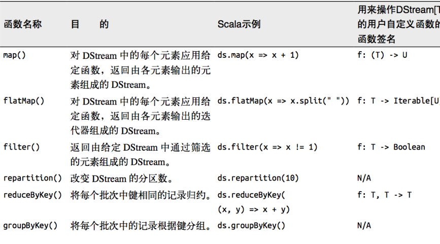

## 一、Spark-Core

### （1）Spark 概述

> Spark 是一种基于内存的快速、通用、可扩展的大数据分析计算引擎。
>
> Spark和Hadoop的根本差异是多个作业之间的数据通信问题 : 
>
> &emsp;Spark多个作业之间数据通信是基于内存，而 Hadoop 是基于磁盘。
>
> Spark 只有在 shuffle 的时候将数据写入磁盘，而 Hadoop 中多个 MR 作业之间的数据交互都要依赖于磁盘交互。
>
> &emsp;在绝大多数的数据计算场景中，Spark 确实会比 MapReduce更有优势。但是 Spark 是基于内存的，所以在实际的生产环境中，由于内存的限制，可能会由于内存资源不够导致 Job 执行失败，此时，MapReduce 其实是一个更好的选择，所以 Spark并不能完全替代 MR。

### （2）Spark的核心模块


➢  Spark Core

&emsp;Spark Core 中提供了 Spark 最基础与最核心的功能，Spark 其他的功能如：Spark SQL，Spark Streaming，GraphX, MLlib 都是在 Spark Core 的基础上进行扩展的

➢  Spark SQL

&emsp;Spark SQL 是 Spark 用来操作结构化数据的组件。通过 Spark SQL，用户可以使用 SQL或者 Apache Hive 版本的 SQL 方言（HQL）来查询数据。

➢  Spark Streaming

&emsp;Spark Streaming 是 Spark 平台上针对实时数据进行流式计算的组件，提供了丰富的处理数据流的 API。

➢  Spark MLlib

&emsp;MLlib 是 Spark 提供的一个机器学习算法库。MLlib 不仅提供了模型评估、数据导入等额外的功能，还提供了一些更底层的机器学习原语。

➢  Spark GraphX

&emsp;GraphX 是 Spark 面向图计算提供的框架与算法库。

### （3）Spark开发环境搭建

#### > 安装Spark

**下载并解压**

&emsp;官方下载地址：http://spark.apache.org/downloads.html ，选择 Spark 版本和对应的 Hadoop 版本后再下载：


&emsp;解压安装包：

```shell
tar -zxvf  spark-2.2.3-bin-hadoop2.6.tgz
```

**配置环境变量**

```shell
vim /etc/profile
```

&emsp;添加环境变量：

```shell
export SPARK_HOME=/usr/app/spark-2.2.3-bin-hadoop2.6
export  PATH=${SPARK_HOME}/bin:$PATH
```

&emsp;使得配置的环境变量立即生效：

```shell
source /etc/profile
```

**Local模式**

&emsp;Local 模式是最简单的一种运行方式，它采用单节点多线程方式运行，不用部署，开箱即用，适合日常测试开发。

```shell
# 启动spark-shell
spark-shell --master local[2]
```

- **local**：只启动一个工作线程；
- **local[k]**：启动 k 个工作线程；
- **local[*]**：启动跟 cpu 数目相同的工作线程数。


&emsp;进入 spark-shell 后，程序已经自动创建好了上下文 `SparkContext`，等效于执行了下面的 Scala 代码：

```java
val conf = new SparkConf().setAppName("Spark shell").setMaster("local[2]")
val sc = new SparkContext(conf)
```

#### > 词频统计案例

&emsp;安装完成后可以先做一个简单的词频统计例子，感受 spark 的魅力。准备一个词频统计的文件样本 `wc.txt`，内容如下：

```text
hadoop,spark,hadoop
spark,flink,flink,spark
hadoop,hadoop
```

&emsp;在 scala 交互式命令行中执行如下 Scala 语句：

```java
val file = spark.sparkContext.textFile("file:///usr/app/wc.txt")
val wordCounts = file.flatMap(line => line.split(",")).map((word => (word, 1))).reduceByKey(_ + _)
wordCounts.collect
```

&emsp;执行过程如下，可以看到已经输出了词频统计的结果：


&emsp;同时还可以通过 Web UI 查看作业的执行情况，访问端口为 `4040`：


#### > Scala开发环境配置

&emsp;Spark 是基于 Scala 语言进行开发的，分别提供了基于 Scala、Java、Python 语言的 API，如果你想使用 Scala 语言进行开发，则需要搭建 Scala 语言的开发环境。

**前置条件**

&emsp;Scala 的运行依赖于 JDK，所以需要你本机有安装对应版本的 JDK，最新的 Scala 2.12.x 需要 JDK 1.8+。

**安装Scala插件**

&emsp;IDEA 默认不支持 Scala 语言的开发，需要通过插件进行扩展。打开 IDEA，依次点击 **File** => **settings**=> **plugins** 选项卡，搜索 Scala 插件 (如下图)。找到插件后进行安装，并重启 IDEA 使得安装生效。


**创建Scala项目** 

&emsp;在 IDEA 中依次点击 **File** => **New** => **Project** 选项卡，然后选择创建 `Scala—IDEA` 工程：


**下载Scala SDK** 

1. 方式一

&emsp;此时看到 `Scala SDK` 为空，依次点击 `Create` => `Download` ，选择所需的版本后，点击 `OK` 按钮进行下载，下载完成点击 `Finish` 进入工程。


2. 方式二

&emsp;方式一是 Scala 官方安装指南里使用的方式，但下载速度通常比较慢，且这种安装下并没有直接提供 Scala 命令行工具。所以个人推荐到官网下载安装包进行安装，下载地址：https://www.scala-lang.org/download/

这里我的系统是 Windows，下载 msi 版本的安装包后，一直点击下一步进行安装，安装完成后会自动配置好环境变量。


&emsp;由于安装时已经自动配置好环境变量，所以 IDEA 会自动选择对应版本的 SDK。


**创建Hello World** 

&emsp;在工程 `src` 目录上右击 **New** => **Scala class** 创建 `Hello.scala`。输入代码如下，完成后点击运行按钮，成功运行则代表搭建成功。


**切换Scala版本** 

&emsp;在日常的开发中，由于对应软件（如 Spark）的版本切换，可能导致需要切换 Scala 的版本，则可以在 `Project Structures` 中的 `Global Libraries` 选项卡中进行切换。


**可能出现的问题** 

&emsp;在 IDEA 中有时候重新打开项目后，右击并不会出现新建 `scala` 文件的选项，或者在编写时没有 Scala 语法提示，此时可以先删除 `Global Libraries` 中配置好的 SDK，之后再重新添加：


&emsp;**另外在 IDEA 中以本地模式运行 Spark 项目是不需要在本机搭建 Spark 和 Hadoop 环境的。**


### （4）Spark部署模式与作业提交 

- **Local  模式**

  > 所谓的 Local 模式，就是不需要其他任何节点资源就可以在本地执行 Spark 代码的环境，一般用于教学，调试，演示等.

- **Standalone  模式**

  > local 本地模式毕竟只是用来进行练习演示的，真实工作中还是要将应用提交到对应的集群中去执行，这里我们来看看只使用 Spark 自身节点运行的集群模式，也就是我们所谓的独立部署（Standalone）模式。Spark 的 Standalone 模式体现了经典的 master-slave 模式。

  集群规划：

  

- **Yarn 模式**

  > 独立部署（Standalone）模式由 Spark 自身提供计算资源，无需其他框架提供资源。这种方式降低了和其他第三方资源框架的耦合性，独立性非常强。但是Spark 主要是计算框架，而不是资源调度框架，所以本身提供的资源调度并不是它的强项，所以还是和其他专业的资源调度框架集成会更靠谱一些。在国内工作中，Yarn 使用的非常多。

  **配置**

  &emsp;在 `spark-env.sh` 中配置 hadoop 的配置目录的位置，可以使用 `YARN_CONF_DIR` 或 `HADOOP_CONF_DIR` 进行指定：

  ```shell
  YARN_CONF_DIR=/usr/app/hadoop-2.6.0-cdh5.15.2/etc/hadoop
  # JDK安装位置
  JAVA_HOME=/usr/java/jdk1.8.0_201
  ```

  **启动**

  &emsp;必须要保证 Hadoop 已经启动，这里包括 YARN 和 HDFS 都需要启动，因为在计算过程中 Spark 会使用 HDFS 存储临时文件，如果 HDFS 没有启动，则会抛出异常。

  ```shell
  start-yarn.sh
  start-dfs.sh
  ```

  **提交应用**

  ```shell
  #  以client模式提交到yarn集群 
  spark-submit \
  --class org.apache.spark.examples.SparkPi \
  --master yarn \
  --deploy-mode client \
  --executor-memory 2G \
  --num-executors 10 \
  /usr/app/spark-2.4.0-bin-hadoop2.6/examples/jars/spark-examples_2.11-2.4.0.jar \
  100

  #  以cluster模式提交到yarn集群 
  spark-submit \
  --class org.apache.spark.examples.SparkPi \
  --master yarn \
  --deploy-mode cluster \
  --executor-memory 2G \
  --num-executors 10 \
  /usr/app/spark-2.4.0-bin-hadoop2.6/examples/jars/spark-examples_2.11-2.4.0.jar \
  100
  ```

  **部署模式对比**： 

  

  **端口号**：

  > ➢  Spark 查看当前 Spark-shell 运行任务情况端口号：4040（计算）
  >
  > ➢  Spark Master 内部通信服务端口号：7077
  >
  > ➢  Standalone 模式下，Spark Master Web 端口号：8080（资源）
  >
  > ➢  Spark 历史服务器端口号：18080
  >
  > ➢  Hadoop YARN 任务运行情况查看端口号：8088


### （5）Spark运行架构

| Term（术语）        | Meaning（含义）                              |
| --------------- | ---------------------------------------- |
| Application     | Spark 应用程序，由集群上的一个 Driver 节点和多个 Executor 节点组成。 |
| Driver program  | 主运用程序，该进程运行应用的 main() 方法并且创建  SparkContext |
| Cluster manager | 集群资源管理器（例如，Standlone Manager，Mesos，YARN） |
| Worker node     | 执行计算任务的工作节点                              |
| Executor        | 位于工作节点上的应用进程，负责执行计算任务并且将输出数据保存到内存或者磁盘中   |
| Task            | 被发送到 Executor 中的工作单元                     |


**核心组件**：

- **Driver**

  > Spark 驱动器节点，用于执行 Spark 任务中的 main 方法，负责实际代码的执行工作。Driver 在 Spark 作业执行时主要负责：
  >
  > ➢  将用户程序转化为作业（job）
  >
  > ➢  在 Executor 之间调度任务(task)
  >
  > ➢  跟踪 Executor 的执行情况
  >
  > ➢  通过 UI 展示查询运行情况
  > &emsp;实际上，我们无法准确地描述 Driver 的定义，因为在整个的编程过程中没有看到任何有关Driver 的字眼。所以简单理解，所谓的 Driver 就是驱使整个应用运行起来的程序，也称之为Driver 类。

-  **Executor**

  > Executor 有两个核心功能：
  >
  > ➢  负责运行组成 Spark 应用的任务，并将结果返回给驱动器进程
  >
  > ➢  它们通过自身的块管理器（Block Manager）为用户程序中要求缓存的 RDD 提供内存式存储。RDD 是直接缓存在 Executor 进程内的，因此任务可以在运行时充分利用缓存数据加速运算

-  **Master & Worker**

  > Spark 集群的独立部署环境中，不需要依赖其他的资源调度框架，自身就实现了资源调度的功能，所以环境中还有其他两个核心组件：Master 和 Worker，这里的 Master 是一个进程，主要负责资源的调度和分配，并进行集群的监控等职责，类似于 Yarn 环境中的 RM, 而Worker 呢，也是进程，一个 Worker 运行在集群中的一台服务器上，由 Master 分配资源对数据进行并行的处理和计算，类似于 Yarn 环境中 NM。

- **ApplicationMaster**

  > Hadoop 用户向 YARN 集群提交应用程序时,提交程序中应该包含 ApplicationMaster，用于向资源调度器申请执行任务的资源容器 Container，运行用户自己的程序任务 job，监控整个任务的执行，跟踪整个任务的状态，处理任务失败等异常情况。
  >
  > 说的简单点就是，ResourceManager（资源）和 Driver（计算）之间的解耦合靠的就是ApplicationMaster。

### （6）核心概念

-  **Executor 与 Core**

  > Spark Executor 是集群中运行在工作节点（Worker）中的一个 JVM 进程，是整个集群中的专门用于计算的节点。在提交应用中，可以提供参数指定计算节点的个数，以及对应的资源。这里的资源一般指的是工作节点 Executor 的内存大小和使用的虚拟 CPU 核（Core）数量。

应用程序相关启动参数如下:


- **并行度（Parallelism)**

> 在分布式计算框架中一般都是多个任务同时执行，由于任务分布在不同的计算节点进行计算，所以能够真正地实现多任务并行执行，记住，这里是并行，而不是并发。这里我们将整个集群并行执行任务的数量称之为并行度。那么一个作业到底并行度是多少呢？这个取决于框架的默认配置。应用程序也可以在运行过程中动态修改。

### （7）提交流程

&emsp;所谓的提交流程，其实就是我们开发人员根据需求写的应用程序通过 Spark 客户端提交给 Spark 运行环境执行计算的流程。在不同的部署环境中，这个提交过程基本相同，但是又有细微的区别，我们这里不进行详细的比较，但是因为国内工作中，将 Spark 引用部署到Yarn 环境中会更多一些，所以本课程中的提交流程是基于 Yarn 环境的。


&emsp;Spark 应用程序提交到 Yarn 环境中执行的时候，一般会有两种部署执行的方式：Client和 Cluster。两种模式主要区别在于：Driver 程序的运行节点位置。

<br/>

**Yarn Client  模式**

&emsp;Client 模式将用于监控和调度的 Driver 模块在客户端执行，而不是在 Yarn 中，所以一般用于测试。

➢  Driver 在任务提交的本地机器上运行。

➢  Driver 启动后会和 ResourceManager 通讯申请启动 ApplicationMaster。

➢  ResourceManager 分配 container，在合适的 NodeManager 上启动 ApplicationMaster，负责向 ResourceManager 申请 Executor 内存。

➢  ResourceManager 接到 ApplicationMaster 的资源申请后会分配 container，然后ApplicationMaster 在资源分配指定的 NodeManager 上启动 Executor 进程。

➢  Executor 进程启动后会向 Driver 反向注册，Executor 全部注册完成后 Driver 开始执行main 函数。

➢  之后执行到 Action 算子时，触发一个 Job，并根据宽依赖开始划分 stage，每个 stage 生成对应的 TaskSet，之后将 task 分发到各个 Executor 上执行。

<br/>

**Yarn Cluster  模式**

&emsp;Cluster 模式将用于监控和调度的 Driver 模块启动在 Yarn 集群资源中执行。一般应用于实际生产环境。

➢  在 YARN Cluster 模式下，任务提交后会和 ResourceManager 通讯申请启动ApplicationMaster。

➢  随后 ResourceManager 分配 container，在合适的 NodeManager 上启动 ApplicationMaster，此时的 ApplicationMaster 就是 Driver。

➢  Driver 启动后向 ResourceManager 申请 Executor 内存，ResourceManager 接到ApplicationMaster 的资源申请后会分配 container，然后在合适的 NodeManager 上启动Executor 进程。

➢  Executor 进程启动后会向 Driver 反向注册，Executor 全部注册完成后 Driver 开始执行main 函数。

➢  之后执行到 Action 算子时，触发一个 Job，并根据宽依赖开始划分 stage，每个 stage 生成对应的 TaskSet，之后将 task 分发到各个 Executor 上执行。

```shell
nohup spark-submit 
--master [yarn, local[*], mesos]  # 集群的 Master Url
--deploy-mode [client, cluster] # 部署模式
--queue [xxxx] 	   # 使用的队列
--class [xxxx]     # 应用程序主入口类
--conf <key>=<value> \        # 可选配置  
--driver-memory 50g   # driver端内存
--executor-memory 8g  # 一个executor的内存
--executor-cores 4    # 一个executor的核数
--num-executors 64    # 总共多少个executor
[/opt/work/xxxx.jar] # Jar 包路径 
```

### （8）RDD的Transformation 和 Action 常用算子

- **RDD**

  > RDD（Resilient Distributed Dataset）叫做弹性分布式数据集，是 Spark 中最基本的数据处理模型。代码中是一个抽象类，它代表一个弹性的、不可变、可分区、里面的元素可并行计算的集合。
  >
  > ​
  >
  > ➢  弹性
  >
  > &emsp;存储的弹性：内存与磁盘的自动切换；
  >
  > &emsp;容错的弹性：数据丢失可以自动恢复；
  >
  > &emsp;计算的弹性：计算出错重试机制；
  >
  > &emsp;分片的弹性：可根据需要重新分片。
  >
  > ➢  分布式：数据存储在大数据集群不同节点上
  >
  > ➢  数据集：RDD 封装了计算逻辑，并不保存数据
  >
  > ➢  数据抽象：RDD 是一个抽象类，需要子类具体实现
  >
  > ➢  不可变：RDD 封装了计算逻辑，是不可以改变的，想要改变，只能产生新的 RDD，在新的 RDD 里面封装计算逻辑
  >
  > ➢  可分区、并行计算

  - **RDD  转换算子:**

    > **map**: 将处理的数据逐条进行映射转换，这里的转换可以是类型的转换，也可以是值的转换。
    >
    > **mapPartitions**: 将待处理的数据以分区为单位发送到计算节点进行处理，这里的处理是指可以进行任意的处理，哪怕是过滤数据。
    >
    > **mapPartitionsWithIndex**:  将待处理的数据以分区为单位发送到计算节点进行处理，这里的处理是指可以进行任意的处理，哪怕是过滤数据，在处理时同时可以获取当前分区索引。
    >
    > **flatMap**: 将处理的数据进行扁平化后再进行映射处理，所以算子也称之为扁平映射。
    >
    > **groupBy**: 将数据根据指定的规则进行分组, 分区默认不变，但是数据会被打乱重新组合，我们将这样的操作称之为 shuffle。极限情况下，数据可能被分在同一个分区中。
    >
    > **filter**: 将数据根据指定的规则进行筛选过滤，符合规则的数据保留，不符合规则的数据丢弃。当数据进行筛选过滤后，分区不变，但是分区内的数据可能不均衡，生产环境下，可能会出现数据倾斜。
    >
    > **sample**: 根据指定的规则从数据集中抽取数据。
    >
    > **distinct**： 将数据集中重复的数据去重。
    >
    > **coalesce**:  根据数据量缩减分区，用于大数据集过滤后，提高小数据集的执行效率当 spark 程序中，存在过多的小任务的时候，可以通过 coalesce 方法，收缩合并分区，减少分区的个数，减小任务调度成本。
    >
    > **repartition**： 该操作内部其实执行的是 coalesce 操作，参数 shuffle 的默认值为 true。无论是将分区数多的RDD 转换为分区数少的 RDD，还是将分区数少的 RDD 转换为分区数多的 RDD，repartition操作都可以完成，因为无论如何都会经 shuffle 过程。
    >
    > **sortBy**：  该操作用于排序数据。在排序之前，可以将数据通过 f 函数进行处理，之后按照 f 函数处理的结果进行排序，默认为升序排列。排序后新产生的 RDD 的分区数与原 RDD 的分区数一致。中间存在 shuffle 的过程。
    >
    > **intersection**： 对源 RDD 和参数 RDD 求交集后返回一个新的 RDD。
    >
    > **union**： 对源 RDD 和参数 RDD 求并集后返回一个新的 RDD。
    >
    > **subtract**： 以一个 RDD 元素为主，去除两个 RDD 中重复元素，将其他元素保留下来。求差集。
    >
    > **zip**：  将两个 RDD 中的元素，以键值对的形式进行合并。其中，键值对中的 Key 为第 1 个 RDD中的元素，Value 为第 2 个 RDD 中的相同位置的元素。
    >
    > **partitionBy**： 将数据按照指定 Partitioner 重新进行分区。Spark 默认的分区器是 HashPartitioner。
    >
    > **reduceByKey**： 可以将数据按照相同的 Key 对 Value 进行聚合。
    >
    > **groupByKey**： 将数据源的数据根据 key 对 value 进行分组。
    >
    > ​
    >
    > (
    >
    > &emsp;从 shuffle  的角度：reduceByKey 和 groupByKey 都存在 shuffle 的操作，但是 reduceByKey可以在 shuffle 前对分区内相同 key 的数据进行预聚合（combine）功能，这样会减少落盘的数据量，而 groupByKey 只是进行分组，不存在数据量减少的问题，reduceByKey 性能比较高。
    >
    > &emsp;从功能的角度：reduceByKey 其实包含分组和聚合的功能。GroupByKey 只能分组，不能聚合，所以在分组聚合的场合下，推荐使用 reduceByKey，如果仅仅是分组而不需要聚合。那么还是只能使用 groupByKey。
    >
    > ）
    >
    > ​
    >
    > **aggregateByKey**:  将数据根据不同的规则进行分区内计算和分区间计算。
    >
    > **foldByKey**：   当分区内计算规则和分区间计算规则相同时，aggregateByKey 就可以简化为 foldByKey。
    >
    > **combineByKey** ：  最通用的对 key-value 型 rdd 进行聚集操作的聚集函数（aggregation function）。类似于aggregate()，combineByKey()允许用户返回值的类型与输入不一致。
    >
    > **sortByKey**： 在一个(K,V)的 RDD 上调用，K 必须实现 Ordered 接口(特质)，返回一个按照 key 进行排序的。
    >
    > **join**： 在类型为(K,V)和(K,W)的 RDD 上调用，返回一个相同 key 对应的所有元素连接在一起的(K,(V,W))的 RDD。
    >
    > **leftOuterJoin**： 类似于 SQL 语句的左外连接。
    >
    > **cogroup**：在类型为(K,V)和(K,W)的 RDD 上调用，返回一个(K,(Iterable<V>,Iterable<W>))类型的 RDD。
    >
    > ​

  - **RDD  行动算子:**

    > **reduce**： 聚集 RDD 中的所有元素，先聚合分区内数据，再聚合分区间数据。
    > **collect**： 在驱动程序中，以数组 Array 的形式返回数据集的所有元素。
    >
    > **count**： 返回 RDD 中元素的个数。
    >
    > **first**： 返回 RDD 中的第一个元素。
    >
    > **take**：返回一个由 RDD 的前 n 个元素组成的数组。
    >
    > **takeOrdered**： 返回该 RDD 排序后的前 n 个元素组成的数组。
    >
    > **aggregate**： 分区的数据通过初始值和分区内的数据进行聚合，然后再和初始值进行分区间的数据聚合。
    >
    > **fold**： 折叠操作，aggregate 的简化版操作。
    >
    > **countByKey**：统计每种 key 的个数。
    >
    > **saveAsTextFile**： 保存。
    >
    > **saveAsObjectFile**： 保存。
    >
    > **saveAsSequenceFile**： 保存。
    >
    > **foreach**：分布式遍历 RDD 中的每一个元素，调用指定函数。

  - **RDD窄依赖:**

    > 窄依赖表示每一个父(上游)RDD 的 Partition 最多被子（下游）RDD 的一个 Partition 使用，窄依赖我们形象的比喻为独生子女。

  - **RDD宽依赖**：

    > 宽依赖表示同一个父（上游）RDD 的 Partition 被多个子（下游）RDD 的 Partition 依赖，会引起 Shuffle，总结：宽依赖我们形象的比喻为多生。

  - **RDD 持久化：**

    > RDD 通过 Cache 或者 Persist 方法将前面的计算结果缓存，默认情况下会把数据以缓存在 JVM 的堆内存中。但是并不是这两个方法被调用时立即缓存，而是触发后面的 action 算子时，该 RDD 将会被缓存在计算节点的内存中，并供后面重用。
    >
    > 缓存有可能丢失，或者存储于内存的数据由于内存不足而被删除，RDD 的缓存容错机制保证了即使缓存丢失也能保证计算的正确执行。通过基于 RDD 的一系列转换，丢失的数据会被重算，由于 RDD 的各个 Partition 是相对独立的，因此只需要计算丢失的部分即可，并不需要重算全部 Partition。
    >
    > Spark 会自动对一些 Shuffle 操作的中间数据做持久化操作(比如：reduceByKey)。这样做的目的是为了当一个节点 Shuffle 失败了避免重新计算整个输入。但是，在实际使用的时候，如果想重用数据，仍然建议调用 persist 或 cache。

  - **RDD CheckPoint  检查点：**

    > 所谓的检查点其实就是通过将 RDD 中间结果写入磁盘由于血缘依赖过长会造成容错成本过高，这样就不如在中间阶段做检查点容错，如果检查点之后有节点出现问题，可以从检查点开始重做血缘，减少了开销。对 RDD 进行 checkpoint 操作并不会马上被执行，必须执行 Action 操作才能触发。

  - **缓存和检查点区别：**

    > 1）Cache 缓存只是将数据保存起来，不切断血缘依赖。Checkpoint 检查点切断血缘依赖。
    >
    > 2）Cache 缓存的数据通常存储在磁盘、内存等地方，可靠性低。Checkpoint 的数据通常存储在 HDFS 等容错、高可用的文件系统，可靠性高。
    >
    > 3）建议对 checkpoint()的 RDD 使用 Cache 缓存，这样 checkpoint 的 job 只需从 Cache 缓存中读取数据即可，否则需要再从头计算一次 RDD。

  - **RDD  分区器：**

    > Spark 目前支持 Hash 分区和 Range 分区，和用户自定义分区。Hash 分区为当前的默认分区。分区器直接决定了 RDD 中分区的个数、RDD 中每条数据经过 Shuffle 后进入哪个分区，进而决定了Reduce 的个数。

<font color='red'>从计算的角度, 算子以外的代码都是在 Driver 端执行, 算子里面的代码都是在 Executor
端执行。</font>

#### > Transformation

&emsp;spark 常用的 Transformation 算子如下表：

| Transformation 算子                        | Meaning（含义）                              |
| ---------------------------------------- | ---------------------------------------- |
| **map**(*func*)                          | 对原 RDD 中每个元素运用 *func* 函数，并生成新的 RDD       |
| **filter**(*func*)                       | 对原 RDD 中每个元素使用*func* 函数进行过滤，并生成新的 RDD    |
| **flatMap**(*func*)                      | 与 map 类似，但是每一个输入的 item 被映射成 0 个或多个输出的 items（ *func* 返回类型需要为 Seq ）。 |
| **mapPartitions**(*func*)                | 与 map 类似，但函数单独在 RDD 的每个分区上运行， *func*函数的类型为  Iterator\<T> => Iterator\<U> ，其中 T 是 RDD 的类型，即 RDD[T] |
| **mapPartitionsWithIndex**(*func*)       | 与 mapPartitions 类似，但 *func* 类型为 (Int, Iterator\<T>) => Iterator\<U> ，其中第一个参数为分区索引 |
| **sample**(*withReplacement*, *fraction*, *seed*) | 数据采样，有三个可选参数：设置是否放回（withReplacement）、采样的百分比（*fraction*）、随机数生成器的种子（seed）； |
| **union**(*otherDataset*)                | 合并两个 RDD                                 |
| **intersection**(*otherDataset*)         | 求两个 RDD 的交集                              |
| **distinct**([*numTasks*]))              | 去重                                       |
| **groupByKey**([*numTasks*])             | 按照 key 值进行分区，即在一个 (K, V) 对的 dataset 上调用时，返回一个 (K, Iterable\<V>) <br/>**Note:** 如果分组是为了在每一个 key 上执行聚合操作（例如，sum 或 average)，此时使用 `reduceByKey` 或 `aggregateByKey` 性能会更好<br>**Note:** 默认情况下，并行度取决于父 RDD 的分区数。可以传入 `numTasks` 参数进行修改。 |
| **reduceByKey**(*func*, [*numTasks*])    | 按照 key 值进行分组，并对分组后的数据执行归约操作。             |
| **aggregateByKey**(*zeroValue*,*numPartitions*)(*seqOp*, *combOp*, [*numTasks*]) | 当调用（K，V）对的数据集时，返回（K，U）对的数据集，其中使用给定的组合函数和 zeroValue 聚合每个键的值。与 groupByKey 类似，reduce 任务的数量可通过第二个参数进行配置。 |
| **sortByKey**([*ascending*], [*numTasks*]) | 按照 key 进行排序，其中的 key 需要实现 Ordered 特质，即可比较 |
| **join**(*otherDataset*, [*numTasks*])   | 在一个 (K, V) 和 (K, W) 类型的 dataset 上调用时，返回一个 (K, (V, W)) pairs 的 dataset，等价于内连接操作。如果想要执行外连接，可以使用 `leftOuterJoin`, `rightOuterJoin` 和 `fullOuterJoin` 等算子。 |
| **cogroup**(*otherDataset*, [*numTasks*]) | 在一个 (K, V) 对的 dataset 上调用时，返回一个 (K, (Iterable\<V>, Iterable\<W>)) tuples 的 dataset。 |
| **cartesian**(*otherDataset*)            | 在一个 T 和 U 类型的 dataset 上调用时，返回一个 (T, U) 类型的 dataset（即笛卡尔积）。 |
| **coalesce**(*numPartitions*)            | 将 RDD 中的分区数减少为 numPartitions。            |
| **repartition**(*numPartitions*)         | 随机重新调整 RDD 中的数据以创建更多或更少的分区，并在它们之间进行平衡。   |
| **repartitionAndSortWithinPartitions**(*partitioner*) | 根据给定的 partitioner（分区器）对 RDD 进行重新分区，并对分区中的数据按照 key 值进行排序。这比调用 `repartition` 然后再 sorting（排序）效率更高，因为它可以将排序过程推送到 shuffle 操作所在的机器。 |

下面分别给出这些算子的基本使用示例：

**map** 

```java
val list = List(1,2,3)
sc.parallelize(list).map(_ * 10).foreach(println)

// 输出结果： 10 20 30 （这里为了节省篇幅去掉了换行,后文亦同）
```

**filter**  

```java
val list = List(3, 6, 9, 10, 12, 21)
sc.parallelize(list).filter(_ >= 10).foreach(println)

// 输出： 10 12 21
```

**flatMap** 

&emsp;`flatMap(func)` 与 `map` 类似，但每一个输入的 item 会被映射成 0 个或多个输出的 items（ *func* 返回类型需要为 `Seq`）。

```java
val list = List(List(1, 2), List(3), List(), List(4, 5))
sc.parallelize(list).flatMap(_.toList).map(_ * 10).foreach(println)

// 输出结果 ： 10 20 30 40 50
```

&emsp;flatMap 这个算子在日志分析中使用概率非常高，这里进行一下演示：拆分输入的每行数据为单个单词，并赋值为 1，代表出现一次，之后按照单词分组并统计其出现总次数，代码如下：

```java
val lines = List("spark flume spark",
                 "hadoop flume hive")
sc.parallelize(lines).flatMap(line => line.split(" ")).
map(word=>(word,1)).reduceByKey(_+_).foreach(println)

// 输出：
(spark,2)
(hive,1)
(hadoop,1)
(flume,2)
```

**mapPartitions** 

&emsp;与 map 类似，但函数单独在 RDD 的每个分区上运行， *func*函数的类型为 `Iterator<T> => Iterator<U>` (其中 T 是 RDD 的类型)，即输入和输出都必须是可迭代类型。

```java
val list = List(1, 2, 3, 4, 5, 6)
sc.parallelize(list, 3).mapPartitions(iterator => {
  val buffer = new ListBuffer[Int]
  while (iterator.hasNext) {
    buffer.append(iterator.next() * 100)
  }
  buffer.toIterator
}).foreach(println)
//输出结果
100 200 300 400 500 600
```

**mapPartitionsWithIndex**

&emsp;与 mapPartitions 类似，但 *func* 类型为 `(Int, Iterator<T>) => Iterator<U>` ，其中第一个参数为分区索引。

```java
val list = List(1, 2, 3, 4, 5, 6)
sc.parallelize(list, 3).mapPartitionsWithIndex((index, iterator) => {
  val buffer = new ListBuffer[String]
  while (iterator.hasNext) {
    buffer.append(index + "分区:" + iterator.next() * 100)
  }
  buffer.toIterator
}).foreach(println)
//输出
0 分区:100
0 分区:200
1 分区:300
1 分区:400
2 分区:500
2 分区:600
```

**sample**

&emsp;数据采样。有三个可选参数：设置是否放回 (withReplacement)、采样的百分比 (fraction)、随机数生成器的种子 (seed) ：

```java
val list = List(1, 2, 3, 4, 5, 6)
sc.parallelize(list).sample(withReplacement = false, fraction = 0.5).foreach(println)
```

**union**

&emsp;合并两个 RDD：

```java
val list1 = List(1, 2, 3)
val list2 = List(4, 5, 6)
sc.parallelize(list1).union(sc.parallelize(list2)).foreach(println)
// 输出: 1 2 3 4 5 6
```

**intersection**

&emsp;求两个 RDD 的交集：

```java
val list1 = List(1, 2, 3, 4, 5)
val list2 = List(4, 5, 6)
sc.parallelize(list1).intersection(sc.parallelize(list2)).foreach(println)
// 输出:  4 5
```

**distinct**

&emsp;去重：

```java
val list = List(1, 2, 2, 4, 4)
sc.parallelize(list).distinct().foreach(println)
// 输出: 4 1 2
```

**groupByKey**

&emsp;按照键进行分组：

```java
val list = List(("hadoop", 2), ("spark", 3), ("spark", 5), ("storm", 6), ("hadoop", 2))
sc.parallelize(list).groupByKey().map(x => (x._1, x._2.toList)).foreach(println)

//输出：
(spark,List(3, 5))
(hadoop,List(2, 2))
(storm,List(6))
```

**reduceByKey**

&emsp;按照键进行归约操作：

```java
val list = List(("hadoop", 2), ("spark", 3), ("spark", 5), ("storm", 6), ("hadoop", 2))
sc.parallelize(list).reduceByKey(_ + _).foreach(println)

//输出
(spark,8)
(hadoop,4)
(storm,6)
```

**sortBy & sortByKey**

&emsp;按照键进行排序：

```java
val list01 = List((100, "hadoop"), (90, "spark"), (120, "storm"))
sc.parallelize(list01).sortByKey(ascending = false).foreach(println)
// 输出
(120,storm)
(90,spark)
(100,hadoop)
```

&emsp;按照指定元素进行排序：

```java
val list02 = List(("hadoop",100), ("spark",90), ("storm",120))
sc.parallelize(list02).sortBy(x=>x._2,ascending=false).foreach(println)
// 输出
(storm,120)
(hadoop,100)
(spark,90)
```

**join**

&emsp;在一个 (K, V) 和 (K, W) 类型的 Dataset 上调用时，返回一个 (K, (V, W)) 的 Dataset，等价于内连接操作。如果想要执行外连接，可以使用 `leftOuterJoin`, `rightOuterJoin` 和 `fullOuterJoin` 等算子。

```java
val list01 = List((1, "student01"), (2, "student02"), (3, "student03"))
val list02 = List((1, "teacher01"), (2, "teacher02"), (3, "teacher03"))
sc.parallelize(list01).join(sc.parallelize(list02)).foreach(println)

// 输出
(1,(student01,teacher01))
(3,(student03,teacher03))
(2,(student02,teacher02))
```

**cogroup**

&emsp;在一个 (K, V) 对的 Dataset 上调用时，返回多个类型为 (K, (Iterable\<V>, Iterable\<W>)) 的元组所组成的 Dataset。

```java
val list01 = List((1, "a"),(1, "a"), (2, "b"), (3, "e"))
val list02 = List((1, "A"), (2, "B"), (3, "E"))
val list03 = List((1, "[ab]"), (2, "[bB]"), (3, "eE"),(3, "eE"))
sc.parallelize(list01).cogroup(sc.parallelize(list02),sc.parallelize(list03)).foreach(println)

// 输出： 同一个 RDD 中的元素先按照 key 进行分组，然后再对不同 RDD 中的元素按照 key 进行分组
(1,(CompactBuffer(a, a),CompactBuffer(A),CompactBuffer([ab])))
(3,(CompactBuffer(e),CompactBuffer(E),CompactBuffer(eE, eE)))
(2,(CompactBuffer(b),CompactBuffer(B),CompactBuffer([bB])))

```

**cartesian**

&emsp;计算笛卡尔积：

```java
val list1 = List("A", "B", "C")
val list2 = List(1, 2, 3)
sc.parallelize(list1).cartesian(sc.parallelize(list2)).foreach(println)

//输出笛卡尔积
(A,1)
(A,2)
(A,3)
(B,1)
(B,2)
(B,3)
(C,1)
(C,2)
(C,3)
```

**aggregateByKey**

&emsp;当调用（K，V）对的数据集时，返回（K，U）对的数据集，其中使用给定的组合函数和 zeroValue 聚合每个键的值。与 `groupByKey` 类似，reduce 任务的数量可通过第二个参数 `numPartitions` 进行配置。示例如下：

```java
// 为了清晰，以下所有参数均使用具名传参
val list = List(("hadoop", 3), ("hadoop", 2), ("spark", 4), ("spark", 3), ("storm", 6), ("storm", 8))
sc.parallelize(list,numSlices = 2).aggregateByKey(zeroValue = 0,numPartitions = 3)(
      seqOp = math.max(_, _),
      combOp = _ + _
    ).collect.foreach(println)
//输出结果：
(hadoop,3)
(storm,8)
(spark,7)
```

&emsp;这里使用了 `numSlices = 2` 指定 aggregateByKey 父操作 parallelize 的分区数量为 2，其执行流程如下：


&emsp;基于同样的执行流程，如果 `numSlices = 1`，则意味着只有输入一个分区，则其最后一步 combOp 相当于是无效的，执行结果为：

```properties
(hadoop,3)
(storm,8)
(spark,4)
```

&emsp;同样的，如果每个单词对一个分区，即 `numSlices = 6`，此时相当于求和操作，执行结果为：

```properties
(hadoop,5)
(storm,14)
(spark,7)
```

&emsp;`aggregateByKey(zeroValue = 0,numPartitions = 3)` 的第二个参数 `numPartitions` 决定的是输出 RDD 的分区数量，想要验证这个问题，可以对上面代码进行改写，使用 `getNumPartitions` 方法获取分区数量：

```java
sc.parallelize(list,numSlices = 6).aggregateByKey(zeroValue = 0,numPartitions = 3)(
  seqOp = math.max(_, _),
  combOp = _ + _
).getNumPartitions
```

 

#### > Action

&emsp;Spark 常用的 Action 算子如下：

| Action（动作）                               | Meaning（含义）                              |
| ---------------------------------------- | ---------------------------------------- |
| **reduce**(*func*)                       | 使用函数*func*执行归约操作                         |
| **collect**()                            | 以一个 array 数组的形式返回 dataset 的所有元素，适用于小结果集。 |
| **count**()                              | 返回 dataset 中元素的个数。                       |
| **first**()                              | 返回 dataset 中的第一个元素，等价于 take(1)。          |
| **take**(*n*)                            | 将数据集中的前 *n* 个元素作为一个 array 数组返回。          |
| **takeSample**(*withReplacement*, *num*, [*seed*]) | 对一个 dataset 进行随机抽样                       |
| **takeOrdered**(*n*, *[ordering]*)       | 按自然顺序（natural order）或自定义比较器（custom comparator）排序后返回前 *n* 个元素。只适用于小结果集，因为所有数据都会被加载到驱动程序的内存中进行排序。 |
| **saveAsTextFile**(*path*)               | 将 dataset 中的元素以文本文件的形式写入本地文件系统、HDFS 或其它 Hadoop 支持的文件系统中。Spark 将对每个元素调用 toString 方法，将元素转换为文本文件中的一行记录。 |
| **saveAsSequenceFile**(*path*)           | 将 dataset 中的元素以 Hadoop SequenceFile 的形式写入到本地文件系统、HDFS 或其它 Hadoop 支持的文件系统中。该操作要求 RDD 中的元素需要实现 Hadoop 的 Writable 接口。对于 Scala 语言而言，它可以将 Spark 中的基本数据类型自动隐式转换为对应 Writable 类型。(目前仅支持 Java and Scala) |
| **saveAsObjectFile**(*path*)             | 使用 Java 序列化后存储，可以使用 `SparkContext.objectFile()` 进行加载。(目前仅支持 Java and Scala) |
| **countByKey**()                         | 计算每个键出现的次数。                              |
| **foreach**(*func*)                      | 遍历 RDD 中每个元素，并对其执行*fun*函数                |

**reduce**

&emsp;使用函数*func*执行归约操作：

```java
 val list = List(1, 2, 3, 4, 5)
sc.parallelize(list).reduce((x, y) => x + y)
sc.parallelize(list).reduce(_ + _)

// 输出 15
```

**takeOrdered**

&emsp;按自然顺序（natural order）或自定义比较器（custom comparator）排序后返回前 *n* 个元素。需要注意的是 `takeOrdered` 使用隐式参数进行隐式转换，以下为其源码。所以在使用自定义排序时，需要继承 `Ordering[T]` 实现自定义比较器，然后将其作为隐式参数引入。

```java
def takeOrdered(num: Int)(implicit ord: Ordering[T]): Array[T] = withScope {
  .........
}
```

&emsp;自定义规则排序：

```java
// 继承 Ordering[T],实现自定义比较器，按照 value 值的长度进行排序
class CustomOrdering extends Ordering[(Int, String)] {
    override def compare(x: (Int, String), y: (Int, String)): Int
    = if (x._2.length > y._2.length) 1 else -1
}

val list = List((1, "hadoop"), (1, "storm"), (1, "azkaban"), (1, "hive"))
//  引入隐式默认值
implicit val implicitOrdering = new CustomOrdering
sc.parallelize(list).takeOrdered(5)

// 输出： Array((1,hive), (1,storm), (1,hadoop), (1,azkaban)
```

**countByKey**

&emsp;计算每个键出现的次数：

```java
val list = List(("hadoop", 10), ("hadoop", 10), ("storm", 3), ("storm", 3), ("azkaban", 1))
sc.parallelize(list).countByKey()

// 输出： Map(hadoop -> 2, storm -> 2, azkaban -> 1)
```

**saveAsTextFile**

&emsp;将 dataset 中的元素以文本文件的形式写入本地文件系统、HDFS 或其它 Hadoop 支持的文件系统中。Spark 将对每个元素调用 toString 方法，将元素转换为文本文件中的一行记录。

```java
val list = List(("hadoop", 10), ("hadoop", 10), ("storm", 3), ("storm", 3), ("azkaban", 1))
sc.parallelize(list).saveAsTextFile("/usr/file/temp")
```

参考资料

[RDD Programming Guide](http://spark.apache.org/docs/latest/rdd-programming-guide.html#rdd-programming-guide)


### （9）累加器

➢  累加器：分布式共享<font color='red'>只写</font>变量

> 累加器用来把 Executor 端变量信息聚合到 Driver 端。在 Driver 程序中定义的变量，在Executor 端的每个 Task 都会得到这个变量的一份新的副本，每个 task 更新这些副本的值后，传回 Driver 端进行merge。

```java
val rdd = sc.makeRDD(List(1,2,3,4,5))
// 声明累加器
var sum = sc.longAccumulator("sum");
rdd.foreach(
num => {
// 使用累加器
sum.add(num)
}
)
// 获取累加器的值
println("sum = " + sum.value)
```

<font color='red'>**理解闭包**</font>

**1. Scala 中闭包的概念**

&emsp;这里先介绍一下 Scala 中关于闭包的概念：

```java
var more = 10
val addMore = (x: Int) => x + more
```

&emsp;如上函数 `addMore` 中有两个变量 x 和 more:

- **x** : 是一个绑定变量 (bound variable)，因为其是该函数的入参，在函数的上下文中有明确的定义；
- **more** : 是一个自由变量 (free variable)，因为函数字面量本生并没有给 more 赋予任何含义。

&emsp;按照定义：在创建函数时，如果需要捕获自由变量，那么包含指向被捕获变量的引用的函数就被称为闭包函数。

**2. Spark 中的闭包**

&emsp;在实际计算时，Spark 会将对 RDD 操作分解为 Task，Task 运行在 Worker Node 上。在执行之前，Spark 会对任务进行闭包，如果闭包内涉及到自由变量，则程序会进行拷贝，并将副本变量放在闭包中，之后闭包被序列化并发送给每个执行者。因此，当在 foreach 函数中引用 `counter` 时，它将不再是 Driver 节点上的 `counter`，而是闭包中的副本 `counter`，默认情况下，副本 `counter` 更新后的值不会回传到 Driver，所以 `counter` 的最终值仍然为零。

&emsp;需要注意的是：在 Local 模式下，有可能执行 `foreach` 的 Worker Node 与 Diver 处在相同的 JVM，并引用相同的原始 `counter`，这时候更新可能是正确的，但是在集群模式下一定不正确。所以在遇到此类问题时应优先使用累加器。

&emsp;累加器的原理实际上很简单：就是将每个副本变量的最终值传回 Driver，由 Driver 聚合后得到最终值，并更新原始变量。


### （10）广播变量

➢  广播变量：分布式共享<font color='red'>只读</font>变量

> 广播变量用来高效分发较大的对象。向所有工作节点发送一个较大的只读值，以供一个或多个 Spark 操作使用。比如，如果你的应用需要向所有节点发送一个较大的只读查询表，广播变量用起来都很顺手。在多个并行操作中使用同一个变量，但是 Spark 会为每个任务分别发送。

```java
val rdd1 = sc.makeRDD(List( ("a",1), ("b", 2), ("c", 3), ("d", 4) ),4)
val list = List( ("a",4), ("b", 5), ("c", 6), ("d", 7) )
// 声明广播变量
val broadcast: Broadcast[List[(String, Int)]] = sc.broadcast(list)
val resultRDD: RDD[(String, (Int, Int))] = rdd1.map {
case (key, num) => {
  var num2 = 0
  // 使用广播变量
  for ((k, v) <- broadcast.value) {
    if (k == key) {
      num2 = v
    }
  }
  (key, (num, num2))
  }
}
```


## 二、 Spark-SQL

### （1）Spark - SQL 的 DataFrame / DataSet

#### > Spark SQL 的简介

> Spark SQL 是 Spark 用于结构化数据(structured data)处理的 Spark 模块。
>
> Spark SQL 它提供了 2 个编程抽象, 类似 Spark Core 中的  RDD
>
> （1）DataFrame
>
> （2）DataSet


#### > Spark SQL 的特点

> **Integrated( 易整合)**：无缝的整合了 SQL 查询和 Spark 编程。
>
> **Uniform Data Access( 统一的数据访问方式)**：使用相同的方式连接不同的数据源。
>
> **Hive Integration( 集成 Hive)**：在已有的仓库上直接运行 SQL 或者 HiveQL。
>
> **Standard Connectivity( 标准的连接方式)**：通过 JDBC 或者 ODBC 来连接。


#### > 什么是DataFrame

> 1. 与 RDD 类似， DataFrame 也是一个分布式数据容器。
> 2. 然而 DataFrame 更像传统数据库的二维表格，除了数据以外，还记录数据的结构信息，即 schema 。同时，与 Hive 类似， DataFrame 也支持嵌套数据类型（ struct 、 array 和 map ）。
> 3. 从 API 易用性的角度上看， DataFrame API 提供的是一套高层的关系操作，比函数式的RDD API 要更加友好，门槛更低。
> 4. 性能上比  RDD 要高，主要原因： 优化的执行计划：查询计划通过 Spark catalyst optimiser进行优化。


#### > 什么是DataSet

> 1. 是 DataFrame API 的一个扩展，是 SparkSQL 最新的数据抽象(1.6 新增)。
> 2. 用户友好的 API 风格，既具有类型安全检查也具有 DataFrame 的查询优化特性。
> 3. Dataset 支持编解码器，当需要访问非堆上的数据时可以避免反序列化整个对象，提高了效率。
> 4. 样例类被用来在 DataSet 中定义数据的结构信息，样例类中每个属性的名称直接映射到 DataSet 中的字段名称。
> 5. DataFrame 是 DataSet 的特列， DataFrame=DataSet[Row] ，所以可以通过as 方法将 DataFrame 转换为 DataSet 。 Row 是一个类型，跟 Car 、 Person 这些的类型一样，所有的表结构信息都用 Row 来表示。
> 6. DataSet 是强类型的。比如可以有 DataSet[Car] ， DataSet[Person] .
> 7. DataFrame 只是知道字段，但是不知道字段的类型，所以在执行这些操作的时候是没办法在编译的时候检查是否类型失败的，比如你可以对一个String 进行减法操作，在执行的时候才报错，而 DataSet 不仅仅知道字段，而且知道字段类型，所以有更严格的错误检查。就跟 JSON 对象和类对象之间的类比。

### （2）Spark - SQL 核心编程

>  SparkSession 是 Spark 最新的 SQL 查询起始点，实质上是 SQLContext和 HiveContext 的组合。
>
>  我们使用 spark-shell 的时候, spark 会自动的创建一个叫做 spark 的 SparkSession ,就像我们以前可以自动获取到一个 sc 来表示 SparkContext

#### > RDD、DataFrame、DataSet的关系 / 转化

> - RDDs 适合非结构化数据的处理，而 DataFrame & DataSet 更适合结构化数据和半结构化的处理；
>
> - DataFrame & DataSet 可以通过统一的 Structured API 进行访问，而 RDDs 则更适合函数式编程的场景；
>
> - 相比于 DataFrame 而言，DataSet 是强类型的 (Typed)，有着更为严格的静态类型检查；
>
> - DataSets、DataFrames、SQL 的底层都依赖了 RDDs API，并对外提供结构化的访问接口。
>
>   ​
>
> - DataSets、DataFrames、RDD区别：
>
>   - **DataSets** 
>     1. Dataset 和 DataFrame 拥有完全相同的成员函数，区别只是每一行的数据类型不同 ，DataFrame 其实就是 DataSet 的一个特例。
>     2. DataFrame 也可以叫 Dataset[Row] ,每一行的类型是 Row ，不解析，每一行究竟有哪些字段，各个字段又是什么类型都无从得知，只能用上面提到的getAS 方法或者共性中的第七条提到的模式匹配拿出特定字段。而Dataset 中，每一行是什么类型是不一定的，在自定义了 case class 之后可以很自由的获得每一行的信息
>   - **RDD**：
>     1. RDD 一般和 spark mlib 同时使用。
>     2. RDD 不支持 sparksql 操作。
>
>   - **DataFrames** 
>     1.  与 RDD 和 Dataset 不同， DataFrame 每一行的类型固定为 Row ，每一列的值没法直接访问，只有通过解析才能获取各个字段的值。
>     2.  DataFrame 与 DataSet 一般不与 spark mlib 同时使用。
>     3.  DataFrame 与 DataSet 均支持 SparkSQL 的操作，比如 select ， groupby之类，还能注册临时表/视窗，进行 sql 语句操作。
>     4.  DataFrame 与 DataSet 支持一些特别方便的保存方式，比如保存成 csv ，可以带上表头，这样每一列的字段名一目了然。


<br/>

  #### > 使用 IDEA  创建 SparkSQL  程序

**步骤 1** :  添加 SparkSQL  依赖

```properties
<dependency>
  <groupId>org.apache.spark</groupId>
  <artifactId>spark-sql_2.11</artifactId>
  <version>2.1.1</version>
</dependency>
```

**步骤 2** :  具体代码

```java
object DataFrameDemo {
	def main(args: Array[String]): Unit = {
		// 创建一个新的 SparkSession 对象
		val spark: SparkSession = SparkSession.builder()
			.master("local[*]")
			.appName("Word Count")
			.getOrCreate()
          
			// 导入用到隐式转换. 如果想要使用: $"age" 则必须导入
            import spark.implicits._
          
			val df = spark.read.json("file://" +
				ClassLoader.getSystemResource("user.json").getPath)
            // 打印信息
            df.show
            // 查找年龄大于 19 岁的
            df.filter($"age" > 19).show
          
            // 创建临时表
            df.createTempView("user")
            spark.sql("select * from user where age > 19").show
          
            //关闭连接
            spark.stop()
	}
}
```

<br/>

#### > **Columns列操作**

**引用列** 

&emsp;Spark 支持多种方法来构造和引用列，最简单的是使用 `col() ` 或 `column() ` 函数。

```java
col("colName")
column("colName")

// 对于 Scala 语言而言，还可以使用$"myColumn"和'myColumn 这两种语法糖进行引用。
df.select($"ename", $"job").show()
df.select('ename, 'job).show()
```

**新增列** 

```java
// 基于已有列值新增列
df.withColumn("upSal",$"sal"+1000)
// 基于固定值新增列
df.withColumn("intCol",lit(1000))
```

**删除列** 

```java
// 支持删除多个列
df.drop("comm","job").show()
```

**重命名列** 

```java
df.withColumnRenamed("comm", "common").show()
```

&emsp;需要说明的是新增，删除，重命名列都会产生新的 DataFrame，原来的 DataFrame 不会被改变。

<br/>

#### > 自定义 Spark-SQL函数

**步骤1**： 写一个生成md5的函数

```java
import java.security.MessageDigest
import java.math.BigInteger

object tools_functions { 
	def getMD5(str: String): String = {
    // 第一步，获取MessageDigest对象，参数为MD5表示这是一个MD5算法
    val md5 = MessageDigest.getInstance("MD5")
    // 第二步，计算MD5值
    val array = md5.digest(str.getBytes("UTF-8"))
    // 第三步，结果转换并返回
    val bigInt = new BigInteger(1, array)

    val md5Str = bigInt.toString(16)

    md5Str
  }
}
```

**步骤二**： 导入udf

```java
import org.apache.spark.sql.SparkSession
import com.martinhub.utils.tools_functions.getMD5
import org.apache.spark.sql.functions.udf

object data_process {
  // udf注册自定义函数
  private val generateMD5 = udf(getMD5 _) //生成MD5

  def main(args: Array[String]): Unit = {
    // 创建spark session
    val spark: SparkSession = SparkSession
      .builder()
      .appName("Extract Data")
      .enableHiveSupport()
      .getOrCreate()
    spark.sparkContext.setLogLevel("ERROR")
    import spark.implicits._
    
    //读取Hive表
     val res = spark.table(s"sys.data_table")
     .withColumn("md5_id", generateMD5($"tel_num"))
     
     ........
     ........
     ........
```


### （3）Spark - SQL 的数据源

#### > 前情概要

**通用加载和保存函数**

> 1.  spark.read.load 是加载数据的通用方法.
> 2.  df.write.save 是保存数据的通用方法.

**手动指定选项**

> 也可以手动给数据源指定一些额外的选项. 数据源应该用全名称来指定, 但是对一些内置的数据源也可以使用短名称: 
>
> - CSV
> - JSON
> - Parquet
> - ORC
> - JDBC
> - text

- **读数据格式** 

  所有读取 API 遵循以下调用格式：

  ```java
  // 格式
  DataFrameReader.format(...).option("key", "value").schema(...).load()

  // 示例
  spark.read.format("csv")
  .option("mode", "FAILFAST")          // 读取模式
  .option("inferSchema", "true")       // 是否自动推断 schema
  .option("path", "path/to/file(s)")   // 文件路径
  .schema(someSchema)                  // 使用预定义的 schema      
  .load()
  ```

  读取模式有以下三种可选项：

  | 读模式             | 描述                                       |
  | --------------- | ---------------------------------------- |
  | `permissive`    | 当遇到损坏的记录时，将其所有字段设置为 null，并将所有损坏的记录放在名为 _corruption t_record 的字符串列中 |
  | `dropMalformed` | 删除格式不正确的行                                |
  | `failFast`      | 遇到格式不正确的数据时立即失败                          |

- **写数据格式**

  ```java
  // 格式
  DataFrameWriter.format(...).option(...).partitionBy(...).bucketBy(...).sortBy(...).save()

  //示例
  dataframe.write.format("csv")
  .option("mode", "OVERWRITE")         //写模式
  .option("dateFormat", "yyyy-MM-dd")  //日期格式
  .option("path", "path/to/file(s)")
  .save()
  ```

  写数据模式有以下四种可选项：

  | Scala/Java               | 描述                             |
  | :----------------------- | :----------------------------- |
  | `SaveMode.ErrorIfExists` | 如果给定的路径已经存在文件，则抛出异常，这是写数据默认的模式 |
  | `SaveMode.Append`        | 数据以追加的方式写入                     |
  | `SaveMode.Overwrite`     | 数据以覆盖的方式写入                     |
  | `SaveMode.Ignore`        | 如果给定的路径已经存在文件，则不做任何操作          |

- **文件保存选项(SaveMode)**

> 保存操作可以使用 SaveMode, 用来指明如何处理数据. 使用 mode() 方法来设置.
>
> 有一点很重要: 这些 SaveMode 都是没有加锁的, 也不是原子操作. 还有, 如果你执行的是Overwrite 操作, 在写入新的数据之前会先删除旧的数据.

| Scala/Java                       | Any Language      | Meaning       |
| -------------------------------- | ----------------- | ------------- |
| SaveMode.ErrorIfExists (default) | "error" (default) | 如果文件已经存在则抛出异常 |
| SaveMode.Append                  | "append"          | 如果文件已经存在则追加   |
| SaveMode.Overwrite               | "overwrite"       | 如果文件已经存在则覆盖   |
| SaveMode.Ignore                  | "ignore"          | 如果文件已经存在则忽略   |

<br/>

#### > 数据源 - JDBC

> Spark 同样支持与传统的关系型数据库进行数据读写。但是 Spark 程序默认是没有提供数据库驱动的，所以在使用前需要将对应的数据库驱动上传到安装目录下的 `jars` 目录中。下面示例使用的是 Mysql 数据库，使用前需要将对应的 `mysql-connector-java-x.x.x.jar` 上传到 `jars` 目录下。

 **导入依赖:** 

```properties
<dependency>
  <groupId>mysql</groupId>
  <artifactId>mysql-connector-java</artifactId>
  <version>5.1.27</version>
</dependency>
```

 **读取数据** 

&emsp;读取全表数据示例如下，这里的 `help_keyword` 是 mysql 内置的字典表，只有 `help_keyword_id` 和 `name` 两个字段。

```java
spark.read
.format("jdbc")
.option("driver", "com.mysql.jdbc.Driver")            //驱动
.option("url", "jdbc:mysql://127.0.0.1:3306/mysql")   //数据库地址
.option("dbtable", "help_keyword")                    //表名
.option("user", "root").option("password","root").load().show(10)
```

&emsp;从查询结果读取数据：

```java
val pushDownQuery = """(SELECT * FROM help_keyword WHERE help_keyword_id <20) AS help_keywords"""
spark.read.format("jdbc")
.option("url", "jdbc:mysql://127.0.0.1:3306/mysql")
.option("driver", "com.mysql.jdbc.Driver")
.option("user", "root").option("password", "root")
.option("dbtable", pushDownQuery)
.load().show()
```

&emsp;也可以使用如下的写法进行数据的过滤：

```java
val props = new java.util.Properties
props.setProperty("driver", "com.mysql.jdbc.Driver")
props.setProperty("user", "root")
props.setProperty("password", "root")
val predicates = Array("help_keyword_id < 10  OR name = 'WHEN'")   //指定数据过滤条件
spark.read.jdbc("jdbc:mysql://127.0.0.1:3306/mysql", "help_keyword", predicates, props).show() 
```

&emsp;可以使用 `numPartitions` 指定读取数据的并行度：

```java
option("numPartitions", 10)
```

&emsp;在这里，除了可以指定分区外，还可以设置上界和下界，任何小于下界的值都会被分配在第一个分区中，任何大于上界的值都会被分配在最后一个分区中。

```java
val colName = "help_keyword_id"   //用于判断上下界的列
val lowerBound = 300L    //下界
val upperBound = 500L    //上界
val numPartitions = 10   //分区综述
val jdbcDf = spark.read.jdbc("jdbc:mysql://127.0.0.1:3306/mysql","help_keyword",
                             colName,lowerBound,upperBound,numPartitions,props)
```

&emsp;想要验证分区内容，可以使用 `mapPartitionsWithIndex` 这个算子，代码如下：

```java
jdbcDf.rdd.mapPartitionsWithIndex((index, iterator) => {
    val buffer = new ListBuffer[String]
    while (iterator.hasNext) {
        buffer.append(index + "分区:" + iterator.next())
    }
    buffer.toIterator
}).foreach(println)
```

&emsp;执行结果如下：`help_keyword` 这张表只有 600 条左右的数据，本来数据应该均匀分布在 10 个分区，但是 0 分区里面却有 319 条数据，这是因为设置了下限，所有小于 300 的数据都会被限制在第一个分区，即 0 分区。同理所有大于 500 的数据被分配在 9 分区，即最后一个分区。

**写入数据** 

```java
val df = spark.read.format("json").load("/usr/file/json/emp.json")
df.write
.format("jdbc")
.option("url", "jdbc:mysql://127.0.0.1:3306/mysql")
.option("user", "root").option("password", "root")
.option("dbtable", "emp")
.save()
```

<br/>

#### > 数据源 - CSV

&emsp;CSV 是一种常见的文本文件格式，其中每一行表示一条记录，记录中的每个字段用逗号分隔。

**读取CSV文件**

&emsp;自动推断类型读取读取示例：

```java
spark.read.format("csv")
.option("header", "false")        // 文件中的第一行是否为列的名称
.option("mode", "FAILFAST")      // 是否快速失败
.option("inferSchema", "true")   // 是否自动推断 schema
.load("/usr/file/csv/dept.csv")
.show()
```

&emsp;使用预定义类型：

```java
import org.apache.spark.sql.types.{StructField, StructType, StringType,LongType}
//预定义数据格式
val myManualSchema = new StructType(Array(
    StructField("deptno", LongType, nullable = false),
    StructField("dname", StringType,nullable = true),
    StructField("loc", StringType,nullable = true)
))
spark.read.format("csv")
.option("mode", "FAILFAST")
.schema(myManualSchema)
.load("/usr/file/csv/dept.csv")
.show()
```

**写入CSV文件**

```java
df.write.format("csv").mode("overwrite").save("/tmp/csv/dept2")
```

&emsp;也可以指定具体的分隔符：

```java
df.write.format("csv").mode("overwrite").option("sep", "\t").save("/tmp/csv/dept2")
```

<br/>

#### > 数据源 - JSON

**读取JSON文件** 

```java
spark.read.format("json").option("mode", "FAILFAST").load("/usr/file/json/dept.json").show(5)
```

&emsp;需要注意的是：默认不支持一条数据记录跨越多行 (如下)，可以通过配置 `multiLine` 为 `true` 来进行更改，其默认值为 `false`。

```json
// 默认支持单行
{"DEPTNO": 10,"DNAME": "ACCOUNTING","LOC": "NEW YORK"}

//默认不支持多行
{
  "DEPTNO": 10,
  "DNAME": "ACCOUNTING",
  "LOC": "NEW YORK"
}
```

**写入JSON文件** 

```java
df.write.format("json").mode("overwrite").save("/tmp/spark/json/dept")
```

<br/>

#### > 数据源 - Parquet

&emsp; Parquet 是一个开源的面向列的数据存储，它提供了多种存储优化，允许读取单独的列非整个文件，这不仅节省了存储空间而且提升了读取效率，它是 Spark 是默认的文件格式。

**读取Parquet文件**

```java
spark.read.format("parquet").load("/usr/file/parquet/dept.parquet").show(5)
```

**写入Parquet文件**

```java
df.write.format("parquet").mode("overwrite").save("/tmp/spark/parquet/dept")
```

**可选配置**

&emsp;Parquet 文件有着自己的存储规则，因此其可选配置项比较少，常用的有如下两个：

| 读写操作  | 配置项                  | 可选值                                      | 默认值                                    | 描述                                       |
| ----- | -------------------- | ---------------------------------------- | -------------------------------------- | ---------------------------------------- |
| Write | compression or codec | None,<br/>uncompressed,<br/>bzip2,<br/>deflate, gzip,<br/>lz4, or snappy | None                                   | 压缩文件格式                                   |
| Read  | mergeSchema          | true, false                              | 取决于配置项 `spark.sql.parquet.mergeSchema` | 当为真时，Parquet 数据源将所有数据文件收集的 Schema 合并在一起，否则将从摘要文件中选择 Schema，如果没有可用的摘要文件，则从随机数据文件中选择 Schema。 |

> 更多可选配置可以参阅官方文档：https://spark.apache.org/docs/latest/sql-data-sources-parquet.html

<br/>

#### > 数据源 - ORC

&emsp;ORC 是一种自描述的、类型感知的列文件格式，它针对大型数据的读写进行了优化，也是大数据中常用的文件格式。

**读取ORC文件**

```java
spark.read.format("orc").load("/usr/file/orc/dept.orc").show(5)
```

**写入ORC文件**

```java
spark.write.format("orc").mode("overwrite").save("/tmp/spark/orc/dept")
```

<br/>

#### > 数据源 - Text

&emsp;Text 文件在读写性能方面并没有任何优势，且不能表达明确的数据结构，所以其使用的比较少，读写操作如下：

**读取Text数据** 

```java
spark.read.textFile("/usr/file/txt/dept.txt").show()
```

**写入Text数据** 

```java
df.write.text("/tmp/spark/txt/dept")
```

<br/>

#### >  数据读写高级特性

**并行读**

&emsp;多个 Executors 不能同时读取同一个文件，但它们可以同时读取不同的文件。这意味着当您从一个包含多个文件的文件夹中读取数据时，这些文件中的每一个都将成为 DataFrame 中的一个分区，并由可用的 Executors 并行读取。

**并行写**

&emsp;写入的文件或数据的数量取决于写入数据时 DataFrame 拥有的分区数量。默认情况下，每个数据分区写一个文件。

**分区写入**

&emsp;分区和分桶这两个概念和 Hive 中分区表和分桶表是一致的。都是将数据按照一定规则进行拆分存储。需要注意的是 `partitionBy` 指定的分区和 RDD 中分区不是一个概念：这里的**分区表现为输出目录的子目录**，数据分别存储在对应的子目录中。

```java
val df = spark.read.format("json").load("/usr/file/json/emp.json")
df.write.mode("overwrite").partitionBy("deptno").save("/tmp/spark/partitions")
```

&emsp;输出结果如下：可以看到输出被按照部门编号分为三个子目录，子目录中才是对应的输出文件。

 

**分桶写入**

&emsp;分桶写入就是将数据按照指定的列和桶数进行散列，目前分桶写入只支持保存为表，实际上这就是 Hive 的分桶表。

```java
val numberBuckets = 10
val columnToBucketBy = "empno"
df.write.format("parquet").mode("overwrite")
.bucketBy(numberBuckets, columnToBucketBy).saveAsTable("bucketedFiles")
```

**文件大小管理**

&emsp;如果写入产生小文件数量过多，这时会产生大量的元数据开销。Spark 和 HDFS 一样，都不能很好的处理这个问题，这被称为“small file problem”。同时数据文件也不能过大，否则在查询时会有不必要的性能开销，因此要把文件大小控制在一个合理的范围内。

&emsp;在上文我们已经介绍过可以通过分区数量来控制生成文件的数量，从而间接控制文件大小。Spark 2.2 引入了一种新的方法，以更自动化的方式控制文件大小，这就是 `maxRecordsPerFile` 参数，它允许你通过控制写入文件的记录数来控制文件大小。

```java
 // Spark 将确保文件最多包含 5000 条记录
df.write.option(“maxRecordsPerFile”, 5000)
```

<br/>

#### > 可选配置附录

**CSV读写可选配置** 

| 读\写操作 | 配置项                         | 可选值                                      | 默认值                           | 描述                                       |
| ----- | --------------------------- | ---------------------------------------- | ----------------------------- | ---------------------------------------- |
| Both  | seq                         | 任意字符                                     | `,`(逗号)                       | 分隔符                                      |
| Both  | header                      | true, false                              | false                         | 文件中的第一行是否为列的名称。                          |
| Read  | escape                      | 任意字符                                     | \                             | 转义字符                                     |
| Read  | inferSchema                 | true, false                              | false                         | 是否自动推断列类型                                |
| Read  | ignoreLeadingWhiteSpace     | true, false                              | false                         | 是否跳过值前面的空格                               |
| Both  | ignoreTrailingWhiteSpace    | true, false                              | false                         | 是否跳过值后面的空格                               |
| Both  | nullValue                   | 任意字符                                     | “”                            | 声明文件中哪个字符表示空值                            |
| Both  | nanValue                    | 任意字符                                     | NaN                           | 声明哪个值表示 NaN 或者缺省值                        |
| Both  | positiveInf                 | 任意字符                                     | Inf                           | 正无穷                                      |
| Both  | negativeInf                 | 任意字符                                     | -Inf                          | 负无穷                                      |
| Both  | compression or codec        | None,<br/>uncompressed,<br/>bzip2, deflate,<br/>gzip, lz4, or<br/>snappy | none                          | 文件压缩格式                                   |
| Both  | dateFormat                  | 任何能转换为 Java 的 <br/>SimpleDataFormat 的字符串 | yyyy-MM-dd                    | 日期格式                                     |
| Both  | timestampFormat             | 任何能转换为 Java 的 <br/>SimpleDataFormat 的字符串 | `yyyy-MM-dd'T'HH:mm:ss.SSSZZ` | 时间戳格式                                    |
| Read  | maxColumns                  | 任意整数                                     | 20480                         | 声明文件中的最大列数                               |
| Read  | maxCharsPerColumn           | 任意整数                                     | 1000000                       | 声明一个列中的最大字符数。                            |
| Read  | escapeQuotes                | true, false                              | true                          | 是否应该转义行中的引号。                             |
| Read  | maxMalformedLogPerPartition | 任意整数                                     | 10                            | 声明每个分区中最多允许多少条格式错误的数据，超过这个值后格式错误的数据将不会被读取 |
| Write | quoteAll                    | true, false                              | false                         | 指定是否应该将所有值都括在引号中，而不只是转义具有引号字符的值。         |
| Read  | multiLine                   | true, false                              | false                         | 是否允许每条完整记录跨域多行                           |

**JSON读写可选配置** 

| 读\写操作 | 配置项                                | 可选值                                      | 默认值                              |
| ----- | ---------------------------------- | ---------------------------------------- | -------------------------------- |
| Both  | compression or codec               | None,<br/>uncompressed,<br/>bzip2, deflate,<br/>gzip, lz4, or<br/>snappy | none                             |
| Both  | dateFormat                         | 任何能转换为 Java 的 SimpleDataFormat 的字符串      | yyyy-MM-dd                       |
| Both  | timestampFormat                    | 任何能转换为 Java 的 SimpleDataFormat 的字符串      | `yyyy-MM-dd'T'HH:mm:ss.SSSZZ`    |
| Read  | primitiveAsString                  | true, false                              | false                            |
| Read  | allowComments                      | true, false                              | false                            |
| Read  | allowUnquotedFieldNames            | true, false                              | false                            |
| Read  | allowSingleQuotes                  | true, false                              | true                             |
| Read  | allowNumericLeadingZeros           | true, false                              | false                            |
| Read  | allowBackslashEscapingAnyCharacter | true, false                              | false                            |
| Read  | columnNameOfCorruptRecord          | true, false                              | Value of spark.sql.column&NameOf |
| Read  | multiLine                          | true, false                              | false                            |

**数据库读写可选配置** 

| 属性名称                                     | 含义                                       |
| ---------------------------------------- | ---------------------------------------- |
| url                                      | 数据库地址                                    |
| dbtable                                  | 表名称                                      |
| driver                                   | 数据库驱动                                    |
| partitionColumn,<br/>lowerBound, upperBoun | 分区总数，上界，下界                               |
| numPartitions                            | 可用于表读写并行性的最大分区数。如果要写的分区数量超过这个限制，那么可以调用 coalesce(numpartition) 重置分区数。 |
| fetchsize                                | 每次往返要获取多少行数据。此选项仅适用于读取数据。                |
| batchsize                                | 每次往返插入多少行数据，这个选项只适用于写入数据。默认值是 1000。      |
| isolationLevel                           | 事务隔离级别：可以是 NONE，READ_COMMITTED, READ_UNCOMMITTED，REPEATABLE_READ 或 SERIALIZABLE，即标准事务隔离级别。<br/>默认值是 READ_UNCOMMITTED。这个选项只适用于数据读取。 |
| createTableOptions                       | 写入数据时自定义创建表的相关配置                         |
| createTableColumnTypes                   | 写入数据时自定义创建列的列类型                          |

> 数据库读写更多配置可以参阅官方文档：https://spark.apache.org/docs/latest/sql-data-sources-jdbc.html


### （4）Spark - SQL 的 Join 操作

- **数据准备**

&emsp;本文主要介绍 Spark SQL 的多表连接，需要预先准备测试数据。分别创建员工和部门的 Datafame，并注册为临时视图，代码如下：

```java
val spark = SparkSession.builder().appName("aggregations").master("local[2]").getOrCreate()

val empDF = spark.read.json("/usr/file/json/emp.json")
empDF.createOrReplaceTempView("emp")

val deptDF = spark.read.json("/usr/file/json/dept.json")
deptDF.createOrReplaceTempView("dept")
```

&emsp;两表的主要字段如下：

```properties
emp 员工表
 |-- ENAME: 员工姓名
 |-- DEPTNO: 部门编号
 |-- EMPNO: 员工编号
 |-- HIREDATE: 入职时间
 |-- JOB: 职务
 |-- MGR: 上级编号
 |-- SAL: 薪资
 |-- COMM: 奖金  
```

```properties
dept 部门表
 |-- DEPTNO: 部门编号
 |-- DNAME:  部门名称
 |-- LOC:    部门所在城市
```

- **连接类型**

&emsp;Spark 中支持多种连接类型：

- **Inner Join** : 内连接；
- **Full Outer Join** :  全外连接；
- **Left Outer Join** :  左外连接；
- **Right Outer Join** :  右外连接；
- **Left Semi Join** :  左半连接；
- **Left Anti Join** :  左反连接；
- **Natural Join** :  自然连接；
- **Cross (or Cartesian) Join** :  交叉 (或笛卡尔) 连接。

&emsp;其中内，外连接，笛卡尔积均与普通关系型数据库中的相同，如下图所示：


&emsp;这里解释一下左半连接和左反连接，这两个连接等价于关系型数据库中的 `IN` 和 `NOT IN` 字句：

```sql
-- LEFT SEMI JOIN
SELECT * FROM emp LEFT SEMI JOIN dept ON emp.deptno = dept.deptno
-- 等价于如下的 IN 语句
SELECT * FROM emp WHERE deptno IN (SELECT deptno FROM dept)

-- LEFT ANTI JOIN
SELECT * FROM emp LEFT ANTI JOIN dept ON emp.deptno = dept.deptno
-- 等价于如下的 IN 语句
SELECT * FROM emp WHERE deptno NOT IN (SELECT deptno FROM dept)
```

<br/>

&emsp;所有连接类型的示例代码如下：

#### > INNER JOIN

```java
// 1.定义连接表达式
val joinExpression = empDF.col("deptno") === deptDF.col("deptno")
// 2.连接查询 
empDF.join(deptDF,joinExpression).select("ename","dname").show()

// 等价 SQL 如下：
spark.sql("SELECT ename,dname FROM emp JOIN dept ON emp.deptno = dept.deptno").show()
```

<br/>

#### >  FULL OUTER JOIN

```java
empDF.join(deptDF, joinExpression, "outer").show()
spark.sql("SELECT * FROM emp FULL OUTER JOIN dept ON emp.deptno = dept.deptno").show()
```

<br/>

#### >  LEFT OUTER JOIN

```java
empDF.join(deptDF, joinExpression, "left_outer").show()
spark.sql("SELECT * FROM emp LEFT OUTER JOIN dept ON emp.deptno = dept.deptno").show()
```

<br/>

#### >  RIGHT OUTER JOIN

```java
empDF.join(deptDF, joinExpression, "right_outer").show()
spark.sql("SELECT * FROM emp RIGHT OUTER JOIN dept ON emp.deptno = dept.deptno").show()
```

<br/>

#### >  LEFT SEMI JOIN

```java
empDF.join(deptDF, joinExpression, "left_semi").show()
spark.sql("SELECT * FROM emp LEFT SEMI JOIN dept ON emp.deptno = dept.deptno").show()
```

<br/>

#### > LEFT ANTI JOIN

```java
empDF.join(deptDF, joinExpression, "left_anti").show()
spark.sql("SELECT * FROM emp LEFT ANTI JOIN dept ON emp.deptno = dept.deptno").show()
```

<br/>

#### >  CROSS JOIN

```java
empDF.join(deptDF, joinExpression, "cross").show()
spark.sql("SELECT * FROM emp CROSS JOIN dept ON emp.deptno = dept.deptno").show()
```

<br/>

#### >  NATURAL JOIN

&emsp;自然连接是在两张表中寻找那些数据类型和列名都相同的字段，然后自动地将他们连接起来，并返回所有符合条件的结果。

```java
spark.sql("SELECT * FROM emp NATURAL JOIN dept").show()
```

&emsp;以下是一个自然连接的查询结果，程序自动推断出使用两张表都存在的 dept 列进行连接，其实际等价于：

```java
spark.sql("SELECT * FROM emp JOIN dept ON emp.deptno = dept.deptno").show()
```

 

&emsp;由于自然连接常常会产生不可预期的结果，所以并不推荐使用。

<br/>

#### >  连接的执行

&emsp;在对大表与大表之间进行连接操作时，通常都会触发 `Shuffle Join`，两表的所有分区节点会进行 `All-to-All` 的通讯，这种查询通常比较昂贵，会对网络 IO 会造成比较大的负担。


&emsp;而对于大表和小表的连接操作，Spark 会在一定程度上进行优化，如果小表的数据量小于 Worker Node 的内存空间，Spark 会考虑将小表的数据广播到每一个 Worker Node，在每个工作节点内部执行连接计算，这可以降低网络的 IO，但会加大每个 Worker Node 的 CPU 负担。


&emsp;是否采用广播方式进行 `Join` 取决于程序内部对小表的判断，如果想明确使用广播方式进行 `Join`，则可以在 DataFrame API 中使用 `broadcast` 方法指定需要广播的小表：

```java
empDF.join(broadcast(deptDF), joinExpression).show()
```


### （5）Spark - SQL 的聚合参数

#### > 简单聚合

- **数据准备**

```java
// 需要导入 spark sql 内置的函数包
import org.apache.spark.sql.functions._

val spark = SparkSession.builder().appName("aggregations").master("local[2]").getOrCreate()
val empDF = spark.read.json("/usr/file/json/emp.json")
// 注册为临时视图，用于后面演示 SQL 查询
empDF.createOrReplaceTempView("emp")
empDF.show()
```

- **count**

```java
// 计算员工人数
empDF.select(count("ename")).show()
```

- **countDistinct** 

```java
// 计算姓名不重复的员工人数
empDF.select(countDistinct("deptno")).show()
```

- **approx_count_distinct**

&emsp;通常在使用大型数据集时，你可能关注的只是近似值而不是准确值，这时可以使用 approx_count_distinct 函数，并可以使用第二个参数指定最大允许误差。

```java
empDF.select(approx_count_distinct ("ename",0.1)).show()
```

- **first & last**

&emsp;获取 DataFrame 中指定列的第一个值或者最后一个值。

```java
empDF.select(first("ename"),last("job")).show()
```

- **min & max**

&emsp;获取 DataFrame 中指定列的最小值或者最大值。

```java
empDF.select(min("sal"),max("sal")).show()
```

- **sum & sumDistinct**

&emsp;求和以及求指定列所有不相同的值的和。

```java
empDF.select(sum("sal")).show()
empDF.select(sumDistinct("sal")).show()
```

- **avg**

&emsp;内置的求平均数的函数。

```java
empDF.select(avg("sal")).show()
```

**数学函数**

&emsp;Spark SQL 中还支持多种数学聚合函数，用于通常的数学计算，以下是一些常用的例子：

```java
// 1.计算总体方差、均方差、总体标准差、样本标准差
empDF.select(var_pop("sal"), var_samp("sal"), stddev_pop("sal"), stddev_samp("sal")).show()

// 2.计算偏度和峰度
empDF.select(skewness("sal"), kurtosis("sal")).show()

// 3. 计算两列的皮尔逊相关系数、样本协方差、总体协方差。(这里只是演示，员工编号和薪资两列实际上并没有什么关联关系)
empDF.select(corr("empno", "sal"), covar_samp("empno", "sal"),covar_pop("empno", "sal")).show()
```

- **聚合数据到集合**

```java
scala>  empDF.agg(collect_set("job"), collect_list("ename")).show()

输出：
+--------------------+--------------------+
|    collect_set(job)| collect_list(ename)|
+--------------------+--------------------+
|[MANAGER, SALESMA...|[SMITH, ALLEN, WA...|
+--------------------+--------------------+
```

<br/>

#### > 分组聚合

- **简单分组**

```java
empDF.groupBy("deptno", "job").count().show()
//等价 SQL
spark.sql("SELECT deptno, job, count(*) FROM emp GROUP BY deptno, job").show()

输出：
+------+---------+-----+
|deptno|      job|count|
+------+---------+-----+
|    10|PRESIDENT|    1|
|    30|    CLERK|    1|
|    10|  MANAGER|    1|
|    30|  MANAGER|    1|
|    20|    CLERK|    2|
|    30| SALESMAN|    4|
|    20|  ANALYST|    2|
|    10|    CLERK|    1|
|    20|  MANAGER|    1|
+------+---------+-----+
```

- **分组聚合**

```java
empDF.groupBy("deptno").agg(count("ename").alias("人数"), sum("sal").alias("总工资")).show()
// 等价语法
empDF.groupBy("deptno").agg("ename"->"count","sal"->"sum").show()
// 等价 SQL
spark.sql("SELECT deptno, count(ename) ,sum(sal) FROM emp GROUP BY deptno").show()

输出：
+------+----+------+
|deptno|人数|总工资|
+------+----+------+
|    10|   3|8750.0|
|    30|   6|9400.0|
|    20|   5|9375.0|
+------+----+------+
```

<br/>

#### > 自定义聚合函数

&emsp;Scala 提供了两种自定义聚合函数的方法，分别如下：

- 有类型的自定义聚合函数，主要适用于 DataSet；
- 无类型的自定义聚合函数，主要适用于 DataFrame。

&emsp;以下分别使用两种方式来自定义一个求平均值的聚合函数，这里以计算员工平均工资为例。两种自定义方式分别如下：

- **有类型的自定义函数**

```java
import org.apache.spark.sql.expressions.Aggregator
import org.apache.spark.sql.{Encoder, Encoders, SparkSession, functions}

// 1.定义员工类,对于可能存在 null 值的字段需要使用 Option 进行包装
case class Emp(ename: String, comm: scala.Option[Double], deptno: Long, empno: Long,
               hiredate: String, job: String, mgr: scala.Option[Long], sal: Double)

// 2.定义聚合操作的中间输出类型
case class SumAndCount(var sum: Double, var count: Long)

/* 3.自定义聚合函数
 * @IN  聚合操作的输入类型
 * @BUF reduction 操作输出值的类型
 * @OUT 聚合操作的输出类型
 */
object MyAverage extends Aggregator[Emp, SumAndCount, Double] {
    
    // 4.用于聚合操作的的初始零值
    override def zero: SumAndCount = SumAndCount(0, 0)
    
    // 5.同一分区中的 reduce 操作
    override def reduce(avg: SumAndCount, emp: Emp): SumAndCount = {
        avg.sum += emp.sal
        avg.count += 1
        avg
    }

    // 6.不同分区中的 merge 操作
    override def merge(avg1: SumAndCount, avg2: SumAndCount): SumAndCount = {
        avg1.sum += avg2.sum
        avg1.count += avg2.count
        avg1
    }

    // 7.定义最终的输出类型
    override def finish(reduction: SumAndCount): Double = reduction.sum / reduction.count

    // 8.中间类型的编码转换
    override def bufferEncoder: Encoder[SumAndCount] = Encoders.product

    // 9.输出类型的编码转换
    override def outputEncoder: Encoder[Double] = Encoders.scalaDouble
}

object SparkSqlApp {

    // 测试方法
    def main(args: Array[String]): Unit = {

        val spark = SparkSession.builder().appName("Spark-SQL").master("local[2]").getOrCreate()
        import spark.implicits._
        val ds = spark.read.json("file/emp.json").as[Emp]

        // 10.使用内置 avg() 函数和自定义函数分别进行计算，验证自定义函数是否正确
        val myAvg = ds.select(MyAverage.toColumn.name("average_sal")).first()
        val avg = ds.select(functions.avg(ds.col("sal"))).first().get(0)

        println("自定义 average 函数 : " + myAvg)
        println("内置的 average 函数 : " + avg)
    }
}
```

&emsp;自定义聚合函数需要实现的方法比较多，这里以绘图的方式来演示其执行流程，以及每个方法的作用：


&emsp;关于 `zero`,`reduce`,`merge`,`finish` 方法的作用在上图都有说明，这里解释一下中间类型和输出类型的编码转换，这个写法比较固定，基本上就是两种情况：

- 自定义类型 Case Class 或者元组就使用 `Encoders.product` 方法；
- 基本类型就使用其对应名称的方法，如 `scalaByte `，`scalaFloat`，`scalaShort` 等，示例如下：

```java
override def bufferEncoder: Encoder[SumAndCount] = Encoders.product
override def outputEncoder: Encoder[Double] = Encoders.scalaDouble
```

- **无类型的自定义聚合函数**

&emsp;理解了有类型的自定义聚合函数后，无类型的定义方式也基本相同，代码如下：

```java
import org.apache.spark.sql.expressions.{MutableAggregationBuffer, UserDefinedAggregateFunction}
import org.apache.spark.sql.types._
import org.apache.spark.sql.{Row, SparkSession}

object MyAverage extends UserDefinedAggregateFunction {
  // 1.聚合操作输入参数的类型,字段名称可以自定义
  def inputSchema: StructType = StructType(StructField("MyInputColumn", LongType) :: Nil)

  // 2.聚合操作中间值的类型,字段名称可以自定义
  def bufferSchema: StructType = {
    StructType(StructField("sum", LongType) :: StructField("MyCount", LongType) :: Nil)
  }

  // 3.聚合操作输出参数的类型
  def dataType: DataType = DoubleType

  // 4.此函数是否始终在相同输入上返回相同的输出,通常为 true
  def deterministic: Boolean = true

  // 5.定义零值
  def initialize(buffer: MutableAggregationBuffer): Unit = {
    buffer(0) = 0L
    buffer(1) = 0L
  }

  // 6.同一分区中的 reduce 操作
  def update(buffer: MutableAggregationBuffer, input: Row): Unit = {
    if (!input.isNullAt(0)) {
      buffer(0) = buffer.getLong(0) + input.getLong(0)
      buffer(1) = buffer.getLong(1) + 1
    }
  }

  // 7.不同分区中的 merge 操作
  def merge(buffer1: MutableAggregationBuffer, buffer2: Row): Unit = {
    buffer1(0) = buffer1.getLong(0) + buffer2.getLong(0)
    buffer1(1) = buffer1.getLong(1) + buffer2.getLong(1)
  }

  // 8.计算最终的输出值
  def evaluate(buffer: Row): Double = buffer.getLong(0).toDouble / buffer.getLong(1)
}

object SparkSqlApp {

  // 测试方法
  def main(args: Array[String]): Unit = {

    val spark = SparkSession.builder().appName("Spark-SQL").master("local[2]").getOrCreate()
    // 9.注册自定义的聚合函数
    spark.udf.register("myAverage", MyAverage)

    val df = spark.read.json("file/emp.json")
    df.createOrReplaceTempView("emp")

    // 10.使用自定义函数和内置函数分别进行计算
    val myAvg = spark.sql("SELECT myAverage(sal) as avg_sal FROM emp").first()
    val avg = spark.sql("SELECT avg(sal) as avg_sal FROM emp").first()

    println("自定义 average 函数 : " + myAvg)
    println("内置的 average 函数 : " + avg)
  }
}
```


## 三、Spark-Streaming

### （1）Spark Streaming 概述

- **Spark Streaming 是什么**

  > Spark 流使得构建可扩展的容错流应用程序变得更加容易。
  >
  > Spark Streaming 用于流式数据的处理。Spark Streaming 支持的数据输入源很多，例如：Kafka、Flume、Twitter、ZeroMQ 和简单的 TCP 套接字等等。数据输入后可以用 Spark 的高度抽象原语
  > 如：map、reduce、join、window 等进行运算。而结果也能保存在很多地方，如 HDFS，数据库等。


> 在 Spark Streaming 中，处理数据的单位是一批而不是单条，而数据采集却是逐条进行的，因此 Spark Streaming 系统需要设置间隔使得数据汇总到一定的量后再一并操作，这个间隔就是批处理间隔。批处理间隔是 Spark Streaming 的核心概念和关键参数，它决定了 Spark Streaming 提交作业的频率和数据处理的延迟，同时也影响着数据处理的吞吐量和性能。


> Spark Streaming 提供了一个高级抽象: discretized stream(SStream), DStream 表示一个连续的数据流.
>
> DStream 可以由来自数据源的输入数据流来创建, 也可以通过在其他的 DStream 上应用一些高阶操作来得到.在内部, 一个 DSteam 是由一个个 RDD 序列来表示的。

- **特点**
  - 易用：通过高阶函数来构建应用
  - 容错
  - 易整合到 Spark  体系中
  - 缺点：Spark Streaming 是一种“微量批处理”架构, 和其他基于“一次处理一条记录”架构的系统相比, 它的延迟会相对高一些
- **Spark-Streaming架构** 


- **背压机制**

> 为了更好的协调数据接收速率与资源处理能力，1.5 版本开始 Spark Streaming 可以动态控制数据接收速率来适配集群数据处理能力。背压机制（即 Spark StreamingBackpressure）: 根据 JobScheduler 反馈作业的执行信息来动态调整 Receiver 数据接收率。
>
> 通过属性 spark.streaming.backpressure.enabled 来控制是否启用 backpressure 机制，默认值 false ，即不启用。


### （2）DStream 入门 

- **WordCount词频统计** 

  **需求：**

  &emsp;使用 netcat 工具向 9999 端口不断的发送数据，通过 SparkStreaming 读取端口数据并统计不同单词出现的次数

  - **基本数据源**：包括文件系统、Socket 连接等；
  - **高级数据源**：包括 Kafka，Flume，Kinesis 等。

  **添加依赖**:

  ```properties
  <dependency>
    <groupId>org.apache.spark</groupId>
    <artifactId>spark-streaming_2.12</artifactId>
    <version>3.0.0</version>
  </dependency>
  ```

  **编写代码**：

  ```java
  object StreamWordCount {
    def main(args: Array[String]): Unit = {
      
      //1.初始化 Spark 配置信息
      val sparkConf = new
      SparkConf().setMaster("local[*]").setAppName("StreamWordCount")
        
      //2.初始化 SparkStreamingContext
      val ssc = new StreamingContext(sparkConf, Seconds(3))
        
      //3.通过监控端口创建 DStream，读进来的数据为一行行
      val lineStreams = ssc.socketTextStream("linux1", 9999)
        
      //将每一行数据做切分，形成一个个单词
      val wordStreams = lineStreams.flatMap(_.split(" "))
        
      //将单词映射成元组（word,1）
      val wordAndOneStreams = wordStreams.map((_, 1))
        
      //将相同的单词次数做统计
      val wordAndCountStreams = wordAndOneStreams.reduceByKey(_+_)
        
      //打印
      wordAndCountStreams.print()
        
      //启动 SparkStreamingContext
      ssc.start()
      ssc.awaitTermination()
    }
  }
  ```

  > 在示例代码中，使用 `streamingContext.start()` 代表启动服务，此时还要使用 `streamingContext.awaitTermination()` 使服务处于等待和可用的状态，直到发生异常或者手动使用 `streamingContext.stop()` 进行终止。

  **启动程序并通过 netcat 发送数据**

  ```shell
  nc -lk 9999
  hello spark
  ```

  > 在内部实现上，DStream 是一系列连续的 RDD 来表示。每个 RDD 含有一段时间间隔内的数据。


### （3）DStream 创建   

&emsp;测试过程中，可以通过使用 ssc.queueStream(queueOfRDDs)来创建 DStream，每一个推送到这个队列中的 RDD，都会作为一个 DStream 处理。

➢  需求：循环创建几个 RDD，将 RDD 放入队列。通过 SparkStream 创建 Dstream，计算WordCount。

**代码**： 

```java
object RDDStream {
  def main(args: Array[String]) {
    
    //1.初始化 Spark 配置信息
    val conf = new SparkConf().setMaster("local[*]").setAppName("RDDStream")
      
    //2.初始化 SparkStreamingContext
    val ssc = new StreamingContext(conf, Seconds(4))
      
    //3.创建 RDD 队列
    val rddQueue = new mutable.Queue[RDD[Int]]()
      
    //4.创建 QueueInputDStream
    val inputStream = ssc.queueStream(rddQueue,oneAtATime = false)
      
    //5.处理队列中的 RDD 数据
    val mappedStream = inputStream.map((_,1))
    val reducedStream = mappedStream.reduceByKey(_ + _)
      
    //6.打印结果
    reducedStream.print()
      
    //7.启动任务
    ssc.start()
      
    //8.循环创建并向 RDD 队列中放入 RDD
    for (i <- 1 to 5) {
      rddQueue += ssc.sparkContext.makeRDD(1 to 300, 10)
      Thread.sleep(2000)
    }
    
    ssc.awaitTermination()
  }
}
```

**结果展示**：

```java
-------------------------------------------
Time: 1539075280000 ms
-------------------------------------------
(4,60)
(0,60)
(6,60)
(8,60)
(2,60)
(1,60)
(3,60)
(7,60)
(9,60)
(5,60)
-------------------------------------------
Time: 1539075284000 ms
-------------------------------------------
(4,60)
(0,60)
(6,60)
(8,60)
(2,60)
(1,60)
(3,60)
(7,60)
(9,60)
(5,60)
-------------------------------------------
Time: 1539075288000 ms
-------------------------------------------
(4,30)
(0,30)
(6,30)
(8,30)
(2,30)
(1,30)
(3,30)
(7,30)
(9,30)
(5,30)
-------------------------------------------
Time: 1539075292000 ms
-------------------------------------------
```

### （4）DStream 转换 

> `DStream` 上的操作与 `RDD` 的类似，分为 `Transformations`（转换）和 `Output Operations`（输出）两种，此外转换操作中还有一些比较特殊的原语，如：`updateStateByKey()`、`transform()`以及各种 `Window `相关的原语

- **无状态转化操作** 

> 无状态转化操作就是把简单的 `RDD` 转化操作应用到每个批次上，也就是转化` DStream` 中的每一个 `RDD`。部分无状态转化操作列在了下表中。注意，针对键值对的` DStream` 转化操作(比如`reduceByKey())`要添加 `import StreamingContext._`才能在 `Scala` 中使用。



> 需要记住的是，尽管这些函数看起来像作用在整个流上一样，但事实上每个 DStream 在内部是由许多 RDD（批次）组成，且无状态转化操作是分别应用到每个 RDD 上的。

- **有状态转化操作** 

  - **UpdateStateByKey** 

    > UpdateStateByKey 原语用于记录历史记录，有时，我们需要在 DStream 中跨批次维护状态(例如流计算中累加 wordcount)。针对这种情况，updateStateByKey()为我们提供了对一个状态变量的访问，用于键值对形式的 DStream。给定一个由(键，事件)对构成的 DStream，并传递一个指定如何根据新的事件更新每个键对应状态的函数，它可以构建出一个新的 DStream，其内部数据为(键，状态) 对。
    >
    > updateStateByKey() 的结果会是一个新的 DStream，其内部的 RDD 序列是由每个时间区间对应的(键，状态)对组成的。
    >
    > updateStateByKey 操作使得我们可以在用新信息进行更新时保持任意的状态。为使用这个功能，需要做下面两步：
    >
    > 1. 定义状态，状态可以是一个任意的数据类型。
    > 2. 定义状态更新函数，用此函数阐明如何使用之前的状态和来自输入流的新值对状态进行更新。
    > 3. 使用 updateStateByKey 需要对检查点目录进行配置，会使用检查点来保存状态。

    **编写代码**：

    ```java
    object WorldCount {
      def main(args: Array[String]) {
        
        // 定义更新状态方法，参数 values 为当前批次单词频度，state 为以往批次单词频度
        val updateFunc = (values: Seq[Int], state: Option[Int]) => {
          val currentCount = values.foldLeft(0)(_ + _)
          val previousCount = state.getOrElse(0)
          Some(currentCount + previousCount)
        }
        
        val conf = new
        SparkConf().setMaster("local[*]").setAppName("NetworkWordCount")
          
        val ssc = new StreamingContext(conf, Seconds(3))
          
        ssc.checkpoint("./ck")
          
        // Create a DStream that will connect to hostname:port, like hadoop102:9999
        val lines = ssc.socketTextStream("linux1", 9999)
          
        // Split each line into words
        val words = lines.flatMap(_.split(" "))
          
        // Count each word in each batch
        val pairs = words.map(word => (word, 1))
          
        // 使用 updateStateByKey 来更新状态，统计从运行开始以来单词总的次数
        val stateDstream = pairs.updateStateByKey[Int](updateFunc)
          
        stateDstream.print()
          
        ssc.start() // Start the computation
        ssc.awaitTermination() // Wait for the computation to terminate
        //ssc.stop()
      }
    }
    ```

    **启动程序并向 9999 端口发送数据**:

    ```shell
    nc -lk 9999
    Hello World
    Hello Scala
    ```

    **结果展示**:

    ```shell
    -------------------------------------------
    Time: 1504685175000 ms
    -------------------------------------------
    -------------------------------------------
    Time: 1504685181000 ms
    -------------------------------------------
    (shi,1)
    (shui,1)
    (ni,1)
    -------------------------------------------
    Time: 1504685187000 ms
    -------------------------------------------
    (shi,1)
    (ma,1)
    (hao,1)
    (shui,1)
    ```

    ​

  - **WindowOperations** 

    > Window Operations 可以设置窗口的大小和滑动窗口的间隔来动态的获取当前 Steaming 的允许状态。所有基于窗口的操作都需要两个参数，分别为窗口时长以及滑动步长。
    >
    > ➢  窗口时长：计算内容的时间范围；
    >
    > ➢  滑动步长：隔多久触发一次计算。
    >
    > 注意：这两者都必须为采集周期大小的整数倍。

### （5）DStream 输出

> 输出操作指定了对流数据经转化操作得到的数据所要执行的操作(例如把结果推入外部数据库或输出到屏幕上)。与 RDD 中的惰性求值类似，如果一个 DStream 及其派生出的 DStream 都没有被执行输出操作，那么这些 DStream 就都不会被求值。如果 StreamingContext 中没有设定输出操作，整个 context 就都不会启动。
>
> ➢  print()：在运行流程序的驱动结点上打印 DStream 中每一批次数据的最开始 10 个元素。这用于开发和调试。在 Python API 中，同样的操作叫 print()。
>
> ➢  saveAsTextFiles(prefix, [suffix])：以 text 文件形式存储这个 DStream 的内容。每一批次的存储文件名基于参数中的 prefix 和 suffix。”prefix-Time_IN_MS[.suffix]”。
>
> ➢  saveAsObjectFiles(prefix, [suffix])：以 Java 对象序列化的方式将 Stream 中的数据保存为SequenceFiles . 每一批次的存储文件名基于参数中的为"prefix-TIME_IN_MS[.suffix]". Python中目前不可用。
>
> ➢  saveAsHadoopFiles(prefix, [suffix])：将 Stream 中的数据保存为 Hadoop files. 每一批次的存储文件名基于参数中的为"prefix-TIME_IN_MS[.suffix]"。Python API 中目前不可用。
>
> ➢  foreachRDD(func)：这是最通用的输出操作，即将函数 func 用于产生于 stream 的每一个RDD。其中参数传入的函数 func 应该实现将每一个 RDD 中数据推送到外部系统，如将RDD 存入文件或者通过网络将其写入数据库。
>
> <br/>
>
> 通用的输出操作 foreachRDD()，它用来对 DStream 中的 RDD 运行任意计算。这和 transform()有些类似，都可以让我们访问任意 RDD。在 foreachRDD()中，可以重用我们在 Spark 中实现的所有行动操作。比如，常见的用例之一是把数据写到诸如 MySQL 的外部数据库中。
>
> 注意：
>
> 1)  连接不能写在 driver 层面（序列化）
>
> 2)  如果写在 foreach 则每个 RDD 中的每一条数据都创建，得不偿失；
>
> 3)  增加 foreachPartition，在分区创建（获取）。

### （6）Spark-straming 整和 kafka

- **导入依赖**

  ```properties
  <dependency>
    <groupId>org.apache.spark</groupId>
    <artifactId>spark-streaming_2.11</artifactId>
    <version>2.3.2</version>
    <scope>provided</scope>
  </dependency>
    
  <dependency>
    <groupId>org.apache.spark</groupId>
    <artifactId>spark-streaming-kafka-0-10_2.11</artifactId>
    <version>2.3.2}</version>
  </dependency>

  <!-- kafka 客户端-->
  <dependency>
    <groupId>org.apache.kafka</groupId>
    <artifactId>kafka-clients</artifactId>
    <version>1.1.1</version>
  </dependency>
  ```

  - **代码** 

  ```java
  import org.apache.kafka.clients.consumer.ConsumerRecord;
  import org.apache.kafka.common.serialization.StringDeserializer;

  import org.apache.spark.SparkConf;
  import org.apache.spark.api.java.JavaRDD;
  import org.apache.spark.api.java.function.VoidFunction;
  import org.apache.spark.streaming.Durations;
  import org.apache.spark.streaming.api.java.JavaInputDStream;
  import org.apache.spark.streaming.api.java.JavaStreamingContext;
  import org.apache.spark.streaming.kafka010.ConsumerStrategies;
  import org.apache.spark.streaming.kafka010.KafkaUtils;
  import org.apache.spark.streaming.kafka010.LocationStrategies;

  import java.util.*;

  public class SparkStreamingProcess {

      public static void main(String[] args) {
  		//=============kafka配置================
  		Map<String, Object> kafkaParams = new HashMap<>();
  		//Kafka服务监听端口
  		kafkaParams.put("bootstrap.servers", "slave01:9092");
  		//指定kafka输出key的数据类型及编码格式（默认为字符串类型编码格式为uft-8）
  		kafkaParams.put("key.deserializer", StringDeserializer.class);
  		//指定kafka输出value的数据类型及编码格式（默认为字符串类型编码格式为uft-8）
  		kafkaParams.put("value.deserializer", StringDeserializer.class);
  		//消费者ID，随意指定
  		kafkaParams.put("group.id", "test_id");
  		//指定从latest(最新,其他版本的是largest这里不行)还是smallest(最早)处开始读取数据
  		kafkaParams.put("auto.offset.reset", "latest");
  		//如果true,consumer定期地往zookeeper写入每个分区的offset
  		kafkaParams.put("enable.auto.commit", false);

  		//kafka - topic
  		Collection<String> topics = Collections.singletonList("test");

  		//构建SparkStreaming上下文
  		SparkConf conf = new SparkConf().setMaster("yarn").setAppName("SparkStreaming-kafka");  //线上使用 - yarn ; 本地使用 - local[*]
  		
           //每隔5秒钟，sparkStreaming作业就会收集最近5秒内的数据源接收过来的数据
  		JavaStreamingContext jssc = new JavaStreamingContext(conf, Durations.seconds(5));

  		//获取kafka的数据
  		JavaInputDStream<ConsumerRecord<String, String>> stream =
  				KafkaUtils.createDirectStream(
  						jssc,
  						LocationStrategies.PreferConsistent(),
  						ConsumerStrategies.Subscribe(topics, kafkaParams)
  				);

  		//foreachRDD：作用于DStream中每一个时间间隔的RDD;
  		//foreachPartition：作用于每一个时间间隔的RDD中的每一个partition;
  		//foreach：作用于每一个时间间隔的RDD中的每一个元素。
          stream.foreachRDD((VoidFunction<JavaRDD<ConsumerRecord<String, String>>>) rdd ->
                  rdd.foreachPartition((VoidFunction<Iterator<ConsumerRecord<String, String>>>) partition_iter -> {
                  while (partition_iter.hasNext()) {
                    ConsumerRecord<String, String>  arg0 = partition_iter.next();
                  	........
                  	........
                  }
         }));

          jssc.start();
          try {
              jssc.awaitTermination();
          } catch (Exception e) {
              // TODO Auto-generated catch block
              e.printStackTrace();
          }
      }
  ```

  ​

## 四、Spark 内核

> Spark 内核泛指 Spark 的核心运行机制，包括 Spark 核心组件的运行机制、Spark 任务调度机制、Spark 内存管理机制、Spark 核心功能的运行原理等，熟练掌握 Spark 内核原理，能够帮助我们更好地完成 Spark 代码设计，并能够帮助我们准确锁定项目运行过程中出现的问题的症结所在。

### （1）Spark  核心组件 

- **Driver** 

  > Spark 驱动器节点，用于执行 Spark 任务中的 main 方法，负责实际代码的执行工作。
  >
  > Driver 在 Spark 作业执行时主要负责：
  >
  > 1)  将用户程序转化为作业（Job）；
  >
  > 2)  在 Executor 之间调度任务（Task）；
  >
  > 3)  跟踪 Executor 的执行情况；
  >
  > 4)  通过 UI 展示查询运行情况；


- **Executor**

  > Executor 有两个核心功能：
  >
  > 1)  负责运行组成 Spark 应用的任务，并将结果返回给驱动器（Driver）；
  >
  > 2)  它们通过自身的块管理器（Block Manager）为用户程序中要求缓存的 RDD 提供内存式存储。RDD 是直接缓存在 Executor 进程内的，因此任务可以在运行时充分利用缓存数据加速运算。

### （2）Spark  通用运行流程


&emsp;上图为 Spark 通用运行流程图，体现了基本的 Spark 应用程序在部署中的基本提交流程。这个流程是按照如下的核心步骤进行工作的：

1)  任务提交后，都会先启动 Driver 程序；

2)  随后 Driver 向集群管理器注册应用程序；

3)  之后集群管理器根据此任务的配置文件分配 Executor 并启动；

4)  Driver 开始执行 main 函数，Spark 查询为懒执行，当执行到 Action 算子时开始反向推算，根据宽依赖进行 Stage 的划分，随后每一个 Stage 对应一个 Taskset，Taskset 中有多个 Task，查找可用资源 Executor 进行调度；

5)  根据本地化原则，Task 会被分发到指定的 Executor 去执行，在任务执行的过程中，Executor 也会不断与 Driver 进行通信，报告任务运行情况。

### （3）Spark  部署模式

- **YARN 模式运行机制：**

  - **YARN Cluster 模式：** 

    > 1)  执行脚本提交任务，实际是启动一个 SparkSubmit 的 JVM 进程；
    >
    > 2)  SparkSubmit 类中的 main 方法反射调用 YarnClusterApplication 的 main 方法；
    >
    > 3)  YarnClusterApplication 创建 Yarn 客户端，然后向 Yarn 服务器发送执行指令：bin/java ApplicationMaster；
    >
    > 4)  Yarn 框架收到指令后会在指定的 NM 中启动 ApplicationMaster；
    >
    > 5)  ApplicationMaster 启动 Driver 线程，执行用户的作业；
    >
    > 6)  AM 向 RM 注册，申请资源；
    >
    > 7)  获取资源后 AM 向 NM 发送指令：bin/java YarnCoarseGrainedExecutorBackend；
    >
    > 8)  CoarseGrainedExecutorBackend 进程会接收消息，跟 Driver 通信，注册已经启动的Executor；然后启动计算对象 Executor 等待接收任务
    >
    > 9)  Driver 线程继续执行完成作业的调度和任务的执行。
    >
    > 10) Driver 分配任务并监控任务的执行。
    >
    > <font color='red'>注意：SparkSubmit、ApplicationMaster 和 CoarseGrainedExecutorBackend是独立的进程；Driver是独立的线程；Executor 和 YarnClusterApplication 是对象。</font>

  - **YARN Client模式:**

    > 1)  执行脚本提交任务，实际是启动一个 SparkSubmit 的 JVM 进程；
    >
    > 2)  SparkSubmit 类中的 main 方法反射调用用户代码的 main 方法；
    >
    > 3)  启动 Driver 线程，执行用户的作业，并创建 ScheduleBackend；
    >
    > 4)  YarnClientSchedulerBackend 向 RM 发送指令：bin/java ExecutorLauncher；
    >
    > 5)  Yarn 框架收到指令后会在指定的 NM 中启动 ExecutorLauncher（实际上还是调用ApplicationMaster 的 main 方法）；
    >
    > 6)  AM 向 RM 注册，申请资源；
    >
    > 7)  获取资源后 AM 向 NM 发送指令：bin/java CoarseGrainedExecutorBackend；
    >
    > 8)  CoarseGrainedExecutorBackend 进程会接收消息，跟 Driver 通信，注册已经启动的Executor；然后启动计算对象 Executor 等待接收任务
    >
    > 9)  Driver 分配任务并监控任务的执行。
    >
    > <font color='red'>注意：SparkSubmit、ApplicationMaster 、YarnCoarseGrainedExecutorBackend 是独立的进程；Executor 和 Driver 是对象。</font>

- **Standalone 模式运行机制：**

  > Standalone 集群有 2 个重要组成部分，分别是：
  >
  > 1)  Master(RM)：是一个进程，主要负责资源的调度和分配，并进行集群的监控等职责；
  >
  > 2)  Worker(NM)：是一个进程，一个 Worker 运行在集群中的一台服务器上，主要负责两个职责，一个是用自己的内存存储 RDD 的某个或某些 partition；另一个是启动其他进程和线程（Executor），对 RDD 上的 partition 进行并行的处理和计算。

  - **Standalone Cluster  模式：**

    > 在 Standalone Cluster 模式下，任务提交后，Master 会找到一个 Worker 启动 Driver。Driver 启动后向 Master 注册应用程序，Master 根据 submit 脚本的资源需求找到内部资源至少可以启动一个 Executor 的所有 Worker，然后在这些 Worker 之间分配 Executor，Worker 上的 Executor 启动后会向 Driver 反向注册，所有的 Executor 注册完成后，Driver 开始执行 main函数，之后执行到Action 算子时，开始划分 Stage，每个 Stage 生成对应的 taskSet，之后将Task 分发到各个Executor 上执行。

  - **Standalone Client  模式：**

    > 在 Standalone Client 模式下，Driver 在任务提交的本地机器上运行。Driver 启动后向Master 注册应用程序，Master 根据 submit 脚本的资源需求找到内部资源至少可以启动一个Executor 的所有 Worker，然后在这些 Worker 之间分配 Executor，Worker 上的 Executor 启动后会向 Driver 反向注册，所有的 Executor 注册完成后，Driver 开始执行 main 函数，之后执行到 Action 算子时，开始划分 Stage，每个 Stage 生成对应的 TaskSet，之后将 Task 分发到各个 Executor 上执行。

### （4）Spark  任务调度机制

> 在生产环境下，Spark 集群的部署方式一般为 YARN-Cluster 模式

- **调度概述：**

  > 当 Driver 起来后，Driver 则会根据用户程序逻辑准备任务，并根据 Executor 资源情况逐步分发任务。在详细阐述任务调度前，首先说明下 Spark 里的几个概念。一个 Spark 应用程序包括 Job、Stage 以及 Task 三个概念：
  >
  > 1)  Job 是以 Action 方法为界，遇到一个 Action 方法则触发一个 Job；
  >
  > 2)  Stage 是 Job 的子集，以 RDD 宽依赖(即 Shuffle)为界，遇到 Shuffle 做一次划分；
  >
  > 3)  Task 是 Stage 的子集，以并行度(分区数)来衡量，分区数是多少，则有多少个 task。
  >
  > Spark 的任务调度总体来说分两路进行，一路是 Stage 级的调度，一路是 Task 级的调度。
  >
  > <br/>
  >
  > Spark RDD 通过其 Transactions 操作，形成了 RDD 血缘（依赖）关系图，即 DAG，最后通过 Action 的调用，触发 Job 并调度执行，执行过程中会创建两个调度器：DAGScheduler和 TaskScheduler。
  >
  > ➢  DAGScheduler 负责 Stage 级的调度，主要是将 job 切分成若干 Stages，并将每个 Stage打包成 TaskSet 交给 TaskScheduler 调度。
  >
  > ➢  TaskScheduler 负责 Task 级的调度，将 DAGScheduler 给过来的 TaskSet 按照指定的调度策略分发到 Executor 上执行，调度过程中 SchedulerBackend 负责提供可用资源，其中SchedulerBackend 有多种实现，分别对接不同的资源管理系统。


## 五、Spark 性能优化(重点)

### （1）Spark 性能调优

#### > 常规性能调优

- **常规性能调优一：最优资源配置**

  > Spark 性能调优的第一步，就是为任务分配更多的资源，在一定范围内，增加资源的分配与性能的提升是成正比的，实现了最优的资源配置后，在此基础上再考虑进行后面论述的性能调优策略。
  >
  > 资源的分配在使用脚本提交 Spark 任务时进行指定，标准的 Spark 任务提交脚本如下所示：

```shell
bin/spark-submit \
--class com.martinhub.spark.Analysis \
--master yarn
--deploy-mode cluster
--num-executors 80 \
--driver-memory 6g \
--executor-memory 6g \
--executor-cores 3 \
/usr/opt/modules/spark/jar/spark.jar \
```

|        名称         |             说明              |
| :---------------: | :-------------------------: |
|  --num-executors  |       配置 Executor 的数量       |
|  --driver-memory  |     配置 Driver 内存（影响不大）      |
| --executor-memory |     配置每个 Executor 的内存大小     |
| --executor-cores  | 配置每个 Executor 的 CPU core 数量 |

**调节原则：** 尽量将任务分配的资源调节到可以使用的资源的最大限度。

对于具体资源的分配，我们分别讨论 Spark 的两种 Cluster 运行模式：

➢  第一种是 Spark Standalone 模式，你在提交任务前，一定知道或者可以从运维部门获取到你可以使用的资源情况，在编写 submit 脚本的时候，就根据可用的资源情况进行资源的分配，比如说集群有 15 台机器，每台机器为 8G 内存，2 个 CPU core，那么就指定 15 个 Executor，每个 Executor 分配 8G 内存，2 个 CPU core。

➢  第二种是 Spark Yarn 模式，由于 Yarn 使用资源队列进行资源的分配和调度，在编写submit 脚本的时候，就根据 Spark 作业要提交到的资源队列，进行资源的分配，比如资源队列有 400G 内存，100 个 CPU core，那么指定 50 个 Executor，每个 Executor 分配8G 内存，2 个 CPU core。

对各项资源进行了调节后，得到的性能提升会有如下表现：

| 名称                          | 解析                                       |
| :-------------------------- | :--------------------------------------- |
| 增加 Executor个数               | 在资源允许的情况下，增加 Executor 的个数可以提高执行 task 的并行度。比如有 4 个Executor，每个 Executor 有 2 个 CPU core，那么可以并行执行 8 个 task，如果将 Executor 的个数增加到 8 个（资源允许的情况下），那么可以并行执行 16 个 task，此时的并行能力提升了一倍。 |
| 增加每个 Executor 的 CPU core 个数 | 在资源允许的情况下，增加每个 Executor 的Cpu core 个数，可以提高执行 task 的并行度。比如有 4 个 Executor，每个 Executor 有 2 个CPU core，那么可以并行执行 8 个 task，如果将每个 Executor 的 CPU core 个数增加到 4 个（资源允许的情况下），那么可以并行执行 16个 task，此时的并行能力提升了一倍。 |
| 增加每个 Executor 的内存量          | 在资源允许的情况下，增加每个 Executor 的内存量以后，对性能的提升有三点：<br/>1.  可以缓存更多的数据（即对 RDD 进行cache），写入磁盘的数据相应减少，甚至可以不写入磁盘，减少了可能的磁盘 IO；<br/>2.  可以为 shuffle 操作提供更多内存，即有更多空间来存放 reduce 端拉取的数据，写入磁盘的数据相应减少，甚至可以不写入磁盘，减少了可能的磁盘 IO；<br/>3.  可以为 task 的执行提供更多内存，在 task的执行过程中可能创建很多对象，内存较小时会引发频繁的 GC，增加内存后，可以避免频繁的 GC，提升整体性能。 |

补充：生产环境 Spark submit 脚本配置:

```shell
bin/spark-submit \
--class com.martinhub.spark.WordCount \
--master yarn\
--deploy-mode cluster\
--num-executors 80 \
--driver-memory 6g \
--executor-memory 6g \
--executor-cores 3 \
--queue root.default \
--conf spark.yarn.executor.memoryOverhead=2048 \
--conf spark.core.connection.ack.wait.timeout=300 \
/usr/local/spark/spark.jar
```

参数配置参考值：

➢  --num-executors：50~100

➢  --driver-memory：1G~5G

➢  --executor-memory：6G~10G

➢  --executor-cores：3

➢  --master：实际生产环境一定使用 yarn

<br/>

- **常规性能调优二 ：RDD**

  - **RDD 复用**

    在对 RDD 进行算子时，要避免相同的算子和计算逻辑之下对 RDD 进行重复的计算.

    

     &emsp; &emsp; 对上图中的 RDD 计算架构进行修改，得到如下图所示的优化结果：

    

  - **RDD 持久化**

    &emsp;在 Spark 中，当多次对同一个 RDD 执行算子操作时，每一次都会对这个 RDD 以之前的父 RDD 重新计算一次，这种情况是必须要避免的，对同一个 RDD 的重复计算是对资源的极大浪费，因此，必须对多次使用的 RDD 进行持久化，通过持久化将公共 RDD 的数据缓存到内存/磁盘中，之后对于公共 RDD 的计算都会从内存/磁盘中直接获取 RDD 数据。

    &emsp;对于 RDD 的持久化，有两点需要说明：

    > ➢  RDD 的持久化是可以进行序列化的，当内存无法将 RDD 的数据完整的进行存放的时候，可以考虑使用序列化的方式减小数据体积，将数据完整存储在内存中。
    >
    > ➢  如果对于数据的可靠性要求很高，并且内存充足，可以使用副本机制，对 RDD 数据进行持久化。当持久化启用了复本机制时，对于持久化的每个数据单元都存储一个副本，放在其他节点上面，由此实现数据的容错，一旦一个副本数据丢失，不需要重新计算，还可以使用另外一个副本。

  - **RDD 尽可能早的 filter 操作**

    &emsp;获取到初始 RDD 后，应该考虑尽早地过滤掉不需要的数据，进而减少对内存的占用，从而提升 Spark 作业的运行效率。

    <br/>

- **常规性能调优三：并行度调节**

&emsp;Spark 作业中的并行度指各个 stage 的 task 的数量。

&emsp;如果并行度设置不合理而导致并行度过低，会导致资源的极大浪费，例如，20 个 Executor，每个 Executor 分配 3 个 CPU core，而 Spark 作业有 40 个 task，这样每个 Executor 分配到的task 个数是 2 个，这就使得每个 Executor 有一个 CPU core 空闲，导致资源的浪费。

&emsp;理想的并行度设置，应该是让并行度与资源相匹配，简单来说就是在资源允许的前提下，并行度要设置的尽可能大，达到可以充分利用集群资源。合理的设置并行度，可以提升整个Spark 作业的性能和运行速度。

&emsp;<font color='red'>Spark 官方推荐，task 数量应该设置为 Spark 作业总 CPU core 数量的 2-3 倍。</font>之所以没有推荐 task 数量与 CPU core 总数相等，是因为 task 的执行时间不同，有的 task 执行速度快而有的 task 执行速度慢，如果 task 数量与 CPU core 总数相等，那么执行快的 task 执行完成后，会出现 CPU core 空闲的情况。如果 task 数量设置为 CPU core 总数的 2~3 倍，那么一个task 执行完毕后，CPU core 会立刻执行下一个 task，降低了资源的浪费，同时提升了 Spark作业运行的效率。

&emsp;Spark 作业并行度的设置如下所示：

```java
val conf = new SparkConf().set("spark.default.parallelism", "500")
```

<br/>

- **常规性能调优四：广播大变量**

&emsp;默认情况下，task 中的算子中如果使用了外部的变量，每个 task 都会获取一份变量的副本，这就造成了内存的极大消耗。一方面，如果后续对 RDD 进行持久化，可能就无法将 RDD数据存入内存，只能写入磁盘，磁盘 IO 将会严重消耗性能；另一方面，task 在创建对象的时候，也许会发现堆内存无法存放新创建的对象，这就会导致频繁的 GC，GC 会导致工作线程停止，进而导致 Spark 暂停工作一段时间，严重影响 Spark 性能。

&emsp; 假设当前任务配置了 20 个 Executor，指定 500 个 task，有一个 20M 的变量被所有 task共用，此时会在 500 个 task 中产生 500 个副本，耗费集群 10G 的内存，如果使用了广播变量， 那么每个 Executor 保存一个副本，一共消耗 400M 内存，内存消耗减少了 5 倍。广播变量在每个 Executor 保存一个副本，此 Executor 的所有 task 共用此广播变量，这让变量产生的副本数量大大减少。

&emsp;在初始阶段，广播变量只在 Driver 中有一份副本。task 在运行的时候，想要使用广播变量中的数据，此时首先会在自己本地的 Executor 对应的 BlockManager 中尝试获取变量，如果本地没有，BlockManager 就会从 Driver 或者其他节点的 BlockManager 上远程拉取变量的复本，并由本地的 BlockManager 进行管理；之后此 Executor 的所有 task 都会直接从本地的BlockManager 中获取变量。

```java

import scala.reflect.ClassTag;
import scala.reflect.ClassTag$;
import org.apache.spark.broadcast.Broadcast;

import java.util.*;

Map<String, String> bmap = new HashMap<>();
bmap.put("obj_type", "01");
bmap.put("data_source", "xx");
bmap.put("data_source2", "xx");
bmap.put("data_source3", "xx");
bmap.put("data_source4", "xx");

ClassTag<Map<String, String>> ct = ClassTag$.MODULE$.apply(Map.class);
Broadcast<Map<String, String>> broad = spark.sparkContext().broadcast(bmap,ct);
```

<br/>

- **常规性能调优五：调节本地化等待时长**

  &emsp;Spark 作业运行过程中，Driver 会对每一个 stage 的 task 进行分配。根据 Spark 的 task 分配算法，Spark 希望 task 能够运行在它要计算的数据算在的节点（数据本地化思想），这样就可以避免数据的网络传输。通常来说，task 可能不会被分配到它处理的数据所在的节点，因为这些节点可用的资源可能已经用尽，此时，Spark 会等待一段时间，默认 3s，如果等待指定时间后仍然无法在指定节点运行，那么会自动降级，尝试将 task 分配到比较差的本地化级别所对应的节点上，比如将 task 分配到离它要计算的数据比较近的一个节点，然后进行计算，如果当前级别仍然不行，那么继续降级。

  &emsp;当 task 要处理的数据不在 task 所在节点上时，会发生数据的传输。task 会通过所在节点的 BlockManager 获取数据，BlockManager 发现数据不在本地时，户通过网络传输组件从数据所在节点的 BlockManager 处获取数据。

  &emsp;网络传输数据的情况是我们不愿意看到的，大量的网络传输会严重影响性能，因此，我们希望通过调节本地化等待时长，如果在等待时长这段时间内，目标节点处理完成了一部分task，那么当前的 task 将有机会得到执行，这样就能够改善 Spark 作业的整体性能。

  &emsp;Spark 的本地化等级如表所示：

| 名称            | 解析                                       |
| :------------ | :--------------------------------------- |
| PROCESS_LOCAL | 进程本地化，task 和数据在同一个 Executor 中，性能最好。      |
| NODE_LOCAL    | 节点本地化，task和数据在同一个节点中，但是task和数据不在同一个 Executor 中，数据需要在进程间进行传输。 |
| RACK_LOCAL    | 机架本地化，task 和数据在同一个机架的两个节点上，数据需要通过网络在节点之间进行传输。 |
| NO_PREF       | 对于 task 来说，从哪里获取都一样，没有好坏之分。              |
| ANY           | task 和数据可以在集群的任何地方，而且不在一个机架中，性能最差。       |

&emsp;在 Spark 项目开发阶段，可以使用 client 模式对程序进行测试，此时，可以在本地看到比较全的日志信息，日志信息中有明确的 task 数据本地化的级别，如果大部分都是PROCESS_LOCAL，那么就无需进行调节，但是如果发现很多的级别都是 NODE_LOCAL、ANY，那么需要对本地化的等待时长进行调节，通过延长本地化等待时长，看看 task 的本地化级别有没有提升，并观察 Spark 作业的运行时间有没有缩短。

&emsp;<font color='red'>注意，过犹不及，不要将本地化等待时长延长地过长，导致因为大量的等待时长，使得Spark 作业的运行时间反而增加了。</font>

&emsp;Spark 本地化等待时长的设置如代码所示：

```java
val conf = new SparkConf().set("spark.locality.wait", "6")
```

<br/>

#### > 算子调优

- **算子调优一：mapPartitions**

  &emsp;普通的 map 算子对 RDD 中的每一个元素进行操作，而 mapPartitions 算子对 RDD 中每一个分区进行操作。如果是普通的 map 算子，假设一个 partition 有 1 万条数据，那么 map算子中的 function 要执行 1 万次，也就是对每个元素进行操作。

  

  &emsp;如果是 mapPartition 算子，由于一个 task 处理一个 RDD 的 partition，那么一个 task 只会执行一次 function，function 一次接收所有的 partition 数据，效率比较高。

  

  &emsp;比如，当要把 RDD 中的所有数据通过 JDBC 写入数据，如果使用 map 算子，那么需要对 RDD 中的每一个元素都创建一个数据库连接，这样对资源的消耗很大，如果使用mapPartitions 算子，那么针对一个分区的数据，只需要建立一个数据库连接。

  &emsp;mapPartitions 算子也存在一些缺点：对于普通的 map 操作，一次处理一条数据，如果在处理了 2000 条数据后内存不足，那么可以将已经处理完的 2000 条数据从内存中垃圾回收掉；但是如果使用 mapPartitions 算子，但数据量非常大时，function 一次处理一个分区的数据，如果一旦内存不足，此时无法回收内存，就可能会 OOM，即内存溢出。

  &emsp;因此，mapPartitions 算子适用于数据量不是特别大的时候，此时使用 mapPartitions 算子对性能的提升效果还是不错的。（当数据量很大的时候，一旦使用 mapPartitions 算子，就会直接 OOM）。

  &emsp;在项目中，应该首先估算一下 RDD 的数据量、每个 partition 的数据量，以及分配给每个 Executor 的内存资源，如果资源允许，可以考虑使用 mapPartitions 算子代替 map。

  <br/>

- **算子调优二：foreachPartition**

&emsp;在生产环境中，通常使用 foreachPartition 算子来完成数据库的写入，通过 foreachPartition算子的特性，可以优化写数据库的性能。

&emsp;如果使用 foreach 算子完成数据库的操作，由于 foreach 算子是遍历 RDD 的每条数据，因此，每条数据都会建立一个数据库连接，这是对资源的极大浪费，因此，对于写数据库操作，我们应当使用 foreachPartition 算子。

&emsp;与 mapPartitions 算子非常相似，foreachPartition 是将 RDD 的每个分区作为遍历对象，一次处理一个分区的数据，也就是说，如果涉及数据库的相关操作，一个分区的数据只需要创建一次数据库连接，如图所示：


&emsp;使用了 foreachPartition 算子后，可以获得以下的性能提升：

&emsp;&emsp;➢  对于我们写的 function 函数，一次处理一整个分区的数据；

&emsp;&emsp;➢  对于一个分区内的数据，创建唯一的数据库连接；

&emsp;&emsp;➢  只需要向数据库发送一次 SQL 语句和多组参数;

&emsp;在生产环境中，全部都会使用 foreachPartition 算子完成数据库操作。foreachPartition 算子存在一个问题，与 mapPartitions 算子类似，如果一个分区的数据量特别大，可能会造成 OOM，即内存溢出。

<br/>

- **算子调优三：filter 与 与 coalesce**

&emsp;在 Spark 任务中我们经常会使用 filter 算子完成 RDD 中数据的过滤，在任务初始阶段，从各个分区中加载到的数据量是相近的，但是一旦进过 filter 过滤后，每个分区的数据量有可能会存在较大差异，如图所示：


&emsp;根据图中信息我们可以发现两个问题：

&emsp;&emsp;➢  每个 partition 的数据量变小了，如果还按照之前与 partition 相等的 task 个数去处理当前数据，有点浪费 task 的计算资源；

&emsp;&emsp;➢  每个 partition 的数据量不一样，会导致后面的每个 task 处理每个 partition 数据的时候，每个 task 要处理的数据量不同，这很有可能导致数据倾斜问题。

&emsp;如上图所示，第二个分区的数据过滤后只剩100条，而第三个分区的数据过滤后剩下800条，在相同的处理逻辑下，第二个分区对应的 task 处理的数据量与第三个分区对应的 task 处理的数据量差距达到了 8 倍，这也会导致运行速度可能存在数倍的差距，这也就是数据倾斜问题。

&emsp;针对上述的两个问题，我们分别进行分析：

&emsp;&emsp;➢  针对第一个问题，既然分区的数据量变小了，我们希望可以对分区数据进行重新分配，比如将原来 4 个分区的数据转化到 2 个分区中，这样只需要用后面的两个 task 进行处理即可，避免了资源的浪费。

&emsp;&emsp;➢  针对第二个问题，解决方法和第一个问题的解决方法非常相似，对分区数据重新分配，让每个 partition 中的数据量差不多，这就避免了数据倾斜问题。

&emsp;那么具体应该如何实现上面的解决思路？我们需要 coalesce 算子。

&emsp;<font color='red'>repartition 与 coalesce 都可以用来进行重分区，其中 repartition 只是 coalesce 接口中 shuffle为 true 的简易实现，coalesce 默认情况下不进行 shuffle，但是可以通过参数进行设置。</font>

&emsp;假设我们希望将原本的分区个数 A 通过重新分区变为 B，那么有以下几种情况：

&emsp;➢  A > B （多数分区合并为少数分区）

&emsp;&emsp;1)  A 与 B 相差值不大

&emsp;&emsp;此时使用 coalesce 即可，无需 shuffle 过程。

&emsp;&emsp;2)  A 与 B 相差值很大

&emsp;&emsp;此时可以使用 coalesce 并且不启用 shuffle 过程，但是会导致合并过程性能低下，所以推荐设置 coalesce 的第二个参数为 true，即启动 shuffle 过程。

&emsp;➢  A < B （少数分区分解为多数分区）

&emsp;此时使用 repartition 即可，如果使用 coalesce 需要将 shuffle 设置为 true，否则 coalesce 无效。我们可以在 filter 操作之后，使用 coalesce 算子针对每个 partition 的数据量各不相同的情况，压缩 partition 的数量，而且让每个 partition 的数据量尽量均匀紧凑，以便于后面的 task 进行计算操作，在某种程度上能够在一定程度上提升性能。

&emsp;注意：local 模式是进程内模拟集群运行，已经对并行度和分区数量有了一定的内部优化，因此不用去设置并行度和分区数量。

<br/>

- **算子调优四：repartition  解决 SparkSQL 低并行度问题**

&emsp;在第一节的常规性能调优中我们讲解了并行度的调节策略，但是，并行度的设置对于Spark SQL 是不生效的，用户设置的并行度只对于 Spark SQL 以外的所有 Spark 的 stage 生效。

&emsp;Spark SQL 的并行度不允许用户自己指定，Spark SQL 自己会默认根据 hive 表对应的HDFS 文件的 split 个数自动设置 Spark SQL 所在的那个 stage 的并行度，用户自己通spark.default.parallelism 参数指定的并行度，只会在没 Spark SQL 的 stage 中生效。

&emsp;由于 Spark SQL 所在 stage 的并行度无法手动设置，如果数据量较大，并且此 stage 中后续的 transformation 操作有着复杂的业务逻辑，而 Spark SQL 自动设置的 task 数量很少，这就意味着每个 task 要处理为数不少的数据量，然后还要执行非常复杂的处理逻辑，这就可能表现为第一个有 Spark SQL 的 stage 速度很慢，而后续的没有 Spark SQL 的 stage 运行速度非常快。

&emsp;为了解决 Spark SQL 无法设置并行度和 task 数量的问题，我们可以使用 repartition 算子。


&emsp;Spark SQL 这一步的并行度和 task 数量肯定是没有办法去改变了，但是，对于Spark SQL 查询出来的 RDD，立即使用 repartition 算子，去重新进行分区，这样可以重新分区为多个 partition，从 repartition 之后的 RDD 操作，由于不再设计 SparkSQL，因此 stage 的并行度就会等于你手动设置的值，这样就避免了 Spark SQL 所在
的 stage 只能用少量的 task 去处理大量数据并执行复杂的算法逻辑。

<br/>

#### > Shuffle 调优

- **Shuffle  调优一：调节 map  端缓冲区大小**

  &emsp;在 Spark 任务运行过程中，如果 shuffle 的 map 端处理的数据量比较大，但是 map 端缓冲的大小是固定的，可能会出现 map 端缓冲数据频繁 spill 溢写到磁盘文件中的情况，使得性能非常低下，通过调节 map 端缓冲的大小，可以避免频繁的磁盘 IO 操作，进而提升 Spark任务的整体性能。

  &emsp;map 端缓冲的默认配置是 32KB，如果每个 task 处理 640KB 的数据，那么会发生 640/32= 20 次溢写，如果每个 task 处理 64000KB 的数据，机会发生 64000/32=2000 此溢写，这对于性能的影响是非常严重的。

  &emsp;map 端缓冲的配置方法如代码清单所示：

  ```java
  val conf = new SparkConf().set("spark.shuffle.file.buffer", "64")
  ```

  <br/>

- **Shuffle  调优二：调节 reduce端拉取数据缓冲区大小**

&emsp;Spark Shuffle 过程中，shuffle reduce task 的 buffer 缓冲区大小决定了 reduce task 每次能够缓冲的数据量，也就是每次能够拉取的数据量，如果内存资源较为充足，适当增加拉取数据缓冲区的大小，可以减少拉取数据的次数，也就可以减少网络传输的次数，进而提升性能。reduce 端数据拉取缓冲区的大小可以通过 spark.reducer.maxSizeInFlight 参数进行设置，默认为 48MB，该参数的设置方法如代码清单所示：

```java
val conf = new SparkConf().set("spark.reducer.maxSizeInFlight", "96")
```

<br/>

- **Shuffle  调优三：调节 reduce端拉取数据重试次数**

&emsp;Spark Shuffle 过程中，reduce task 拉取属于自己的数据时，如果因为网络异常等原因导致失败会自动进行重试。对于那些包含了特别耗时的 shuffle 操作的作业，建议增加重试最大次数（比如 60 次），以避免由于 JVM 的 full gc 或者网络不稳定等因素导致的数据拉取失败。在实践中发现，对于针对超大数据量（数十亿~上百亿）的 shuffle 过程，调节该参数可以大幅度提升稳定性。

&emsp;reduce 端拉取数据重试次数可以通过 spark.shuffle.io.maxRetries 参数进行设置，该参数就代表了可以重试的最大次数。如果在指定次数之内拉取还是没有成功，就可能会导致作业执行失败，默认为 3，该参数的设置方法如代码清单所示：

```java
val conf = new SparkConf().set("spark.shuffle.io.maxRetries", "6")
```

<br/>

- **Shuffle  调优四：调节 reduce 端拉取数据等待间隔**

&emsp;Spark Shuffle 过程中，reduce task 拉取属于自己的数据时，如果因为网络异常等原因导致失败会自动进行重试，在一次失败后，会等待一定的时间间隔再进行重试，可以通过加大间隔时长（比如 60s），以增加 shuffle 操作的稳定性。

&emsp;reduce 端拉取数据等待间隔可以通过 spark.shuffle.io.retryWait 参数进行设置，默认值为 5s，该参数的设置方法如代码清单所示：

```java
val conf = new SparkConf().set("spark.shuffle.io.retryWait", "60s")
```

<br/>

- **Shuffle  调优五：调节 SortShuffle排序操作阈值**

&emsp;对于 SortShuffleManager，如果 shuffle reduce task 的数量小于某一阈值则 shuffle write 过程中不会进行排序操作，而是直接按照未经优化的 HashShuffleManager 的方式去写数据，但是最后会将每个 task 产生的所有临时磁盘文件都合并成一个文件，并会创建单独的索引文件。

&emsp;当你使用 SortShuffleManager 时，如果的确不需要排序操作，那么建议将这个参数调大一些，大于 shuffle read task 的数量，那么此时 map-side 就不会进行排序了，减少了排序的性能开销，但是这种方式下，依然会产生大量的磁盘文件，因此 shuffle write 性能有待提高。SortShuffleManager 排序操作阈值的设置可以通过 spark.shuffle.sort. bypassMergeThreshold 这一参数进行设置，默认值为 200，该参数的设置方法如代码清单所示：

```java
val conf = new SparkConf().set("spark.shuffle.sort.bypassMergeThreshold", "400")
```

<br/>

#### > JVM 调优

> 对于 JVM 调优，首先应该明确，full gc/minor gc，都会导致 JVM 的工作线程停止工作，即 stop the world。

- **JVM  调优一：降低 cache 操作的内存占比**

1. **静态内存管理机制** 

     &emsp;根据 Spark 静态内存管理机制，堆内存被划分为了两块，Storage 和 Execution。Storage
       主要用于缓存 RDD 数据和 broadcast 数据，Execution 主要用于缓存在 shuffle 过程中产生的中间数据，Storage 占系统内存的 60%，Execution 占系统内存的 20%，并且两者完全独立。在一般情况下，Storage 的内存都提供给了 cache 操作，但是如果在某些情况下 cache 操作内存不是很紧张，而 task 的算子中创建的对象很多，Execution 内存又相对较小，这回导致频繁的 minor gc，甚至于频繁的 full gc，进而导致 Spark 频繁的停止工作，性能影响会很大。在 Spark UI 中可以查看每个 stage 的运行情况，包括每个 task 的运行时间、gc 时间等等，如果发现 gc 太频繁，时间太长，就可以考虑调节 Storage 的内存占比，让 task 执行算子函数式，有更多的内存可以使用。

     &emsp;Storage 内存区域可以通过 spark.storage.memoryFraction 参数进行指定，默认为 0.6，即  60%，可以逐级向下递减，如代码清单所示：

  ```java
  val conf = new SparkConf().set("spark.storage.memoryFraction", "0.4")
  ```

2. **统一内存管理机制** 

     &emsp;根据 Spark 统一内存管理机制，堆内存被划分为了两块，Storage 和 Execution。Storage主要用于缓存数据，Execution 主要用于缓存在 shuffle 过程中产生的中间数据，两者所组成的内存部分称为统一内存，Storage 和 Execution 各占统一内存的 50%，由于动态占用机制的实现，shuffle 过程需要的内存过大时，会自动占用 Storage 的内存区域，因此无需手动进行调节。

<br/>

- **JVM  调优二：调节 Executor 堆外内存**

&emsp;Executor 的堆外内存主要用于程序的共享库、Perm Space、 线程 Stack 和一些 Memory mapping 等, 或者类 C 方式 allocate object。

&emsp;有时，如果你的 Spark 作业处理的数据量非常大，达到几亿的数据量，此时运行 Spark作业会时不时地报错，例如 <font color='red' >shuffle output file cannot find，executor lost，task lost，out of memory</font>等，这可能是 Executor 的堆外内存不太够用，导致 Executor 在运行的过程中内存溢出。

&emsp;stage 的 task 在运行的时候，可能要从一些 Executor 中去拉取 shuffle map output 文件，但是 Executor 可能已经由于内存溢出挂掉了，其关联的 BlockManager 也没有了，这就可能会报出 shuffle output file cannot find，executor lost，task lost，out of memory 等错误，此时，就可以考虑调节一下 Executor 的堆外内存，也就可以避免报错，与此同时，堆外内存调节的比较大的时候，对于性能来讲，也会带来一定的提升。

&emsp;默认情况下，Executor 堆外内存上限大概为 300 多 MB，在实际的生产环境下，对海量数据进行处理的时候，这里都会出现问题，导致 Spark 作业反复崩溃，无法运行，此时就会去调节这个参数到至少 1G，甚至于 2G、4G。

&emsp;Executor 堆外内存的配置需要在 spark-submit 脚本里配置，如代码清单所示：

```java
--conf spark.yarn.executor.memoryOverhead=2048
```

以上参数配置完成后，会避免掉某些 JVM OOM 的异常问题，同时，可以提升整体 Spark作业的性能。

<br/>

- **JVM  调优三：调节连接等待时长**

&emsp;在 Spark 作业运行过程中，Executor 优先从自己本地关联的 BlockManager 中获取某份数据，如果本地BlockManager没有的话，会通过TransferService远程连接其他节点上Executor的 BlockManager 来获取数据。
&emsp;如果 task 在运行过程中创建大量对象或者创建的对象较大，会占用大量的内存，这回导致频繁的垃圾回收，但是垃圾回收会导致工作现场全部停止，也就是说，垃圾回收一旦执行，Spark 的 Executor 进程就会停止工作，无法提供相应，此时，由于没有响应，无法建立网络连接，会导致网络连接超时。

&emsp;在生产环境下，有时会遇到 file not found、file lost 这类错误，在这种情况下，很有可能是 Executor 的 BlockManager 在拉取数据的时候，无法建立连接，然后超过默认的连接等待时长 60s 后，宣告数据拉取失败，如果反复尝试都拉取不到数据，可能会导致 Spark 作业的崩溃。这种情况也可能会导致 DAGScheduler 反复提交几次 stage，TaskScheduler 返回提交几次 task，大大延长了我们的 Spark 作业的运行时间。

&emsp;此时，可以考虑调节连接的超时时长，连接等待时长需要在 spark-submit 脚本中进行设置，设置方式如代码清单所示：

```java
--conf spark.core.connection.ack.wait.timeout=300
```

&emsp;调节连接等待时长后，通常可以避免部分的 XX 文件拉取失败、XX 文件 lost 等报错。

<br/>

### （2）Spark 数据倾斜

> Spark 中的数据倾斜问题主要指 shuffle 过程中出现的数据倾斜问题，是由于不同的 key对应的数据量不同导致的不同 task 所处理的数据量不同的问题。
>
> 例如，reduce 点一共要处理 100 万条数据，第一个和第二个 task 分别被分配到了 1 万条数据，计算 5 分钟内完成，第三个 task 分配到了 98 万数据，此时第三个 task 可能需要 10个小时完成，这使得整个 Spark 作业需要 10 个小时才能运行完成，这就是数据倾斜所带来的后果。
>
> 注意，要区分开数据倾斜与数据量过量这两种情况，数据倾斜是指少数 task 被分配了绝大多数的数据，因此少数 task 运行缓慢；数据过量是指所有 task 被分配的数据量都很大，相差不多，所有 task 都运行缓慢。

**数据倾斜的表现**

> ➢  Spark 作业的大部分 task 都执行迅速，只有有限的几个 task 执行的非常慢，此时可能出现了数据倾斜，作业可以运行，但是运行得非常慢；
>
> ➢  Spark 作业的大部分 task 都执行迅速，但是有的 task 在运行过程中会突然报出 OOM，反复执行几次都在某一个 task 报出 OOM 错误，此时可能出现了数据倾斜，作业无法正常运行。

**定位数据倾斜问题**

> ➢  查阅代码中的 shuffle 算子，例如 reduceByKey、countByKey、groupByKey、join 等算子，根据代码逻辑判断此处是否会出现数据倾斜；
>
> ➢  查看 Spark 作业的 log 文件，log 文件对于错误的记录会精确到代码的某一行，可以根据异常定位到的代码位置来明确错误发生在第几个 stage，对应的 shuffle 算子是哪一个；

- **解决方案一：聚合原数据**

  1)  避免 shuffle 过程

  &emsp;绝大多数情况下，Spark 作业的数据来源都是 Hive 表，这些 Hive 表基本都是经过 ETL之后的昨天的数据。为了避免数据倾斜，我们可以考虑避免 shuffle 过程，如果避免了 shuffle过程，那么从根本上就消除了发生数据倾斜问题的可能。

  &emsp;如果 Spark 作业的数据来源于 Hive 表，那么可以先在 Hive 表中对数据进行聚合，例如按照key进行分组，将同一key对应的所有value用一种特殊的格式拼接到一个字符串里去，这样，一个 key 就只有一条数据了；之后，对一个 key 的所有 value 进行处理时，只需要进行 map 操作即可，无需再进行任何的 shuffle 操作。通过上述方式就避免了执行 shuffle 操作，也就不可能会发生任何的数据倾斜问题。

  &emsp;对于 Hive 表中数据的操作，不一定是拼接成一个字符串，也可以是直接对 key 的每一条数据进行累计计算。

  &emsp;要区分开，处理的数据量大和数据倾斜的区别。

  2)  缩小 key 粒度（增大数据倾斜可能性，降低每个 task 的数据量）

  &emsp;key 的数量增加，可能使数据倾斜更严重。

  3)  增大 key 粒度（减小数据倾斜可能性，增大每个 task 的数据量）

  &emsp;如果没有办法对每个 key 聚合出来一条数据，在特定场景下，可以考虑扩大 key 的聚合粒度。

  &emsp;例如，目前有 10 万条用户数据，当前 key 的粒度是（省，城市，区，日期），现在我们考虑扩大粒度，将 key 的粒度扩大为（省，城市，日期），这样的话，key 的数量会减少，key 之间的数据量差异也有可能会减少，由此可以减轻数据倾斜的现象和问题。（此方法只针对特定类型的数据有效，当应用场景不适宜时，会加重数据倾斜）

<br/>

- **解决方案二：过滤导致倾斜的 key**

  &emsp;如果在 Spark 作业中允许丢弃某些数据，那么可以考虑将可能导致数据倾斜的 key 进行过滤，滤除可能导致数据倾斜的 key 对应的数据，这样，在 Spark 作业中就不会发生数据倾斜了。

  <br/>

- **解决方案三：提高 shuffle  操作中的 reduce**

  &emsp;当方案一和方案二对于数据倾斜的处理没有很好的效果时，可以考虑提高 shuffle 过程中的 reduce 端并行度，reduce 端并行度的提高就增加了 reduce 端 task 的数量，那么每个 task分配到的数据量就会相应减少，由此缓解数据倾斜问题。

  ➢  reduce  端并行度的设置

  &emsp;在大部分的 shuffle 算子中，都可以传入一个并行度的设置参数，比如 reduceByKey(500)，这个参数会决定 shuffle 过程中 reduce 端的并行度，在进行 shuffle 操作的时候，就会对应着创建指定数量的 reduce task。对于 Spark SQL 中的 shuffle 类语句，比如 group by、join 等，需要设置一个参数，即 spark.sql.shuffle.partitions，该参数代表了 shuffle read task 的并行度，该值默认是 200，对于很多场景来说都有点过小。

  &emsp;增加 shuffle read task 的数量，可以让原本分配给一个 task 的多个 key 分配给多个 task，从而让每个 task 处理比原来更少的数据。举例来说，如果原本有 5 个 key，每个 key 对应 10条数据，这 5 个 key 都是分配给一个 task 的，那么这个 task 就要处理 50 条数据。而增加了shuffle read task 以后，每个 task 就分配到一个 key，即每个 task 就处理 10 条数据，那么自然每个 task 的执行时间都会变短了。

  ➢  reduce  端并行度设置存在的缺陷

  &emsp;提高 reduce 端并行度并没有从根本上改变数据倾斜的本质和问题（方案一和方案二从根本上避免了数据倾斜的发生），只是尽可能地去缓解和减轻 shuffle reduce task 的数据压力，以及数据倾斜的问题，适用于有较多 key 对应的数据量都比较大的情况。

  &emsp;该方案通常无法彻底解决数据倾斜，因为如果出现一些极端情况，比如某个 key 对应的数据量有 100 万，那么无论你的 task 数量增加到多少，这个对应着 100 万数据的 key 肯定还是会分配到一个 task 中去处理，因此注定还是会发生数据倾斜的。所以这种方案只能说是在发现数据倾斜时尝试使用的第一种手段，尝试去用嘴简单的方法缓解数据倾斜而已，或者是和其他方案结合起来使用。
  &emsp;在理想情况下，reduce 端并行度提升后，会在一定程度上减轻数据倾斜的问题，甚至基本消除数据倾斜；但是，在一些情况下，只会让原来由于数据倾斜而运行缓慢的 task 运行速度稍有提升，或者避免了某些 task 的 OOM 问题，但是，仍然运行缓慢，此时，要及时放弃方案三，开始尝试后面的方案。

  <br/>

- **解决方案四：使用随机 key  实现双重聚合**

  &emsp;当使用了类似于 groupByKey、reduceByKey 这样的算子时，可以考虑使用随机 key 实
  现双重聚合，如图所示：

  

&emsp;首先，通过 map 算子给每个数据的 key 添加随机数前缀，对 key 进行打散，将原先一样的 key 变成不一样的 key，然后进行第一次聚合，这样就可以让原本被一个 task 处理的数据分散到多个 task 上去做局部聚合；随后，去除掉每个 key 的前缀，再次进行聚合。

&emsp;此方法对于由 groupByKey、reduceByKey 这类算子造成的数据倾斜由比较好的效果，仅仅适用于聚合类的 shuffle 操作，适用范围相对较窄。如果是 join 类的 shuffle 操作，还得用其他的解决方案。

&emsp;此方法也是前几种方案没有比较好的效果时要尝试的解决方案。

<br/>

- **解决方案五：将 reduce join 为 转换为 map join**

&emsp;正常情况下，join 操作都会执行 shuffle 过程，并且执行的是 reduce join，也就是先将所有相同的 key 和对应的 value 汇聚到一个 reduce task 中，然后再进行 join。普通 join 的过程如下图所示：


&emsp;普通的 join 是会走 shuffle 过程的，而一旦 shuffle，就相当于会将相同 key 的数据拉取到一个 shuffle read task 中再进行 join，此时就是 reduce join。但是如果一个 RDD 是比较小的，则可以采用广播小RDD全量数据+map算子来实现与join同样的效果，也就是map join，此时就不会发生 shuffle 操作，也就不会发生数据倾斜。

（注意，RDD 是并不能进行广播的，只能将 RDD 内部的数据通过 collect 拉取到 Driver 内存然后再进行广播）

**核心思路:**

&emsp;不使用 join 算子进行连接操作，而使用 Broadcast 变量与 map 类算子实现 join 操作，进而完全规避掉 shuffle 类的操作，彻底避免数据倾斜的发生和出现。将较小 RDD 中的数据直接通过 collect 算子拉取到 Driver 端的内存中来，然后对其创建一个 Broadcast 变量；接着对另外一个 RDD 执行 map 类算子，在算子函数内，从 Broadcast 变量中获取较小 RDD 的全量数据，与当前 RDD 的每一条数据按照连接 key 进行比对，如果连接 key 相同的话，那么就将两个 RDD 的数据用你需要的方式连接起来。

&emsp;根据上述思路，根本不会发生 shuffle 操作，从根本上杜绝了 join 操作可能导致的数据倾斜问题。

&emsp;当 join 操作有数据倾斜问题并且其中一个 RDD 的数据量较小时，可以优先考虑这种方式，效果非常好。map join 的过程如图所示：

 

**不适用场景分析：**

&emsp;由于Spark的广播变量是在每个Executor中保存一个副本，如果两个RDD数据量都比较大，那么如果将一个数据量比较大的  RDD 做成广播变量，那么很有可能会造成内存溢出。

<br/>

- **解决方案六：sample  采样对 倾斜 key  单独行 进行 join**

&emsp;在 Spark 中，如果某个 RDD 只有一个 key，那么在 shuffle 过程中会默认将此 key 对应
的数据打散，由不同的 reduce 端 task 进行处理。

&emsp;当由单个 key 导致数据倾斜时，可有将发生数据倾斜的 key 单独提取出来，组成一个RDD，然后用这个原本会导致倾斜的 key 组成的 RDD 根其他 RDD 单独 join，此时，根据Spark 的运行机制，此 RDD 中的数据会在 shuffle 阶段被分散到多个 task 中去进行 join 操作。倾斜 key 单独 join 的流程如图所示：


1． 适用场景分析：

&emsp;对于 RDD 中的数据，可以将其转换为一个中间表，或者是直接使用 countByKey()的方式，看一个这个 RDD 中各个 key 对应的数据量，此时如果你发现整个 RDD 就一个 key 的数据量特别多，那么就可以考虑使用这种方法。

&emsp;当数据量非常大时，可以考虑使用 sample 采样获取 10%的数据，然后分析这 10%的数据中哪个 key 可能会导致数据倾斜，然后将这个 key 对应的数据单独提取出来。

2． 不适用场景分析：

&emsp;如果一个 RDD 中导致数据倾斜的 key 很多，那么此方案不适用。

<br/>

### （3）Spark 故障排除

- **故障排除一：控制 reduce 端缓冲大小以避免 OOM**

&emsp;在 Shuffle 过程，reduce 端 task 并不是等到 map 端 task 将其数据全部写入磁盘后再去拉取，而是 map 端写一点数据，reduce 端 task 就会拉取一小部分数据，然后立即进行后面的聚合、算子函数的使用等操作。

&emsp;reduce 端 task 能够拉取多少数据，由 reduce 拉取数据的缓冲区 buffer 来决定，因为拉取过来的数据都是先放在 buffer 中，然后再进行后续的处理，buffer 的默认大小为 48MB。reduce 端 task 会一边拉取一边计算，不一定每次都会拉满 48MB 的数据，可能大多数时候拉取一部分数据就处理掉了。

&emsp;虽然说增大 reduce 端缓冲区大小可以减少拉取次数，提升 Shuffle 性能，但是有时 map端的数据量非常大，写出的速度非常快，此时 reduce 端的所有 task 在拉取的时候，有可能全部达到自己缓冲的最大极限值，即 48MB，此时，再加上 reduce 端执行的聚合函数的代码，可能会创建大量的对象，这可难会导致内存溢出，即 OOM。

&emsp;如果一旦出现 reduce 端内存溢出的问题，我们可以考虑减小 reduce 端拉取数据缓冲区的大小，例如减少为 12MB。

&emsp;在实际生产环境中是出现过这种问题的，这是典型的以性能换执行的原理。reduce 端拉取数据的缓冲区减小，不容易导致 OOM，但是相应的，reudce 端的拉取次数增加，造成更多的网络传输开销，造成性能的下降。

&emsp;注意，要保证任务能够运行，再考虑性能的优化。

<br/>

- **故障排除二：JVM GC  导致的 shuffle**

&emsp;在 Spark 作业中，有时会出现 shuffle file not found 的错误，这是非常常见的一个报错，有时出现这种错误以后，选择重新执行一遍，就不再报出这种错误。

&emsp;出现上述问题可能的原因是 Shuffle 操作中，后面 stage 的 task 想要去上一个 stage 的task 所在的 Executor 拉取数据，结果对方正在执行 GC，执行 GC 会导致 Executor 内所有的工作现场全部停止，比如 BlockManager、基于 netty 的网络通信等，这就会导致后面的 task拉取数据拉取了半天都没有拉取到，就会报出 shuffle file not found 的错误，而第二次再次执行就不会再出现这种错误。

&emsp;可以通过调整 reduce 端拉取数据重试次数和 reduce 端拉取数据时间间隔这两个参数来对 Shuffle 性能进行调整，增大参数值，使得 reduce 端拉取数据的重试次数增加，并且每次失败后等待的时间间隔加长。

```java
val conf = new SparkConf()
.set("spark.shuffle.io.maxRetries", "60")
.set("spark.shuffle.io.retryWait", "60s")
```

<br/>

- **故障排除三：解决各种序列化导致的报错**

&emsp;当 Spark 作业在运行过程中报错，而且报错信息中含有 Serializable 等类似词汇，那么可能是序列化问题导致的报错。

&emsp;序列化问题要注意以下三点：

➢  作为 RDD 的元素类型的自定义类，必须是可以序列化的；

➢  算子函数里可以使用的外部的自定义变量，必须是可以序列化的；

➢  不可以在 RDD 的元素类型、算子函数里使用第三方的不支持序列化的类型，例如Connection。

<br/>

- **故障排除四：解决算子函数返回 NULL**

&emsp;在一些算子函数里，需要我们有一个返回值，但是在一些情况下我们不希望有返回值，此时我们如果直接返回 NULL，会报错，例如 Scala.Math(NULL)异常。

&emsp;如果你遇到某些情况，不希望有返回值，那么可以通过下述方式解决：

➢  返回特殊值，不返回 NULL，例如“-1”；

➢  在通过算子获取到了一个 RDD 之后，可以对这个 RDD 执行 filter 操作，进行数据过滤，

&emsp;将数值为-1 的数据给过滤掉；

➢  在使用完 filter 算子后，继续调用 coalesce 算子进行优化。

<br/>

- **故障排除五：解决 YARN-CLIENT 模式导致的网卡流量激增问题**

&emsp;YARN-client 模式的运行原理如下图所示：


&emsp;在 YARN-client 模式下，Driver 启动在本地机器上，而 Driver 负责所有的任务调度，需要与 YARN 集群上的多个 Executor 进行频繁的通信。

&emsp;假设有 100 个 Executor， 1000 个 task，那么每个 Executor 分配到 10 个 task，之后，Driver 要频繁地跟 Executor 上运行的 1000 个 task 进行通信，通信数据非常多，并且通信品类特别高。这就导致有可能在 Spark 任务运行过程中，由于频繁大量的网络通讯，本地机器的网卡流量会激增。

&emsp;注意，YARN-client 模式只会在测试环境中使用，而之所以使用 YARN-client 模式，是由于可以看到详细全面的 log 信息，通过查看 log，可以锁定程序中存在的问题，避免在生产环境下发生故障。

&emsp;在生产环境下，使用的一定是 YARN-cluster 模式。在 YARN-cluster 模式下，就不会造成本地机器网卡流量激增问题，如果 YARN-cluster 模式下存在网络通信的问题，需要运维团队进行解决。

<br/>

- **故障排除六：解决 YARN-CLUSTER  模式的 JVM  栈内存溢出无法执行问题**

  &emsp;YARN-cluster 模式的运行原理如下图所示：


&emsp;当 Spark 作业中包含 SparkSQL 的内容时，可能会碰到 YARN-client 模式下可以运行，但是YARN-cluster 模式下无法提交运行（报出 OOM 错误）的情况。

&emsp;YARN-client 模式下，Driver 是运行在本地机器上的，Spark 使用的 JVM 的 PermGen 的配置，是本地机器上的 spark-class 文件，JVM 永久代的大小是 128MB，这个是没有问题的，但是在 YARN-cluster 模式下，Driver 运行在 YARN 集群的某个节点上，使用的是没有经过配置的默认设置，PermGen 永久代大小为 82MB。

&emsp;SparkSQL 的内部要进行很复杂的 SQL 的语义解析、语法树转换等等，非常复杂，如果sql 语句本身就非常复杂，那么很有可能会导致性能的损耗和内存的占用，特别是对 PermGen的占用会比较大。

&emsp;所以，此时如果 PermGen 的占用好过了 82MB，但是又小于 128MB，就会出现 YARN-client模式下可以运行，YARN-cluster 模式下无法运行的情况。

&emsp;解决上述问题的方法时增加 PermGen 的容量，需要在 spark-submit 脚本中对相关参数进行设置，设置方法如代码清单所示。

```java
--conf spark.driver.extraJavaOptions="-XX:PermSize=128M -XX:MaxPermSize=256M"
```

&emsp;通过上述方法就设置了 Driver 永久代的大小，默认为 128MB，最大 256MB，这样就可以避免上面所说的问题。

<br/>

- **故障排除七：解决 SparkSQL  导致的 JVM**

  &emsp;当 SparkSQL 的 sql 语句有成百上千的 or 关键字时，就可能会出现 Driver 端的 JVM 栈内存溢出。

  &emsp; JVM 栈内存溢出基本上就是由于调用的方法层级过多，产生了大量的，非常深的，超出了 JVM 栈深度限制的递归。 （我们猜测 SparkSQL 有大量 or 语句的时候，在解析 SQL 时，例如转换为语法树或者进行执行计划的生成的时候，对于 or 的处理是递归，or 非常多时，会发生大量的递归）

  &emsp;此时，建议将一条 sql 语句拆分为多条 sql 语句来执行，每条 sql 语句尽量保证 100 个以内的子句。根据实际的生产环境试验，一条 sql 语句的 or 关键字控制在 100 个以内，通常不会导致 JVM 栈内存溢出。

  <br/>

- **故障排除八：持久化与 checkpoint  的使用**

  &emsp;Spark 持久化在大部分情况下是没有问题的，但是有时数据可能会丢失，如果数据一旦丢失，就需要对丢失的数据重新进行计算，计算完后再缓存和使用，为了避免数据的丢失，可以选择对这个 RDD 进行 checkpoint，也就是将数据持久化一份到容错的文件系统上（比如 HDFS）。

  &emsp;一个 RDD 缓存并 checkpoint 后，如果一旦发现缓存丢失，就会优先查看 checkpoint 数据存不存在，如果有，就会使用 checkpoint 数据，而不用重新计算。也即是说，checkpoint可以视为 cache 的保障机制，如果 cache 失败，就使用 checkpoint 的数据。使用 checkpoint 的优点在于提高了 Spark 作业的可靠性，一旦缓存出现问题，不需要重新计算数据，缺点在于，checkpoint 时需要将数据写入 HDFS 等文件系统，对性能的消耗较大。

## 六、基于ZooKeeper搭建Spark高可用集群

### （1）集群规划

&emsp;这里搭建一个 3 节点的 Spark 集群，其中三台主机上均部署 `Worker` 服务。同时为了保证高可用，除了在 hadoop001 上部署主 `Master` 服务外，还在 hadoop002 和 hadoop003 上分别部署备用的 `Master` 服务，Master 服务由 Zookeeper 集群进行协调管理，如果主 `Master` 不可用，则备用 `Master` 会成为新的主 `Master`。


### （2）前置条件

&emsp;搭建 Spark 集群前，需要保证 JDK 环境、Zookeeper 集群和 Hadoop 集群已经搭建。

### （3）Spark集群搭建

#### > 下载解压

&emsp;下载所需版本的 Spark，官网下载地址：http://spark.apache.org/downloads.html


&emsp;下载后进行解压：

```shell
tar -zxvf  spark-2.2.3-bin-hadoop2.6.tgz
```

#### > 配置环境变量

```shell
vim /etc/profile
```

&emsp;添加环境变量：

```shell
export SPARK_HOME=/usr/app/spark-2.2.3-bin-hadoop2.6
export  PATH=${SPARK_HOME}/bin:$PATH
```

&emsp;使得配置的环境变量立即生效：

```shell
source /etc/profile
```

#### > 集群配置

&emsp;进入 `${SPARK_HOME}/conf` 目录，拷贝配置样本进行修改：

**1. spark-env.sh**

```shell
 cp spark-env.sh.template spark-env.sh
```

```shell
# 配置JDK安装位置
JAVA_HOME=/usr/java/jdk1.8.0_201
# 配置hadoop配置文件的位置
HADOOP_CONF_DIR=/usr/app/hadoop-2.6.0-cdh5.15.2/etc/hadoop
# 配置zookeeper地址
SPARK_DAEMON_JAVA_OPTS="-Dspark.deploy.recoveryMode=ZOOKEEPER -Dspark.deploy.zookeeper.url=hadoop001:2181,hadoop002:2181,hadoop003:2181 -Dspark.deploy.zookeeper.dir=/spark"
```

**2. slaves**

```shell
cp slaves.template slaves
```

&emsp;配置所有 Woker 节点的位置：

```properties
hadoop001
hadoop002
hadoop003
```

#### > 安装包分发

&emsp;将 Spark 的安装包分发到其他服务器，分发后建议在这两台服务器上也配置一下 Spark 的环境变量。

```shell
scp -r /usr/app/spark-2.4.0-bin-hadoop2.6/   hadoop002:usr/app/
scp -r /usr/app/spark-2.4.0-bin-hadoop2.6/   hadoop003:usr/app/
```


### （4）启动集群

#### > 启动ZooKeeper集群

&emsp;分别到三台服务器上启动 ZooKeeper 服务：

```shell
 zkServer.sh start
```

#### > 启动Hadoop集群

```shell
# 启动dfs服务
start-dfs.sh
# 启动yarn服务
start-yarn.sh
```

#### > 启动Spark集群

&emsp;进入 hadoop001 的 ` ${SPARK_HOME}/sbin` 目录下，执行下面命令启动集群。执行命令后，会在 hadoop001 上启动 `Maser` 服务，会在 `slaves` 配置文件中配置的所有节点上启动 `Worker` 服务。

```shell
start-all.sh
```

&emsp;分别在 hadoop002 和 hadoop003 上执行下面的命令，启动备用的 `Master` 服务：

```shell
# ${SPARK_HOME}/sbin 下执行
start-master.sh
```

#### > 查看服务

&emsp;查看 Spark 的 Web-UI 页面，端口为 `8080`。此时可以看到 hadoop001 上的 Master 节点处于 `ALIVE` 状态，并有 3 个可用的 `Worker` 节点。


&emsp;而 hadoop002 和 hadoop003 上的 Master 节点均处于 `STANDBY` 状态，没有可用的 `Worker` 节点。


### （5）验证集群高可用

&emsp;此时可以使用 `kill` 命令杀死 hadoop001 上的 `Master` 进程，此时备用 `Master` 会中会有一个再次成为 ` 主 Master`，我这里是 hadoop002，可以看到 hadoop2 上的 `Master` 经过 `RECOVERING` 后成为了新的主 `Master`，并且获得了全部可以用的 `Workers`。


&emsp;Hadoop002 上的 `Master` 成为主 `Master`，并获得了全部可以用的 `Workers`。


&emsp;此时如果你再在 hadoop001 上使用 `start-master.sh` 启动 Master 服务，那么其会作为备用 `Master` 存在。

### （6）提交作业

&emsp;和单机环境下的提交到 Yarn 上的命令完全一致，这里以 Spark 内置的计算 Pi 的样例程序为例，提交命令如下：

```shell
spark-submit \
--class org.apache.spark.examples.SparkPi \
--master yarn \
--deploy-mode client \
--executor-memory 1G \
--num-executors 10 \
/usr/app/spark-2.4.0-bin-hadoop2.6/examples/jars/spark-examples_2.11-2.4.0.jar \
100
```


