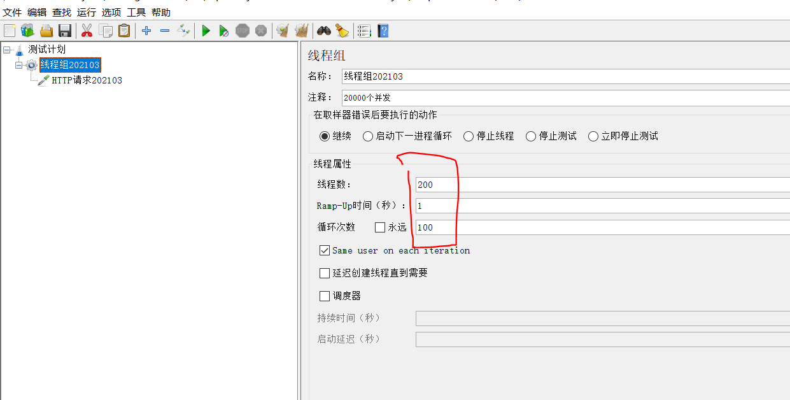
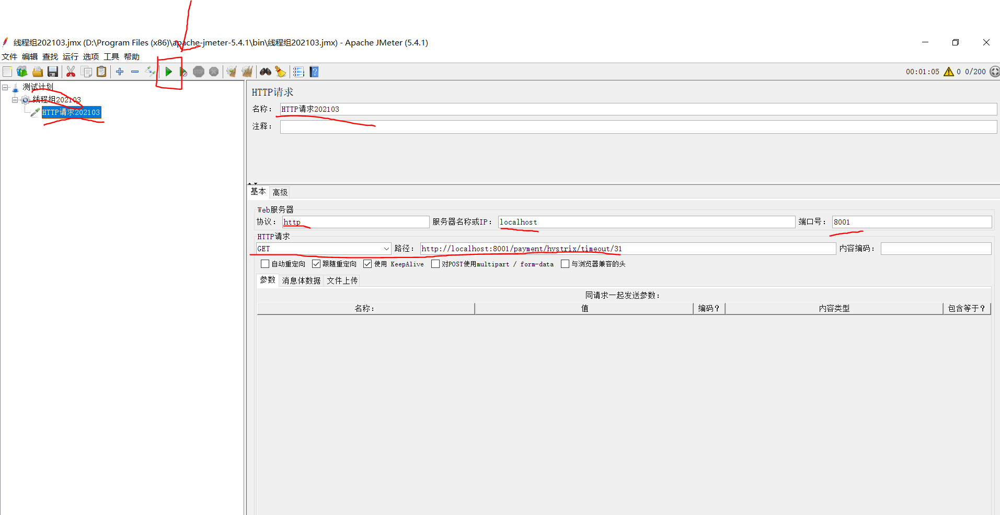
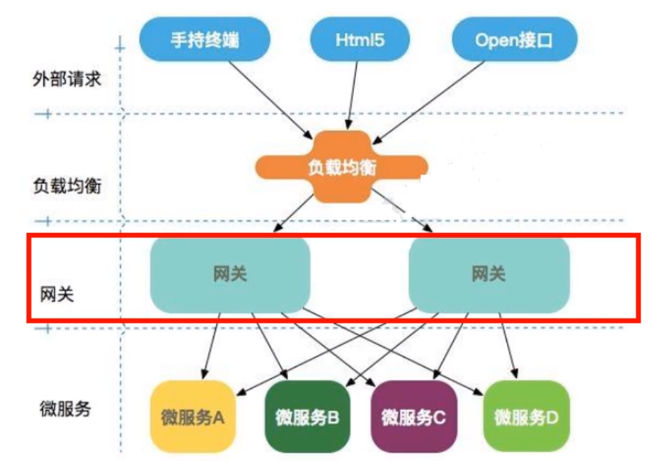

官网：https://spring.io/projects/spring-cloud

## 一、技术版本选型

1. SpringCloud Release Train Version: **2020.0.1**

2. Supported SpringBoot Version: **2.4.2**

   > 查看官方推荐的版本配置：https://start.spring.io/actuator/info

   

##  二、SpringCloud升级 

1. **服务注册中心：Eureka, Zookeeper, Consul, Alibaba Nacos**
2. **服务调用：Ribbon, Load Balancer**
3. **服务调用2：OpenFeign** 
4. **服务降级（熔断/限流）：Hystrix, Alibaba Sentinel**
5. **服务网关：gateway**
6. **服务配置：config, Alibaba Nacos**
7. **服务总线：Bus, Alibaba Nacos**


## 三、微服务模块创建的一般步骤

1. 建module
2. 改POM
3. 写YML
4. 写主启动类
5. 业务类
   - `entity`
   - `dao`: *Mapper.java
   - `mapper/*Mapper.xml`
   - `service`:  *service.java   &&   *serviceImpl.java
   - `controller`: *Controlller.java

## 四、版本

### （1）上篇 SpringBoot2.X版+SpringCloud H 版

### （2）下篇 SpringCloud Alibaba

### （3）官网查看 cloud与boot 版本对应关系

https://spring.io/projects/spring-cloud#overflow

### （4）更加详细的cloud与boot版本对应

https://start.spring.io/actuator/info


## 五、项目实践

### （1）新建父项目

1. 新建maven工程
2. 选择模板 org.apache.maven.archetypes:maven-archetypes-site
3. 选择项目字符编码setting->editor->file Encodings ->将所有字符编码全部换成 utf-8
4. 支持注解setting->Build,Execution,Deployment->Compiler->Annotation Processors 内的 Enable annotation processing 打上勾表示能够使用注解。
5. 更改编译版本setting->Build,Execution,Deployment->Compiler->Java Compiler 下 Pe-module butecode version 框内的编译版本换成 8
6. 删除src文件夹

### （2）父工程POM

**maven中的 dependencyManagement 与 dependencies** 

**dependencyManagement 父类管理** 

Maven 使用dependencyManagement元素提供依赖版本号管理的方式

**通常会在一个组织或者项目的最顶级父POM中看到dependencyManagement** 

使用dependencyManagement可以使所有子项目中引用一个依赖而不用显示列出版本号。Maven会沿父子层级向上走，直到找到dependencyManagement元素的项目 ，然后它就会使用版本号

如果某一个子项目需要另外一个版本，加上version即可。如果子项目中声明了版本号，那么使用子项目中的jar包。

dependencyManagement只是声明依赖，并不实现引入，一次子项目需要显式的声明需要用的依赖。

### （3）支付模块构建

#### > 1. cloud-provider-payment8001微服务提供者支持Moudle模块

1. 建module
   1. 新建maven工程，不使用任何模板，改jdk为1.8。
   2. 写入项目name即可。
2. 改POM
   1. 主POM内增加 moudle
   2. 子项目引入依赖
3. 写YML
4. 主启动
5. 业务类
   - `entity`
   - `dao`: *Mapper.java
   - `mapper/*Mapper.xml`
   - `service`:  *service.java   &&   *serviceImpl.java
   - `controller`: *Controlller.java

#### > 2. 热部署Devtools

1. 引入坐标依赖

   ```xml
       <!--热部署-->
       <dependency>
           <groupId>org.springframework.boot</groupId>
           <artifactId>spring-boot-devtools</artifactId>
           <scope>runtime</scope>
           <optional>true</optional>
       </dependency>
   ```

2. 添加插件到父类总工程中

   ```xml
     <build>
           <finalName>工程名字</finalName>
           <plugins>
               <plugin>
                   <groupId>org.springframework.boot</groupId>
                   <artifactId>spring-boot-maven-plugin</artifactId>
                   <configuration>
                   <fork>true</fork>
                   <addResources>true</addResources>
                   </configuration>
               </plugin>
           </plugins>
       </build>
   ```

3. 开启自动编译权限
     setting->Build,Execution,Deployment->Compiler 内复选框全部打勾
4. 开启热注册
    1. 进入子模块 ctrl shift alt /
    2. 选择 Registry
        compiler.automake.allow.when.app.running
        compiler.automake.allow.when.app.running
        这两个勾选中
    3. 重启idea

#### > 3. cloud-consumer-order80微服务消费者订单Module模块

1. 建module
    1. 新建maven工程，不使用任何模板，改jdk为1.8。
    2. 写入项目name即可。
2. 改POM
    1. 主POM内增加 moudle
    2. 子项目引入依赖
3. 写YML
4. 主启动
5. 业务类
    1. 将第一个子模块支付模块的实体类包复制过来
    2. 新建Controller类
6. 使用 RestTemplate 进行两个模块之间的调用，由消费者订单模块调用支付模块。
    1. 新建配置类，注册 RestTemplate bean
        ```java
        @Configuration
        public class ApplicationContextConfig {
            @Bean
            public RestTemplate getRestTemplate(){
                return new RestTemplate();
            }
        }
        ```


2. 写Controller方法
    ```java
    public class OrderController {
        public static final String PAYMENT_URL = "http://localhost:8001";

        @Resource
        private RestTemplate restTemplate;

        @GetMapping("/consumer/payment/create")
        public CommonResult<Payment> create(Payment payment){
            return restTemplate.postForObject(PAYMENT_URL+"/payment/create",payment,CommonResult.class);
        }

        @GetMapping("/consumer/payment/get/{id}")
        public CommonResult<Payment> getPayment(@PathVariable("id")Long id){
            return restTemplate.getForObject(PAYMENT_URL+"/payment/get/"+id,CommonResult.class);
        }
    }
    ```
3. 启动  
    1. 先启动8001
    2. 再启动 80 
    3. idea右下角弹出窗口，选择show，共同管理两个端口号
    4. 使用http://localhost/consumer/payment/get/31访问，80为默认端口号可省略不写

### （4） 工程重建

1. 问题项目中有重复部分：两个工程中有完全相同的实体类
2. 新建公共项目 cloud-api-commons 将公共有的实体类包括工具类等放到里面，所有模块都可以使用
   - 导入依赖 lombok devtools 以及 hutool 工具包
   - 将实体类包导入到项目中
3. maven clean install
   - 点击上面的闪电 跳过测试
   - 进入 maven 找到新建模块，进入 Lifecycle 先clean再  install重新安装
   - 注意观察公共模块 pom 文件中必须含有独立的 groupid 和 artifactid

## 六、服务注册中心-Eureka

### （1）Eureka基础知识

#### > 什么是服务注册

Eureka Server 作为服务注册功能的服务器，它是服务注册中心，而系统中其他微服务，使用 Eureka 的客户端连接到 Eureka Server 并维持心跳连接，这样系统维护人员就可以通过 Eureka Server来监控各个微服务是否正常运行。

在服务注册与发现中有一个注册中心，服务器启动时，会把当前自己的服务器信息比如服务地址，通信地址等注册到注册中心上，另一方（消费者）以别名的方式在注册中心上获取实际的服务器通讯地址，然后再实现本地RPC调用远程RPC。


#### > Eureka的两个组件

1. Eureka Server 提供服务注册服务
   各个微服务节点通过配置启动后，会在 EurekaServer中进行注册，这样 EurekaServer中的服务注册表中将会存储所有可用服务节点的信息。
2. EurekaClient通过注册中心进行访问
   是一个Java客户端，用于简化与 Eureka Server的交互，客户端也同时具备一个内置的，使用 轮询负载算法的负载均衡器。在应用启动后，将会向Eureka Server 发送心跳（默认周期30秒）。如果Eureka Server 在多个心跳周期内没有接收到某个节点的心跳，EurekaServer将会从服务注册表中将这个服务节点移除（默认90秒）

### （2）单机Eureka

#### > IDEA生成eurekaServer端服务注册中心，类似物业公司

1. 建Module
   cloud-eureka-server7001
2. 改pom

```xml
    <dependencies>
        <!-- eureka-server -->
        <dependency>
            <groupId>org.springframework.cloud</groupId>
            <artifactId>spring-cloud-starter-netflix-eureka-server</artifactId>
        </dependency>

        <!--引入自己定义的api通用包，可以使用Payment支付Entity-->
        <dependency>
            <groupId>org.martinhub</groupId>
            <artifactId>cloud-api-commons</artifactId>
            <version>1.0-SNAPSHOT</version>
        </dependency>

        <!--spring-boot-starter-web 和 spring-boot-starter-actuator 始终要写在一起-->
        <dependency>
            <groupId>org.springframework.boot</groupId>
            <artifactId>spring-boot-starter-web</artifactId>
        </dependency>
        <dependency>
            <groupId>org.springframework.boot</groupId>
            <artifactId>spring-boot-starter-actuator</artifactId>
        </dependency>

        <!--热部署：更改代码后，自动重启-->
        <dependency>
            <groupId>org.springframework.boot</groupId>
            <artifactId>spring-boot-devtools</artifactId>
            <scope>runtime</scope>
            <optional>true</optional>
        </dependency>

        <!--简化代码-->
        <dependency>
            <groupId>org.projectlombok</groupId>
            <artifactId>lombok</artifactId>
        </dependency>

        <!--springboot框架测试-->
        <dependency>
            <groupId>org.springframework.boot</groupId>
            <artifactId>spring-boot-starter-test</artifactId>
            <scope>test</scope>
        </dependency>

        <!--java单元测试框架-->
        <dependency>
            <groupId>junit</groupId>
            <artifactId>junit</artifactId>
        </dependency>

    </dependencies>
```

3. 写YML

```yml
# 服务端口
server:
  port: 7001

# 服务注册中心euraka
eureka:
  instance:
    hostname: localhost  #eureka服务端的实例名字
    # hostname: eureka7001.com  #eureka服务端的实例名字(#集群版)
  client:
    # false表示不向注册中心注册自己
    register-with-eureka: false
    # false表示自己就是注册中心，职责是维护服务实例，并不需要去检索服务
    fetch-registry: false
    service-url:
      # 设置与eureka server交互的地址查询服务和注册服务都需要依赖这个地址
      defaultZone: http://${eureka.instance.hostname}:${server.port}/eureka/
      # defaultZone: http://eureka7002.com:7002/eureka/  #集群版


```

4. 主启动

```java
@SpringBootApplication
// 声明自己是 eureka 的服务端
@EnableEurekaServer
public class EurekaMain7001 {
    public static void main(String[] args) {
        SpringApplication.run(EurekaMain7001.class,args);
    }
}
```

5. 测试

浏览器进入 http://localhost:7001/ 看能不能看到 eureka 的服务页面

#### > EurekaClient端cloud-provider-payment8001 

将注册进 EurekaServer 成为服务提供者 provider ，类似尚硅谷对外提供授课服务

1. 引入坐标依赖

```xml
        <!--eureka-client-->
        <dependency>
            <groupId>org.springframework.cloud</groupId>
            <artifactId>spring-cloud-starter-netflix-eureka-client</artifactId>
        </dependency>
```

2. 更改yml配置

```yml
eureka:
  client:
    #表示是否将自己注册进EurekaServer默认为true
    register-with-eureka: true
    #是否从EurekaServer抓取已有的注册信息，默认为true。单节点无所谓，集群必须设置为true才能配合ribbon使用负载均衡
    # fetch-registry: false
    service-url:
      defaultZone:  http://localhost:7001/eureka
```

3. 添加注解

8001启动类添加`@EnableEurekaClient`注解

4. 测试

进入http://localhost:7001/可以看到DS Replicas
Instances currently registered with Eureka 下的服务端口

#### > EurekaClient端 cloud-consumer-order80注册进EurekaServer成为服务注册者consumer

步骤同上


### （3）集群Eureka构建步骤

<font color='red'>微服务RPC远程服务调用最核心是什么？ 高可用，如果注册中心只有一个，出了故障就会导致整个服务环境不可用</font>

#### > 集群的目的

高可用，如果注册中心只有一个，出了故障就会导致整个服务环境不可用
**解决方法：** 搭建Eureka注册中心集群，实现负载均衡 + 故障排错。


多个 eureka serve 相互注册，保障信息共享。

#### > 搭建集群

1. 将7001模块复制
2. 粘贴后修改 pom 文件，yml文件，主启动类
3. 在主 pom 文件中的 moudles 中加入 7002 即可

#### > 集群与单机的区别

1. 修改映射文件
   找到 C:\Windows\System32\drivers\etc 下的 hosts文件添加
   127.0.0.1    eureka7001.com
   127.0.0.1    eureka7002.com

2. yml 文件 —— 相互注册

   - eureka7001:

     ```yaml
     # 服务注册中心euraka
     eureka:
       instance:
         #hostname: localhost  #eureka服务端的实例名字(单机版)
         hostname: eureka7001.com  #eureka服务端的实例名字(集群版)
       client:
         register-with-eureka: false  # false表示不向注册中心注册自己
         fetch-registry: false  # false表示自己就是注册中心，职责是维护服务实例，并不需要去检索服务
         service-url:
           # 设置与eureka server交互的地址查询服务和注册服务都需要依赖这个地址
           # defaultZone: http://${eureka.instance.hostname}:${server.port}/eureka/  #单机版
           defaultZone: http://eureka7002.com:7002/eureka/  #集群版
     ```

   - eureka7002:

     ```yaml
     # 服务注册中心euraka
     eureka:
       instance:
         #hostname: localhost  #eureka服务端的实例名字(单机版)
         hostname: eureka7002.com  #eureka服务端的实例名字(集群版)
       client:
         register-with-eureka: false  # false表示不向注册中心注册自己
         fetch-registry: false  # false表示自己就是注册中心，职责是维护服务实例，并不需要去检索服务
         service-url:
           # 设置与eureka server交互的地址查询服务和注册服务都需要依赖这个地址
           # defaultZone: http://${eureka.instance.hostname}:${server.port}/eureka/  #单机版
           defaultZone: http://eureka7001.com:7001/eureka/  #集群版
     ```

3. 测试

   访问
   http://eureka7001.com:7001/
   http://eureka7002.com:7002/
   可以看到两者相互注册

4. 问题
   三台集群如何相互守望注册

#### > 把微服务模块 payment 与 order 发布到 eureka 集群上

1. 修改两个模块的yml文件

   ```yaml
   # 服务注册中心
   eureka:
     client:
       register-with-eureka: true  # 表示是否将自己注册进 EurekaServer.默认为true
       # 是否从EurekaServer抓取已有的注册信息,默认为true.单节点无所谓,集群必须设置为true,才能配合ribbon使用负载均衡
       fetchRegistry: true   #单机需为false

       # EurekaServer地址
       service-url:
         # defaultZone: http://localhost:7001/eureka     #单机版
         defaultZone: http://eureka7001.com:7001/eureka,http://eureka7002.com:7002/eureka     #集群版
   ```

2. 测试，启动微服务
   1. 7001/7002
   2. 8001
   3. 80
   4. http://localhost/consumer/payment/get/34

#### > 支付模块微服务的集群配置

1. 复制模块8001，yml更改端口为8002

2. 更改主启动类名称8002

3. 修改 8001与8002的controller

   ```java
   // 在各个方法中调用 serverPort 查看端口号
   @Value("${server.port}")
   private String serverPort;
   ```

4. 修改 80 中controller的PAYMENT_URL

   - 在之前单机版中写死为8001，但是集群后有8001与8002，
   - 进入 http://eureka7001.com:7001/ 查看 8001 与 8002 对应的名称 application
   - 将 PAYMENT_URL 改为 http+application 名 :http://CLOUD-PAYMENT-SERVICE
   - 此时未开启负载均衡不能访问页面：将80端口下的配置类ApplicationContextConfig 下生成的 RestTemplate 的bean方法上添加注解 @LoadBalanced
   - http://localhost/consumer/payment/get/34 访问查看端口号，可以看到在8001与8002之间来回切换

#### > actuator微服务信息完善

修改主机名与暴露ip地址，方便查看某一个服务部署在哪一台服务器上。
可在http://eureka7002.com:7002/ 查看自定义主机名的变化
鼠标在主机名上方，浏览器下面会出现ip地址

```yaml
eureka
    instance:
      instance-id: payment8002  # 自定义主机名
      prefer-ip-address: true # 设置暴露ip地址
```

浏览器：

&emsp;查看8001服务的状态：http://localhost:8001/actuator/health

&emsp;查看8002服务的状态：http://localhost:8002/actuator/health

### （4）服务发现Discovery

方便对外暴露所有的微服务信息。

1. 8001 的 controller添加代码

```java
    @Resource
    private DiscoveryClient discoveryClient;

    @GetMapping(value = "/payment/discovery")  //服务发现
    public Object discovery() {
        List<String> services = discoveryClient.getServices();  //查找所有微服务
        log.info("***** services:" + Arrays.toString(services.toArray()));
        List<ServiceInstance> instances = discoveryClient.getInstances("CLOUD-PAYMENT-SERVICE");  //根据微服务名称，查看服务相关信息
        for (ServiceInstance instance : instances) {
            log.info(instance.getServiceId() + "\t" + instance.getHost() + "\t" + instance.getPort() + "\t" + instance.getUri());
        }
        return this.discoveryClient;
    }
```

2. 8001 主类添加注解 `@EnableDiscoveryClient`
3. 重启服务，观察日志

### （5）eureka自我保护

#### > 自我保护理论

1. 为什么会产生自我保护？
   为了防止 EurekaClient 可以正常运行，但是在 EurekaServer 网络不通的情况下，EurekaServer 不会立刻将 EurekaClient 服务剔除。
2. 什么是自我保护模式？
   默认情况下，EurekaServer在一定时间内没有接收到某个微服务实例的心跳，EurekaServer将会注销该实例（默认90s），但是当网络分区故障发生，微服务与 EurekaServer 之间无法正常通信，以上行为就非常危险。当EurekaServer节点在短时间内丢失过多客户端时，那么这个节点就会进入自我保护模式。

#### > 禁止自我保护

1. 将 7001 与 8001 改为单机版：修改对应 eureka 地址
2. yml文件

```yml
# 7001
eureka:
  server:
    # 关闭自我保护机制
    enable-self-preservation: false
    # 心跳时间默认90s，改为2000ms，即2s
    eviction-interval-timer-in-ms: 2000

# 8001
eureka:
  instance:
    #eureka客户端发送心跳的时间间隔，默认30s
    lease-renewal-interval-in-seconds: 1
    #eureka服务端在收到最后一次心跳等待的时间上线，默认90s
    lease-expiration-duration-in-seconds: 2
```

1. 测试
2. 访问 http://eureka7001.com:7001/ 可以看到红字THE SELF PRESERVATION MODE IS TURNED OFF. THIS MAY NOT PROTECT INSTANCE EXPIRY IN CASE OF NETWORK/OTHER PROBLEMS.代表自我保护关闭
3. 关闭8001服务可以看到在 eureka 页面两秒后 8001 服务消失


## 七、服务注册中心-Zookeeper

### （1）配置虚拟机和zookeeper

1. 虚拟机终端输入ifconfig查看 ens33 下的端口号

2. 查看主机与虚拟机之间通信是否畅通

   1. 虚拟机端口号：ifconfig查看 ens33 下的端口号
   2. 主机端口号：网络连接下的 VMnet8 的端口号
   3. 使用虚拟机ping主机，使用主机ping虚拟机确保都可以ping通

3. 解压zookeeper
   `tar -zxvf zookeeper-3.4.10.tar.gz`

4. 启动 zookeeper
   **注意此时应该修改conf里的zoo_sample.cfg名字为zoo.cfg**

   ```shell
   [root@localhost ~]# cd /usr/local/zookeeper/zookeeper-3.4.14/bin
   [root@localhost bin]# ./zkServer.sh start
   ```

### （2）新建项目

#### > pom文件

**注意：**

1. 排除zookeeper-discovery中自带的 zookeeper，同时引入与linux相同版本的 zookeeper
2. 排除引入 zookeeper 的日志，因为日志会会冲突

```xml
    <dependencies>
        <!--引入spring cloud zookeeper 依赖-->
        <dependency>
            <groupId>org.springframework.cloud</groupId>
            <artifactId>spring-cloud-starter-zookeeper-discovery</artifactId>
            <!--排除自带的zk3.5.3-->
            <exclusions>
                <exclusion>
                    <groupId>org.apache.zookeeper</groupId>
                    <artifactId>zookeeper</artifactId>
                </exclusion>
            </exclusions>
        </dependency>

        <!-- 添加zookeeper,与linux上的版本一致-->
        <dependency>
            <groupId>org.apache.zookeeper</groupId>
            <artifactId>zookeeper</artifactId>
            <version>3.4.14</version>
            <exclusions>
                <exclusion>
                    <artifactId>slf4j-log4j12</artifactId>
                    <groupId>org.slf4j</groupId>
                </exclusion>
            </exclusions>
        </dependency>

        <!--引入自己定义的api通用包： 所有实体Entity-->
        <dependency>
            <groupId>org.martinhub</groupId>
            <artifactId>cloud-api-commons</artifactId>
            <version>1.0-SNAPSHOT</version>
        </dependency>

        <!--spring-boot-starter-web 和 spring-boot-starter-actuator 始终要写在一起-->
        <dependency>
            <groupId>org.springframework.boot</groupId>
            <artifactId>spring-boot-starter-web</artifactId>
            <exclusions>
                <exclusion>
                    <groupId>org.springframework.boot</groupId>
                    <artifactId>spring-boot-starter-logging</artifactId>
                </exclusion>
            </exclusions>
        </dependency>
        <dependency>
            <groupId>org.springframework.boot</groupId>
            <artifactId>spring-boot-starter-actuator</artifactId>
        </dependency>

        <!-- 使用log4j2 -->
        <dependency>
            <groupId>org.springframework.boot</groupId>
            <artifactId>spring-boot-starter-log4j2</artifactId>
        </dependency>

        <!--热部署：更改代码后，自动重启-->
        <dependency>
            <groupId>org.springframework.boot</groupId>
            <artifactId>spring-boot-devtools</artifactId>
            <scope>runtime</scope>
            <optional>true</optional>
        </dependency>

        <!--简化代码-->
        <dependency>
            <groupId>org.projectlombok</groupId>
            <artifactId>lombok</artifactId>
            <optional>true</optional>
        </dependency>

        <!--springboot框架测试-->
        <dependency>
            <groupId>org.springframework.boot</groupId>
            <artifactId>spring-boot-starter-test</artifactId>
            <scope>test</scope>
        </dependency>
    </dependencies>
```

#### > yml 文件

```yaml
# 8004 表示注册到 zookeeper 服务器的端口号
server:
  port: 8004

# 服务别名---注册zookeeper到注册中心的名称
spring:
  application:
    name: cloud-provider-payment
  cloud:
    zookeeper:
      # ip地址为linux中的网络接口，2181为zookeeper的默认端口
      connect-string: 192.168.111.44:2181
```

#### > 主启动类

```java
package org.martinhub;

import org.springframework.boot.SpringApplication;
import org.springframework.boot.autoconfigure.SpringBootApplication;
import org.springframework.cloud.client.discovery.EnableDiscoveryClient;

/**
 * @Project：cloud2021
 * @File: PaymentMain8004
 * @IDE ：IntelliJ IDEA
 * @Author ：MartinHub
 * @Date ：2021/3/4 21:32
 */
@SpringBootApplication
@EnableDiscoveryClient //该注解用于向使用 consul 或者 zookeeper 作为注册中心时注册服务
public class PaymentMain8004 {
    public static void main(String[] args) {
        SpringApplication.run(PaymentMain8004.class,args);
    }
}
```


#### > linux测试

1. 启动端口，进入客户端

```
[root@localhost bin]# ./zkCli.sh
Connecting to localhost:2181
```

```shell
[zk: localhost:2181(CONNECTED) 3] ls /services
[cloud-provider-payment]
```

能看到服务名即为配置成功

#### > 测试2

1. http://localhost:8004/payment/zk
   可以看到信息
2. linux 

```
# 获取服务名
[zk: localhost:2181(CONNECTED) 0] ls /services
[cloud-provider-payment]
# 获取流水号
[zk: localhost:2181(CONNECTED) 1] ls /services/cloud-provider-payment
[efc76371-522d-4d5d-8f56-f8fe4deb7a47]
# 获取详细信息
[zk: localhost:2181(CONNECTED) 2] get /services/cloud-provider-payment/efc76371-522d-4d5d-8f56-f8fe4deb7a47
{"name":"cloud-provider-payment","id":"efc76371-522d-4d5d-8f56-f8fe4deb7a47","address":"WINDOWS-N0GUAG7","port":8004,"sslPort":null,"payload":{"@class":"org.springframework.cloud.zookeeper.discovery.ZookeeperInstance","id":"application-1","name":"cloud-provider-payment","metadata":{}},"registrationTimeUTC":1590232919360,"serviceType":"DYNAMIC","uriSpec":{"parts":[{"value":"scheme","variable":true},{"value":"://","variable":false},{"value":"address","variable":true},{"value":":","variable":false},{"value":"port","variable":true}]}}
```

### （3）服务节点是临时还是持久

关闭8004后在linux终端中,一段时间后失去连接

```
[zk: localhost:2181(CONNECTED) 18] ls /services/cloud-provider-payment
[efc76371-522d-4d5d-8f56-f8fe4deb7a47]
[zk: localhost:2181(CONNECTED) 19] ls /services/cloud-provider-payment
[efc76371-522d-4d5d-8f56-f8fe4deb7a47]
[zk: localhost:2181(CONNECTED) 20] ls /services/cloud-provider-payment
[efc76371-522d-4d5d-8f56-f8fe4deb7a47]
[zk: localhost:2181(CONNECTED) 21] ls /services/cloud-provider-payment
[]
[zk: localhost:2181(CONNECTED) 22] 
```

再开启8004，再次查看流水号可以发现流水号跟之前的不一样 ，所以**服务节点是临时的** ，在关闭服务后完全删除。

### （4）订单服务入住zookeeper

1. 新建订单 moudle：`cloud-consumerzk-order80`
2. 改pom
3. 建yml

```yml
server:
  port: 80
spring:
  application:
    name: cloud-consumerzk-order80
  cloud:
    zookeeper:
      connect-string: 192.168.150.66:2181
```

4. 写主类
5. 配置类生成 RestTemplate
6. Controller 调用 8004
7. linux 输入，查看节点是否注册上

```
[zk: localhost:2181(CONNECTED) 1] ls /services
[cloud-provider-payment, cloud-consumerzk-order80]
```

1. 网址登陆查看
   http://localhost:8004/payment/zk
   http://localhost/consumer/payment/zk

### （5）存在问题

zookeeper集群?????????


## 八、服务注册中心-Consul

### （1）简介

#### > 是什么？

https://www.consul.io/intro
Consul是一种服务网格解决方案，提供具有**服务发现，配置**和分段功能的全功能控制平面。这些功能中的每一个都可以根据需要单独使用，也可以一起使用以构建完整的服务网格。Consul需要一个数据平面，并支持代理和本机集成模型。Consul附带了一个简单的内置代理，因此一切都可以直接使用，还支持Envoy等第三方代理集成。

#### > 能做什么？

- 服务发现：Consul的客户端可以注册服务，例如 api或mysql，其他客户端可以使用Consul来发现给定服务的提供者。使用DNS或HTTP，应用程序可以轻松找到它们依赖的服务。
- 运行状况检查：领事客户端可以提供任何数量的运行状况检查，这些检查可以与给定服务（“ Web服务器返回200 OK”）或与本地节点（“内存利用率低于90％”）相关联。操作员可以使用此信息来监视群集的运行状况，服务发现组件可以使用此信息将流量路由到运行状况不佳的主机之外。
- KV商店：应用程序可以将Consul的分层键/值存储用于多种目的，包括动态配置，功能标记，协调，领导者选举等。简单的HTTP API使其易于使用。
- 安全的服务通信：领事可以为服务生成并分发TLS证书，以建立相互TLS连接。 意图 可用于定义允许哪些服务进行通信。可以使用可以实时更改的意图轻松管理服务分段，而不必使用复杂的网络拓扑和静态防火墙规则。
- 多数据中心：Consul开箱即用地支持多个数据中心。这意味着Consul的用户不必担心会构建其他抽象层以扩展到多个区域。

#### > 去哪下？

https://www.consul.io/downloads

#### > 怎么玩？

https://www.springcloud.cc/spring-cloud-consul.html

### （2）安装启动

1. 将下载的exe文件双击即可安装
2. 在 exe ==文件的目录==下打开黑窗口
3. 输入 consul --version 检测是否安装成功
4. 启动服务：consul agent -dev
5. 通过 http://localhost:8500/ 访问web界面

### （3）服务提供者

1. 建moudle: `cloud-providerconsul-payment8006`
2. 改pom

```xml
    <dependency>
        <groupId>org.springframework.cloud</groupId>
        <artifactId>spring-cloud-starter-consul-discovery</artifactId>
    </dependency>
```

3. 建yml

```yml
server:
  port: 8006
spring:
  application:
    name: cloud-provider-payment
  cloud:
    consul:
      host: localhost
      port: 8500
      discovery:
        service-name: ${spring.application.name}
```

4. 建启动类
5. 建controller类
6. 测试
   http://localhost:8006/payment/consul
   http://localhost:8500/ui/dc1/services

### （4）服务消费者

1. 建module: cloud-consumerconsul-order80
2. 改pom

```xml
    <dependency>
        <groupId>org.springframework.cloud</groupId>
        <artifactId>spring-cloud-starter-consul-discovery</artifactId>
    </dependency>
```

3. 建yml

```yml
server:
  port: 80
spring:
  application:
    name: cloud-consumer-order
  cloud:
    consul:
      host: localhost
      port: 8500
      discovery:
        service-name: ${spring.application.name}
```

4. 建启动类
5. 建controller、config
6. 测试
   http://localhost/consumer/payment/cs
   http://localhost:8006/payment/consul

### （5）三个注册中心 eureka zookeeper consul的异同点


### （6）CAP

C: Cosistency（强一致性）
A: Availability（可用性）
P: Partition tolerance（分区容错性）
CAP理论关注粒度是数据，而不是整体系统设计的


## 九、服务调用-Ribbon

### （1）概述

#### > 是什么？

Spring Cloud Ribbon 是基于 Netflix Ribbon 实现的一套**客户端负载均衡的工具**。
简单的说，Ribbonn是Netflix的开源项目，主要功能是提供**客户端的软件负载均衡算法和服务调用。**Ribbon客户端组件提供一系列完善的配置项，如连接超时，重试等。就是在配置文件中列出 LoadBalancer后面所有机器，Ribbon会自动帮助你基于某种规则 (如简单轮询，随机连接等)去连接这些机器。我们很容易使用Ribbon实现自定义的负载均衡算法。

#### > 官网资料，停更

https://github.com/Netflix/ribbon

#### > 能干什么？

1. **负载均衡**
   - 负载均衡(Load Balance)是什么
     将用户的请求平摊的分配到多个服务上，从而达到HA(高可用)，常见的负载均衡有 Nginx,LVS,硬件 F5等。
   - Ribbon 本地负载均衡客户端 VS Nginx 服务端负载均衡
     Nginx 是服务器 负载均衡，客户端所有请求都会交给 nginx，然后由 nginx实现请求转发。即负载均衡是由服务端实现的。
     Ribbon 是本地负载均衡，在微服务调用接口时，在注册中心上获取注册信息服务列表 之后缓存在JVM本地，从而实现本地RPC远程服务调用技术。
2. **实现** 
   负载均衡 + RestTemplate 调用


- Ribbon工作时有两步
  1. 第一步先选择 EurekaServer，优先选择统一区域负载较少的 server
  2. 第二步再根据用户指定的策略，从server取到的服务注册列表中选择一个地址。其中 Riibon 提供了多种策略（轮询，随机，根据响应时间加权）。

### （2）引入依赖

不需要
`spring-cloud-starter-netflix-eureka-client` 已经引入了 Ribbon-Balance的依赖

### （3）RestTemplate 使用

1. `getForObject` 返回json
2. `getForEntity` 返回ResponseEnity对象，包括响应头，响应体等信息。
3. `postForObject`
   与 get 方法一样，不同的是传进去的参数是对象
4. `postForEntity`
5. GET 请求方法
6. POST请求方法

### （4）Ribbon 自带的负载均衡

#### > 核心组件 IRule

**IRule默认自带的负载规则** 

1. RoundRobinRule   轮询
2. RandomRule   随机
3. RetryRule    先按照RoundRobinRule的 策略获取服务，如果获取服务失败则在指定时间里进行重试，获取可用服务
4. WeightedResponseTimeRule 对RoundRobinRule的扩展，响应速度越快，实例选择权重越大 ，越容易被选择
5. BestAvailableRule    会先过滤掉由于多次访问故障而处于断路器 跳闸状态的服务，然后选择一个并发一个最小的服务
6. BestAvaibilityFilteringRule  先过滤掉故障实例，再选择并发量较小的实例
7. ZoneAvoidanceRule    默认规则，符合server所在区域的性能和server的可用性选择服务器

**如何替换** 

1. 注意：IRule配置类不能放在`@ComponentSan` 的包及子包下，因为默认的扫描会变成全局负载均衡都按照这样的规则。

2. 新建包 org.loadbalance.myRule

3. 新建类 

   ```java
   public class MySelfRule {
       @Bean
       public IRule myRule(){
           return new RandomRule();//定义为随机
       }
   }
   ```

4. 主类添加注解

```java
// 选择要接收的服务和配置类
@RibbonClient(name = "CLOUD-PAYMENT-SERVICE",configuration = MySelfRule.class)
```

#### > 默认负载均衡轮回算法原理

**负载均衡算法** 

rest 接口 第几次请求数 % 服务器集群=实际调用服务器位置下标，每次服务重启后rest接口计数从1开始

总台数：2台

请求数  调用下标
1       1%2=1       
2       2%2=0
3       3%2=1
4       4%2=0

**RoundRobinRule源码分析**

**手写轮回算法** 


## 十、服务调用-Openfeign(注解式调用)

<font color='red'> 微服务接口 + 注解(`@FeignClient`) ---- 消费端即可实现服务调用。</font>

### （1）是什么

Feign是声明性Web服务客户端。它使编写Web服务客户端更加容易。要使用Feign，请创建一个接口并对其进行注释。它具有可插入的注释支持，包括Feign注释和JAX-RS注释。Feign还支持可插拔编码器和解码器。Spring Cloud添加了对Spring MVC注释的支持，并支持使用HttpMessageConvertersSpring Web中默认使用的注释。Spring Cloud集成了Ribbon和Eureka以及Spring Cloud LoadBalancer，以在使用Feign时提供负载平衡的http客户端。

### （2）能干什么

- 使编写Java Http客户端更加容易
  使用 RestTemplate + Ribbon 时，利用 RestTemplate 对http 请求的封装处理，形成一套模板化的调用方法，但是在实际中，由于对服务的调用可能不止一处，往往一个接口会被多处调用，所以通常都会针对每个微服务自行封装一些客户端类来包装这些依赖服务的调用。所以Feign在此基础上做了进一步封装，由他来帮助我们定义和实现服务接口的定义。在**Feign的实现下我们只需要创建一个接口并使用注解来配置它(以前是Dao接口上标注Mapper注解，现在是一个微服务接口上面标注一个Feign注解即可)**。自动封装服务调用客户端的开发量。
- Feign集成了Ribbon
  利用Ribbon维护了Payment的服务列表信息，并且实现了轮询实现客户端的负载均衡。而与Ribbon不同的是，**feign只需要定义服务绑定接口且以声明式的方法**，优雅而简单的实现服务调用。
- Feign与OpenFeign区别
  

### （3）官网

https://cloud.spring.io/spring-cloud-openfeign/2.2.x/reference/html/

### （4）实践

1. 建项目：`cloud-consumer-feign-order80`

2. 改pom

   ```pom
   <!-- 引入 spring-cloud-openfeign 依赖-->
   <dependency>
     <groupId>org.springframework.cloud</groupId>
     <artifactId>spring-cloud-starter-openfeign</artifactId>
   </dependency>
   ```

3. 建yml

   ```yaml
   # 服务端口
   server:
     port: 80

   spring:
     # 应用名称
     application:
       name: cloud-order-openfeign-service

   # 服务注册中心
   eureka:
     client:
       register-with-eureka: false  # 表示是否将自己注册进 EurekaServer.默认为true
       # 是否从EurekaServer抓取已有的注册信息,默认为true.单节点无所谓,集群必须设置为true,才能配合ribbon使用负载均衡
       fetchRegistry: true   # 单机需为false
       # EurekaServer地址
       service-url:
         # defaultZone: http://localhost:7001/eureka     #单机版
         defaultZone: http://eureka7001.com:7001/eureka,http://eureka7002.com:7002/eureka     #集群版
   ```

4. 写启动类

```java
@SpringBootApplication
@EnableFeignClients  //开启openfeign支持
public class OrderFeignMain80 {
    public static void main(String[] args) {
        SpringApplication.run(OrderFeignMain80.class,args);
    }
}
```

5. 写业务类

```java
@Component
// 将业务提供者的名写进去
@FeignClient(value = "CLOUD-PAYMENT-SERVICE")
public interface PaymentFeignService {

// 将业务提供者的controller路径和方法复制粘贴进来
    @GetMapping("/payment/get/{id}")
    public CommonResult getPaymentById(@PathVariable("id")Long id);
}
```

6. controller

```java
    @Resource
    private PaymentFeignService paymentFeignService;    
	
	@GetMapping("/consumer/payment/get/{id}")
    public CommonResult<Payment> getPaymentById(@PathVariable Long id){
        return paymentFeignService.getPaymentById(id);
    }
```

### （5）超时控制

1. 8001 暂停

2. 通过 8001访问
   http://localhost:8001/payment/feign/timeout  (此接口设置3秒后响应)
   可以访问

3. 通过80 访问
   异常

4. 原因：OpenFeign 默认等待时间 1s

5. 设置超时时间

   yml:

   ```yaml
   #设置feign客户端超时时间（OpenFeign集成了Ribbon，超时由ribbon控制）
   ribbon:
     #指的是建立连接后从服务器读取到可用资源所用的时间
     ReadTimeout:  5000
     #指的是建立连接所用的时间，适用于网络正常的情况下，两端连接所用的时间
     ConnectTimeout: 5000
   ```

6. 测试

### （6）日志增强

#### > 日志级别

1. NONE：默认不显示日志
2. BASIC：仅记录请求方法，URL，响应状态及执行时间
3. HEADERS：除了BASIC中定义的信息之外，还有请求和响应的头信息
4. FULL：除了HEADERS中定义的信息外，还有请求和响应的正文及元数据

#### > 配置类

```java
import feign.Logger;

@Configuration
public class FeignConfig {
    @Bean
    Logger.Level feignLoggerLevel(){
        return Logger.Level.FULL;
    }
}
```

#### > 选择日志监听接口

```yml
logging:
  level: 
    # 选择具体接口的日志输出 级别为debug
    org.martinhub.service.PaymentFeignService: debug
```


##  十一、服务降级/熔断/限流-Hystrix

### （1）简介

#### > 分布式系统面临的问题

复杂分布式系统中的应用程序有数十个依赖关系，每个依赖关系在某些时候不可避免的失败。

多个微服务之间调用时，假设 A 调B和C，B和C又调其他微服务，就是所谓的扇出。当扇出的链路上某个微服务响应时间过长或不可用对A的调用就会占用越来越多的资源，进而引起系统崩溃 ，所谓的**雪崩效应**。

#### > 是什么

Hystrix 是处理分布式系统的延迟和容错的开源库，保证一个依赖出现问题时不会导致整体服务失败，避免级联故障，以提高分布式系统弹性。
断路器本身是一种开关装置，当某个服务单元发生故障后，通过断路器的故障监控，向调用方返回一个符合预期的可处理的备选响应，而不是长时间的等待或抛出调用方法无法处理的异常 。

#### > 官网资料

https://github.com/Netflix/Hystrix
<font color='red'>停更</font>

### （2）Hystrix重要概念

#### > 服务降级

1. 服务器忙，请稍后重试，不让客户端等待并立即返回一个友好的提示。
2. 哪些情况会导致服务降级
   1. 程序运行异常
   2. 超时
   3. 服务熔断触发服务降级
   4. 线程池/信号量打满

#### > 服务熔断

1. 类比保险丝达到最大服务访问时，直接拒绝访问，拉闸限电，然后调用服务降级的方法返回友好提示。
2. 服务降级->进而熔断->恢复调用链路

#### > 服务限流

1. 秒杀高并发等操作，严禁一窝蜂过来拥挤，一秒N个有序进行。

### （3）实践

#### > 准备

将注册中心7001换成单机版

#### > 构建

1. **新建moudle**

   `cloud-provider-hystrix-payment8001`

2. **pom**

```xml
<dependency>
    <groupId>org.springframework.cloud</groupId>
    <artifactId>spring-cloud-starter-netflix-hystrix</artifactId>
</dependency>
```

3. **yml**

```yml
server:
  port: 8001
spring:
  application:
    name: cloud-provider-hystrix-payment

eureka:
  client:
    register-with-eureka: true
    fetch-registry: true
    service-url:
      defauleZone:  http://eureka7001.com:7001/eureka
```

4. **主启动**

   ```java
   import org.springframework.boot.SpringApplication;
   import org.springframework.boot.autoconfigure.SpringBootApplication;
   import org.springframework.cloud.netflix.eureka.EnableEurekaClient;

   /**
    * @Project：cloud2021
    * @File: PaymentHystrixMain8001
    * @IDE ：IntelliJ IDEA
    * @Author ：MartinHub
    * @Date ：2021/3/5 16:22
    */
   @SpringBootApplication
   @EnableEurekaClient
   public class PaymentHystrixMain8001 {
       public static void main(String[] args) {
           SpringApplication.run(PaymentHystrixMain8001.class, args);
       }
   }

   ```

5. **业务类**

​    service:

```java
@Service
public class PaymentHystrixServiceImpl implements PaymentHystrixService {

    //成功
    @Override
    public String paymentInfo_OK(Integer id) {
        return "线程池：" + Thread.currentThread().getName() + "   paymentInfo_OK,id：  " + id + "\t" + "哈哈哈";
    }
  
    @Override
    public String paymentInfo_TimeOut(Integer id) {
        int timeNumber = 3;
        try {
            TimeUnit.SECONDS.sleep(timeNumber);
        } catch (Exception e) {
            e.printStackTrace();
        }
        //int age = 10/0;
        return "线程池：" + Thread.currentThread().getName() + "   paymentInfo_TimeOut,id：  " + id + "\t" + "O(∩_∩)O哈哈~" + " 耗时(秒):" + timeNumber;
    }
}
```

​    controller:

```java
import lombok.extern.slf4j.Slf4j;
import org.martinhub.service.impl.PaymentHystrixServiceImpl;
import org.springframework.beans.factory.annotation.Value;
import org.springframework.web.bind.annotation.GetMapping;
import org.springframework.web.bind.annotation.PathVariable;
import org.springframework.web.bind.annotation.RestController;

import javax.annotation.Resource;

/**
 * @Project：cloud2021
 * @File: PaymentHystrixController
 * @IDE ：IntelliJ IDEA
 * @Author ：MartinHub
 * @Date ：2021/3/6 12:01
 */
@RestController
@Slf4j
public class PaymentHystrixController {
    @Resource
    private PaymentHystrixServiceImpl paymentHystrixService;

    @Value("${server.port}")
    private String serverPort;

    @GetMapping("/payment/hystrix/ok/{id}")
    public String paymentInfo_OK(@PathVariable("id") Integer id){
        String result = paymentHystrixService.paymentInfo_OK(id);
        log.info("*******result:"+result);
        return result;
    }

    @GetMapping("/payment/hystrix/timeout/{id}")
    public String paymentInfo_TimeOut(@PathVariable("id") Integer id){
        String result = paymentHystrixService.paymentInfo_TimeOut(id);
        log.info("*******result:"+result);
        return result;
    }
}
```

4. **测试**
   先启动7001，在启动8001测试两个方法，全部正常

#### > 使用Jmeter模拟高并发

Jmeter配置高并发：





高并发打到http://localhost:8001/payment/hystrix/timeout/1上

**使用后** 

http://localhost:8001/ok/1 也有延迟
上述还是8001单独测试，如果外部消费者80也来访问，那么消费者只能干等，最终导致消费端80不满意，服务端8001直接被拖死。

**加入消费者80**

(促使高并发环境下情况更加恶化。)

1. 建moudle: `cloud-consumer-feign-hystrix-order80`
2. pom
3. yml
4. 主启动类
5. service
6. controller
7. 测试
   1. 正常情况下
      1. http://localhost:8001/payment/hystrix/ok/31
      2. http://localhost:8001/payment/hystrix/timeout/31
      3. http://localhost/comsumer/payment/hystrix/ok/31 通过80 访问的非常快
   2. 高并发打到8001端口时, 80端口也会非常慢

**如何解决** 

1. 超时导致服务器变慢（转圈）-> 超时不再等待
2. 出错（宕机或程序运行时出错）-> 出错要有兜底
3. 解决
   1. 服务 8001 超时，调用者 80 不能一直等待，必须有服务降级
   2. 服务 8001 宕机，调用者 80 不能一直等待，必须有服务降级
   3. 服务 8001 OK ，调用者自己出故障或有自我要求（自己的等待时间小于服务提供的时间。），自己降级处理

### （4）服务降级fallback

#### > 微服务运行超时情况：8001

service

```java
@Service
public class PaymentHystrixServiceImpl implements PaymentHystrixService {

    //成功
    @Override
    public String paymentInfo_OK(Integer id) {
        return "线程池：" + Thread.currentThread().getName() + "   paymentInfo_OK,id：  " + id + "\t" + "哈哈哈";
    }

    @Override
  	//降级配置：@HystrixCommand
  		// fallbackMethod: 备选方法
    @HystrixCommand(fallbackMethod = "paymentInfo_TimeOutHandler",commandProperties = {
            @HystrixProperty(name = "execution.isolation.thread.timeoutInMilliseconds",value = "4000")  //峰值为4，4秒钟以内就执行正常的业务逻辑,反之执行降级方法
    })
    public String paymentInfo_TimeOut(Integer id) {
        int timeNumber = 3;
        try {
            TimeUnit.SECONDS.sleep(timeNumber);
        } catch (Exception e) {
            e.printStackTrace();
        }
        //int age = 10/0;
        return "线程池：" + Thread.currentThread().getName() + "   paymentInfo_TimeOut,id：  " + id + "\t" + "O(∩_∩)O哈哈~" + " 耗时(秒):" + timeNumber;
    }

    //服务降级方法
    // 方法签名(参数+返回值)需要跟原方法一致,方法名不同即可
    public String paymentInfo_TimeOutHandler(Integer id){
        return "线程池："+Thread.currentThread().getName()+"   系统繁忙, 请稍候再试  ,id：  "+id+"\t"+"哭了哇呜";
    }
}
```

main

```java
//要在SpringCloud中使用断路器,需要此配置
@EnableCircuitBreaker
```

#### >  微服务运行异常情况：8001

service

```java
    @HystrixCommand(fallbackMethod = "paymentInfo_TimeoutHandler",commandProperties = {
            @HystrixProperty(name="execution.isolation.thread.timeoutInMilliseconds",value = "3000")
    })
    public String paymentInfo_Timeout(Integer id){
        int a = 10/0;
//        try {
//            TimeUnit.SECONDS.sleep(5);
//        } catch (InterruptedException e) {
//            e.printStackTrace();
//        }
        return "线程池："+Thread.currentThread().getName()+"Timeout"+id;
    }
```

无论是运行异常还是超时都有兜底策略

#### > 消费者服务异常情况：80

先去掉8001的超时和异常，保证8001正常。

**服务降级处理，既可以配在客户端也可以配在服务端，一般建议放在客户端**

1. yml

```yml
feign:
  hystrix:
    enabled: true  #如果处理自身的容错就开启。开启方式与生产端不一样
```

2. 主类

   添加 `@EnableHystrix` 注解

3. 业务类

4. 注意：降级处理方法参数列表必须跟异常方法一样

   ​

#### > 全面服务降级

**存在问题**

1. 每一个方法都需要配置一个降级方法 —— 导致： 代码膨胀
2. 和业务代码在一起 -  麻烦，凌乱

**解决** 

1. 第一个问题： 定义全局降级方法
   controller

   ```java
   @RestController
   @Slf4j
   @DefaultProperties(defaultFallback = "globTimeOutFallbackMethod")  //定义全局降级方法
   public class OrderHystrixController {

       @Resource
       private PaymentHystrixService paymentHystrixService;

       @GetMapping("/consumer/payment/hystrix/ok/{id}")
       @HystrixCommand  //没有特别指明降级处理方法，就使用这个注解就好，会自动使用全局降级方法
       public String paymentInfo_OK(@PathVariable("id") Integer id) {
           System.out.println("id = " + id);
           String result = paymentHystrixService.paymentInfo_OK(id);
           log.info("*******result:" + result);
           return result;
       }

       @GetMapping("/consumer/payment/hystrix/timeout/{id}")
       @HystrixCommand(fallbackMethod = "paymentTimeOutFallbackMethod", commandProperties = {
               @HystrixProperty(name = "execution.isolation.thread.timeoutInMilliseconds", value = "4000")  //4秒钟以内就是正常的业务逻辑
       })
       public String paymentInfo_TimeOut(@PathVariable("id") Integer id) {
           System.out.println("id = " + id);
           String result = paymentHystrixService.paymentInfo_TimeOut(id);
           log.info("*******result:" + result);
           return result;
       }

       //兜底方法
       public String paymentTimeOutFallbackMethod(@PathVariable("id") Integer id) {
           return "我是消费者80，对付支付系统繁忙请10秒钟后再试或者自己运行出错请检查自己,(┬＿┬)";
       }

       public String globTimeOutFallbackMethod() {
           return "服务器繁忙，请稍后重试";
       }

   }

   ```

2. 第二个问题： 业务代码与降级代码分离

   1. 找到注解 @FeignClient 对应的服务接口

      ```java
      @Component
      @FeignClient(value = "CLOUD-PROVIDER-HYSTRIX-PAYMENT",
              fallback = PaymentHystrixFallbackService.class)   //服务调用、 服务降低配置
      public interface PaymentHystrixService {
          @GetMapping("/payment/hystrix/ok/{id}")
          String paymentInfo_OK(@PathVariable("id") Integer id);

          @GetMapping("/payment/hystrix/timeout/{id}")
          String paymentInfo_TimeOut(@PathVariable("id") Integer id);

      }
      ```

   2. 再写一个类实现该接口，对降级方法进行处理

      ```java
      @Component
      public class PaymentHystrixFallbackService implements PaymentHystrixService {
          @Override
          public String paymentInfo_OK(Integer id) {
              // 服务降级处理
              return "-----PaymentFallbackService fall back-paymentInfo_OK , (┬＿┬)";
          }

          @Override
          public String paymentInfo_TimeOut(Integer id) {
              //服务降级处理
              return "-----PaymentFallbackService fall back-paymentInfo_TimeOut , (┬＿┬)";
          }

      }

      ```

   3. 测试在 8001 内加异常，或使 8001 宕机 ，返回异常处理

### （5）服务熔断

#### > 简介

类比保险丝，达到最大访问后直接拒绝访问，拉闸限电，然后调用服务降级。当检测**到该节点微服务调用正常后，恢复调用链路。**
当失败的调用达到一定阈值，缺省是5s内20次调用失败，就会启动熔断机制。熔断机制的注解是，`@HystrixCommand`

#### > 是什么

https://martinfowler.com/bliki/CircuitBreaker.html

#### > 实践：8001

1. **service**

```java
    @HystrixCommand(fallbackMethod = "paymentCircuitBreaker_fallback",commandProperties = {
            @HystrixProperty(name = "circuitBreaker.enabled",value = "true"),  //是否开启断路器
            @HystrixProperty(name = "circuitBreaker.requestVolumeThreshold",value = "10"),   //请求次数
            @HystrixProperty(name = "circuitBreaker.sleepWindowInMilliseconds",value = "10000"),  //时间范围
            @HystrixProperty(name = "circuitBreaker.errorThresholdPercentage",value = "60"), //失败率达到多少后跳闸，此处为60%
                //（上面配置意思是：10秒钟内，10次请求，失败率60%就不让用了）
            // 这些参数的配置，在 HystrixCommandProperties.java 类中
    })
    public String paymentCircuitBreaker(Integer id){
        if (id < 0){
            throw new RuntimeException("*****id 不能负数");
        }
        String serialNumber = IdUtil.simpleUUID();

        return Thread.currentThread().getName()+"\t"+"调用成功,流水号："+serialNumber;
    }

    public String paymentCircuitBreaker_fallback(Integer id){
        return "id 不能负数，请稍候再试,(┬＿┬)/~~     id: " +id;
    }
```

2. **controller**

```java
    // 服务熔断
    @GetMapping("/payment/circuit/{id}")
    public String paymentCircuitBreaker(@PathVariable("id") Integer id){
        String result = paymentHystrixService.paymentCircuitBreaker(id);
        log.info("*******result:"+result);
        return result;
    }
```

3. **结果**

一直输入id为负数，达到失败率后即使输入id为正数也进入错误页面。

### （6）总结

#### > 熔断类型

1. **熔断打开**
   请求不再进行调用当前服务，内部设有时钟一般为 MTTR，当打开时长达时钟则进入半熔断状态
2. **熔断关闭**
   熔断关闭不会对服务进行熔断
3. **熔断半开**
   根据规则调用当前服务，符合规则恢复正常，关闭熔断

#### > 什么时候打开

设计三个参数：时间窗，请求总阈值，错误百分比阈值

1. 快照时间窗：默认为最近的10s
2. 请求总数阈值：必须满足请求总阈值才有资格熔断。默认为20。意味着在10s内，如果命令调用次数不足20次，即使所有请求都超时或其他原因失败断路器都不会打开
3. 错误百分比阈值：在快照时间窗内请求总数超过阈值，且错误次数占总请求次数的比值大于阈值，断路器将会打开

#### > 断路器配置ALL


### （7）web界面图形化展示Dashboard

#### > 搭建

1. **建 moudle**
   `cloud-consumer-hystrix-dashboard9001`
2. **pom**

```xml
<dependency>
    <groupId>org.springframework.cloud</groupId>
    <artifactId>spring-cloud-starter-netflix-hystrix-dashboard</artifactId>
</dependency>
```

3. **yml**

只需要配置端口号就行

4. **启动类**

加注解@EnableHystrixDashboard

5. **测试**

http://localhost:9001/hystrix有页面即为成功

#### > 使用

**注意**

1. 注意：依赖于actuator，要监控哪个接口，哪个接口必须有这个依赖
2. 业务模块需要添加bean

```java
    @Bean
    public ServletRegistrationBean getServlet(){
        HystrixMetricsStreamServlet streamServlet = new HystrixMetricsStreamServlet();
        ServletRegistrationBean registrationBean = new ServletRegistrationBean(streamServlet);
        registrationBean.setLoadOnStartup(1);
        registrationBean.addUrlMappings("/hystrix.stream");
        registrationBean.setName("HystrixMetricsStreamServlet");
        return registrationBean;
    }
```

**使用**


1. 进行8001 的访问查看对应页面变化
2. 页面状态
   1. 七色
      对应不同状态
   2. 一圈
      对应访问量
   3. 一线
      访问趋势

## 十二、服务网关-Gateway

### （1）概述

#### > 官网

https://cloud.spring.io/spring-cloud-static/spring-cloud-gateway/2.2.2.RELEASE/reference/html/

#### > 结构




#### > 三大核心概念

1. Route（路由）
   网关的基本构建块。它由ID，目标URI，谓词集合和过滤器集合定义。如果断言为true，则匹配路由。
2. Predicate（断言）
   这是Java 8 Function谓词。输入类型是Spring FrameworkServerWebExchange。这使您可以匹配HTTP请求中的所有内容，例如标头或参数。
3. Filter（过滤器）
   这些是使用特定工厂构造的Spring FrameworkGatewayFilter实例。在这里，您可以在发送下游请求之前或之后修改请求和响应。

#### > 工作流程


客户端向Spring Cloud Gateway发出请求。如果网关处理程序映射确定请求与路由匹配，则将其发送到网关Web处理程序。该处理程序通过特定于请求的过滤器链来运行请求。筛选器由虚线分隔的原因是，筛选器可以在发送代理请求之前和之后运行逻辑。所有“前置”过滤器逻辑均被执行。然后发出代理请求。发出代理请求后，将运行“后”过滤器逻辑。

### （2）实践

#### > 建模块:cloud-gateway-gateway9527

1. pom

```xml
<dependency>
    <groupId>org.springframework.cloud</groupId>
    <artifactId>spring-cloud-starter-gateway</artifactId>
</dependency>
<!-- 注意不要添加 web的依赖，与gateway里的web flux冲突 -->
```

1. yml

```yml
server:
  port: 9527
spring:
  application:
    name: cloud-gateway
eureka:
  instance:
    hostname: cloud-gateway-service
  client:
    service-url:
       register-with-eureka:  true
       fetch-registry:  true
       defaultZone: http://eureka7001.com:7001/eureka
```

1. 启动类

```java
@SpringBootApplication
@EnableEurekaClient
@EnableDiscoveryClient
```

#### > 测试

1. 9527中配置路由

```yml
spring:
  application:
    name: cloud-gateway
  cloud:
    gateway:
      routes: # 可以配置多个路由
        - id: payment_routh # 路由id，没有固定规则但要求唯一
          uri:  http://localhost:8001 # 匹配后提供服务的路由地址
          predicates:
            - Path=/payment/get/** # 路径相匹配的进行路由

        - id: payment_routh2 # 路由id，没有
          uri:  http://localhost:8001 # 匹配后提供服务的路由地址
          predicates:
            - Path=/payment/payment # 路径相匹配的进行路由
```

1. 配置后可以通过以下路径访问8001中的信息
   http://localhost:9527/payment/get/31
   不再暴露8001的端口
2. 配置路由的另一种方法，9527注入 RouteLocator的Bean

```java
@Configuration
public class GateWayConfig {
    @Bean
    public RouteLocator routeLocator(RouteLocatorBuilder routeLocatorBuilder){
        RouteLocatorBuilder.Builder  routes = routeLocatorBuilder.routes();

        /*
        * 代表访问http://localhost:9527/guonei
        * 跳转到http://news.baidu.com/guonei
        * */
        routes.route("route1",
                r->r.path("/guonei")
                .uri("http://news.baidu.com/guonei")).build();
        return routes.build();
    }
}
```

### （3）动态路由

1. 9527yml

```yml
server:
  port: 9527
spring:
  application:
    name: cloud-gateway
  cloud:
    gateway:
      discovery:
        locator:
          enabled: true # 1.开启从服务在注册中心动态创建路由的功能
      routes:
        - id: payment_routh
#          uri:  http://localhost:8001 # 匹配后提供服务的路由地址
          uri:  lb://cloud-payment-service # 2.输入服务名，lb代表负载均衡
          predicates:
            - Path=/payment/get/** 

        - id: payment_routh2 
#          uri:  http://localhost:8001 # 匹配后提供服务的路由地址
          uri:  lb://cloud-payment-service # 2.输入服务名，lb代表负载均衡
          predicates:
            - Path=/payment/create 
```

### （4）Predicate的使用

https://cloud.spring.io/spring-cloud-static/spring-cloud-gateway/2.2.2.RELEASE/reference/html/#the-between-route-predicate-factory
全部在 yml的Predicate之下

1. After

```yml
# 在该时间之后可以使用
- After=2020-05-26T17:07:03.043+08:00[Asia/Shanghai]
```

获取当前时区的时间

```java
ZonedDateTime z = ZonedDateTime.now();// 默认时区
```

1. Before

```yml
# 之前
- Before=2017-01-20T17:42:47.789-07:00[America/Denver]
```

1. Between

```yml
# 之间
- Between=2017-01-20T17:42:47.789-07:00[America/Denver], 2017-01-21T17:42:47.789-07:00[America/Denver]
```

1. Cookie

```yml
# 查看有没有指定kv的cookie
- Cookie=username,wxh
```

1. Header

```yml
# 请求头，跟cookie一样指定kv键值对
```

1. Host

```yml
# 
```

1. Method

```yml
# 
```

1. Path

```yml
# 
```

1. Query

```yml
# 
```

1. ReadBodyPredicateFactory

```yml
# 
```

1. RemoteAddr

```yml
# 
```

1. Weight

```yml
# 
```

1. CloudFoundryRouteService

```yml
# 
```

### （5）过滤器 Filter 

#### > 单一过滤器

https://cloud.spring.io/spring-cloud-static/spring-cloud-gateway/2.2.2.RELEASE/reference/html/#gatewayfilter-factories

#### > 全局过滤器

#### > 请求头过滤器

#### > 自定义过滤器

1. 实现接口GlobalFilter,Ordered
2. 能干嘛
   1. 全局日志记录
   2. 统一网关鉴权
3. 案例

```java
@Component
@Slf4j
public class MyLogFilter implements GlobalFilter, Ordered {
    @Override
    public Mono<Void> filter(ServerWebExchange exchange, GatewayFilterChain chain) {
        // 判断有没有 uname 这个参数
        log.info("自定义全局日志过滤器");
        String uname = exchange.getRequest().getQueryParams().getFirst("uname");
        if (uname==null){
            log.info("用户名非法");
            exchange.getResponse().setStatusCode(HttpStatus.NOT_ACCEPTABLE);
            return exchange.getResponse().setComplete();
        }
        return chain.filter(exchange);
    }
    /*
    *     int HIGHEST_PRECEDENCE = -2147483648;
            int LOWEST_PRECEDENCE = 2147483647;
            * 加载过滤器顺序
            * 数字越小优先级越高
    * */
    @Override
    public int getOrder() {
        return 0;
    }
}
```


## 十三、服务配置-Config

### （1）概述

1. 分布式系统面临的配置问题
   每建一个微服务都需要一次配置，例如10个微服务访问相同的数据库，如果数据库名更改了，要改十次。
2. 是什么
   SpringCloud Config 为微服务架构中的微服务提供几种化的外部配置支持，将不同微服务应用提供一个中心化外部配置。
3. 怎么用
   服务端也称为分布式配置中心，它是一个独立的微服务应用，用来连接配置服务器 并为客户端提供配置信息。加密解密信息接口。
   客户端则是通过指定的配置中心来管理应用资源。并在启动的时候从配置中心获取和加载配置信息配置服务器默认采用git来存储配置信息。这样有助于对环境配置进行版本管理，并且可以通过git客户端方便管理和配置服务内容。
   将配置信息以REST接口的形式暴露。通过 post curl 刷新
4. 与 github整合

### （2）服务端配置与整合

#### > github

1. 新建仓库springcloud-config
2. 获取新建的地址git@github.com:OT-mt/springcloud-config.git
3. 本地硬盘目录新建 git仓库并clone

#### > 建模块

1. pom

```xml
<dependency>
    <groupId>org.springframework.cloud</groupId>
    <artifactId>spring-cloud-config-server</artifactId>
</dependency>
```

1. yml

```yml
server:
  port: 3344

spring:
  application:
    name: cloud-config-center
  cloud:
    config:
      server:
        git:
          #uri: git@github.com:EiletXie/config-repo.git #Github上的git仓库名字
          uri: https://github.com/OT-mt/springcloud-config.git
          ##搜索目录.这个目录指的是github上的目录
          search-paths:
            - springcloud-config
      ##读取分支
      label: master

eureka:
  client:
    service-url:
      defaultZone: http://eureka7001.com:7001/eureka/

```

1. 主启动

```java
@SpringBootApplication
@RestController
@EnableConfigServer
```

1. 测试
   http://localhost:3344/springcloud-config/blob/master/config-prod.yml

### （3）客户端配置与测试

1. 建 mouble 
   cloud-config-client3355
2. pom

```xml
<!-- 注意与上述不同 -->
<dependency>
    <groupId>org.springframework.cloud</groupId>
    <artifactId>spring-cloud-starter-config</artifactId>
</dependency>
```

1. yml

```yml

```

1. 主启动

### （4）客户端动态刷新

1. 避免每次更新配置都要更新客户端
2. 步骤
3. 添加 actuator 依赖
4. 修改yml暴露端口
5. @RefreshScope业务类controller修饰
6. 刷新

```
​```
curl -X POST "http://localhost:3355/actuator/refresh"
​```
```

7. 测试


## 十四、服务总线-Bus

### （1）简介

#### > 是什么？

Spring Cloud Bus将分布式系统的节点与轻量级消息代理链接

#### > 干什么

这可以用于广播状态更改（例如配置更改）或其他管理指令。一个关键的想法是，Bus就像一个扩展的Spring Boot应用程序的分布式执行器，但也可以用作应用程序之间的通信渠道。当前唯一的实现是使用AMQP代理作为传输，但是相同的基本功能集（还有一些取决于传输）在其他传输的路线图上。

#### > 官网资料

https://www.springcloud.cc/spring-cloud-bus.html

### （2）安装 RabbitMQ

1. 下载 ErLang
   https://www.erlang.org/downloads
   按照默认安装即可
2. 下载RabbitMQ：https://dl.bintray.com/rabbitmq/all/rabbitmq-server/3.7.7/rabbitmq-server-3.7.7.exe
   按默认安装
3. 进入sbin目录输入命令：rabbitmq-plugins enable rabbitmq_management 进行安装
4. 查看是否安装成功：http://localhost:15672/
5. 登录 guest guest

```
rabbitmq-server -detached 后台启动

Rabbitmq-server 直接启动，如果你关闭窗口或者需要在改窗口使用其他命令时应用就会停止

 关闭:rabbitmqctl stop
```

### （3）全局广播

#### > 新建项目 cloud-config-client3366，与3355一样

#### > 设计思想

1. 利用消息总线触发一个客户端/bus/refresh从而刷新所有客户端配置
2. 利用消息总线触发一个服务端 ConfigServer 的/bus/refresh端点从而刷新所有客户端
3. 明显二更合适
   1. 打破了微服务职责单一性
   2. 破坏了微服务各节点的对等性
   3. 有一定局限性 ，微服务歉意时网络地址常常发生变化

#### > 实现

**给cloud-config-center3344 配置中心提供消息总线支持**

1. pom

```xml
<!-- 添加消息总线RabbitMQ支持 -->
<dependency>
    <groupId>org.springframework.cloud</groupId>
    <artifactId>spring-cloud-starter-bus-amqp</artifactId>
</dependency>

```

1. yml

```yml
#rabbitmq配置
rabbitmq:
  host: localhost
  port: 5672
  username: guest
  password: guest
#暴露bus刷新配置端点
management:
  endpoints:
    web:
      exposure:
        include: 'bus-refresh'
```

**给cloud-config-client3355客户端提供消息总线支持** 

1. pom

```xml
<!-- 添加消息总线RabbitMQ支持 -->
<dependency>
    <groupId>org.springframework.cloud</groupId>
    <artifactId>spring-cloud-starter-bus-amqp</artifactId>
</dependency>
```

1. yml

```yml 
spring:
  application:
    name: cloud-client
  cloud:
    config:
      label: master
      name: config
      profile: dev
      uri: http://localhost:3344
  #rabbitmq配置,注意与服务端不同这个在spring下面
  rabbitmq:
    host: localhost
    port: 5672
    username: guest
    password: guest
```

**给cloud-config-client3366客户端提供消息总线支持** 

**测试**

1. 改变github内容

2. 发送post请求：

   ```
   curl -X POST "http://localhost:3344/actuator/bus-refresh"
   ```

**动态刷新定点通知** 

1. 使用
   curl -X POST "http://localhost:配置中心端口号/actuator/bus-refresh/{destination}"
2. 本例中
   curl -X POST "http://localhost:3344/actuator/bus-refresh/cloud-client:3355"
   代表只通知3355


## 十五、Stream

### （1）简介

#### > 官网

https://spring.io/projects/spring-cloud-stream

#### > 是什么

Spring Cloud Stream是一个框架，用于构建与共享消息传递系统连接的高度可扩展的事件驱动型微服务。

应用程序通过 inputs 和 outputs 来与 Spring Cloud Stream 中的 binder 对象交互。而 Spring Cloud Stream 的 binder 对象负责与消息中间件交互。

**目前仅支持 RabbitMQ,Kafaka** 

#### > 解决了什么

一个系统中采用多个消息中间件，解决不同消息中间件之间通信的问题。

#### > 消息中间件

**种类**

1. ActiveMQ
2. RabbitMQ
3. RocketMQ
4. Kafka

**标准MQ**

1. 生产者和消费者之间靠消息媒介传递消息内容？Message
2. 消息必须走特定通道？MessageChannel
3. 消息通道里的消息如何被消费？
   消息通道MessageChannel的子接口SubscribableChanner，由MessageHandler消息处理器所订阅

**常用注解**

1. @Input
   注解标识输入通道
2. @Output
   注解标识输出通道
3. @StreamListener
   监听队列，用于消费者的队列的消息接收
4. @EnableBinding
   channel和exchange绑定在一起

### （2）实操

#### > 模块 cloud-stream-rabbitmq-provider8801

1. pom

```xml
<dependency>
    <groupId>org.springframework.cloud</groupId>
    <artifactId>spring-cloud-starter-stream-rabbit</artifactId>
</dependency>
```

1. yml

```yml
server:
  port: 8801

spring:
  application:
    name: cloud-stream-provider
  cloud:
    stream:
      binders: #在此配置要绑定的 rabbitmq的服务信息
        defaultRabbit:  # 表示定义的名称，用于 binding整合
          type: rabbit  # 消息组件类型
          environment:  # 设置rabbitmq相关的环境配置
            spring:
              rabbitmq:
                host: localhost
                port: 5672
                username: guest
                password: guest
      bindings: # 服务的整合处理
        output: # 输出通道的名称
          destination: studyExchange  #表示要使用的 Exchange 名称定义
          content-type: application/json  # 消息类型
          binder: defaultRabbit
eureka:
  client:
    service-url:
      defaultZone: http://localhost:7001/eureka
  instance:
    lease-renewal-interval-in-seconds: 2 # 设置心跳时间间隔默认30s
    lease-expiration-duration-in-seconds: 5 # 如果超过了5秒的间隔默认90s
    instance-id: send-8001.com  #信息列表显示主机名称
    prefer-ip-address: true # 访问路径变为ip地址
```

1. main

```java
@SpringBootApplication
@EnableEurekaClient
```

1. service

```java
import org.springframework.messaging.MessageChannel;
import org.springframework.messaging.support.MessageBuilder;

import javax.annotation.Resource;
import java.util.UUID;

@EnableBinding(Source.class)//定义消息推送管道
@Slf4j
public class IMessageProviderImpl implements IMessageProvider {

    @Resource
    private MessageChannel output;//消息发送通道

    @Override
    public String send() {

        String serial = UUID.randomUUID().toString();
        output.send(MessageBuilder.withPayload(serial).build());
        log.info(serial+"***********************");
        return serial;
    }
}
```

1. controller

```java
@RestController
public class IMessageController {
    @Resource
    private IMessageProvider provider;

    @GetMapping("/sendMessage")
    public String send(){
        return provider.send();
    }
}
```

1. 测试
   1. 进入rabbitmq 查看Exchanges中有没有studyExchange对应 yml中的自定义名字
   2. 多次访问http://localhost:8801/sendMessage
   3. 查看rabbitmq 中overview中 Message rates 的折线变化

#### > 消费者模块 cloud-stream-rabbitmq-consumer8802

1. pom
   同8801一样
2. yml

```yml
server:
  port: 8802

spring:
  application:
    name: cloud-stream-consumer
  cloud:
    stream:
      binders: #在此配置要绑定的 rabbitmq的服务信息
        defaultRabbit:  # 表示定义的名称，用于 binding整合
          type: rabbit  # 消息组件类型
          environment:  # 设置rabbitmq相关的环境配置
            spring:
              rabbitmq:
                host: localhost
                port: 5672
                username: guest
                password: guest
      bindings: # 服务的整合处理
        input: # 输出通道的名称
          destination: studyExchange  #表示要使用的 Exchange 名称定义
          content-type: application/json  # 消息类型
          binder: defaultRabbit
eureka:
  client:
    service-url:
      defaultZone: http://localhost:7001/eureka
  instance:
    lease-renewal-interval-in-seconds: 2 # 设置心跳时间间隔默认30s
    lease-expiration-duration-in-seconds: 5 # 如果超过了5秒的间隔默认90s
    instance-id: receive-8002.com  #信息列表显示主机名称
    prefer-ip-address: true # 访问路径变为ip地址
```

1. main
   @SpringBootApplication
2. 业务类

```java
@Component
@Slf4j
@EnableBinding(Sink.class)
public class StreamController {
    @Value("${server.port}")
    private String serverPort;

    @StreamListener(Sink.INPUT)
    public void input(Message<String>message){
        log.info("消费者1号接收到消息"+message.getPayload()+"\t port:"+serverPort);
    }

}
```

1. 测试
   1. 依次启动7001，8801,8802
   2. 访问http://localhost:8801/sendMessage
   3. 查看8801控制台是否有输出

#### > 消息重复消费

1. 新建8803，同8802一样
2. 访问http://localhost:8801/sendMessage
3. 8802与8803都可以访问消息

### （3）消息分组与持久化

#### > 消息分组

1. 将两个微服务分到一个组group中，保证消息只能被一个组中的一个应用消费一次，不同的组可以同时消费
2. 配置8802与8803的yml如下

```yml
spring:
  application:
    name: cloud-stream-consumer
  cloud:
    stream:
      binders: #在此配置要绑定的 rabbitmq的服务信息
      bindings: # 服务的整合处理
        input: # 输出通道的名称
          group: group1 # 将 8802与8803分为同一组，这样消息只有一个可以消费
```

#### > 持久化

1. 停掉8802,8803
2. 使用8801发送消息
3. 删除8803的分组 group 
4. 启动8803与8802
5. 发现8802可以接受到关闭时发送的消息，而8803不能


## 十六、Sleuth

### （1）简介

#### > 官网

https://spring.io/projects/spring-cloud-sleuth

#### > 监控链路调用

这包括将跟踪数据（跨度）报告到的位置，要保留（跟踪）多少个跟踪，是否发送了远程字段（行李）以及要跟踪哪些库。微服务中节点过多，使用它能更好的做监控。

#### > 安装Zipkin

1. Sleuth 负责链路监控，Zipkin负责展现
2. https://dl.bintray.com/openzipkin/maven/io/zipkin/java/zipkin-server/
3. 下载 exec.jar
4. 使用
   命令行打开到jar包所在目录
   java -jar zipkin-server-2.12.9-exec.jar
   成功后访问http://localhost:9411/

### （2）使用

#### > 改变最原始的模块80与8001

1. 依赖

```xml
<dependency>
    <groupId>org.springframework.cloud</groupId>
    <artifactId>spring-cloud-starter-zipkin</artifactId>
</dependency>
```

2. yml

```yml
spring:
  zipkin:
    # 放到 zipkin上
    base-url: http://localhost:9411
  sleuth:
    sampler:
      # 采样率介于0-1之间，1表示全部采集
      probability: 1
```

3. controller 80

```java
    @GetMapping("/consumer/payment/zipkin")
    public String paymentZipkin(){
        String result = restTemplate.getForObject(PAYMENT_URL+"/payment/zipkin",String.class);
        return result;
    }
```

4. controller 8001

```java
    @GetMapping("/payment/zipkin")
    public String paymentZipkin(){
        return "我是 zipkin";
    }
```

5. 测试

依次打开7001,8001,80
访问80
访问http://localhost:9411/可以查看到访问的链路


## 十七、Springcloud Alibaba简介

### （1）是什么

Spring Cloud Alibaba 致力于提供微服务开发的一站式解决方案。此项目包含开发分布式应用微服务的必需组件，方便开发者通过 Spring Cloud 编程模型轻松使用这些组件来开发分布式应用服务。

依托 Spring Cloud Alibaba，您只需要添加一些注解和少量配置，就可以将 Spring Cloud 应用接入阿里微服务解决方案，通过阿里中间件来迅速搭建分布式应用系统。

### （2）能做什么

#### > 服务限流降级：

默认支持 WebServlet、WebFlux, OpenFeign、RestTemplate、Spring Cloud Gateway, Zuul, Dubbo 和 RocketMQ 限流降级功能的接入，可以在运行时通过控制台实时修改限流降级规则，还支持查看限流降级 Metrics 监控。

#### > 服务注册与发现：

适配 Spring Cloud 服务注册与发现标准，默认集成了 Ribbon 的支持。

#### > 分布式配置管理：

支持分布式系统中的外部化配置，配置更改时自动刷新。

#### > 消息驱动能力：

基于 Spring Cloud Stream 为微服务应用构建消息驱动能力。

#### > 分布式事务：

使用 @GlobalTransactional 注解， 高效并且对业务零侵入地解决分布式事务问题。。

#### > 阿里云对象存储：

阿里云提供的海量、安全、低成本、高可靠的云存储服务。支持在任何应用、任何时间、任何地点存储和访问任意类型的数据。

#### > 分布式任务调度：

提供秒级、精准、高可靠、高可用的定时（基于 Cron 表达式）任务调度服务。同时提供分布式的任务执行模型，如网格任务。网格任务支持海量子任务均匀分配到所有 Worker（schedulerx-client）上执行。

#### > 阿里云短信服务：

覆盖全球的短信服务，友好、高效、智能的互联化通讯能力，帮助企业迅速搭建客户触达通道。

### （3）官网学习资料

1. spring官网
   https://spring.io/projects/spring-cloud-alibaba#overview
2. github
   https://github.com/alibaba/spring-cloud-alibaba
3. 全部参考手册
   https://spring-cloud-alibaba-group.github.io/github-pages/greenwich/spring-cloud-alibaba.html


## 十八、Alibaba Nacos

### （1）简介

#### > 什么是 Nacos

Dynamic Naming and Configuration Service 动态命名和配置服务
Nacos = Eureka+Config+Bus 注册中心与配置中心的组合

#### > 能干什么

1. 替代Eureka做注册中心
2. 替代Config做配置中心

#### > 下载

https://github.com/alibaba/nacos

#### > 官网

https://nacos.io/en-us/

#### > 安装

1. 本案例采用 1.1.4
2. https://github.com/alibaba/nacos/releases/tag/1.1.4          tar.gz是linux，zip是windows
3. 解压 cmd 进入 bin目录下
4. startup.cmd 启动程序
5. 进入 http://localhost:8848/nacos
6. 默认账号密码都是 nacos

### （2）作为服务注册中心

#### > 服务提供者模块

1. cloud-ali-provider-payment9001
2. 父 pom

```xml
  <dependencyManagement>
    <dependencies>
        <!--spring cloud alibaba 2.1.0.RELEASE-->
        <dependency>
        <groupId>com.alibaba.cloud</groupId>
        <artifactId>spring-cloud-alibaba-dependencies</artifactId>
        <version>2.2.0.RELEASE</version>
        <type>pom</type>
        <scope>import</scope>
        </dependency>
    </dependencies>
  </dependencyManagement>
```

1. 子 pom

```xml
<dependency>
    <groupId>com.alibaba.cloud</groupId>
    <artifactId>spring-cloud-starter-alibaba-nacos-discovery</artifactId>
</dependency>
```

1. yml

```yml
server:
  port: 9001

spring:
  application:
    name: nacos-payment-provider
  cloud:
    nacos:
      server-addr: localhost:8848 # Nacos地址

management:
  endpoints:
    web:
      exposure:
        include: '*'  #暴露端口

```

1. 测试
   http://localhost:9001/payment/nacos/1
   进入nocas查看是否配置成功
2. 参照9001新建9002

#### > 消费者模块

**Nacos自带Ribbon实现负载均衡，Nacos支持AP与CP的切换** 

1. 新建消费者模块
2. pom 
   同 9001 一样
3. yml

```yml
server:
  port: 83
spring:
  application:
    name: nacos-order-consumer
  cloud:
    nacos:
      server-addr: localhost:8848
# 消费者要去访问的微服务名称
service-url:
  nacos-user-service: http://nacos-payment-provider
```

1. 主启动类
   同 9001 一样
2. config类

```java
@Configuration
public class ApplicationContextConfig {
    @Bean
    @LoadBalanced
    public RestTemplate getRestTemplate(){
        return new RestTemplate();
    }
}
```

1. controller

```java
@RestController
@Slf4j
public class OrderNacosController {
    @Resource
    private RestTemplate restTemplate;

    @Value(("${service-url.nacos-user-service}"))
    private String serverURL;

    @GetMapping(value = "/consumer/payment/nacos/{id}")
    public String paymentInfo(@PathVariable("id") Long id){
        return restTemplate.getForObject(serverURL+"/payment/nacos/"+id,String.class);
    }
}
```

1. 测试
   http://localhost:83/consumer/payment/nacos/1

### （3）作为配置中心

#### > 配置

1. 建模块cloud-ali-config-nacos-client3377
2. pom

```xml
<dependency>
    <groupId>com.alibaba.cloud</groupId>
    <artifactId>spring-cloud-starter-alibaba-nacos-discovery</artifactId>
</dependency>
<dependency>
    <groupId>com.alibaba.cloud</groupId>
    <artifactId>spring-cloud-starter-alibaba-nacos-config</artifactId>
</dependency>
```

1. yml：有application与bootstrap
   application

```yml
spring:
  profiles:
    active: dev # 表示开发环境
```

bootstrap

```yml
server:
  port: 3377

spring:
  application:
    name: nacos-config-client
  cloud:
    nacos:
      discovery:
        server-addr: localhost:8848 # 服务注册中心
      config:
        server-addr: localhost:8848 # 服务注册中心
        file-extension: yaml # 指定yaml格式的配置
```

1. 主启动

```java
@SpringBootApplication
@EnableDiscoveryClient
```

1. controller

```java
@RestController
@RefreshScope // 动态刷新
public class ConfigClientController {
    @Value("/config.info")
    private String configInfo;

    @GetMapping("/config/info")
    public String getConfigInfo(){
        return configInfo;
    }
}
```

1. 配置dataid
   ``${prefix}-${spring.profile.active}.${file-extension}``

   - prefix 默认为 spring.application.name 的值，也可以通过配置项 spring.cloud.nacos.config.prefix来配置。

   - spring.profile.active 即为当前环境对应的 profile，详情可以参考 Spring Boot文档。 注意：当 spring.profile.active 为空时，对应的连接符 - 也将不存在，dataId 的拼接格式变成 ${prefix}.${file-extension}

   - file-exetension 为配置内容的数据格式，可以通过配置项 spring.cloud.nacos.config.file-extension 来配置。目前只支持 properties 和 yaml 类型。

   - 得到 data id为

     ```
         ${prefix}-${spring.profile.active}.${file-extension}
         ${spring-application-name}-${spring.profiles.active}.${spring.cloud.nacos.config.file-extension}
     ```

   - 配置 yaml 文件
     
      

   - 测试访问http://localhost:3377/config/info看是否得到配置信息

   - 更改nacos中内容查看3377中是否变化

#### > 分组


1. Nacos默认的命名空间是 public ，Namespace主要实现隔离。
   比如说现在有三个环境：开发，测试，生产环境，就可以创建三个Namespace，不同的Namespace之间是隔离的。
2. Group默认是 DEFAULT_GROUP，Group 可以把不同的微服务划分到一个组里去。
3. service就是微服务，一个微服务可以包含多个 Cluster （集群）
4. Instance就是微服务的实例

#### > 三种方案加载配置

**DataID**

指定 spring.profile.active 与配置文件的DataID来使不同环境下读取不同的配置
默认空难攻坚+默认分组+新建dev和test两个DataID

1. Nacos配置中心新建nacos-config-client-test.yaml
2. 将spring中的配置spring.profile.active改成test，就会加载Nacos中新建的yaml

**Group**

1. Nacos中新建配置 nacos-config-client-info.yaml ,分组为 DEV_GROUP
2. Nacos中新建配置 nacos-config-client-info.yaml ,分组为 TEST_GROUP
3. 将 spring.profile.active改成 info 
4. 增加配置 spring.cloud.nacos.config.group 指定组名，选择调用哪个组的文件
5. 测试：http://localhost:3377/config/info

**Namespace** 

1. 找到左侧命名空间，新建test与dev命名空间
2. dev 命名空间新建 nacos-config-client-dev.yaml 分组为 DEV_GROUP
3. yml文件

```yml
spring:
  application:
    name: nacos-config-client
  cloud:
    nacos:
      config:
      # 这个为命名空间的流水号
        namespace: 625e1f16-7820-412f-84d0-890d0092577a
        group: DEV_GROUP
```

1. 测试：http://localhost:3377/config/info

**总结** 

如同包一样 Namespace>Group>DataID

### （4）Nacos集群与持久化配置（重要）

#### > 解决问题

1. 如果Nacos挂掉怎么办
2. Nacos停机了，但是有些数据仍需要保留

#### > 持久化配置

**Nacos支持三种部署模式** 

1. 单机模式
2. 集群模式-用于生产环境
3. 多集群模式-用于多数据中心场景
   默认Nacos使用嵌入式数据库derby来实现数据的存储。但是如果启动多个默认配置下的Nacos节点，数据存储是存在一致性问题的。为了解决这个问题，Nacos采用集中式存储的方式来支持集群化部署，目前只支持MySQL的存储。

**环境准备**

1. 64 bit OS Linux/Unix/Mac，推荐使用Linux系统。
2. 64 bit JDK 1.8+；下载.配置。
3. Maven 3.2.x+；下载.配置。
4. 3个或3个以上Nacos节点才能构成集群。

**切换数据库** 

1. 安装数据库，版本要求：5.6.5+

2. 初始化mysql数据库，数据库初始化文件：nacos\conf\nacos-mysql.sql

3. 修改nacos\conf\application.properties文件，增加支持mysql数据源配置（目前只支持mysql），添加mysql数据源的url、用户名和密码。

   ```properties
   spring.datasource.platform=mysql

   db.num=1
   db.url.0=jdbc:mysql://11.162.196.16:3306/nacos_devtest?characterEncoding=utf8&connectTimeout=1000&socketTimeout=3000&autoReconnect=true # 更改数据库名,更改127.0.0.1
   db.user=nacos_devtest   #更改用户名
   db.password=youdontknow #更改密码
   ```

4. 重启Nacos

5. 观察到之前写过的配置全部消失，因为切换了数据库

#### > 集群

 

**前提配置**

1个Nginx+3个nacos注册中心+1个mysql

**下载linux版**

1. 下载：https://github.com/alibaba/nacos/releases
2. 解压
3. 同windows一样，需要在linux下设置mysql为nacos持久化存储

**linux安装mysql** 

1. 下载：``wget https://dev.mysql.com/get/Downloads/MySQL-5.7/mysql-5.7.24-linux-glibc2.12-x86_64.tar.gz``
2. 将安装包放到指定目录下，解压tar xzvf mysql-5.7.24-linux-glibc2.12-x86_64.tar.gz
3. 移动到 /usr/local目录下
   https://blog.csdn.net/dc282614966/article/details/81098074

**创建 nacos 数据库**

1. source /usr/local/nacos/conf/nacos-mysql.sql

2. 修改nacos\conf\application.properties文件，增加支持mysql数据源配置（目前只支持mysql），添加mysql数据源的url、用户名和密码。

   ```properties
   spring.datasource.platform=mysql

   db.num=1
   db.url.0=jdbc:mysql://11.162.196.16:3306/nacos_devtest?characterEncoding=utf8&connectTimeout=1000&socketTimeout=3000&autoReconnect=true # 更改数据库名,更改127.0.0.1
   db.user=nacos_devtest   #更改用户名
   db.password=youdontknow #更改密码
   ```

**集群配置**

1. 复制nacos/config下的 cluster.config.example 重命名为 cluster.config
2. 修改文件内容,ip地址查看 id addr

```
192.168.150.66:3333
192.168.150.66:4444
192.168.150.66:5555
```

1. 配置 bin 下的 startup.sh,109集
2. 安装Nginx
   https://blog.csdn.net/t8116189520/article/details/81909574
   命令： cd /usr/local/nginx/sbin

启动，关闭，重启，命令：

./nginx 启动

./nginx -s stop 关闭

./nginx -s reload 重启

1. 配置nginx
   https://www.cnblogs.com/linchenguang/p/12827582.html
2. 注意
3. 关闭防火墙
4. 打开mysql服务
5. 有错误要去nacos的log文件夹内查询
6. 不要将安装包在windows下载后直接拖到linux
7. 测试
   将idea对应端口换成 nginx 地址即可：192.168.150.66:1111


## 十九、Alibaba Sentinel

### （1）简介

#### > 官网

https://github.com/alibaba/Sentinel/wiki/%E4%B8%BB%E9%A1%B5

#### > 与Hystrix区别

**Hystrix**

1. 需要自己搭建监控平台。
2. 没有一套web界面可以进行更加细粒度的配置，流控，速率控制，服务熔断，服务降级。

**Sentinel** 

1. 单独一个组件，可以独立出来
2. 页面化的细粒度统一配置

#### > 是什么

随着微服务的流行，服务和服务之间的稳定性变得越来越重要。Sentinel 是面向分布式服务架构的流量控制组件，主要以流量为切入点，从限流、流量整形、熔断降级、系统负载保护、热点防护等多个维度来帮助开发者保障微服务的稳定性。

#### > 能干什么

1. 流量控制
2. 熔断降级
3. 系统自适应保护

### （2）Sentinel 控制台

#### > 组件由两部分组成

1. 核心库，jar包，不依赖任何框架，能够运行于所有Java运行的环境。
2. 控制台，基于springboot开发，打包后直接运行，不需要额外的tomcat。

#### > 安装

1. https://github.com/alibaba/Sentinel/releases
   选择sentinel-dashboard-1.7.2.jar
2. 命令行切换到jar包目录
3. ``java -jar sentinel-dashboard-1.7.2.jar``
4. http://localhost:8080/
5. 账号密码 sentinel

### （3）使用

#### > 建模块cloud-alibaba-sentinel-service8401

1. pom

```xml
<!-- 后续做持久化用到 -->
<dependency>
    <groupId>com.alibaba.csp</groupId>
    <artifactId>sentinel-datasource-nacos</artifactId>
</dependency>
<dependency>
    <groupId>com.alibaba.cloud</groupId>
    <artifactId>spring-cloud-starter-alibaba-sentinel</artifactId>
</dependency>
```

1. yml

```yml
server:
  port: 8401

spring:
  application:
    name: cloud-alibaba-sentinel-service
  cloud:
    nacos:
      discovery:
        # 服务注册中心地址
        server-addr: localhost:8848
    sentinel:
      transport:
        # 配置sentinel dashboard地址
        dashboard: localhost:8080
        # 默认 8719端口，假如被占用从8719开始+1扫描直到直到未被占用的端口
        port: 8719

management:
  endpoints:
    web:
      exposure:
        include: '*'
```

1. main
   @SpringBootApplication
   @EnableDiscoveryClient
2. controller

```java
    @GetMapping("/testA")
    public String testA(){
        return "testA";
    }

    @GetMapping("/testB")
    public String testB(){
        return "testB";
    }
```

1. 启动 nacos，sentinel，启动模块
2. 访问模块，观察 sentinel里变化

### （4）流控规则

#### > 介绍

1. 资源名：唯一名称，默认请求路径
2. 针对来源：Sentinel可以针对调用者进行限流 ，填写微服务名，默认 default
3. 阈值类型
   - QPS（每秒请求数量）：当调用api的QPS达到阈值后进行限流
   - 线程数：调用该api的线程数达到阈值后进行限流
4. 是否集群：不需要集群
5. 流控模式：
   - 直接：api达到限流条件时直接限流
   - 关联：当关联的资源达到阈值时就限流自己
   - 链路：只记录指定链路上的流量（指定资源从入口资源进来的流量，如果达到阈值就进行限流）
6. 流控效果
   - 快速失败：直接失败，抛异常
   - Warm Up：根据codeFactor（冷加热因子，默认3）的值，从阈值 codeFactor，经过预热时长，才达到设定的QPS阈值。

#### > 流控模式


**直接**

1. 按上图设置QPS为1，然后访问 testA 观察效果
2. 达到阈值快速失败
3. 自定义报错信息

**关联** 

1. 关联 testA 与 testB
2. B达到阈值，限流A
3. 使用 postman 模拟并发请求
   
   
   1. 先访问testB
   2. save到新建collection里
   3. 选择runner，选择testB，选择迭代次数和等待时长
4. 启动postman，再访问testA查看效果

**链路** 

1. 两个入口a，b调用同一个资源，只记录a上的限流，而不关系心b的使用

#### > 流控效果

**直接快速失败（默认）** 

**预热** 


1. 初始QPS = QPS/3
2. 阈值从初始QPS主键增加到 QPS
3. 访问 testB 观察随时间变化错误的数量变化

**排队等待** 


为 testB 设置打印当前时间
可以观察到一秒一个挨个执行
即请求按照顺序依次执行

### （5）熔断降级

#### > 基本介绍

 熔断降级会在调用链路中某个资源出现不稳定状态时（例如调用超时或异常比例升高），对这个资源的调用进行限制，让请求快速失败，避免影响到其它的资源而导致级联错误。
 **没有半开状态** 

#### > 触发降级的标准

1. 平均响应时间 (DEGRADE_GRADE_RT)：当 1s 内持续进入 N 个请求，对应时刻的平均响应时间（秒级）均超过阈值（count，以 ms 为单位），那么在接下的时间窗口（DegradeRule 中的 timeWindow，以 s 为单位）之内，对这个方法的调用都会自动地熔断（抛出 DegradeException）。注意 Sentinel 默认统计的 RT 上限是 4900 ms，超出此阈值的都会算作 4900 ms，若需要变更此上限可以通过启动配置项 -Dcsp.sentinel.statistic.max.rt=xxx 来配置。
2. 异常比例 (DEGRADE_GRADE_EXCEPTION_RATIO)：当资源的每秒请求量 >= N（可配置），并且每秒异常总数占通过量的比值超过阈值（DegradeRule 中的 count）之后，资源进入降级状态，即在接下的时间窗口（DegradeRule 中的 timeWindow，以 s 为单位）之内，对这个方法的调用都会自动地返回。异常比率的阈值范围是 [0.0, 1.0]，代表 0% - 100%。
3. 异常数 (DEGRADE_GRADE_EXCEPTION_COUNT)：当资源近 1 分钟的异常数目超过阈值之后会进行熔断。注意由于统计时间窗口是分钟级别的，若 timeWindow 小于 60s，则结束熔断状态后仍可能再进入熔断状态。

#### > 开启

**平均响应时间** 


1. jmeter压力测试每秒10次，永远循环
2. 如何 1s 内持续进了 N 个请求且 平均响应时间均超过阈值，那么下一个窗口期服务熔断
3. 该例中设置个请求 sleep 1s 所以，jmeter 每秒 10次（访问总次数）超过 n=5（默认是5），在下一个时间窗口期内服务熔断

**异常比例** 

1. 默认请求量大于5时
2. 异常比例占通过总量和的比例超过阈值时
3. 进入降级状态，且下一个时间窗口期对这个方法调用自动返回

**异常数** 

1. ==将窗口期超过 60s==
2. 模拟异常 10/0
3. jmeter压测
4. 进入熔断异常
5. 过了时间窗口期，之间不要做任何操作，即可访问

### （6）热点参数限流

#### > 是什么

即经常访问的数据

- 商品id为参数，统计一段时间最常购买的商品 id 并进行限制。
- 用户id为参数，针对一段时间内频繁访问的用户 id 进行限制。

#### > 怎么用

1. controller

```java
      @GetMapping("/testHotKey")
      // 名字可以随意起，但为唯一标识
      @SentinelResource(value = "testHotKey",blockHandler = "deal_testHotKey")
      // required 表示是否必须包含此参数
      public String testHostKey(@RequestParam(value = "p1",required = false) String p1,
          @RequestParam(value="p2",required = false)String p2){
          System.out.println(p1);
          return "testHostKey";
      }

      public String deal_testHotKey(String p1, String p2, BlockException exception){
          return "deal_testHotKey";
      }
```

1. 
2. 多次访问 http://localhost:8401/testHotKey?p1=a 查看效果,可以生效
3. 多次访问 http://localhost:8401/testHotKey?p1=a&p2=b 查看效果,可以生效
4. 多次访问 http://localhost:8401/testHotKey?p2=a 查看效果,不能生效
5. 多次访问 http://localhost:8401/testHotKey?p2=b&p1=a 查看效果,可以生效
6. 总结上图的参数索引0，对应Java代码参数列表里的参数下标

#### > 参数特殊项


1. 当参数为特定值的时候拥有不同的阈值
2. 即使其他参数项熔断，特定参数项也不会熔断

### （7）系统自适应限流

#### > 简介

**系统保护的目的**

1. 保证系统不被拖垮
2. 在系统稳定的前提下，保持系统吞吐量

**系统保护的问题**

长期以来系统保护是根据负载来做系统过载保护。当负载超过某个阈值，就禁止或减少流量进入，负载好转后恢复流量进入。

1. 如果根据当前负载的情况调节流量通过率，始终有延迟。这样会浪费系统处理能力。所以看到的曲线总会有所抖动。
2. 恢复慢，下游应用不可靠导致应用 RT 很好，从而负载很高，但过了一段时间下游恢复了，其实应该大幅增加流量通过率。但这时候load仍然很高。通过率恢复仍然不高。
   **最终目的：在系统不被拖垮的情况下，提高系统的吞吐率，而不是 load 一定要到低于某个阈值** 

**是什么** 

从单台机器的 load、CPU 使用率、平均 RT、入口 QPS 和并发线程数等几个维度监控应用指标，让系统尽可能跑在最大吞吐量的同时保证系统整体的稳定性。

**能做什么** 

1. Load 自适应（仅对 Linux/Unix-like 机器生效）：系统的 load1 作为启发指标，进行自适应系统保护。当系统 load1 超过设定的启发值，且系统当前的并发线程数超过估算的系统容量时才会触发系统保护（BBR 阶段）。系统容量由系统的 maxQps * minRt 估算得出。设定参考值一般是 CPU cores * 2.5。
2. CPU usage（1.5.0+ 版本）：当系统 CPU 使用率超过阈值即触发系统保护（取值范围 0.0-1.0），比较灵敏。
3. 平均 RT：当单台机器上所有入口流量的平均 RT 达到阈值即触发系统保护，单位是毫秒。
4. 并发线程数：当单台机器上所有入口流量的并发线程数达到阈值即触发系统保护。
5. 入口 QPS：当单台机器上所有入口流量的 QPS 达到阈值即触发系统保护。

**怎么做** 


**简而言之就是对整个系统添加限流，不推荐使用** 

### （8）SentinelResource 配置兜底方法的两种实现

#### > 自定义方法

```java
@RestController
public class RateLimitController {
    @GetMapping("/A")
    @SentinelResource(value = "A",blockHandler = "exceptionA")
    public String A(){
        return "a";
    }

    public String exceptionA(BlockException e){
        return "exceptionA";
    }
}
```

#### > 自定义异常处理类

```java
    @GetMapping("/B")
    @SentinelResource(value = "B",blockHandlerClass = ExceptionHandler.class,blockHandler = "handler1")
    public String B(){
        return "B";
    }
```

异常处理类

```java
public class ExceptionHandler {
    public static String handler1(BlockException e){
        return "hanlder1";
    }
    public static String handler2(BlockException e){
        return "hanlder2";
    }
}
```

### （9）服务熔断Ribbon

#### > 准备

**提供者模块 cloud-ali-provider-payment9003/9004**

1. pom
   nacos
2. yml

```yml
server:
  port: 9003
spring:
  application:
    name: nacos-payment-provider
  cloud:
    nacos:
      discovery:
        server-addr: localhost:8848
management:
  endpoints:
    web:
      exposure:
        include: '*'
```

1. 主启动 
   @SpringBootApplication
   @EnableDiscoveryClient
2. 业务类

```java
@RestController
public class PaymentController {
    @Value("${server.port}")
    private String serverPort;

    public static HashMap<Long,String> hashMap = new HashMap<>();
    static {
        hashMap.put(1l,"aaaaaaaaaaaaaa");
        hashMap.put(2l,"bbbbbbbbbbbbbb");
        hashMap.put(3l,"cccccccccccccc");
    }

    @GetMapping("/payment/{id}")
    public String payment(@PathVariable("id") Long id){
        return hashMap.get(id)+serverPort;
    }
}
```

**消费者模块 cloud-ali-consumer-nacos-order84**

1. pom

```xml
  <dependency>
      <groupId>com.alibaba.cloud</groupId>
      <artifactId>spring-cloud-starter-alibaba-nacos-discovery</artifactId>
  </dependency>
  <dependency>
      <groupId>com.alibaba.cloud</groupId>
      <artifactId>spring-cloud-starter-alibaba-sentinel</artifactId>
  </dependency>
```

1. yml

```yml
server:
  port: 84

spring:
  application:
    name: nacos-order-consumer
  cloud:
    nacos:
      discovery:
        server-addr: localhost:8848
    sentinel:
      transport:
        dashboard: localhost:8080
        port: 8719

service-url:
  nacos-user-service: http://nacos-payment-provider
```

1. main
   @SpringBootApplication
   @EnableDiscoveryClient
2. config
   配置RestTemplate
3. controller

```java
@RestController
public class CircleBreakerController {
    public static final String SERVICE_URL = "http://nacos-payment-provider";

    @Resource
    private RestTemplate restTemplate;

    @RequestMapping("/consumer/fallback/{id}")
    @SentinelResource(value = "fallback")
    public String fallback(@PathVariable("id") Long id){

        String result = restTemplate.getForObject(SERVICE_URL+"/payment/"+id,String.class,id);
        if (id==4){
            throw new RuntimeException("非法参数异常");
        }

        return result;
    }
}
```

#### > 使用

**配置fallback** 

1. 改变 84 中的 controller

```java
@RestController
public class CircleBreakerController {
    public static final String SERVICE_URL = "http://nacos-payment-provider";

    @Resource
    private RestTemplate restTemplate;

    @RequestMapping("/consumer/fallback/{id}")
//    @SentinelResource(value = "fallback")   // 没有配置
    @SentinelResource(value = "fallback",fallback = "handlerFallback")
    public String fallback(@PathVariable("id") Long id){

        String result = restTemplate.getForObject(SERVICE_URL+"/payment/"+id,String.class,id);
        if (id==4){
            throw new RuntimeException("非法参数异常");
        }

        return result;
    }

    public String handlerFallback(@PathVariable Long id){
        return id+"异常";
    }
}
```

1. 访问 84 输入 id=4 模拟异常
2. 有异常时进入fallback，其实就是兜底方法

**配置 blockHanlder** 

1. 改变 84 中的controller

```java
    @RequestMapping("/consumer/fallback/{id}")
//    @SentinelResource(value = "fallback")   // 没有配置
//    @SentinelResource(value = "fallback",fallback = "handlerFallback")
    @SentinelResource(value = "fallback",blockHandler = "blockHandler")
    public String fallback(@PathVariable("id") Long id){

        String result = restTemplate.getForObject(SERVICE_URL+"/payment/"+id,String.class,id);
        if (id==4){
            throw new RuntimeException("非法参数异常");
        }

        return result;
    }

//    public String handlerFallback(@PathVariable Long id){
//        return id+"异常";
//    }

    public String blockHandler(Long id, BlockException e){
        return "blockHandler异常";
    }
```

1. 访问 84 输入 id=4 模拟异常
2. 结果 
   ==没有在sentinel中配置服务降级只会报出异常界面，而fallback不需要配置sentinel==
3. 再测试
   
   配置异常数为 2 ，单独点 1 次 爆异常界面，连续两次爆blockhandler的方法

**配置fallback+blockHanlder** 

未进入限流条件进 fallback，进入限流条件进 blockhandler

**异常忽略** 

``    @SentinelResource(value = "fallback",fallback = "handlerFallback",blockHandler = "blockHandler",exceptionsToIgnore = RuntimeException.class)
``
忽略某种类型的异常

### （10）服务熔断OpenFeign

#### > 更改84

1. pom

```xml
  <dependency>
      <groupId>org.springframework.cloud</groupId>
      <artifactId>spring-cloud-starter-openfeign</artifactId>
      <version>2.2.1.RELEASE</version>
  </dependency>
```

1. yml

```yml
  feign:
    sentinel:
      enabled: true
```

1. main
   @EnableFeignClients
2. 新建service

```java
@FeignClient(value = "nacos-payment-provider",fallback = PaymentFailService.class)
public interface PaymentService {
    @GetMapping("/payment/{id}")
    public String payment(@PathVariable("id") Long id);
}
```

1. 新建service兜底类

```java
@Component
public class PaymentFailService implements PaymentService {
    @Override
    public String payment(Long id) {
        return "feign失败调用";
    }
}
```

1. 更改controller

```java
    @Resource
    private PaymentService paymentService;
    @GetMapping("consumer/payment/{id}")
    public String payment(@PathVariable("id") Long id){
        return paymentService.payment(id);
    }
```

1. 测试关闭 9003,9004 访问 84 查看是否进入兜底方案

### （11）持久化

1. 简介
   存到nacos中
2. pom

```xml
 <!-- 后续做持久化用到 -->
        <dependency>
            <groupId>com.alibaba.csp</groupId>
            <artifactId>sentinel-datasource-nacos</artifactId>
        </dependency>
```

1. yml

```yml
spring:
  cloud:
    sentinel:
      datasource:
        ds1:
          nacos:
            server-addr: localhost:8848 #nacos地址
            dataId: cloud-alibaba-sentinel-service  #微服务名称
            groupId: DEFAULT_GROUP  #默认分组
            data-type: json #数据格式
            rule-type: flow #流控规则
```

1. nocos 8848 中新增配置
   

```json
[
    {
        "resource":"/A",//资源名称
        "limitApp":"default",//来源应用
        "grade":1,//阈值类型，0线程数，1QPS
        "count":1,//单机阈值
        "strategy":0,//流控模式，0表示直接，1表示关联，2表示链路
        "controlBehavior":0,//流控效果 ，0表示快速失败，1表示warm up，2表示排队等待
        "clusterMode":false //是否集群
    }
]
```

1. 重启8401，刷新sentinel查看效果


## 二十、Alibaba-Seata

### （1）简介

#### > 解决问题

1. 分布式前Java服务与数据库1->1
2. 分布式后 1->1,1>多,多->多
   保证多个服务之间的数据一致性

#### > 是什么

Seata 是一款开源的分布式事务解决方案，致力于提供高性能和简单易用的分布式事务服务。Seata 将为用户提供了 AT、TCC、SAGA 和 XA 事务模式，为用户打造一站式的分布式解决方案。

#### > 官网

http://seata.io/zh-cn/

### （2）处理过程


**一ID+三组件**

1. id
   全局唯一的事务ID
2. 3组件
   1. TC - 事务协调者
      维护全局和分支事务的状态，驱动全局事务提交或回滚。
   2. TM - 事务管理器
      定义全局事务的范围：开始全局事务、提交或回滚全局事务。
   3. RM - 资源管理器
      管理分支事务处理的资源，与TC交谈以注册分支事务和报告分支事务的状态，并驱动分支事务提交或回滚。

**处理过程** 

1. TM向TC申请开启一个全局事务，全局事务创建成功并生成一个全局唯一的XID
2. XID在微服务调用链路的上下文中传播
3. RM向TC注册分支事务，将其纳入XID对应全局事务的管辖
4. TM 向 TC 发起针对 XID 的全局提交或回滚请求
5. TC 调度 XID 下管辖的全部分支事务完成提交或回滚请求

### （3）安装

1. 下载
   https://github.com/seata/seata/releases
2. 找到conf下的 file.conf 
   将 mode 改为 db代表将日志存储到数据库
   修改数据库账号密码端口
   找到 register.conf
   将 registry 与 config 里的 type均改为nacos
   同时修改两者下面的 nacos信息
3. 创建数据库 seata
4. 数据库加载文件
   查看RANDME.MD server 对应网址即可
   1. https://github.com/seata/seata/tree/develop/script/client下db中的mysql

### （4）实验

#### > 数据库

1. 创建数据库
   1. create database seata_order;订单
   2. create database seata_storage;库存
   3. create database seata_account;账户信息
2. 建表
   1. seata_order下建t_order
   2. seata_storage下建 t_storage;
   3. seata_account下建 t_account
3. 建表sql

```sql
create table t_order(
    id bigint(11) not null auto_increment primary key,
    user_id bigint(11) default null comment '用户id',
    product_id bigint(11) default null comment '产品id',
    count  int(11) default null comment '数量',
    money decimal(11,0) default null comment '余额',
    status int(1) default null comment '订单状态'
)
```

#### > 建模块

**seata-order-service2001** 

1. pom

```xml
<!-- seata -->
<dependency>
    <groupId>com.alibaba.cloud</groupId>
    <artifactId>spring-cloud-alibaba-seata</artifactId>
    <exclusions>
        <exclusion>
            <groupId>io.seata</groupId>
            <artifactId>seata-all</artifactId>
        </exclusion>
    </exclusions>
</dependency>
<!-- 引入与自己版本相同的 -->
<dependency>
    <groupId>io.seata</groupId>
    <artifactId>seata-all</artifactId>
    <version>1.2.0</version>
</dependency>
<dependency>
    <groupId>org.springframework.cloud</groupId>
    <artifactId>spring-cloud-starter-openfeign</artifactId>
</dependency>
```

########################## 

1. 依赖

```xml
        <dependency>
            <groupId>com.alibaba.cloud</groupId>
            <artifactId>spring-cloud-starter-alibaba-seata</artifactId>
            <exclusions>
                <exclusion>
                    <groupId>io.seata</groupId>
                    <artifactId>seata-spring-boot-starter</artifactId>
                </exclusion>
            </exclusions>
        </dependency>
        <!-- 引入与自己版本相同的 -->
        <dependency>
            <groupId>io.seata</groupId>
            <artifactId>seata-spring-boot-starter</artifactId>
            <version>1.2.0</version>
        </dependency>
```

1. yml
2. config.txt nacos-config.sh 上传配置


## 二十一、seata配置

本例使用seata1.2

### （1）创建seata数据库

1. 找到 seata/conf 下的 README-zh.md
2. 进入 [server](https://github.com/seata/seata/tree/develop/script/server)
   1. 找到 db 下的 mysql.sql
   2. 创建数据库 seata ，后执行mysql.sql
   3. mysql.sql中的三张表为 seata配置必须的表 

### （2）创建业务必须数据库

用以做案例

```sql
-- 建数据库，订单
create database seata_order;
use seata_order;
-- 建订单表
CREATE TABLE `t_order` (
	`id` INT(11) NOT NULL AUTO_INCREMENT,
	`name` VARCHAR(50) NULL DEFAULT NULL,
	PRIMARY KEY (`id`)
)
COLLATE='utf8_general_ci'
ENGINE=InnoDB
AUTO_INCREMENT=8
;
-- 建数据库，库存
create database seata_storage;
-- 建库存表
CREATE TABLE `t_storage` (
	`id` INT(11) NOT NULL,
	`num` INT(11) NOT NULL,
	PRIMARY KEY (`id`)
)
COLLATE='utf8_general_ci'
ENGINE=InnoDB
;
-- 初始化库存数量
insert into t_storage values(1,20);
```

1. 找到 seata/conf 下的 README-zh.md
2. 进入 [client](https://github.com/seata/seata/tree/develop/script/client) 
3. 找到db下的mysql.sql[client](https://github.com/seata/seata/tree/develop/script/client) 
4. 其中为一建表sql
5. ==每一个分布式业务数据库都需要这张表，即在新建的数据库 seata_order 与 seata_storage中新建该表==

### （3）修改seata1.2

1. 找到 seata/conf/file.conf
   将 store 下的 mode 改为 db ，代表采用数据库配置
   更改 store下数据库的相关配置
2. 找到  seata/conf/registry.conf
   将 type 改为 nacos 同时修改 nacos中的信息和config下nacos的信息

```conf
registry {
  # file 、nacos 、eureka、redis、zk、consul、etcd3、sofa
  type = "nacos"

  nacos {
    application = "seata-server"
    serverAddr = "localhost:8848"
    namespace = ""
    cluster = "default"
    username = "nacos"
    password = "nacos"
  }
}

config {
  # file、nacos 、apollo、zk、consul、etcd3
  type = "nacos"

  nacos {
    serverAddr = "localhost:8848"
    namespace = ""
    group = "SEATA_GROUP"
    username = "nacos"
    password = "nacos"
  }
}

```

### （4）为nacos添加配置信息

1. 访问 [config-center](https://github.com/seata/seata/tree/develop/script/config-center)
2. 将 config.txt 拷贝到 seata/下
3. 修改config.txt内容为下列，因为其余配置为默认或无用配置

```
service.vgroupMapping.my_test_tx_group=default
store.mode=db
store.db.datasource=druid
store.db.dbType=mysql
store.db.driverClassName=com.mysql.jdbc.Driver
store.db.url=jdbc:mysql://127.0.0.1:3306/seata?useUnicode=true
store.db.user=root
store.db.password=root
store.db.minConn=5
store.db.maxConn=30
store.db.globalTable=global_table
store.db.branchTable=branch_table
store.db.queryLimit=100
store.db.lockTable=lock_table
store.db.maxWait=5000
```

1. 将 nacos 下的 nacos-config.sh 拷贝到 seata/conf/ 下
2. 启动nacos
3. 使用 Git Bash Here 切换到 seata/conf/ 下执行命令``sh nacos-config.sh``
4. 查看nacos中是否有 seata 相关的配置信息。

### （5）配置业务seata-order-service2001

1. pom

```xml
    <dependencies>
        <!--引入自己的公共api-->
        <dependency>
            <groupId>com.wxh.springcloud</groupId>
            <artifactId>cloud-api-commons</artifactId>
            <version>${project.version}</version>
        </dependency>
        <dependency>
            <groupId>org.springframework.boot</groupId>
            <artifactId>spring-boot-starter-web</artifactId>
        </dependency>
        <dependency>
            <groupId>org.springframework.boot</groupId>
            <artifactId>spring-boot-starter-actuator</artifactId>
        </dependency>
        <!--热部署-->
        <dependency>
            <groupId>org.springframework.boot</groupId>
            <artifactId>spring-boot-devtools</artifactId>
            <scope>runtime</scope>
            <optional>true</optional>
        </dependency>
        <dependency>
            <groupId>org.projectlombok</groupId>
            <artifactId>lombok</artifactId>
            <optional>true</optional>
        </dependency>
        <dependency>
            <groupId>org.springframework.boot</groupId>
            <artifactId>spring-boot-starter-test</artifactId>
        </dependency>
        <dependency>
            <groupId>org.mybatis.spring.boot</groupId>
            <artifactId>mybatis-spring-boot-starter</artifactId>
        </dependency>
        <dependency>
            <groupId>com.alibaba</groupId>
            <artifactId>druid-spring-boot-starter</artifactId>
        </dependency>
        <dependency>
            <groupId>mysql</groupId>
            <artifactId>mysql-connector-java</artifactId>
        </dependency>
        <dependency>
            <groupId>org.springframework.boot</groupId>
            <artifactId>spring-boot-starter-jdbc</artifactId>
        </dependency>
        <!-- 使用openfeign做微服务调用 -->
        <dependency>
            <groupId>org.springframework.cloud</groupId>
            <artifactId>spring-cloud-starter-openfeign</artifactId>
        </dependency>
        <dependency>
            <groupId>com.alibaba.cloud</groupId>
            <artifactId>spring-cloud-starter-alibaba-nacos-config</artifactId>
        </dependency>
        <dependency>
            <groupId>com.alibaba.cloud</groupId>
            <artifactId>spring-cloud-starter-alibaba-seata</artifactId>
            <exclusions>
                <exclusion>
                    <groupId>io.seata</groupId>
                    <artifactId>seata-spring-boot-starter</artifactId>
                </exclusion>
            </exclusions>
        </dependency>
        <!-- 引入与自己版本相同的 -->
        <dependency>
            <groupId>io.seata</groupId>
            <artifactId>seata-spring-boot-starter</artifactId>
            <version>1.2.0</version>
        </dependency>
    </dependencies>
```

1. yml

```yml
# 端口号
server:
  port: 2001
spring:
  application:
    name: seata-order-service
  cloud:
    nacos:
      discovery: #Nacos注册中心地址
        server-addr: localhost:8848
  datasource:
    type: com.alibaba.druid.pool.DruidDataSource  #数据源类型
    driver-class-name: org.gjt.mm.mysql.Driver    #mysql驱动包
    url: jdbc:mysql://localhost:3306/seata_order?useUnicode=true&characterEncoding=utf-8&useSSL=false
    username: root
    password: root
feign:
  hystrix:
    enabled: true

logging:
  level:
    io:
      seata: info
mybatis:
  mapper-locations: classpath:mapper/*.xml

seata:
  enabled: true
  # 应用 id 为唯一便于区分
  application-id: order
  # 事务分组，这个是默认分组
  tx-service-group: my_test_tx_group
  config:
    type: nacos
    nacos:
      namespace:
      serverAddr: 127.0.0.1:8848
      group: SEATA_GROUP
      userName: "nacos"
      password: "nacos"
  registry:
    type: nacos
    nacos:
      application: seata-server
      server-addr: 127.0.0.1:8848
      namespace:
      userName: "nacos"
      password: "nacos"

```

1. mapper

```java
@Mapper
public interface OrderMapper {
    // 插入一条订单
    @Insert("insert into t_order values(null,'test')")
    public void test();
}
```

1. service：接口类省略

```java
@Service
public class OrderServiceImpl implements OrderService {

    @Resource
    OrderMapper orderMapper;
    @Resource
    StroageService stroageService;

    @Override
    // name对应配置文件里的事务分组
    @GlobalTransactional(name = "my_test_tx_group",rollbackFor = Exception.class)
    public void test() {
        orderMapper.test();
        stroageService.test();
    }
}
```

1. StorageService.java

```java
@FeignClient(value = "seata-storage-service")
public interface StroageService {
    @RequestMapping("/test")
    public String test();
}
```

1. controller

```java
    @Resource
    private OrderService orderService;
    @RequestMapping("/test")
    public String test(){
        orderService.test();
        return "test";
    }
```

### （6）配置业务模块seata-storage-service2003

1. pom 与上一模块相同
2. yml 与上一模块相同
   1. 更改端口号
   2. 更改spring.application.name.
   3. 更改seata.application-id: storage
3. 为了方便省去service由controller直接调用mapper
4. mapper

```java
@Mapper
public interface StorageMapper {
    // 代表库存减1
    @Update("UPDATE t_storage SET num = num-1 WHERE id = 1")
    public void test();
}
```

1. controller

```java
@RestController
public class StorageController {
    @Resource
    StorageMapper storageMapper;

    @RequestMapping("/test")
    public String test(){

        // int a = 1/0; // 模拟异常

        storageMapper.test();
        return "storage";
    }
}
```

### （7）测试

1. 正常启动两个模块
2. 访问http://localhost:2001/test查看是否能成功访问
3. 启动模拟异常
4. 将模块 seata-order-service2001 中 OrderServiceImpl.class 下的 stroageService.test();打上断点
5. debug 启动seata-order-service2001
6. 访问 http://localhost:2001/test 
7. 此时进入断点
8. 查看 t_order 表中新增一条数据，数据库中 seata_order 下的 undo_log 表中增加信息，代表事务
9. 数据库 seata_order 的 undo_log 表中添加事务信息
10. 结束执行代码
11. t_order 表中数据消失
12. 数据库 seata_order 的 undo_log 表数据消失
13. 测试成功

### （8）修改事务分组

1. yml中
   seata:
     tx-service-group: test
2. nacos中新增配置
   service.vgroupMapping.test
   内容为 default
3. service.vgroupMapping.test 的值为集群名称，test即事务分组 ，default代表无集群

<div align="center">  </div>