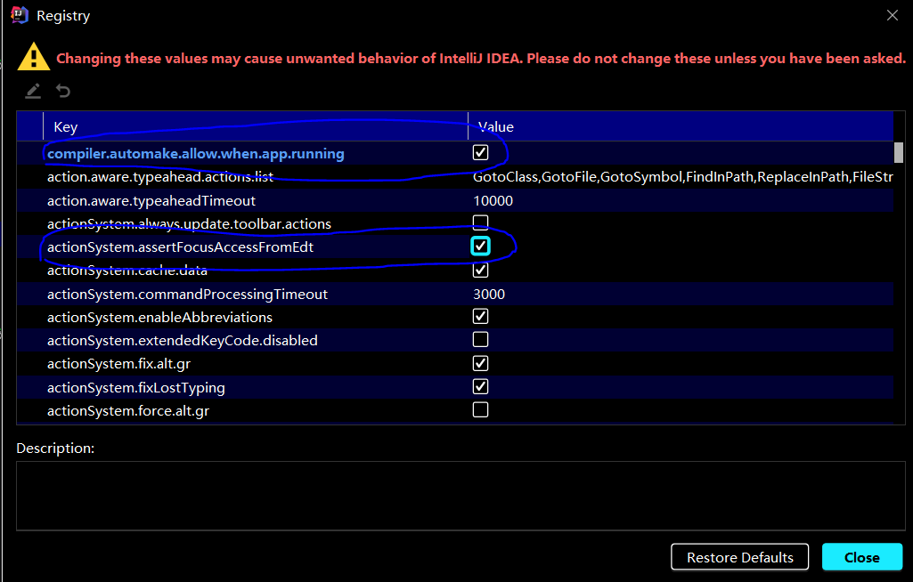

## Java 必须掌握的 20+ 种 Spring 常用注解

**Spring部分** 

**1、声明bean的注解**

> @Component 添加到容器中
>
> @Service 在业务逻辑层使用（service层）
>
> @Repository 在数据访问层使用（dao层）
>
> @Controller 在展现层使用，控制器的声明（C）

**2、注入bean的注解**

> @Autowired：由Spring提供
>
> @Inject：由JSR-330提供
>
> @Resource：由JSR-250提供

都可以注解在set方法和属性上，推荐注解在属性上（一目了然，少写代码）。

**3、java配置类相关注解**

> @Configuration 声明当前类为配置类，相当于xml形式的Spring配置（类上）
>
> @Bean 注解在方法上，声明当前方法的返回值为一个bean，替代xml中的方式（方法上）
>
> @Configuration 声明当前类为配置类，其中内部组合了@Component注解，表明这个类是一个bean（类上）
>
> @ComponentScan 用于对Component进行扫描，相当于xml中的（类上）
>
> @WishlyConfiguration 为@Configuration与@ComponentScan的组合注解，可以替代这两个注解

**4、切面（AOP）相关注解**

Spring支持AspectJ的注解式切面编程。

> @Aspect 声明一个切面（类上）
> 使用@After、@Before、@Around定义建言（advice），可直接将拦截规则（切点）作为参数。
>
> @After 在方法执行之后执行（方法上）
> @Before 在方法执行之前执行（方法上）
> @Around 在方法执行之前与之后执行（方法上）
>
> @PointCut 声明切点

在java配置类中使用@EnableAspectJAutoProxy注解开启Spring对AspectJ代理的支持（类上）

**5、@Bean的属性支持**

> @Scope 设置Spring容器如何新建Bean实例（方法上，得有@Bean）
> 其设置类型包括：
>
> Singleton （单例,一个Spring容器中只有一个bean实例，默认模式）,
> Protetype （每次调用新建一个bean）,
> Request （web项目中，给每个http request新建一个bean）,
> Session （web项目中，给每个http session新建一个bean）,
> GlobalSession（给每一个 global http session新建一个Bean实例）
>
> @StepScope 在Spring Batch中还有涉及
>
> @PostConstruct 由JSR-250提供，在构造函数执行完之后执行，等价于xml配置文件中bean的initMethod
>
> @PreDestory 由JSR-250提供，在Bean销毁之前执行，等价于xml配置文件中bean的destroyMethod

**6、@Value注解**

> @Value 为属性注入值（属性上）

支持如下方式的注入：
》注入普通字符

 

》注入操作系统属性


》注入表达式结果


》注入其它bean属性


》注入文件资源


》注入网站资源


》注入配置文件


注入配置使用方法

① 编写配置文件（test.properties）

book.name=《三体》

② @PropertySource 加载配置文件(类上)


③ 还需配置一个PropertySourcesPlaceholderConfigurer的bean。


**7、环境切换**

> @Profile 通过设定Environment的ActiveProfiles来设定当前context需要使用的配置环境。（类或方法上）
>
> @Conditional Spring4中可以使用此注解定义条件话的bean，通过实现Condition接口，并重写matches方法，从而决定该bean是否被实例化。（方法上）

**8、异步相关**

> @EnableAsync 配置类中，通过此注解开启对异步任务的支持，叙事性AsyncConfigurer接口（类上）
>
> @Async 在实际执行的bean方法使用该注解来申明其是一个异步任务（方法上或类上所有的方法都将异步，需要@EnableAsync开启异步任务）

**9、定时任务相关**

> @EnableScheduling 在配置类上使用，开启计划任务的支持（类上）
>
> @Scheduled 来申明这是一个任务，包括cron,fixDelay,fixRate等类型（方法上，需先开启计划任务的支持）

**10、@Enable\*注解说明**

这些注解主要用来开启对xxx的支持。

> @EnableAspectJAutoProxy 开启对AspectJ自动代理的支持
>
> @EnableAsync 开启异步方法的支持
>
> @EnableScheduling 开启计划任务的支持
>
> @EnableWebMvc 开启Web MVC的配置支持
>
> @EnableConfigurationProperties 开启对@ConfigurationProperties注解配置Bean的支持
>
> @EnableJpaRepositories 开启对SpringData JPA Repository的支持
>
> @EnableTransactionManagement 开启注解式事务的支持
>
> @EnableTransactionManagement 开启注解式事务的支持
>
> @EnableCaching 开启注解式的缓存支持

**11、测试相关注解**

@RunWith 运行器，Spring中通常用于对JUnit的支持


@ContextConfiguration 用来加载配置ApplicationContext，其中classes属性用来加载配置类


**SpringMVC部分** 

> @EnableWebMvc 在配置类中开启Web MVC的配置支持，如一些ViewResolver或者MessageConverter等，若无此句，重写WebMvcConfigurerAdapter方法（用于对SpringMVC的配置）。
>
> @Controller 声明该类为SpringMVC中的Controller
>
> @RequestMapping 用于映射Web请求，包括访问路径和参数（类或方法上）
>
> @ResponseBody 支持将返回值放在response内，而不是一个页面，通常用户返回json数据（返回值旁或方法上）
>
> @RequestBody 允许request的参数在request体中，而不是在直接连接在地址后面。（放在参数前）
>
> @PathVariable 用于接收路径参数，比如@RequestMapping(“/hello/{name}”)申明的路径，将注解放在参数中前，即可获取该值，通常作为Restful的接口实现方法。
>
> @RestController 该注解为一个组合注解，相当于@Controller和@ResponseBody的组合，注解在类上，意味着，该Controller的所有方法都默认加上了@ResponseBody。
>
> @ControllerAdvice 通过该注解，我们可以将对于控制器的全局配置放置在同一个位置，注解了@Controller的类的方法可使用@ExceptionHandler、@InitBinder、@ModelAttribute注解到方法上，
> 这对所有注解了 @RequestMapping的控制器内的方法有效。
>
> @ExceptionHandler 用于全局处理控制器里的异常
>
> @InitBinder 用来设置WebDataBinder，WebDataBinder用来自动绑定前台请求参数到Model中。
>
> @ModelAttribute 本来的作用是绑定键值对到Model里，在@ControllerAdvice中是让全局的@RequestMapping 都能获得在此处设置的键值对。

<br/>

<br/>

## Spring Boot 项目结构

**（1）分层** 

- **表示层**：

  > controller - 负责页面访问控制，对外暴露Rest API接口。

- **业务层**：

  > service / biz：
  >
  > &emsp;服务 contract 是接口；
  >
  > &emsp;impl 是服务实现；
  >
  > entity：
  >
  > &emsp;实体 vo 是服务可对外公开的实体；
  >
  > &emsp;dto 是数据传输对象，可在服务间传递；
  >
  > &emsp;qo 是查询对象，可以认为是查询条件的封装；

- **持久层**：

  > dao ：数据访问对象，选择比较熟悉的 mybatis 作为 ORM 工具；
  >
  > domain ：数据对象实体 DO，通常和数据表、视图或其他业务对象一一对应；

- **公共模块**：

  > common ：公共类，如枚举，常量、业务无关的通用公共实体等；
  >
  > util ：常用实用的帮助类，如反射、字符串、集合、枚举、正则、缓存、队列等；
  >
  > config ：自定义的配置项，可从配置文件读取；

**（2）Spring 框架的重要内容** 

> IOC : 控制反转
>
> AOP : 面向切面编程

**注** ：Spring Boot 框架封装 spring、spring mvc 等框架之后，使用变得十分简单。

**（3）注解说明** 

> @RestController = @Controller + @ResponseBody；
>
> &emsp;方法返回 object，会转化为 json 格式；
>
> @RequestBody: 从请求体中获取数据；
>
> @RequestParam: 从请求头中获取数据；
>
> 

## 配置文件

```yaml
<!--导入配置文件处理器，配置文件绑定就会有输入提示-->
<dependency>
    <groupId>org.springframework.boot</groupId>
    <artifactId>spring-boot-configuration-processor</artifactId>
    <optional>true</optional>
</dependency>
```

(注意： 配置好了重新启动main)

**application.yml写入配置**  

```yaml
server:
  port: 8081
 
person:
  lastName: zhangsan
  age: 18
  boss: false
  birth: 2017/12/12
  maps: {k1: v1,k2: 12}
  lists:
    - list
    - zhaoliu
  dog:
    name: 小狗
    age: 2
```

**@Component 添加到容器中**

```java
import org.springframework.boot.context.properties.ConfigurationProperties;
import org.springframework.stereotype.Component;
import java.util.Date;
import java.util.List;
import java.util.Map;
import lombok.Data;
 
@Component
@ConfigurationProperties(prefix = "person")
@Data
public class Person {
 
    private String lastName;
    private Integer age;
    private Boolean boss;
    private Date birth;
 
    private Map<String,Object> maps;
    private List<Object> lists;
    private Dog dog;
 
    @Override
    public String toString() {
        return "Person{" +
                "lastName='" + lastName + '\'' +
                ", age=" + age +
                ", boss=" + boss +
                ", birth=" + birth +
                ", maps=" + maps +
                ", lists=" + lists +
                ", dog=" + dog +
                '}';
    }
}
```

## JSR 303 基本的校验规则

**空检查** 

> @Null 验证对象是否为null 
>
> @NotNull 验证对象是否不为null, 无法查检长度为0的字符串 
>
> @NotBlank 检查约束字符串是不是Null还有被Trim的长度是否大于0,只对字符串,且会去掉前后空格. 
>
> @NotEmpty 检查约束元素是否为NULL或者是EMPTY.

 **Booelan检查**  

> @AssertTrue 验证 Boolean 对象是否为 true 
>
> @AssertFalse 验证 Boolean 对象是否为 false长度检查 
>
> @Size(min=, max=) 验证对象（Array,Collection,Map,String）长度是否在给定的范围之内 
>
> @Length(min=, max=) Validates that the annotated string is between min and max included.

 **日期检查** 

> @Past 验证 Date 和 Calendar 对象是否在当前时间之前，验证成立的话被注释的元素一定是一个过去的日期 
>
> @Future 验证 Date 和 Calendar 对象是否在当前时间之后 ，验证成立的话被注释的元素一定是一个将来的日期 
>
> @Pattern 验证 String 对象是否符合正则表达式的规则，被注释的元素符合制定的正则表达式，regexp:正则表式 flags: 指定 Pattern.Flag 的数组，表示正则表达式的相关选项。

**数值检查** 

建议使用在Stirng,Integer类型，不建议使用在int类型上，因为表单值为“”时无法转换为int，但可以转换为Stirng为”“,Integer为null 

> @Min 验证 Number 和 String 对象是否大等于指定的值 
>
> @Max 验证 Number 和 String 对象是否小等于指定的值 
>
> @DecimalMax 被标注的值必须不大于约束中指定的最大值. 这个约束的参数是一个通过BigDecimal定义的最大值的字符串表示.小数存在精度 
>
> @DecimalMin 被标注的值必须不小于约束中指定的最小值. 这个约束的参数是一个通过BigDecimal定义的最小值的字符串表示.小数存在精度 
>
> @Digits 验证 Number 和 String 的构成是否合法 
>
> @Digits(integer=,fraction=) 验证字符串是否是符合指定格式的数字，interger指定整数精度，fraction指定小数精度。 
>
> @Range(min=, max=) 被指定的元素必须在合适的范围内 
>
> @Range(min=10000,max=50000,message=”range.bean.wage”) 
>
> @Valid 递归的对关联对象进行校验, 如果关联对象是个集合或者数组,那么对其中的元素进行递归校验,如果是一个map,则对其中的值部分进行校验.(是否进行递归验证) 
>
> @CreditCardNumber信用卡验证 
>
> @Email 验证是否是邮件地址，如果为null,不进行验证，算通过验证。 
>
> @ScriptAssert(lang= ,script=, alias=) 
>
> @URL(protocol=,host=, port=,regexp=, flags=)

## Spring Dao层@Repository 与 @Mapper

使用注解的方式开发Dao层的时候，常常会混淆这两个注解，不知道怎么添加，这里做个记录。

总结：

1. @Mapper 一定要有，否则 Mybatis 找不到 mapper。
2. @Repository 可有可无，可以消去依赖注入的报错信息。
3. @MapperScan 可以替代 @Mapper。

### (1) @Mapper 

**@Mapper 是 Mybatis 的注解，和 Spring 没有关系，@Repository 是 Spring 的注解，用于声明一个 Bean。**（重要）

使用 Mybatis 有 XML 文件或者注解的两种使用方式，如果是使用 XML 文件的方式，我们需要在配置文件中指定 XML 的位置，这里只研究注解开发的方式。

在 Spring 程序中，Mybatis 需要找到对应的 mapper，在编译的时候动态生成代理类，实现数据库查询功能，所以我们需要在接口上添加 @Mapper 注解。

```java
@Mapper
public interface UserDao {
	...
}
```

但是，仅仅使用@Mapper注解，我们会发现，在其他变量中依赖注入，IDEA 会提示错误，但是不影响运行（亲测～）。因为我们没有显式标注这是一个 Bean，IDEA 认为运行的时候会找不到实例注入，所以提示我们错误。

尽管这个错误提示并不影响运行，但是看起来很不舒服，所以我们可以在对应的接口上添加 bean 的声明，如下：

```java
@Repository // 也可以使用@Component，效果都是一样的，只是为了声明为bean
@Mapper
public interface UserDao {
	
	@Insert("insert into user(account, password, user_name) " +
            "values(#{user.account}, #{user.password}, #{user.name})")
    int insertUser(@Param("user") User user) throws RuntimeException;
}
```

### (2) @Repository

正如上面说的，@Repository 用于声明 dao 层的 bean，如果我们要真正地使用 @Repository 来进行开发，那是基于代码的开发，简单来说就是手写 JDBC。

和 @Service、@Controller 一样，我们将 @Repository 添加到对应的实现类上，如下：

```java
@Repository
public class UserDaoImpl implements UserDao{
	
	@Override
	public int insertUser(){
		JdbcTemplate template = new JdbcTemplate();
		...
	}
}
```

### (3) 其他扫描手段

基于注解的开发也有其他手段帮助 Mybatis 找到 mapper，那就是 @MapperScan 注解，可以在启动类上添加该注解，自动扫描包路径下的所有接口。

```java
@SpringBootApplication
@MapperScan("com.martinhub.dao")
public class UserEurekaClientApplication {
 
    public static void main(String[] args) {
        SpringApplication.run(UserEurekaClientApplication.class, args);
    }
}
```

使用这种方法，接口上不用添加任何注解。

### (4) 总结

1. @Mapper 一定要有，否则 Mybatis 找不到 mapper。
2. @Repository 可有可无，可以消去依赖注入的报错信息。
3. @MapperScan 可以替代 @Mapper。 
4. Mapper报假红打上@component

## IDEA打开的文件不隐藏全部展示（而不是只显示一行）

- `File > settings > Editor > general > Editor Tabs > appearance > show tabs in one row`这个勾选去掉就可以了

## IDEA开启热部署

<font color='red'>注意：此功能在开发阶段开启，生产环境一定要关闭。</font>

1. Pom.xml文件添加插件：

   ```xml
   <!--热部署：更改代码后，自动重启-->
   <dependency>
     <groupId>org.springframework.boot</groupId>
     <artifactId>spring-boot-devtools</artifactId>
     <scope>runtime</scope>
     <optional>true</optional>
   </dependency>

    <build>
      <finalName>cloud2021</finalName>
      <plugins>
        <plugin>
          <groupId>org.springframework.boot</groupId>
          <artifactId>spring-boot-maven-plugin</artifactId>
          <version>2.3.1.RELEASE</version>
          <configuration>
            <fork>true</fork>
            <addResources>true</addResources>
          </configuration>
        </plugin>
      </plugins>
    </build>
   ```


   2. IDEA设置：

      

   3. 在工程内按住快捷键

      `Ctrl + Shift + Alt + /`

      出现的选择框：选择Registry。

      选择：

      

   4. 重启IDEA

      ​

## 一般Maven项目新建后，必做的几个设置

1. 设置编码: UTF-8

   

2. 设置jdk编译版本

   

3. 开启注解自动生效

   


## RestTemplate

> RestTemplate提供了多种便捷访问远程HTTP服务的方法，是一种简单便捷的访问restful服务模板类，是Spring提供的用于访问Rest服务的客户端模板工具集。

**使用：** 

使用restTemplate访问restful接口十分简单。

（url, requestMap, ResponseBean.class)这三个参数分别代表REST请求地址、请求参数、HTTP响应转换被转换成的对象类型。

（1） 编写Config，将RestTemplate导入容器

```java
import org.springframework.context.annotation.Bean;
import org.springframework.context.annotation.Configuration;
import org.springframework.web.client.RestTemplate;

/**
 * @Project：cloud2021
 * @File: ApplicationContextConfig
 * @IDE ：IntelliJ IDEA
 * @Author ：MartinHub
 * @Date ：2021/3/3 11:10
 */
@Configuration
public class ApplicationContextConfig {

    /**
     * RestTemplate配置(HttpClient的封装类)
     * @return
     */
    @Bean
    public RestTemplate getRestTemplate() {
        return new RestTemplate();
    }

}
```

（2）编写Controller

```java
import com.martinhub.entities.CommonResult;
import com.martinhub.entities.Payment;
import lombok.extern.slf4j.Slf4j;
import org.springframework.web.bind.annotation.GetMapping;
import org.springframework.web.bind.annotation.PathVariable;
import org.springframework.web.bind.annotation.RestController;
import org.springframework.web.client.RestTemplate;

import javax.annotation.Resource;

/**
 * @Project：cloud2021
 * @File: OrderController
 * @IDE ：IntelliJ IDEA
 * @Author ：MartinHub
 * @Date ：2021/3/3 10:47
 */
@RestController
@Slf4j
public class OrderController {
    public static final String PAYMENT_URL = "http://localhost:8001";

    @Resource
    private RestTemplate restTemplate;

    @GetMapping("/consumer/payment/create")
    public CommonResult<Payment> create(Payment payment){
        log.info("******客户端调用远程微服务-创建*********成功！！！！！！！！");
        return restTemplate.postForObject(PAYMENT_URL + "/payment/create", payment, CommonResult.class);
    }

    @GetMapping("/consumer/payment/get/{id}")
    public CommonResult<Payment> getPayment(@PathVariable("id") Long id) {
        log.info("******客户端调用远程微服务-查询*********成功！！！！！！！！");
        return restTemplate.getForObject(PAYMENT_URL + "/payment/get/" + id, CommonResult.class);
    }

}
```


## Maven依赖中scope的含义

&emsp;scope元素的作用：控制 dependency 元素的使用范围。通俗的讲，就是控制 Jar 包在哪些范围被加载和使用。

&emsp;scope具体含义如下：

### compile（默认）

含义：compile 是默认值，如果没有指定 scope 值，该元素的默认值为 compile。被依赖项目需要参与到当前项目的编译，测试，打包，运行等阶段。打包的时候通常会包含被依赖项目。

### provided

含义：被依赖项目理论上可以参与编译、测试、运行等阶段，相当于compile，但是再打包阶段做了exclude的动作。
适用场景：例如， 如果我们在开发一个web 应用，在编译时我们需要依赖 servlet-api.jar，但是在运行时我们不需要该 jar 包，因为这个 jar 包已由应用服务器提供，此时我们需要使用 provided 进行范围修饰。

### runtime

含义：表示被依赖项目无需参与项目的编译，但是会参与到项目的测试和运行。与compile相比，被依赖项目无需参与项目的编译。
适用场景：例如，在编译的时候我们不需要 JDBC API 的 jar 包，而在运行的时候我们才需要 JDBC 驱动包。

### test

含义： 表示被依赖项目仅仅参与测试相关的工作，包括测试代码的编译，执行。
适用场景：例如，Junit 测试。

### system

含义：system 元素与 provided 元素类似，但是被依赖项不会从 maven 仓库中查找，而是从本地系统中获取，systemPath 元素用于制定本地系统中 jar 文件的路径。例如：

```xml
<dependency>
    <groupId>org.open</groupId>
    <artifactId>open-core</artifactId>
    <version>1.5</version>
    <scope>system</scope>
    <systemPath>${basedir}/WebContent/WEB-INF/lib/open-core.jar</systemPath>
</dependency>
```

### import

它只使用在< dependencyManagement >中，表示从其它的pom中导入dependency的配置，例如 (B项目导入A项目中的包配置)：

想必大家在做 SpringBoot 应用的时候，都会有如下代码：

```xml
<parent>
    <groupId>org.springframework.boot</groupId>
    <artifactId>spring-boot-starter-parent</artifactId>
    <version>1.3.3.RELEASE</version>
</parent>
```


<div align="center">  </div>