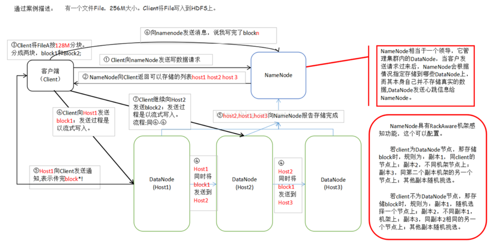

## 一、 大数据面试题

### （1）Hadoop 面试题

- **1. 讲述HDFS上传⽂件和读⽂件的流程？** 

  > HDFS 上传流程，举例说明⼀个256M的⽂件上传过程

  (1) 由客户端`Client`向`NameNode`节点发出请求;

  (2) `NameNode`向`Client`返回可以存数据的`DataNode`列表，这⾥遵循机架感应原则(把副本分别放在不同的机架，甚⾄不同的数据中心);

  (3) 客户端⾸先根据返回的信息先将⽂件分块(`Hadoop2.X`版本每⼀个`block`为 `128M`，⽽之前的版本为 `64M`);

  (4) 通过`NameNode`返回的`DataNode`信息，将⽂件块以流失写入方式直接发送给`DataNode`，同时复制到其他两台机器(默认⼀份数据，有两个副本)；

  (5) 数据块传送完成以后，`dataNode`向`Client`通信，同时向`NameNode`报告；

  (6) 依照上⾯ (4) 到 (5) 的原理将所有的数据块都上传，结束后向 `NameNode `报告 表明已经传完所有的数据块。
  

- **2. HDFS在上传⽂件的时候，如果其中⼀个块突然损坏了怎么办？** 

  &emsp;其中⼀个块坏了，只要有其它块存在，会⾃动检测还原。

- **3. NameNode的作⽤？**

  &emsp;`namenode`总体来说是管理和记录恢复功能。⽐如管理`datanode`，保持⼼跳，如果超时则排除。对于上传⽂件都有镜像`images`和`edits`,这些可以⽤来恢复。

- **4. NameNode在启动的时候会做哪些操作？**

  &emsp;`NameNode`启动的时候，会加载`fsimage`
  &emsp;`Fsimage`加载过程完成的操作主要是为了：

  &emsp;&emsp;(1) 从`fsimage`中读取该`HDFS`中保存的每⼀个⽬录和每⼀个⽂件

  &emsp;&emsp;(2) 初始化每个⽬录和⽂件的元数据信息

  &emsp;&emsp;(3) 根据⽬录和⽂件的路径，构造出整个`namespace`在内存中的镜像

  &emsp;&emsp;(4) 如果是⽂件，则读取出该⽂件包含的所有`blockid`，并插⼊到`BlocksMap`中。

  &emsp;&emsp;`namenode`在加载`fsimage`过程其实⾮常简单，就是从`fsimage`中不停的顺序读取⽂件和⽬录的元数据信息，并在内存中构建整个`namespace`，同时将每个⽂件对应的`blockid`保存⼊`BlocksMap`中，此时`BlocksMap`中每个`block`对应的`datanodes`列表暂时为空。当`fsimage`加载完毕后，整个`HDFS`的⽬录结构在内存中就已经初始化完毕，所缺的就是每个⽂件对应的`block`对应的`datanode`列表信息。这些信息需要从`datanode`的`blockReport`中获取，所以加载`fsimage`完毕后，`namenode`进程进⼊`rpc`等待状态，等待所有的`datanodes`发送`blockReports`。

- **5. NameNode的HA？**

  &emsp;`NameNode`的`HA`⼀个备⽤，⼀个⼯作，且⼀个失败后，另⼀个被激活。他们通过`journal node`来实现共享数据。

- **6. Hadoop的作业提交流程？**

  &emsp;Hadoop2.x Yarn作业提交（客户端）

  &emsp;&emsp;http://www.aboutyun.com/forum.php?mod=viewthread&tid=9498

  &emsp;Hadoop2.x Yarn作业提交（服务端）

  &emsp;&emsp;http://www.aboutyun.com/forum.php?mod=viewthread&tid=9496

- **7. Hadoop怎么分⽚？**

  - 1、分块：

    &emsp;HDFS存储系统中，引⼊了⽂件系统的分块概念（block），块是存储的最⼩单位，HDFS定义其⼤⼩为64MB。与单磁盘⽂件系统相似，存储在 HDFS上的⽂件均存储为多个块，不同的是，如果某⽂件⼤⼩没有到达64MB，该⽂件也不会占据整个块空间。在分布式的HDFS集群上，Hadoop系统 保证⼀个块存储在⼀个datanode上。

    &emsp;HDFS的namenode只存储整个⽂件系统的元数据镜像，这个镜像由配置dfs.name.dir指定，datanode则存有⽂件的metainfo和具体的分块，存储路径由dfs.data.dir指定。

  - 2、分⽚片：

    &emsp;hadoop的作业在提交过程中，需要把具体的输⼊进⾏分⽚。具体的分⽚细节由InputSplitFormat指定。分⽚的规则为FileInputFormat.class中的getSplits()⽅法指定：

    ```java
    long splitSize = computeSplitSize(goalSize, minSize, blockSize);
    computeSplitSize:
    	Math.max(minSize, Math.min(goalSize, blockSize));
    ```

    &emsp;其中goalSize为“InputFile⼤⼩”/“我们在配置⽂件中定义的mapred.map.tasks”值，minsize为mapred.min.split.size，blockSize为64，所以，这个算式为取分⽚⼤⼩不⼤于block，并且不⼩于在mapred.min.split.size配置中定义的最⼩Size。

    &emsp;当某个分块分成均等的若⼲分⽚时，会有最后⼀个分⽚⼤⼩⼩于定义的分⽚⼤⼩，则该分⽚独⽴成为⼀个分⽚。

- **8. 如何减少Hadoop Map端到Reduce端的数据传输量？**
  &emsp;减少传输量，可以让map处理完，让同台的reduce直接处理，理想情况下，没有数据传输。

- **9. Hadoop的Shuffle?** 

  1、hadoop：map端保存分⽚数据，通过⽹络收集到reduce端

  2、Shuffle产⽣的意义是什么？

  &emsp;完整地从map task端拉取数据到reduce 端；在跨节点拉取数据时，尽可能地减少对带宽的不必要消耗；减少磁盘IO对task执⾏的影响；每个map task都有⼀个内存缓冲区，存储着map的输出结果，当缓冲区快满的时候需要将缓冲区的数据该如何处理？

  &emsp;每个map task都有⼀个内存缓冲区，存储着map的输出结果，当缓冲区快满的时候需要将缓冲区的数据以⼀个临时⽂件的⽅式存放到磁盘，当整个map task结束后再对磁盘中这个map task产⽣的所有临时⽂件做合并，⽣成最终的正式输出⽂件，然后等待reduce task来拉数据。

- **10. 哪些场景才能使⽤Combiner呢？**

  1. Combiner的输出是Reducer的输⼊，Combiner绝不能改变最终的计算结果。所以从我的想法来看，Combiner只应该⽤于那种Reduce的输⼊key/value与输出key/value类型完全⼀致，且不影响最终结果的场景。⽐如累加，最⼤值等。Combiner的使⽤⼀定得慎重，如果⽤好，它对job执⾏效率有帮助，反之会影响reduce的最终结果。
  2. combiner最基本是实现本地key的聚合，对map输出的key排序，value进⾏迭代。
  3. combiner的⽬的是减少map⽹络流量。combiner的对象是对于map。combiner具有和reduce相似的功能。只不过combiner合并对象，是对于⼀个map。reduce合并对象，是对于多个map。

- **11. HMaster的作⽤？**

  1. 为region server分配region.
  2. 负责region server的负载均衡。
  3. 发现失效的region server并重新分配其上的region.
  4. Gfs上的垃圾⽂件回收。
  5. 处理schema更新请求。

### （2）Hive 面试题

&emsp;loading...............

### （3）HBase 面试题 

&emsp;loading...............

### （4）Scala 面试题

&emsp;loading...............

### （5）Spark 面试题

&emsp;loading...............

### （6）Kafka 面试题

&emsp;loading...............

